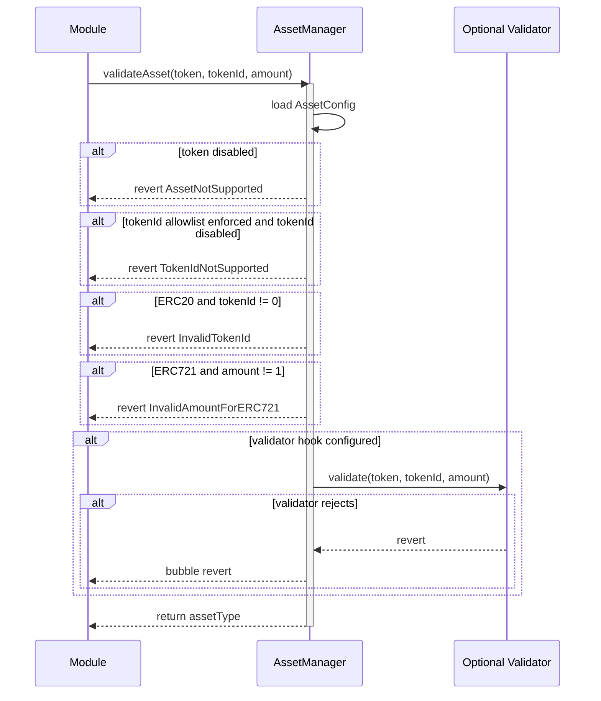

# AssetManager Contract Documentation

## Overview

`AssetManager` is the protocol's asset allowlist and transfer-shape validator for marketplace custody flows. [`Marketplace`](Marketplace.md), [`OrderbookMarketplace`](OrderbookMarketplace.md), and [`EscrowManager`](EscrowManager.md) use it to confirm whether a token/tokenId pair is supported before escrowed marketplace activity proceeds.

The contract does not transfer assets and does not probe token interfaces. It stores governance-configured asset metadata and validates the requested `(token, tokenId, amount)` shape against that metadata.
Governance may also attach an optional token-level validator hook for domain-specific checks that should stay outside the generic asset allowlist.

## Prerequisites

- Contract must be initialized with an owner
- `ADMIN` role must be granted to accounts authorized to configure supported assets; see [`roles.md`](../roles.md)
- Marketplace modules must be wired to the active `AssetManager`

## Contract Architecture

- Inherits from `OwnableRolesExtension` for owner-managed roles
- Inherits from `Initializable` for beacon-proxy deployment
- Implements `IAssetManager`
- Stores token-level `AssetConfig`:
  - `assetType`
  - `enabled`
  - `enforceTokenId`
- Stores optional tokenId allowlist state when `enforceTokenId == true`
- Stores optional token-level validator hooks invoked after static asset validation

## Authorization Model

- `ADMIN`: Can call `setAsset`, `setAssetTokenId`, and `setAssetValidator`
- Owner: Can grant/revoke `ADMIN` through `OwnableRolesExtension`
- Read-only validation and getter functions are permissionless

## Core Functions

### initialize(address owner)

Initializes the proxy owner.

**Errors:**
- `ZeroAddress()`: When owner is zero

### setAsset(address token, AssetType assetType, bool enabled, bool enforceTokenId)

Configures token-level support for an asset contract.

**Prerequisites:**
- Caller must have `ADMIN`
- `token` must be non-zero
- If `enabled == true`, `assetType` must not be `AssetType.NONE`

**Events:**
- `AssetConfigured(token, assetType, enabled, enforceTokenId)`

**Errors:**
- `Unauthorized()`: When caller lacks `ADMIN`
- `ZeroAddress()`: When `token` is zero
- `AssetManager__InvalidAssetType()`: When enabling with `AssetType.NONE`

**Important Notes:**
- Disabling an asset prevents future validation successes. It does not retroactively invalidate marketplace offers that were already registered and escrowed.

### setAssetTokenId(address token, uint256 tokenId, bool enabled)

Configures tokenId-level support when a token has `enforceTokenId == true`.

**Prerequisites:**
- Caller must have `ADMIN`
- Token must already be enabled
- Token must have tokenId allowlisting enabled

**Events:**
- `AssetTokenIdConfigured(token, tokenId, enabled)`

**Errors:**
- `AssetManager__AssetNotSupported(token, tokenId)`: Token is not enabled
- `AssetManager__TokenIdAllowlistDisabled(token)`: Token does not use tokenId allowlisting

### setAssetValidator(address token, address validator)

Configures an optional validator hook for an enabled token.

**Prerequisites:**
- Caller must have `ADMIN`
- Token must already be enabled

**Events:**
- `AssetValidatorConfigured(token, validator)`

**Errors:**
- `AssetManager__AssetNotSupported(token, 0)`: Token is not enabled

**Important Notes:**
- `validator == address(0)` clears the hook.
- The hook is generic. `AssetManager` does not know bond-specific metadata; validator implementations are responsible for any domain-specific checks they need.

### validateAsset(address token, uint256 tokenId, uint256 amount)

Validates that an asset is supported and that the request matches the configured asset type.

**Behavior:**
- Reverts if the token is not enabled
- Reverts if tokenId allowlisting is enabled and the requested tokenId is not allowed
- For ERC-20 assets, requires `tokenId == 0`
- For ERC-721 assets, requires `amount == 1`
- If a validator hook is configured for the token, calls `IAssetValidator.validate(token, tokenId, amount)`
- Returns the configured `AssetType` for supported assets

**Errors:**
- `AssetManager__AssetNotSupported(token, tokenId)`
- `AssetManager__TokenIdNotSupported(token, tokenId)`
- `AssetManager__InvalidTokenId(tokenId)`
- `AssetManager__InvalidAmountForERC721(amount)`

**Sequence Diagram:**

### isAssetSupported(address token, uint256 tokenId)

Returns `false` instead of reverting when the token is disabled or a required tokenId allowlist entry is missing.

### getAssetType(address token)

Returns the configured asset type for an enabled token.

**Errors:**
- `AssetManager__AssetNotSupported(token, 0)`: Token is not enabled

### getAssetConfig(address token)

Returns the raw token-level configuration, including disabled or unconfigured values.

### isTokenIdAllowed(address token, uint256 tokenId)

Returns the stored tokenId allowlist flag. This getter does not check whether token-level allowlisting is enabled.

### getAssetValidator(address token)

Returns the configured validator hook for a token, or `address(0)` when no hook is configured.

## Trust and Security Notes

- `ADMIN` configuration controls which assets can enter marketplace escrow flows. Incorrect asset type or tokenId settings can block valid activity or allow unsupported assets into new escrows.
- A configured validator can block new marketplace validation calls for its token by reverting. Keep validator contracts simple, view-only, and domain-specific.
- `AssetManager` validates configured asset support only. Transfer execution and balance accounting remain in `EscrowManager` and the marketplace modules.
- Existing offers and escrows keep their stored asset type and amount. AssetManager changes affect new validation calls, not historical escrow records or already registered Marketplace offers.
