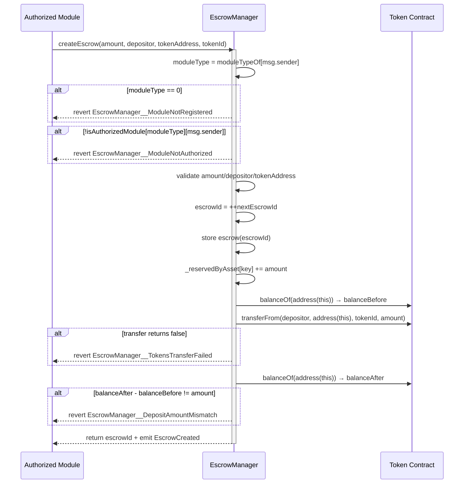
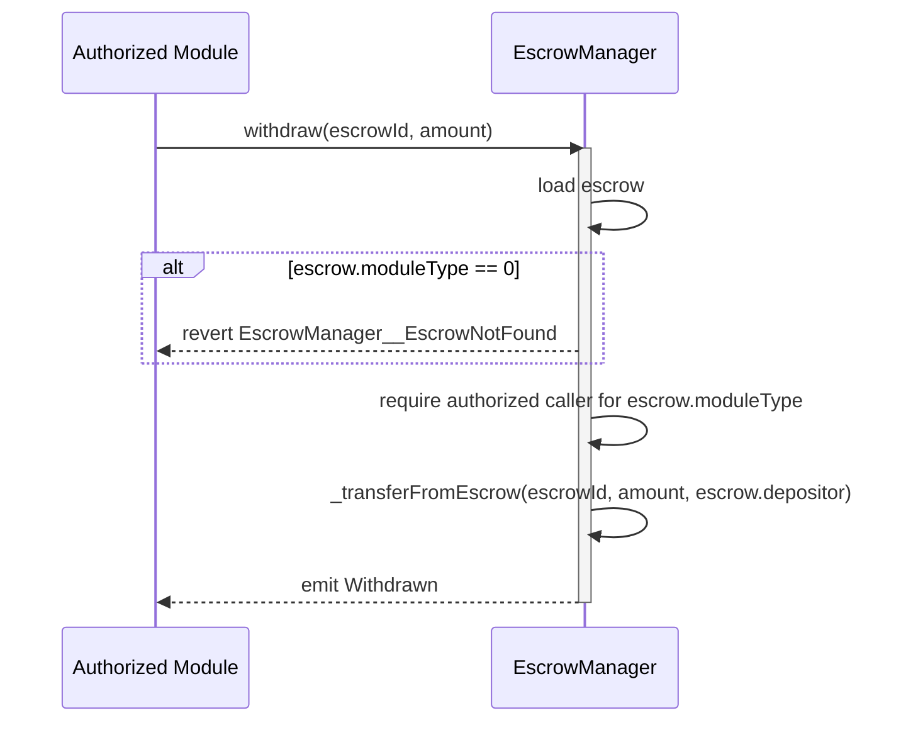
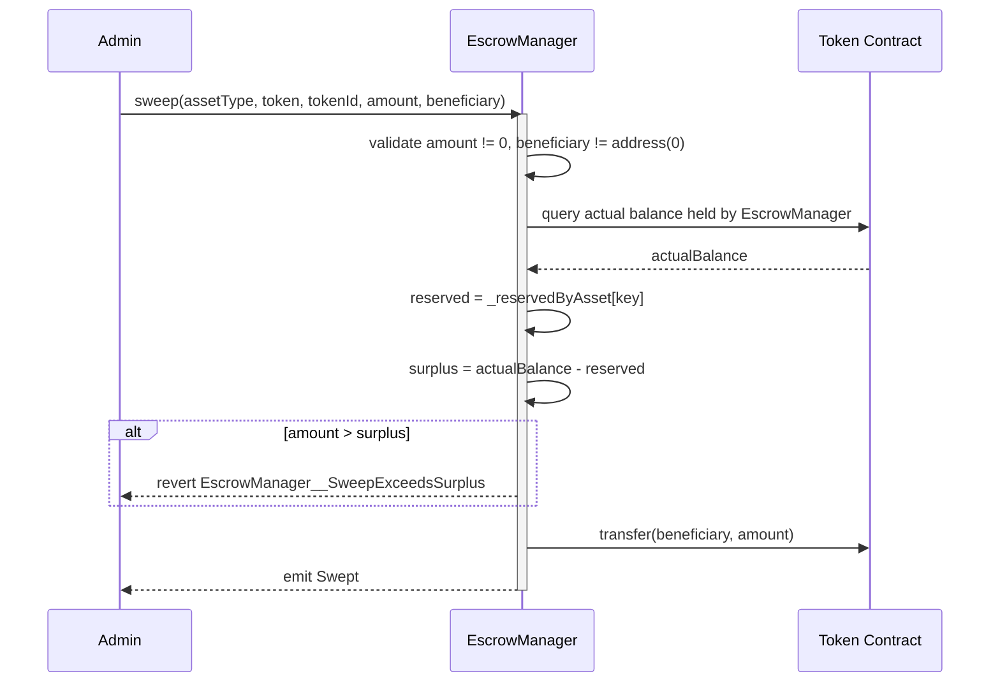
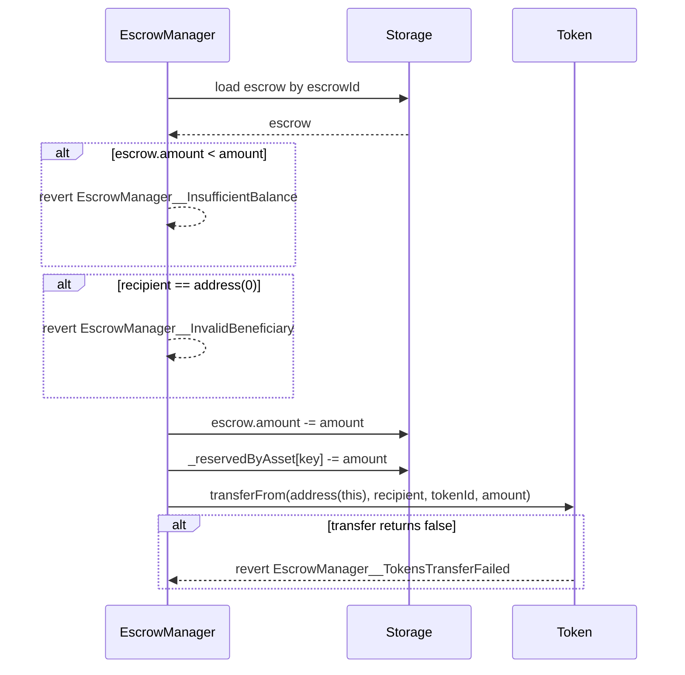

# EscrowManager Contract Documentation

## Overview
The `EscrowManager` contract manages token escrow operations for marketplace modules in the DEUSS bond marketplace. It is module-type aware and uses an internal registry (`moduleTypeOf` + `isAuthorizedModule`) to authorize callers.

Escrows are keyed by a globally unique `escrowId` allocated by `EscrowManager`, which prevents orphaning when module addresses are rotated.

Supports ERC-20, ERC-721, ERC-1155, and ERC-6909 token standards. Asset type validation is delegated to [`AssetManager`](AssetManager.md).

### Surplus Recovery

`EscrowManager` maintains aggregate reserved-by-asset accounting so that stray balances (tokens sent directly to the contract outside the normal escrow flow) can be safely recovered via the admin-only `sweep` function without ever touching assets that are genuinely reserved by active escrows.

## Prerequisites
- Contract must be initialized with:
  - `owner_`
  - `marketplace_` (optional)
  - `orderbookMarketplace_` (optional)
- Proper roles must be assigned:
  - `ADMIN`: For module registry management (`registerModule`, `deactivateModule`), AssetManager wiring (`setAssetManager`), and surplus asset recovery (`sweep`)
- Calling module must be registered and active for its module type
- Any module passed as zero at initialization must be registered later via `registerModule(...)`
- Depositor must approve (or operator-authorize) `EscrowManager` on the ERC-6909 token for escrow deposits

## Contract Architecture
The `EscrowManager` is a core component of the bond marketplace system:
- Inherits from `OwnableRolesExtension` for role-based access control. Read more in the [Roles](../roles.md) docs page.
- Inherits from `Initializable` for proxy initialization
- Implements `IEscrowManager` and ERC-165 support (`supportsInterface`)
- Integrates with ERC-20, ERC-721, ERC-1155, and ERC-6909 tokens for transfers
- Stores escrows as `mapping(uint256 => Escrow)`
- Maintains aggregate reserved-by-asset accounting:
  - `mapping(bytes32 assetKey => uint256 reservedAmount) _reservedByAsset`
  - Key: `keccak256(assetType, token, tokenId)`
  - Invariant: for each key, `reservedAmount == sum of escrow.amount` across all active escrows for that asset
  - Maintained automatically by `createEscrow` (increment) and `_transferFromEscrow` (decrement)
- Maintains active escrow counts per creating module:
  - `mapping(address moduleAddress => uint256 activeEscrows) _activeEscrowsByModule`
  - Incremented when a module creates an escrow and decremented when that escrow is fully drained
- Maintains module registry:
  - `mapping(address => bytes32) moduleTypeOf`
  - `mapping(bytes32 => mapping(address => bool)) isAuthorizedModule`
- Exposes built-in module type constants:
  - `MARKETPLACE_MODULE`
  - `ORDERBOOK_MARKETPLACE_MODULE`
- Uses monotonic `nextEscrowId` for escrow ID allocation

## Trust Assumption: Authorized ERC20 Depositor

### Arbitrary `from` in ERC20 `transferFrom` (trusted-module risk)

`EscrowManager` supports module-driven escrow creation. For ERC20 deposits, `_transferToEscrow` executes:

- `IERC20(token).safeTransferFrom(from, address(this), amount)`

Here, `from` is passed by an authorized module, not forced to `msg.sender`. This is intentional to let marketplace
modules create escrows on behalf of depositors.

**Risk model:**
- This is safe only under the trusted-module assumption.
- If an authorized module is compromised, buggy, or incorrectly integrated, it may attempt to pull tokens from any
  address that has granted allowance to `EscrowManager`.

**Impact:**
- Unauthorized token movement from approved depositors can occur through a compromised authorized module.

**Mitigations / operational controls:**
- Strict governance over module registration (`registerModule`) and immediate deactivation (`deactivateModule`) on
  incident.
- Authorize only audited modules; avoid broad third-party module onboarding.
- Encourage minimal allowances (exact amount / short-lived approvals) from depositors.
- Monitor module behavior and escrow creation activity.

## Core Functions

### createEscrow(uint256 amount, address depositor, address tokenAddress, uint256 tokenId)

Creates a new escrow and deposits tokens into escrow.

**Prerequisites:**
- Caller must be registered (`moduleTypeOf[msg.sender] != 0`)
- Caller must be active for its module type (`isAuthorizedModule[moduleType][msg.sender] == true`)
- `amount` must be non-zero
- `depositor` must be non-zero
- `tokenAddress` must be non-zero
- The escrow contract's actual balance increase after the transfer must equal the requested `amount` (tokens whose on-chain balance changes differ from transfer amounts are rejected)

**Parameters:**
- `amount`: The amount of tokens to deposit into escrow
- `depositor`: The address of the token depositor
- `tokenAddress`: The address of the token contract
- `tokenId`: The ID of the specific token

**Returns:**
- `escrowId`: The newly allocated escrow ID

**Events:**
- `EscrowCreated(escrowId, moduleType, depositor, tokenAddress, tokenId, amount, assetType)`

**Errors:**
- `EscrowManager__ModuleNotRegistered(address moduleAddress)`
- `EscrowManager__ModuleNotAuthorized(address moduleAddress, bytes32 moduleType)`
- `EscrowManager__ZeroAmount()`
- `EscrowManager__InvalidDepositor()`
- `EscrowManager__InvalidTokenAddress()`
- `EscrowManager__TokensTransferFailed()`
- `EscrowManager__DepositAmountMismatch()` — the balance increase observed after the transfer does not equal `amount`

**Important Notes:**
- `EscrowManager` allocates `escrowId` internally (`++nextEscrowId`)
- Escrow stores caller's derived `moduleType` and the caller module address
- Authorization is module-type based, not hardcoded to a single address
- Increments `_reservedByAsset` for the asset key to maintain sweep safety invariant
- Increments `_activeEscrowsByModule[msg.sender]`; this prevents deactivation while that module still has live escrow balances
- Deposit integrity is enforced by comparing the contract's balance before and after the transfer; any token whose received amount differs from the requested amount (regardless of cause) is rejected with `EscrowManager__DepositAmountMismatch`

**Sequence Diagram:**

### withdraw(uint256 escrowId, uint256 amount)

Withdraws escrowed tokens back to the escrow depositor.

**Prerequisites:**
- Escrow must exist
- Caller must be authorized for `escrow.moduleType`
- `amount` must be non-zero
- Escrow must have sufficient balance

**Parameters:**
- `escrowId`: The escrow ID
- `amount`: The amount of tokens to withdraw from escrow

**Events:**
- `Withdrawn(escrowId, beneficiary, amount, tokenAddress, tokenId, assetType)`: Withdrawal asset snapshot

**Errors:**
- `EscrowManager__EscrowNotFound(uint256 escrowId)`
- `EscrowManager__ModuleNotAuthorized(address moduleAddress, bytes32 moduleType)`
- `EscrowManager__ZeroAmount()`
- `EscrowManager__InsufficientBalance()`
- `EscrowManager__InvalidBeneficiary()`
- `EscrowManager__TokensTransferFailed()`

**Important Notes:**
- Recipient is always `escrow.depositor`
- Module authorization is checked against `escrow.moduleType`
- Token transfer failures propagate to the caller. If an ERC20 blocks the depositor as recipient, for example through a blacklist, the withdrawal for that escrow item reverts until the recipient can receive tokens or the upstream module uses its compliance recovery path.

**Sequence Diagram:**

### claim(uint256 escrowId, uint256 amount, address beneficiary)

Claims tokens from escrow to a beneficiary.

**Prerequisites:**
- Escrow must exist
- Caller must be authorized for `escrow.moduleType`
- `amount` must be non-zero
- Escrow must have sufficient balance
- `beneficiary` must be non-zero

**Parameters:**
- `escrowId`: The escrow ID
- `amount`: The amount of tokens to claim from escrow
- `beneficiary`: The address receiving claimed tokens

**Events:**
- `Claimed(escrowId, beneficiary, amount, tokenAddress, tokenId, assetType)`

**Errors:**
- `EscrowManager__EscrowNotFound(uint256 escrowId)`
- `EscrowManager__ModuleNotAuthorized(address moduleAddress, bytes32 moduleType)`
- `EscrowManager__ZeroAmount()`
- `EscrowManager__InsufficientBalance()`
- `EscrowManager__InvalidBeneficiary()`
- `EscrowManager__TokensTransferFailed()`

**Important Notes:**
- Module authorization is checked against `escrow.moduleType`
- Token transfer failures propagate to the caller. If an ERC20 blocks the beneficiary as recipient, for example through a blacklist, the claim for that escrow item reverts. Batch-capable upstream modules should isolate that failure per item; permanent failures are handled operationally through freeze and seizure flows where available.

**Sequence Diagram:**

### sweep(AssetType assetType, address token, uint256 tokenId, uint256 amount, address beneficiary)

Sweeps surplus (untracked) assets from the contract to a beneficiary. Only transfers tokens that are not reserved by any active escrow.

**Prerequisites:**
- Caller must have `ADMIN` role
- `amount` must be non-zero
- `beneficiary` must be non-zero
- For ERC-721, `amount` must be `1`
- Sufficient surplus must exist (actual on-chain balance minus reserved amount)

**Parameters:**
- `assetType`: The token standard of the asset (ERC20, ERC721, ERC1155, ERC6909)
- `token`: The token contract address
- `tokenId`: The token identifier (0 for ERC-20)
- `amount`: The amount to sweep (must not exceed surplus)
- `beneficiary`: The address receiving the swept assets

**Events:**
- `Swept(assetType, token, tokenId, beneficiary, amount)`

**Errors:**
- `EscrowManager__InvalidSweepAmount()` — amount is zero
- `EscrowManager__InvalidBeneficiary()` — beneficiary is zero address
- `EscrowManager__InvalidERC721Amount(uint256 amount)` — ERC-721 amount != 1
- `EscrowManager__SweepExceedsSurplus(uint256 requested, uint256 surplus)` — requested amount exceeds available surplus

**Important Notes:**
- The sweep function computes surplus as: `actualBalance - reservedBalance` (clamped to zero)
- `actualBalance` is queried from the token contract using the appropriate balance method for the asset type
- `reservedBalance` is read from `_reservedByAsset[assetKey]`
- Reuses `_transferAsset` for token dispatch — no duplicated transfer logic
- Does **not** modify `_reservedByAsset` — only unreserved surplus is moved

**Sequence Diagram:**

## Internal Logic

### _transferFromEscrow(Escrow storage escrow, uint256 amount, address recipient)

Shared internal helper used by both `withdraw` and `claim`.

**Parameters:**
- `escrow`: Storage pointer to the escrow record to debit
- `amount`: Amount of tokens to transfer
- `recipient`: Token receiver

**Behavior:**
- Validates `escrow.amount >= amount`
- Validates `recipient != address(0)`
- Decrements escrow amount
- Decrements `_reservedByAsset` for the asset key
- Dispatches transfer via `_transferAsset` based on `escrow.assetType`
- Reverts on failed transfer
- Does not emit events (external function emits domain event)

**Errors:**
- `EscrowManager__InsufficientBalance()`
- `EscrowManager__InvalidBeneficiary()`
- `EscrowManager__TokensTransferFailed()`

**Called by:**
- `withdraw(escrowId, amount)`
- `claim(escrowId, amount, beneficiary)`

**Sequence Diagram:**

## Administrative Functions

### initialize(address owner_, address marketplace_, address orderbookMarketplace_)

Initializes owner and registers default marketplace modules.

**Prerequisites:**
- Contract must not be already initialized
- `marketplace_` may be zero (optional dependency at init time)
- `orderbookMarketplace_` may be zero (optional dependency at init time)

**Parameters:**
- `owner_`: Address that will own the contract
- `marketplace_`: Marketplace module address
- `orderbookMarketplace_`: OrderbookMarketplace module address

**Errors:**
- `EscrowManager__InvalidModuleAddress()`

**Important Notes:**
- Internally registers:
  - `MARKETPLACE_MODULE -> marketplace_` when non-zero
  - `ORDERBOOK_MARKETPLACE_MODULE -> orderbookMarketplace_` when non-zero
- If one or more module addresses are zero at initialization, register them later with:
  - `registerModule(MARKETPLACE_MODULE, marketplaceAddress)`
  - `registerModule(ORDERBOOK_MARKETPLACE_MODULE, orderbookMarketplaceAddress)`

### registerModule(bytes32 moduleType, address moduleAddress)

Registers (or reactivates) a module address for a module type.

**Prerequisites:**
- Caller must have `ADMIN` role
- `moduleType` must be non-zero
- `moduleAddress` must be non-zero

**Parameters:**
- `moduleType`: Module type key
- `moduleAddress`: Module contract address

**Events:**
- `ModuleRegistered(moduleType, moduleAddress)`

**Errors:**
- `EscrowManager__InvalidModuleType()`
- `EscrowManager__InvalidModuleAddress()`
- `EscrowManager__ModuleTypeMismatch(bytes32 existingModuleType, bytes32 requestedModuleType)`
- `EscrowManager__ModuleAlreadyRegistered(address moduleAddress, bytes32 moduleType)`

**Important Notes:**
- Reverts on duplicate active registration (same address + same type)
- Allows re-registration after prior deactivation

### setAssetManager(address assetManager)

Updates the AssetManager used to validate assets during `createEscrow`.

**Prerequisites:**
- Caller must have `ADMIN` role
- `assetManager` must be non-zero

**Events:**
- `AssetManagerSet(previousAssetManager, assetManager)`

**Errors:**
- `Unauthorized()`: When caller lacks `ADMIN`
- `ZeroAddress()`: When `assetManager` is zero

**Important Notes:**
- This is a live dependency rotation path. A misconfigured AssetManager can block new escrow creation, but existing escrow records keep their stored asset type and balances.

### deactivateModule(bytes32 moduleType, address moduleAddress)

Deactivates a module address for a module type.

**Prerequisites:**
- Caller must have `ADMIN` role
- `moduleType` must be non-zero
- `moduleAddress` must be non-zero
- Module must be currently registered and match the provided module type
- Module must have no active escrows

**Parameters:**
- `moduleType`: Module type key
- `moduleAddress`: Module contract address

**Events:**
- `ModuleDeactivated(moduleType, moduleAddress)`

**Errors:**
- `EscrowManager__InvalidModuleType()`
- `EscrowManager__InvalidModuleAddress()`
- `EscrowManager__ModuleNotRegistered(address moduleAddress)`
- `EscrowManager__ModuleTypeMismatch(bytes32 existingModuleType, bytes32 requestedModuleType)`
- `EscrowManager__ModuleHasActiveEscrows(address moduleAddress, uint256 activeEscrows)`

**Important Notes:**
- Sets `isAuthorizedModule[moduleType][moduleAddress] = false`
- Clears `moduleTypeOf[moduleAddress]`
- Reverts while `_activeEscrowsByModule[moduleAddress] > 0`; all escrows created by the module must be fully withdrawn or claimed first

## View Functions

### getEscrow(uint256 escrowId)

Returns escrow details for `escrowId`.

**Parameters:**
- `escrowId`: Escrow identifier

**Returns:**
- `Escrow`: Full escrow struct

### previewNextEscrowId()

Returns the escrow ID expected to be allocated by the next `createEscrow(...)` call.

**Parameters:**
- None

**Returns:**
- `uint256`: `nextEscrowId + 1`

### getSweepableAmount(AssetType assetType, address token, uint256 tokenId)

Returns the amount of surplus (untracked) assets currently available for sweeping.

**Parameters:**
- `assetType`: The token standard of the asset
- `token`: The token contract address
- `tokenId`: The token identifier

**Returns:**
- `uint256`: The sweepable surplus, computed as `max(0, actualBalance - reservedBalance)`

**Important Notes:**
- Queries the actual on-chain balance held by `EscrowManager` for the given asset
- Subtracts the aggregate reserved amount tracked by `_reservedByAsset`
- Returns zero if the reserved amount meets or exceeds the actual balance
- Useful for off-chain tooling to preview how much can be swept before calling `sweep`

### supportsInterface(bytes4 interfaceId)

Checks if the contract supports a specific interface.

**Parameters:**
- `interfaceId`: Interface identifier to check

**Returns:**
- `bool`: True for `IEscrowManager` and interfaces supported by the inherited ERC-1155 receiver stack, including `IERC165` and `IERC1155Receiver`; false otherwise

**Notes:**
- The contract accepts ERC-721 safe transfers through `ERC721Holder.onERC721Received`, but does not advertise `IERC721Receiver` through ERC-165.
