# Marketplace Contract Documentation

## Overview
The `Marketplace` contract is the DEUSS marketplace entrypoint for negotiated bond-token sales. It supports three sale modes on the same contract:

- `MARKETPLACE`: direct offer acceptance with optional counteroffers
- `REDEMPTION`: direct offer acceptance restricted to an offer-specific allowlist, intended for issuer or operator buybacks
- `INTEREST_DISCOVERY`: threshold-gated book-building where investors first express binding interest and only later activate that interest into normal deals

The contract manages offers, interests, deals, disputes, and offer-level escrow accounting. Inventory is escrowed through [`EscrowManager`](EscrowManager.md) during `registerOffer(...)`, asset validation is delegated to [`AssetManager`](AssetManager.md), and eligibility checks are delegated to `EntityRegistry` through [`EntityEligibilityGuard`](../registry/EntityEligibilityGuard.md).

## Prerequisites
- Contract must be initialized with:
  - `owner_`
  - `offerExpiryThreshold`
  - `maxOfferLifetime`
  - `marketplacePaymentExpiryThreshold`
  - `redemptionPaymentExpiryThreshold`
  - `interestDiscoveryPaymentExpiryThreshold`
  - `disputeBufferPeriod`
  - `assetManager_`
  - `escrowManager`
  - `entityRegistry_`
  - `maxCounterOffers`
- Proper roles must be assigned to authorized users:
  - `PAYMENT_HANDLER`: For handling payments
  - `ARBITRATOR`: For resolving disputes
  - `ADMIN`: For managing platform settings (dependency wiring, configuration parameters, currency and entity-type allowlists)
  - `SEIZURE_ROLE` (_ROLE_3): For seizing escrowed assets from frozen offers and deals; bootstrap grants this to `TimelockController`, not the operational admin
  - `FREEZE_ROLE` (_ROLE_4): For freezing and unfreezing offers and deals
  - `INTEREST_DISCOVERY_OPERATOR` (_ROLE_5): Operational maintenance; can call `closeExpiredInterests` independent of the offer owner's enablement status and can cancel expired failed `INTEREST_DISCOVERY` offers while the owner account remains enabled; withdrawal still routes to the escrow depositor
- Required registry contracts must be properly configured:
  - Asset Manager
  - Escrow Manager
  - Entity Registry
- Allowed pricing currencies must be configured through `addCurrency(bytes3 currency)`. Marketplace currency checks use exact `bytes3` allowlist matching; charset validation of currency symbols is not enforced in `MarketplaceBase`.
- Admins must set allowed entity types through:
  - `setAllowedEntityType(typeId, allowed)`
  - `setAllowedEntityTypes(typeIds, allowed)`
- Counter offer settings:
  - Maximum counter offers per user per offer (default: 5, configurable by ADMIN)
- Deployment timing defaults from `DeployConstants.sol`:
  - Direct `MARKETPLACE` payment expiry: 4 days / 96 hours
  - `REDEMPTION` payment expiry: 5 days / 120 hours
  - `INTEREST_DISCOVERY` payment expiry: 4 days / 96 hours, snapshotted into each new interest-discovery offer
  - Minimum offer and counter-offer lifetime: 1 day / 24 hours
  - Dispute buffer period: 3 days / 72 hours
- Dispute buffer settings:
  - Configurable by ADMIN via `setDisputeBufferPeriod(uint256 disputeBufferPeriod)`
  - Bounds: `MIN_DISPUTE_BUFFER_PERIOD = 1 day`, `MAX_DISPUTE_BUFFER_PERIOD = 10 days`
  - Reverts when out of bounds:
    - `Marketplace__DisputeBufferPeriodTooLow(uint256 disputeBufferPeriod)`
    - `Marketplace__DisputeBufferPeriodTooHigh(uint256 disputeBufferPeriod)`

## Entity Type Allowlist and Wallet Validation
- `Marketplace` requires a non-zero `EntityRegistry` during initialization.
- `Marketplace` enforces wallet/entity enabled state and entity type allowlist on entrypoints that create new offers, new direct-sale deals, new counter-offer proposals, or new expressed-interest commitments:
  - `registerOffer`: seller (caller)
  - `acceptOffer`: buyer (caller)
  - `expressInterest`: investor (caller)
  - `createCounterOffer`: buyer (caller)
- `activateInterest` is a lifecycle operation for an already expressed interest. It does not re-check the investor's entity type allowlist status; it re-checks only that the stored investor wallet/entity and seller wallet/entity are enabled.
- `resolveCounterOffer` re-checks the stored buyer's entity type only when `accepted == true`.
- Lifecycle operations that do not create or advance a deal commitment, such as declining or cancelling a counter offer, do **not** re-check entity type allowlist.
- `seizeOfferEscrow` and `seizeDeal` re-check only that the beneficiary wallet/entity is enabled. They do not require the beneficiary's entity type to be allowlisted for normal marketplace participation, allowing compliance recovery to enabled operational or custody entity types.
- Actor-identity authority is distinct from protocol-role authority:
  - When authority comes from a stored business actor address, the caller must equal that actor and the actor must be enabled in `EntityRegistry`.
  - This rule applies to direct-sale `cancelOffer`, `withdrawAvailable`, `cancelCounterOffer`, `resolveCounterOffer`, `initiateDispute`, and the owner branches of interest-discovery `cancelOffer` and `closeExpiredInterests`.
  - The `INTEREST_DISCOVERY_OPERATOR` branches of failed-book interest-discovery `cancelOffer` and `closeExpiredInterests` are role-based and do not require the caller to be the offer owner. `ADMIN` alone does not grant this right.
  - Operator-authorized failed-book `cancelOffer` also requires the offer owner to remain enabled because cancellation withdraws escrow back to that owner.
- `Marketplace` validates entity wallet/entity enabled state on creation and deal-advancement paths:
  - `registerOffer`: seller (caller)
  - `acceptOffer`: buyer (caller) and seller (offer owner)
  - `expressInterest`: investor (caller) and seller (offer owner)
  - `activateInterest`: stored investor and seller (offer owner)
  - `createCounterOffer`: buyer (caller) and seller (offer owner)
  - `resolveCounterOffer` when `accepted == true`: seller (caller) and buyer (deal buyer)
  - `settleDeal` when the deal is `PAID`: buyer (deal buyer)
- Additional wallet check is **not** performed in:
  - `resolvePayment`
  - `resolvePayments`
  - `resolveDispute`
- Escrow releases still execute token transfers and follow the policy of the escrowed asset:
  - `cancelOffer` and `withdrawAvailable` ultimately trigger `EscrowManager.withdraw`
  - `settleDeal` in the `PAID` branch ultimately triggers `EscrowManager.claim`
- Operational consequence: some lifecycle actions can become blocked after creation if the eventual payout recipient is later disabled and the escrowed asset enforces registry-aware transfer rules.
  - Direct-sale `cancelOffer`, all interest-discovery `cancelOffer` branches, `withdrawAvailable`, `resolveCounterOffer`, and the owner branch of `closeExpiredInterests` are blocked at authorization time when the offer owner is disabled; the `INTEREST_DISCOVERY_OPERATOR` branch of `closeExpiredInterests` is not blocked by owner authorization because it does not transfer escrow.
  - Buyer-authorized `cancelCounterOffer` and `initiateDispute` are blocked at authorization time when the deal buyer is disabled.
  - `settleDeal` in the `PAID` branch re-checks that the deal buyer is enabled before paying the deal buyer.
  - If asset-level transfer policy rejects a recipient at escrow release time, the assets stay in escrow until the recipient is re-enabled or governance uses freeze + seizure.

## Contract Architecture
The `Marketplace` is the central component of the bond marketplace system:
- Inherits from `MarketplaceBase` for base functionality
- Implements `IMarketplace` interface
- Implements `IMarketplaceLensSource` as a compact read surface for the lens contract
- Manages offers, interests, and deals
- Integrates with EscrowManager for token handling
- Implements validation and verification mechanisms
- Supports three sale flows per offer through `SaleMode`
- Tracks interest-discovery-only state separately in `InterestDiscoveryState`
- Exposes grouped read snapshots, while the end-user getter API lives in `MarketplaceLens`
- Stores mutable marketplace state through ERC-7201 namespaced storage, with `Config`, dependency addresses,
  counters, primary records, authorization mappings, and derived indexes grouped by the repository storage-layout
  convention.
- Ordinary top-level storage variables still follow standard upgrade-safe ordering rules: append only in
  reserved gap space, shrink the gap accordingly, and never reorder or insert before existing top-level fields.

### Direct-Sale Allowlist Model
- `MARKETPLACE` and `REDEMPTION` belong to the same direct-sale function family:
  - `acceptOffer`
  - `cancelOffer`
  - `withdrawAvailable`
- `allowedBuyers` is stored per offer and exposed through `MarketplaceLens.getAllowedBuyers(uint256 offerId)`.
- `MARKETPLACE` semantics:
  - empty `allowedBuyers` means any eligible taker may call `acceptOffer` or `createCounterOffer`
  - non-empty `allowedBuyers` means only listed accounts may call `acceptOffer` or `createCounterOffer`
  - counter offers are supported only for `MARKETPLACE` offers when `allowCounterOffers == true`
- `REDEMPTION` semantics:
  - `allowedBuyers` must be non-empty
  - only listed accounts may call `acceptOffer`
  - `allowCounterOffers` must be `false`; redemption offers cannot use counter offers
- `INTEREST_DISCOVERY` does not support `allowedBuyers`.

### Pricing Currency Model
- `Marketplace` currency validation applies to the offer price/payment metadata stored on the offer and emitted in marketplace events, not to the bond's denomination currency in `BondRegistry`.
- A bond may be denominated in one allowed issuance currency while an offer uses another marketplace-supported pricing currency.
- `Marketplace` and `BondRegistry` keep separate currency allowlists because issuance policy and marketplace settlement policy may be governed or migrated independently. Deployments should coordinate both lists for the intended market; an EUR-only market should configure both lists accordingly.

### Marketplace State Model
- `InterestDiscoveryState.minSaleUnits`: activation threshold for the offer
- `InterestDiscoveryState.interestedUnits`: cumulative expressed-interest volume
- `InterestDiscoveryState.reservedInterestUnits`: inventory currently reserved by open expressed interests
- `InterestDiscoveryState.paymentExpiryThreshold`: per-offer activation offset and activated-deal payment window snapshotted when an interest-discovery offer is registered
- Threshold is derived from `interestedUnits >= minSaleUnits`; there is no stored `thresholdReached` flag
- There is no stored offer-level interest-discovery lifecycle status
- A successful interest-discovery offer does not later enter the `CANCELLED` flag state simply because all interests were activated or closed and all available inventory was withdrawn. Integrators should derive completion from the offer amounts and interest-discovery state.

### Configuration Snapshot Semantics
- Economic offer terms are fixed when an offer is registered: token, token ID, amount, lot size, unit price, currency, sale mode, expiry, and direct-sale allowlist.
- `offerExpiryThreshold` and `maxOfferLifetime` are live validation settings for new offers and new counter offers. Existing offers and existing proposed counter offers keep their stored expiry timestamps.
- `marketplacePaymentExpiryThreshold`, `redemptionPaymentExpiryThreshold`, `disputeBufferPeriod`, and `maxCounterOffersPerUser` are live operational settings. Direct-sale deals, accepted counter offers, and new counter-offer attempts use the values in force when that downstream action is executed.
- `interestDiscoveryPaymentExpiryThreshold` is different: it is snapshotted into each new `INTEREST_DISCOVERY` offer at registration. It defines the activation deadline from `saleEnd` and the payment window used when expressed interests are activated into deals.

## Core Functions

### registerOffer(OfferInput calldata offer)

Registers a new offer for bond trading.

**Prerequisites:**
- Offer must be valid for the selected `saleMode`
- Sender wallet/entity must be enabled and sender entity type must be allowlisted
- Sender must approve `EscrowManager` for the token contract before calling `registerOffer`
- Asset must be accepted by `AssetManager.validateAsset(...)`

**Parameters:**
- `offer`: The offer input containing asset metadata, amounts, price, mode, expiry, and optional direct-sale allowlist
  - `allowCounterOffers`: Boolean flag indicating whether counter offers are allowed for this specific offer
  - `allowedBuyers`: Optional direct-sale taker allowlist
  - `saleMode`: `MARKETPLACE`, `REDEMPTION`, or `INTEREST_DISCOVERY`
  - `minSaleUnits`: minimum threshold for interest-discovery offers

**Returns:**
- `uint256`: The unique identifier for the registered offer

**Events:**
- `OfferRegistered(offerId, owner, tokenAddress, tokenId, assetType, saleMode)`: Offer identity and asset reference
- `OfferTermsRegistered(offerId, totalAmount, lot, unitPrice, currency, expiry, allowCounterOffers)`: Immutable offer pricing and sale terms
- `InterestDiscoveryConfigured(offerId, minSaleUnits)`: Emitted only for interest-discovery offers. The current `interestDiscoveryPaymentExpiryThreshold` is snapshotted into the offer's interest-discovery state at the same time.
- `AmountsUpdated(offerId, available, inDeals, sold)`: Emitted when amounts are updated

**Errors:**
- **EntityEligibilityGuard__EntityWalletNotAllowed(address wallet)**: Sender wallet/entity is disabled.
- **EntityEligibilityGuard__EntityTypeNotAllowed(uint256 typeId)**: Sender entity type is not allowlisted.
- **Marketplace__AssetManagerNotSet()**: Asset manager dependency is not configured.
- **Marketplace__ZeroAmount()**: `totalAmount` or `lot` equals 0.
- **Marketplace__LotSizeTooLarge()**: `lot` is greater than `totalAmount`.
- **Marketplace__TotalAmountNotMultipleOfLot()**: `totalAmount % lot != 0`.
- **Marketplace__ZeroPrice()**: `unitPrice` equals 0.
- **Marketplace__InvalidCurrency(bytes3 currency)**: Currency is not in the allowed set.
- **Marketplace__InvalidSaleMode(uint8 saleMode)**: `saleMode` is not one of the supported enum encodings.
- **Marketplace__InvalidExpiry(uint256 expiry, uint256 timestamp)**: `expiry` is in the past or its lifetime is below `offerExpiryThreshold`.
- **Marketplace__ExpiryTooFar(uint256 expiry, uint256 timestamp, uint256 maxOfferLifetime)**: `expiry - block.timestamp` exceeds `maxOfferLifetime`.
- **Marketplace__CounterOffersMustBeDisabled()**: `allowCounterOffers == true` for any non-marketplace offer.
- **Marketplace__AllowedBuyersNotAllowed()**: `allowedBuyers.length != 0` for an interest-discovery offer.
- **Marketplace__AllowedBuyersRequired()**: `allowedBuyers.length == 0` for a redemption offer.
- **Marketplace__DuplicateAllowedBuyer(address buyer)**: the same buyer appears more than once in `allowedBuyers`.
- **ZeroAddress()**: one of the entries in `allowedBuyers` is the zero address.
- **Marketplace__MinSaleUnitsNotAllowed(uint256 minSaleUnits)**: `minSaleUnits != 0` for a direct-sale offer.
- **Marketplace__InvalidMinSaleUnits(uint256 minSaleUnits, uint256 totalAmount, uint256 lot)**: invalid threshold configuration for an interest-discovery offer.

**Important Notes:**
- Proper validation of input data is performed including asset support, amounts, price, currency, expiry, and sale mode
- `saleMode` is validated against the supported enum encodings before mode-specific offer rules are applied
- **Lot Size**: The `lot` parameter is mandatory and must satisfy:
  - `lot > 0` (cannot be zero)
  - `lot ≤ totalAmount` (cannot exceed total amount)
  - `totalAmount % lot == 0` (total amount must be a multiple of lot size)
- **Offer Expiry**: The `expiry` timestamp must create a lifetime in the inclusive range `[offerExpiryThreshold, maxOfferLifetime]` from the current block timestamp
- **Escrow Creation**: Tokens are immediately transferred to escrow upon offer registration, not when offers are accepted
- **Wallet Validation Path**: `registerOffer` performs seller wallet/entity enabled validation and entity-type allowlist validation in `Marketplace` before calling `EscrowManager.createEscrow`
- **Asset Validation Timing**: `AssetManager` is consulted only while registering the offer. Existing offers keep their escrowed inventory and are not revalidated if an admin later disables the token or tokenId in `AssetManager`.
- **Escrow ID Tracking**: `EscrowManager.createEscrow(...)` returns an internal `escrowId` that is stored in `Marketplace` as `_escrowIdByOfferId[offerId]`
- **Escrow ID Invariant**: `registerOffer` captures `EscrowManager.previewNextEscrowId()` before creating escrow and reverts unless the returned `escrowId` matches that previewed value. The escrow ID is not required to equal the marketplace `offerId`
- **Interest-Discovery Offer Rules**:
  - `allowCounterOffers` must be `false`
  - `allowedBuyers` must be empty
  - `minSaleUnits` must be non-zero, no greater than `totalAmount`, and a multiple of `lot`
  - initializes `InterestDiscoveryState` for the offer, including the snapshotted `paymentExpiryThreshold`
- **Direct-Sale Offer Rules**:
  - `minSaleUnits` must be `0`
  - `MARKETPLACE` may leave `allowedBuyers` empty or restrict acceptance to a provided allowlist
  - `MARKETPLACE` may enable or disable counter offers per offer
  - `REDEMPTION` must provide at least one allowed buyer and must disable counter offers

**Sequence Diagram:**
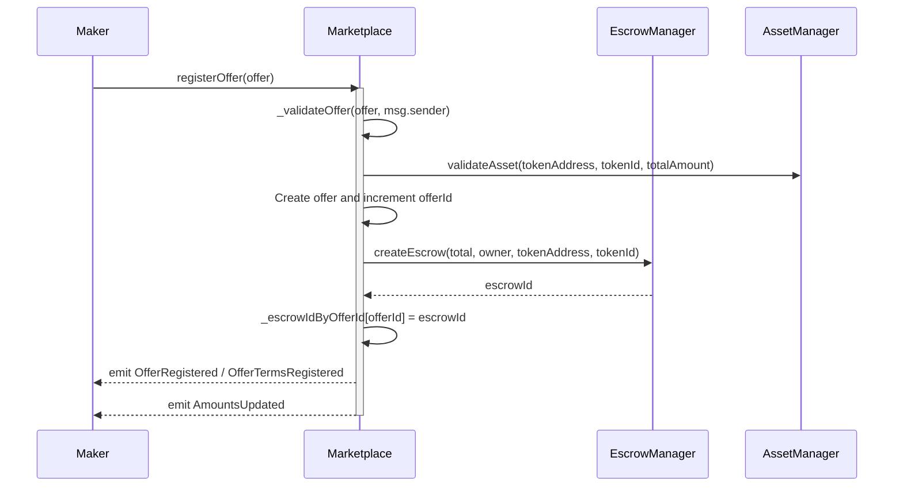
```mermaid
sequenceDiagram
    participant Maker
    participant Marketplace
    participant EscrowManager
    participant AssetManager

    Maker->>Marketplace: registerOffer(offer)
    activate Marketplace
    
    Marketplace->>Marketplace: _validateOffer(offer, msg.sender)
    Marketplace->>AssetManager: validateAsset(tokenAddress, tokenId, totalAmount)
    
    Marketplace->>Marketplace: Create offer and increment offerId
    Marketplace->>EscrowManager: createEscrow(total, owner, tokenAddress, tokenId)
    EscrowManager-->>Marketplace: escrowId
    Marketplace->>Marketplace: _escrowIdByOfferId[offerId] = escrowId
    Marketplace-->>Maker: emit OfferRegistered / OfferTermsRegistered
    Marketplace-->>Maker: emit AmountsUpdated
    deactivate Marketplace
```

### acceptOffer(uint256 offerId, uint256 amount)

Accepts an offer by creating a deal.
On deal creation, the offer amounts are updated:  
- `inDeals` amount is increased by the amount input.  
- `available` amount is decreased by the amount input.  

**Prerequisites:**
- Offer must not be expired
- Offer must not be cancelled
- Offer must be in a direct-sale mode (`MARKETPLACE` or `REDEMPTION`)
- If `saleMode == MARKETPLACE` and `allowedBuyers` is non-empty, buyer must be allowlisted
- If `saleMode == REDEMPTION`, buyer must be allowlisted
- Offer must not be frozen
- Amount must be valid (greater than 0, multiple of lot size, within available amount)
- Buyer entity type must be allowlisted
- Buyer and seller wallets/entities must be enabled
- Seller wallet/entity enabled state and entity type were validated when the offer was originally registered; seller wallet/entity enabled state is rechecked here

**Parameters:**
- `offerId`: The ID of the offer to accept
- `amount`: The amount of tokens to accept (must be greater than 0 and a multiple of offer's lot size)

**Returns:**
- `uint256`: The unique identifier for the created deal

**Events:**
- `DealCreated(offerId, dealId, buyer, dealType, amount, price)` with `dealType == DealType.OFFER`: Direct-sale deal identity and amount snapshot
- `DealTermsRegistered(dealId, paymentDeadline, counterOfferExpiry, disputeDeadline)`: Deal payment and deadline terms
- `AmountsUpdated(offerId, available, inDeals, sold)`: Emitted when amounts are updated

**Errors:**
- **EntityEligibilityGuard__EntityWalletNotAllowed(address wallet)**: Buyer or seller wallet/entity is disabled.
- **EntityEligibilityGuard__EntityTypeNotAllowed(uint256 typeId)**: Buyer entity type is not allowlisted.
- **Marketplace__NotMarketplaceOffer(uint256 offerId)**: Offer is not in the direct-sale family.
- **Marketplace__BuyerNotAllowed(uint256 offerId, address buyer)**: Buyer is not permitted to directly accept the offer.
- **Marketplace__OfferExpired(uint256 expiry, uint256 timestamp)**: Offer has expired.
- **Marketplace__OfferAlreadyCancelled(uint256 offerId)**: Offer has already been cancelled.
- **Marketplace__OfferFrozen(uint256 offerId)**: Offer is frozen.
- **Marketplace__SenderIsOwner()**: Buyer equals seller.
- **Marketplace__ZeroAmount()**: `amount == 0`.
- **Marketplace__InsufficientAvailableAmount(uint256 requested, uint256 available)**: `amount` exceeds available.
- **Marketplace__AmountNotMultipleOfLot(uint256 lot, uint256 amount)**: `amount % lot != 0`.

**Important Notes:**
- Validates buyer wallet/entity enabled state and type allowlist, and validates seller wallet/entity enabled state before creating a new deal
- For `MARKETPLACE`, direct acceptance is public only when `allowedBuyers` is empty
- For `REDEMPTION`, direct acceptance is always restricted to the stored allowlist
- Creates a PENDING deal that requires payment within the deadline
- **Deal Expiry**: Payment deadline is calculated from the sale mode:
  - `MARKETPLACE`: `marketplacePaymentExpiryThreshold + block.timestamp`
  - `REDEMPTION`: `redemptionPaymentExpiryThreshold + block.timestamp`
- **Lot Size Validation**: The `amount` parameter must be a multiple of the offer's `lot` size. If the offer has no lot size (lot = 0), the transaction will revert during offer registration
- **Concurrency Handling**: The system uses atomic state updates to prevent overselling:
  - Amount validation occurs before state changes
  - Available amount is decremented immediately after validation
  - If multiple users try to accept the same offer simultaneously, only those with sufficient available amount will succeed (first come first serve)
- **Escrow Architecture**: No new escrow is created during `acceptOffer` - tokens are already held in escrow from the original offer registration. The escrow is managed at the offer level, not the deal level

**Sequence Diagram:**
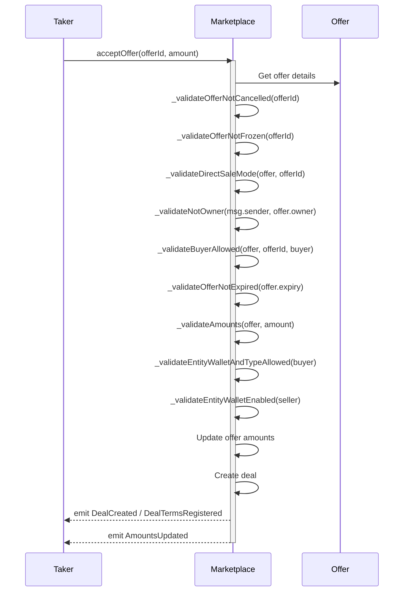
```mermaid
sequenceDiagram
    participant Taker
    participant Marketplace
    participant Offer

    Taker->>Marketplace: acceptOffer(offerId, amount)
    activate Marketplace
    
    Marketplace->>Offer: Get offer details
    Marketplace->>Marketplace: _validateOfferNotCancelled(offerId)
    Marketplace->>Marketplace: _validateOfferNotFrozen(offerId)
    Marketplace->>Marketplace: _validateDirectSaleMode(offer, offerId)
    Marketplace->>Marketplace: _validateNotOwner(msg.sender, offer.owner)
    Marketplace->>Marketplace: _validateBuyerAllowed(offer, offerId, buyer)
    Marketplace->>Marketplace: _validateOfferNotExpired(offer.expiry)
    Marketplace->>Marketplace: _validateAmounts(offer, amount)
    Marketplace->>Marketplace: _validateEntityWalletAndTypeAllowed(buyer)
    Marketplace->>Marketplace: _validateEntityWalletEnabled(seller)
    
    Marketplace->>Marketplace: Update offer amounts
    Marketplace->>Marketplace: Create deal
    Marketplace-->>Taker: emit DealCreated / DealTermsRegistered
    Marketplace-->>Taker: emit AmountsUpdated
    deactivate Marketplace
```

### expressInterest(uint256 offerId, uint256 amount)

Creates a binding pre-payment interest for an `INTEREST_DISCOVERY` offer.

**Prerequisites:**
- Offer must be in `INTEREST_DISCOVERY` mode
- Offer must not be expired
- Offer must not be cancelled
- Offer must not be frozen
- Caller must not be the offer owner
- Amount must be valid (greater than 0, multiple of lot size, within available amount)
- Investor entity type must be allowlisted
- Seller wallet/entity must be enabled

**Parameters:**
- `offerId`: The ID of the offer to reserve inventory from
- `amount`: The amount of tokens to reserve

**Returns:**
- `uint256`: The unique identifier for the expressed interest

**Events:**
- `InterestExpressed(offerId, interestId, investor, amount, price)`
- `AmountsUpdated(offerId, available, inDeals, sold)`

**Errors:**
- **Marketplace__NotInterestDiscoveryOffer(uint256 offerId)**: Offer is not an interest-discovery offer.
- **EntityEligibilityGuard__EntityWalletNotAllowed(address wallet)**: Seller wallet/entity is disabled.
- **EntityEligibilityGuard__EntityTypeNotAllowed(uint256 typeId)**: Investor entity type is not allowlisted.
- **Marketplace__OfferExpired(uint256 expiry, uint256 timestamp)**: Offer has expired.
- **Marketplace__OfferAlreadyCancelled(uint256 offerId)**: Offer has already been cancelled.
- **Marketplace__OfferFrozen(uint256 offerId)**: Offer is frozen.
- **Marketplace__SenderIsOwner()**: Investor equals seller.
- **Marketplace__ZeroAmount()**: `amount == 0`.
- **Marketplace__InsufficientAvailableAmount(uint256 requested, uint256 available)**: `amount` exceeds available.
- **Marketplace__AmountNotMultipleOfLot(uint256 lot, uint256 amount)**: `amount % lot != 0`.

**Important Notes:**
- No deal is created yet
- `Offer.amounts.available` is decreased immediately
- `interestedUnits` is cumulative and is never decremented
- `reservedInterestUnits` tracks currently reserved, still-open expressed interests
- Entity-type eligibility is accepted at expression time; later allowlist changes do not invalidate already expressed interests
- There is no stored `thresholdReached` flag; threshold is derived from `interestedUnits >= minSaleUnits`

### activateInterest(uint256 interestId)

Activates a previously expressed interest into a normal `PENDING` deal.

**Prerequisites:**
- Interest must exist
- Linked offer must be in `INTEREST_DISCOVERY` mode
- Linked offer must not be cancelled
- Linked offer must not be frozen
- Threshold must be reached
- Interest status must be `EXPRESSED`
- Activation must happen on or before `saleEnd + paymentExpiryThreshold`, where `paymentExpiryThreshold` is snapshotted on the linked interest-discovery offer
- Activation may happen before `saleEnd` once the threshold has been reached
- Stored investor wallet/entity must be enabled
- Seller wallet/entity must be enabled

**Parameters:**
- `interestId`: The ID of the expressed interest to activate

**Returns:**
- `uint256`: The unique identifier for the created deal

**Events:**
- `InterestStatusUpdated(interestId, offerId, newStatus, oldStatus)`
- `DealCreated(offerId, dealId, buyer, dealType, amount, price)`
- `DealTermsRegistered(dealId, paymentDeadline, counterOfferExpiry, disputeDeadline)`
- `AmountsUpdated(offerId, available, inDeals, sold)`

**Errors:**
- **Marketplace__InterestNotFound(uint256 interestId)**: Interest does not exist.
- **Marketplace__NotInterestDiscoveryOffer(uint256 offerId)**: Linked offer is not an interest-discovery offer.
- **Marketplace__OfferAlreadyCancelled(uint256 offerId)**: Linked offer has already been cancelled.
- **Marketplace__OfferFrozen(uint256 offerId)**: Linked offer is frozen.
- **Marketplace__ThresholdNotReached(uint256 offerId, uint256 interestedUnits, uint256 minSaleUnits)**: Cumulative expressed interest is still below threshold.
- **Marketplace__InvalidInterestStatus(uint256 interestId, uint8 status)**: Interest is not in `EXPRESSED` status.
- **Marketplace__InterestActivationWindowExpired(uint256 offerId, uint256 activationDeadline, uint256 timestamp)**: Activation deadline has already passed.
- **Marketplace__InterestActivationDeadlineOverflow(uint256 offerId, uint256 saleEnd, uint256 paymentExpiryThreshold)**: `saleEnd + paymentExpiryThreshold` cannot be computed safely.
- **EntityEligibilityGuard__EntityWalletNotAllowed(address wallet)**: Stored investor or seller wallet/entity is not enabled.

**Important Notes:**
- Activation is allowed once `minSaleUnits` has been reached, including before `saleEnd`, and remains available until `saleEnd + paymentExpiryThreshold`
- Any caller can activate an expressed interest. This is intentional because the investor commitment is created by `expressInterest`; activation always converts the stored `interest.investor` into the deal buyer and never uses `msg.sender` as buyer.
- The permissionless activation path allows operator or keeper automation to progress successful books without requiring every investor to submit a second transaction.
- Investors may continue expressing interest until `saleEnd` even if earlier interests have already been activated
- The created deal buyer is always `interest.investor`, not `msg.sender`
- `Offer.amounts.inDeals` increases and `reservedInterestUnits` decreases during activation
- Payment deadline uses the value snapshotted on the offer: activations through `saleEnd` use `saleEnd + paymentExpiryThreshold`, while activations after `saleEnd` use `block.timestamp + paymentExpiryThreshold`
- Activation deadline calculation is guarded against arithmetic overflow as defence in depth.

### closeExpiredInterests(uint256 offerId, uint256[] calldata interestIds)

Closes stale expressed interests in bounded batches after the activation deadline has passed.

**Prerequisites:**
- Offer must be in `INTEREST_DISCOVERY` mode
- Offer must not be cancelled
- Caller must be the enabled offer owner or hold the `INTEREST_DISCOVERY_OPERATOR` role
  - If caller is the offer owner, the owner account must be enabled in `EntityRegistry`; `INTEREST_DISCOVERY_OPERATOR` role path is unaffected by owner enablement status
  - `ADMIN` role alone does not authorize this call
- Threshold must have been reached
- `block.timestamp > saleEnd + paymentExpiryThreshold`, where `paymentExpiryThreshold` is snapshotted on the linked interest-discovery offer
- Each provided interest must belong to the offer and still be in `EXPRESSED` status

**Parameters:**
- `offerId`: The linked interest-discovery offer
- `interestIds`: The specific interest identifiers to close

**Events:**
- `InterestStatusUpdated(interestId, offerId, newStatus, oldStatus)` for each closed interest
- `AmountsUpdated(offerId, available, inDeals, sold)`

**Errors:**
- **Marketplace__NotAuthorized(address caller)**: Caller is neither the enabled offer owner nor holds `INTEREST_DISCOVERY_OPERATOR`; or caller is the offer owner but the owner account is disabled in `EntityRegistry`.
- **Marketplace__OfferAlreadyCancelled(uint256 offerId)**: Offer has already been cancelled.
- **Marketplace__NotInterestDiscoveryOffer(uint256 offerId)**: Offer is not an interest-discovery offer.
- **Marketplace__InterestActivationWindowOpen(uint256 offerId, uint256 activationDeadline, uint256 timestamp)**: Activation deadline has not passed yet.
- **Marketplace__InterestActivationDeadlineOverflow(uint256 offerId, uint256 saleEnd, uint256 paymentExpiryThreshold)**: `saleEnd + paymentExpiryThreshold` cannot be computed safely.
- **Marketplace__ThresholdNotReached(uint256 offerId, uint256 interestedUnits, uint256 minSaleUnits)**: Threshold was never reached.
- **Marketplace__InterestOfferMismatch(uint256 interestId, uint256 offerId)**: Interest does not belong to the supplied offer.
- **Marketplace__InvalidInterestStatus(uint256 interestId, uint8 status)**: Interest is not in `EXPRESSED` status.

**Important Notes:**
- This is the bounded cleanup path for successful books
- Failed books whose threshold was never reached use `cancelOffer`, which releases all remaining available and reserved inventory at the offer level instead of closing individual interests.
- `releasedAmount` is returned to `Offer.amounts.available`
- The function can be called repeatedly in batches
- The function remains callable while the offer is frozen; freeze does not pause the activation-window lifecycle
- The function is blocked on cancelled offers (for example after `seizeOfferEscrow`) because the offer-level reserved bucket may already have been released or seized

### createCounterOffer(CounterOfferInput calldata counterOffer)

Creates a counter offer to an existing offer (technically as a deal in `PROPOSED` status and type `COUNTER_OFFER`). 
⚠️ **NOTE**: No amounts in the offer are being updated yet!

**Prerequisites:**
- Original offer must not be expired
- Original offer must not be cancelled
- Original offer must not be frozen
- Original offer must be in `MARKETPLACE` mode
- Original offer must allow counter offers (`allowCounterOffers = true`)
- If `allowedBuyers` is non-empty, buyer must be allowlisted
- Buyer entity type must be allowlisted
- Buyer and seller wallets/entities must be enabled
- Seller wallet/entity enabled state and entity type were validated when the offer was originally registered; seller wallet/entity enabled state is rechecked here
- Sender must not have reached the platform-wide counter offer limit for this offer
- Amount must be valid (greater than 0, multiple of lot size, within available amount)
- Counter offer unit price must be non-zero
- Counter offer expiry must satisfy the configured lifetime window:
  - `counterOffer.expiry >= block.timestamp + offerExpiryThreshold`
  - `counterOffer.expiry <= block.timestamp + maxOfferLifetime`
  - `offerExpiryThreshold` itself must stay within [`MIN_OFFER_EXPIRY_THRESHOLD`, `MAX_OFFER_EXPIRY_THRESHOLD`]
  - `maxOfferLifetime` must stay within `offerExpiryThreshold <= maxOfferLifetime <= MAX_CONFIGURABLE_OFFER_LIFETIME`

**Parameters:**
- `counterOffer`: The counter offer input containing offer ID, amount, price, and expiry

**Returns:**
- `uint256`: The unique identifier for the counter offer deal

**Events:**
- `DealCreated(offerId, dealId, buyer, dealType, amount, price)` with `dealType == DealType.COUNTER_OFFER`
- `DealTermsRegistered(dealId, paymentDeadline, counterOfferExpiry, disputeDeadline)` (`paymentDeadline` and `disputeDeadline` are 0 while the deal remains `PROPOSED`)
- `CounterOfferCreated(offerId, dealId, owner)`: Emitted when counter offer is created

**Errors:**
- **Marketplace__CounterOffersNotAllowed()**: The original offer does not allow counter offers (`allowCounterOffers = false`).
- **Marketplace__CounterOfferLimitReached()**: Sender has reached the maximum number of counter offers allowed per user for this offer.
- **EntityEligibilityGuard__EntityWalletNotAllowed(address wallet)**: Buyer or seller wallet/entity is disabled.
- **EntityEligibilityGuard__EntityTypeNotAllowed(uint256 typeId)**: Buyer entity type is not allowlisted.
- **Marketplace__NotMarketplaceOffer(uint256 offerId)**: Offer is not a `MARKETPLACE` offer.
- **Marketplace__BuyerNotAllowed(uint256 offerId, address buyer)**: Buyer is not permitted to enter the direct-sale flow for this offer.
- **Marketplace__OfferExpired(uint256 expiry, uint256 timestamp)**: Original offer has expired.
- **Marketplace__OfferAlreadyCancelled(uint256 offerId)**: Original offer has already been cancelled.
- **Marketplace__OfferFrozen(uint256 offerId)**: Original offer is frozen.
- **Marketplace__InvalidExpiry(uint256 expiry, uint256 timestamp)**: Counter offer expiry is in the past or below the configured minimum lifetime.
- **Marketplace__ExpiryTooFar(uint256 expiry, uint256 timestamp, uint256 maxOfferLifetime)**: Counter offer lifetime exceeds `maxOfferLifetime`.
- **Marketplace__ZeroAmount()**: `amount == 0`.
- **Marketplace__ZeroPrice()**: `unitPrice == 0`.
- **Marketplace__InsufficientAvailableAmount(uint256 requested, uint256 available)**: `amount` exceeds available.
- **Marketplace__AmountNotMultipleOfLot(uint256 lot, uint256 amount)**: `amount % lot != 0`.

**Important Notes:**
- Creates a PROPOSED deal that the original offer owner can accept or decline
- Counter offers are intentionally marketplace-only. `REDEMPTION` offers are allowlist-only direct acceptances and must be registered with `allowCounterOffers == false`
- Validates buyer wallet/entity enabled state and type allowlist, and validates seller wallet/entity enabled state before creating a new counter offer
- `allowedBuyers` gates entry into the full direct-sale flow, not only direct acceptance
- **Counter Offer Permissions**: Each offer has an `allowCounterOffers` flag set during registration. If `false`, no counter offers can be created for that offer
- **Counter Offer Limits**: The platform enforces a maximum number of counter offers per user per offer (configurable by admin, default is 5)
- **Counter Tracking**: Each successful counter offer increments the user's counter for that specific offer. Counters are independent across different users and different offers.
- Counter-offer counters are intentionally not decremented when proposed counter offers expire, are cancelled, or are declined. The per-user quota is a permanent business-limit counter for the offer; only changing the global admin-configured cap changes future capacity.
- The counter offer limit check occurs after the permission check, ensuring proper validation order
- `Marketplace__CounterOfferExpired(...)` applies when checking an already created counter offer (e.g., `cancelCounterOffer` / `resolveCounterOffer`), not during `createCounterOffer`

**Sequence Diagram:**
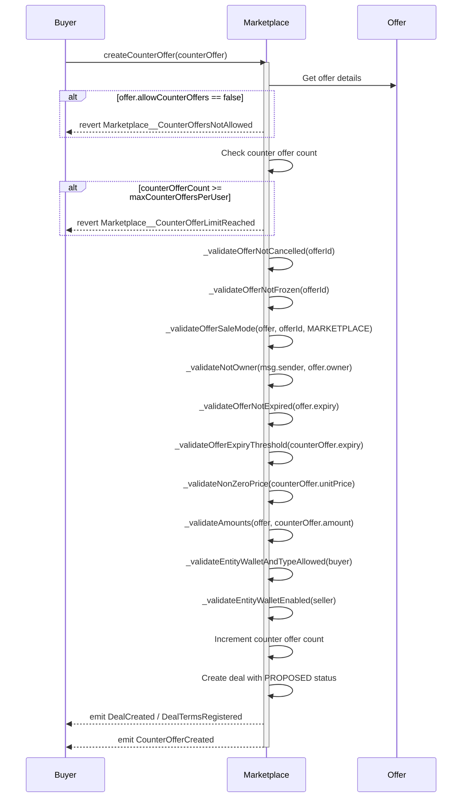
```mermaid
sequenceDiagram
    participant Buyer
    participant Marketplace
    participant Offer

    Buyer->>Marketplace: createCounterOffer(counterOffer)
    activate Marketplace
    
    Marketplace->>Offer: Get offer details
    
    alt offer.allowCounterOffers == false
        Marketplace-->>Buyer: revert Marketplace__CounterOffersNotAllowed
    end

    Marketplace->>Marketplace: Check counter offer count
    alt counterOfferCount >= maxCounterOffersPerUser
        Marketplace-->>Buyer: revert Marketplace__CounterOfferLimitReached
    end

    Marketplace->>Marketplace: _validateOfferNotCancelled(offerId)
    Marketplace->>Marketplace: _validateOfferNotFrozen(offerId)
    Marketplace->>Marketplace: _validateOfferSaleMode(offer, offerId, MARKETPLACE)
    Marketplace->>Marketplace: _validateNotOwner(msg.sender, offer.owner)
    Marketplace->>Marketplace: _validateOfferNotExpired(offer.expiry)
    Marketplace->>Marketplace: _validateOfferExpiryThreshold(counterOffer.expiry)
    Marketplace->>Marketplace: _validateNonZeroPrice(counterOffer.unitPrice)
    Marketplace->>Marketplace: _validateAmounts(offer, counterOffer.amount)
    Marketplace->>Marketplace: _validateEntityWalletAndTypeAllowed(buyer)
    Marketplace->>Marketplace: _validateEntityWalletEnabled(seller)
    
    Marketplace->>Marketplace: Increment counter offer count
    Marketplace->>Marketplace: Create deal with PROPOSED status
    Marketplace-->>Buyer: emit DealCreated / DealTermsRegistered
    Marketplace-->>Buyer: emit CounterOfferCreated
    deactivate Marketplace
```

### cancelCounterOffer(uint256 dealId)

Cancels a counter offer.

**Prerequisites:**
- Linked offer must be in `MARKETPLACE` mode
- Deal must be in `PROPOSED` status (counter offer)
- Neither the counter offer nor its parent offer may be frozen
- Counter offer must still be valid (i.e., not expired)
- Only the creator of the counter offer can cancel it, and the creator account must be enabled in `EntityRegistry`

**Parameters:**
- `dealId`: ID of the counter offer deal to cancel

**Events:**
- `DealStatusUpdated(dealId, offerId, newStatus, oldStatus)`: Emitted when deal status is updated
- `CounterOfferCancelled(dealId, cancelor)`: Emitted when counter offer is cancelled

**Errors:**
- **Marketplace__InvalidStatus(uint8 actualStatus)**: Deal is not in `PROPOSED` status.
- **Marketplace__DealFrozen(uint256 dealId)**: Counter offer deal is frozen.
- **Marketplace__OfferFrozen(uint256 offerId)**: Parent offer is frozen.
- **Marketplace__CounterOfferExpired(uint256 expiry, uint256 timestamp)**: Counter offer has already expired.
- **Marketplace__NotAuthorized(address caller)**: Caller is not the counter offer creator (`deal.buyer`), or `deal.buyer` is disabled in `EntityRegistry`.

**Important Notes:**
- **Offer Validity**: "Offer is valid" means the counter offer deal has not yet expired (`block.timestamp <= deal.counterOfferExpiry`)
- **Cancellation Rules**: Only the enabled counter offer creator (deal.buyer) can cancel, and only while the counter offer remains valid. Expired counter offers cannot be cancelled.
- **Freeze Interaction**: Freeze blocks cancellation, but it does not pause `counterOfferExpiry`. A counter offer can expire while frozen and stay expired after unfreeze.

**Sequence Diagram:**
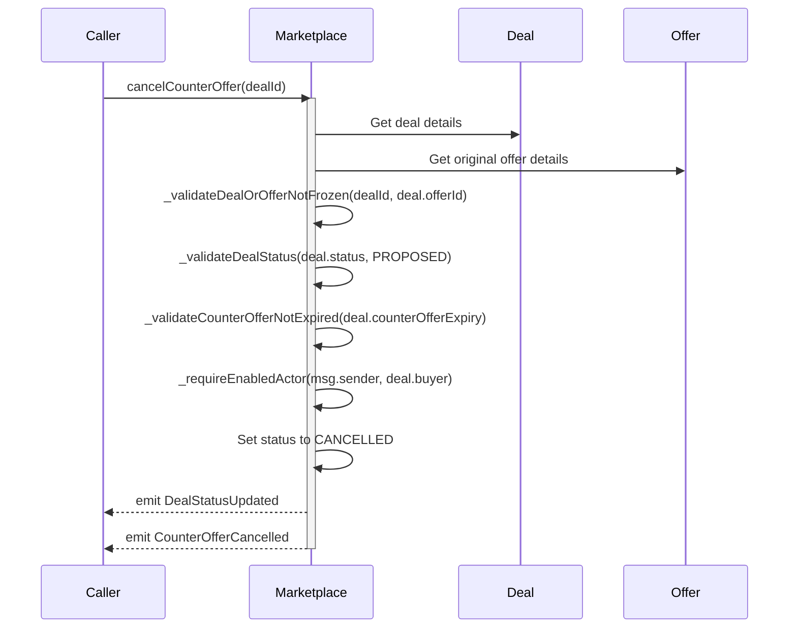
```mermaid
sequenceDiagram
    participant Caller
    participant Marketplace
    participant Deal
    participant Offer

    Caller->>Marketplace: cancelCounterOffer(dealId)
    activate Marketplace
    
    Marketplace->>Deal: Get deal details
    Marketplace->>Offer: Get original offer details
    Marketplace->>Marketplace: _validateDealOrOfferNotFrozen(dealId, deal.offerId)
    Marketplace->>Marketplace: _validateDealStatus(deal.status, PROPOSED)
    Marketplace->>Marketplace: _validateCounterOfferNotExpired(deal.counterOfferExpiry)
    Marketplace->>Marketplace: _requireEnabledActor(msg.sender, deal.buyer)
    
    Marketplace->>Marketplace: Set status to CANCELLED
    Marketplace-->>Caller: emit DealStatusUpdated
    Marketplace-->>Caller: emit CounterOfferCancelled
    deactivate Marketplace
```

### resolveCounterOffer(uint256 dealId, bool accepted)

Resolves a counter offer by accepting (`accepted==true`) or declining (`accepted==false`) it.

**Prerequisites:**
- Deal must be in PROPOSED status (counter offer)
- Neither the counter offer nor its parent offer may be frozen
- Counter offer must not be expired (current timestamp must be ≤ counter offer expiry)
- Only the original offer owner can resolve, and the offer owner account must be enabled in `EntityRegistry`
- Related offer must not be cancelled
- If accepted, original offer must not be expired
- If accepted, amount must be greater than 0 and sufficient amount must be available
- If accepted, seller and buyer wallets/entities must be enabled
- If accepted, buyer entity type must still be allowlisted

**Parameters:**
- `dealId`: ID of the counter offer deal to resolve
- `accepted`: Whether to accept the counter offer

**Events:**
- `DealStatusUpdated(dealId, offerId, newStatus, oldStatus)`: Emitted when deal status is updated
- `CounterOfferResolved(dealId, accepted, tokenId, amount, currency, buyer, seller)`: Emitted when counter offer is resolved (payload matches the deal and underlying offer for integrators)
- `AmountsUpdated(offerId, available, inDeals, sold)`: Emitted when amounts are updated (if accepted)

**Errors:**
- **Marketplace__InvalidStatus(uint8 actualStatus)**: Deal is not in `PROPOSED` status.
- **Marketplace__DealFrozen(uint256 dealId)**: Counter offer deal is frozen.
- **Marketplace__OfferFrozen(uint256 offerId)**: Parent offer is frozen.
- **Marketplace__NotAuthorized(address caller)**: Caller is not the original offer owner, or the offer owner account is disabled in `EntityRegistry`.
- **Marketplace__CounterOfferExpired(uint256 expiry, uint256 timestamp)**: Counter offer has expired (current timestamp > counter offer expiry).
- **Marketplace__OfferExpired(uint256 expiry, uint256 timestamp)**: On accept, original offer has expired.
- **Marketplace__OfferAlreadyCancelled(uint256 offerId)**: Related offer has already been cancelled.
- **EntityEligibilityGuard__EntityWalletNotAllowed(address wallet)**: On accept, seller or buyer wallet/entity is disabled.
- **EntityEligibilityGuard__EntityTypeNotAllowed(uint256 typeId)**: On accept, buyer entity type is not allowlisted.
- **Marketplace__ZeroAmount()**: On accept, `amount == 0`.
- **Marketplace__InsufficientAvailableAmount(uint256 requested, uint256 available)**: On accept, `amount` exceeds available.
- **Marketplace__AmountNotMultipleOfLot(uint256 lot, uint256 amount)**: On accept, `amount % lot != 0`.

**Important Notes:**
- **Counter Offer Expiry Validation**: The function validates that the counter offer has not expired before allowing resolution. This ensures that expired counter offers cannot be accepted or declined through this function
- **Freeze Interaction**: Freeze blocks resolution, but it does not pause `counterOfferExpiry`. A frozen counter offer may still expire and remain expired after unfreeze.
- **Accepted Path Eligibility Validation**: Seller wallet/entity-enabled and buyer wallet/entity-enabled plus buyer entity-type allowlist checks are performed only when `accepted == true`
- **Payment Deadline**: When a counter offer is accepted, the deal's `paymentDeadline` is set to `block.timestamp + marketplacePaymentExpiryThreshold`, establishing the deadline for payment
- **Dispute Buffer**: When accepted, the `disputeBuffer` is set to `paymentDeadline + disputeBufferPeriod`, defining the window for dispute initiation after an unpaid deal
- **Counter Offer Expiry Reset**: The `counterOfferExpiry` field is reset to 0 for both accepted and declined counter offers, as it's no longer relevant once resolved
- **Deal Type Change**: When accepted, the deal type changes from `COUNTER_OFFER` to `OFFER`, and the status changes to `PENDING`
- **Original Offer Expiry**: Accepting a counter offer validates that the original offer has not expired. Declining a counter offer remains available after the original offer expires while the counter offer itself is unexpired.
- **validateDealStatus**: This function checks that `deal.status == DealStatus.PROPOSED`. It ensures the deal is a counter offer (only counter offers can have PROPOSED status) and hasn't been previously resolved

**Sequence Diagram:**
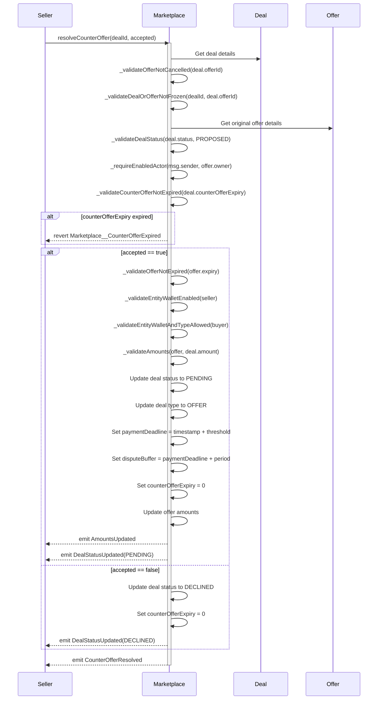
```mermaid
sequenceDiagram
    participant Seller
    participant Marketplace
    participant Deal
    participant Offer

    Seller->>Marketplace: resolveCounterOffer(dealId, accepted)
    activate Marketplace
    
    Marketplace->>Deal: Get deal details
    Marketplace->>Marketplace: _validateOfferNotCancelled(deal.offerId)
    Marketplace->>Marketplace: _validateDealOrOfferNotFrozen(dealId, deal.offerId)
    Marketplace->>Offer: Get original offer details
    Marketplace->>Marketplace: _validateDealStatus(deal.status, PROPOSED)
    Marketplace->>Marketplace: _requireEnabledActor(msg.sender, offer.owner)
    Marketplace->>Marketplace: _validateCounterOfferNotExpired(deal.counterOfferExpiry)
    
    alt counterOfferExpiry expired
        Marketplace-->>Seller: revert Marketplace__CounterOfferExpired
    end
    
    alt accepted == true
        Marketplace->>Marketplace: _validateOfferNotExpired(offer.expiry)
        Marketplace->>Marketplace: _validateEntityWalletEnabled(seller)
        Marketplace->>Marketplace: _validateEntityWalletAndTypeAllowed(buyer)
        Marketplace->>Marketplace: _validateAmounts(offer, deal.amount)
        Marketplace->>Marketplace: Update deal status to PENDING
        Marketplace->>Marketplace: Update deal type to OFFER
        Marketplace->>Marketplace: Set paymentDeadline = timestamp + threshold
        Marketplace->>Marketplace: Set disputeBuffer = paymentDeadline + period
        Marketplace->>Marketplace: Set counterOfferExpiry = 0
        Marketplace->>Marketplace: Update offer amounts
        Marketplace-->>Seller: emit AmountsUpdated
        Marketplace-->>Seller: emit DealStatusUpdated(PENDING)
    else accepted == false
        Marketplace->>Marketplace: Update deal status to DECLINED
        Marketplace->>Marketplace: Set counterOfferExpiry = 0
        Marketplace-->>Seller: emit DealStatusUpdated(DECLINED)
    end
    
    Marketplace-->>Seller: emit CounterOfferResolved
    deactivate Marketplace
```

### resolvePayment(uint256 dealId, bool paid)

Resolves payment for a pending deal as either paid or unpaid.

**Prerequisites:**
- `paymentDeadline` for a `PENDING` deal is set when the deal is created:
  - `block.timestamp + marketplacePaymentExpiryThreshold` for direct marketplace deals and accepted counter offers
  - `block.timestamp + redemptionPaymentExpiryThreshold` for redemption deals
  - For activated interests, `saleEnd + paymentExpiryThreshold` when activated through `saleEnd`, otherwise `block.timestamp + paymentExpiryThreshold`, using the value snapshotted on the interest-discovery offer
- All payment-expiry thresholds are admin-configurable and must stay within
  [`MIN_PAYMENT_EXPIRY_THRESHOLD`, `MAX_PAYMENT_EXPIRY_THRESHOLD`]
- If `paid == true`:
  - Caller must have `PAYMENT_HANDLER` role
  - Deal must be in `PENDING` or pre-arbitration `UNPAID` status
  - If the deal is currently `PENDING`, `block.timestamp <= deal.paymentDeadline`
  - If the deal is currently `UNPAID`, `deal.disputeBuffer != 0` (the dispute outcome has not already been arbitrated)
- If `paid == false`:
  - Callable by anyone
  - Deal must be in `PENDING` status
  - `block.timestamp > deal.paymentDeadline`

**Parameters:**
- `dealId`: The ID of the deal to resolve
- `paid`: `true` to resolve as `PAID`, `false` to resolve as `UNPAID`

**Events:**
- `DealStatusUpdated(dealId, offerId, newStatus, oldStatus)`: Emitted when status changes to `PAID` or `UNPAID`
- `PaymentResolved(dealId, paid, resolver)`: Emitted when payment resolution is finalized

**Errors:**
- Reverts if caller lacks the **PAYMENT_HANDLER** role when `paid == true`.
- **Marketplace__InvalidStatus(uint8 actualStatus)**:
  - `paid == true`: Deal is neither `PENDING` nor `UNPAID`
  - `paid == false`: Deal is not `PENDING`
- **Marketplace__PaymentDeadlineExpired()**: `paid == true` and deadline already passed.
- **Marketplace__DealNotExpired()**: `paid == false` and deadline has not passed yet.
- **Marketplace__DealAlreadyArbitrated()**: `paid == true`, deal is currently `UNPAID`, and `disputeBuffer == 0`.

**Important Notes:**
- The function remains callable while the deal or its parent offer is frozen. Only asset movement is blocked by the freeze. `_resolvePayment` records payment intent (status transition only); no assets are transferred at this step. Asset movement is gated in `_settleDeal`, which calls `_validateDealOrOfferNotFrozen` before any transfer.
- Freeze does not pause `paymentDeadline`; once the raw deadline passes, `paid == true` still reverts with `Marketplace__PaymentDeadlineExpired()`
- `resolvePayment(dealId, true)` can correct a pre-arbitration `UNPAID` deal back to `PAID`, but not after arbitration has finalized the dispute outcome
- A status transition while frozen does not reduce the compliance team's ability to seize. `seizeDeal` covers all pre-settlement statuses (`PENDING`, `UNPAID`, `IN_DISPUTE`, and `PAID`), so the deal remains subject to seizure regardless of payment resolution.

**Sequence Diagram:**
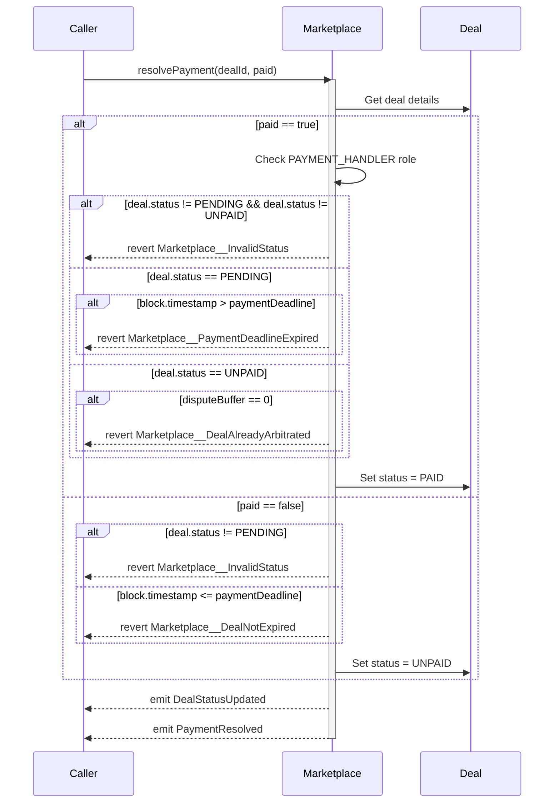
```mermaid
sequenceDiagram
    participant Caller
    participant Marketplace
    participant Deal

    Caller->>Marketplace: resolvePayment(dealId, paid)
    activate Marketplace
    Marketplace->>Deal: Get deal details

    alt paid == true
        Marketplace->>Marketplace: Check PAYMENT_HANDLER role
        alt deal.status != PENDING && deal.status != UNPAID
            Marketplace-->>Caller: revert Marketplace__InvalidStatus
        else deal.status == PENDING
            alt block.timestamp > paymentDeadline
                Marketplace-->>Caller: revert Marketplace__PaymentDeadlineExpired
            end
        else deal.status == UNPAID
            alt disputeBuffer == 0
                Marketplace-->>Caller: revert Marketplace__DealAlreadyArbitrated
            end
        end
        Marketplace->>Deal: Set status = PAID
    else paid == false
        alt deal.status != PENDING
            Marketplace-->>Caller: revert Marketplace__InvalidStatus
        else block.timestamp <= paymentDeadline
            Marketplace-->>Caller: revert Marketplace__DealNotExpired
        end
        Marketplace->>Deal: Set status = UNPAID
    end

    Marketplace-->>Caller: emit DealStatusUpdated
    Marketplace-->>Caller: emit PaymentResolved
    deactivate Marketplace
```

### resolvePayments(PaymentResolutionInput[] calldata resolutions)

Resolves multiple deal payments in input order. Each item has a `dealId` and `paid` flag and uses the same validation rules as `resolvePayment`. Item-level failures are skipped and reported through events, so later items can continue.

**Prerequisites:**
- Empty batches are valid.
- If any item has `paid == true`, caller must have the `PAYMENT_HANDLER` role before any item is processed.
- If every item has `paid == false`, the batch is permissionless.

**Parameters:**
- `resolutions`: Ordered payment-resolution items:
  - `dealId`: The ID of the deal to resolve.
  - `paid`: `true` to resolve as `PAID`, `false` to resolve as `UNPAID`.

**Events:**
- Successful items emit the same `DealStatusUpdated` and `PaymentResolved` events as `resolvePayment`.
- `PaymentResolutionSkipped(dealId, paid, resolver, failureData)`: Emitted for each skipped item.
- `PaymentResolutionsBatchProcessed(resolver, requested, succeeded, skipped)`: Emitted once after the batch finishes, including for empty batches.

**Errors and Skips:**
- A missing `PAYMENT_HANDLER` role for a batch containing any paid item reverts the whole call before processing starts.
- Per-item validation failures do **not** revert the batch. The item is skipped and the raw revert data is emitted in `PaymentResolutionSkipped`.
- Skipped items can include the same errors as `resolvePayment`, such as:
  - **Marketplace__InvalidStatus(uint8 actualStatus)**
  - **Marketplace__PaymentDeadlineExpired()**
  - **Marketplace__DealNotExpired()**
  - **Marketplace__DealAlreadyArbitrated()**

**Important Notes:**
- The function remains callable while the deal or its parent offer is frozen.
- Successful and failed duplicate deal IDs are processed strictly in input order.
- Earlier successful items remain applied if a later item fails.
- `resolvePayments` does not return per-item results. Off-chain callers should inspect `PaymentResolutionSkipped` and `PaymentResolutionsBatchProcessed` logs for failure details and summary counts.

**Sequence Diagram:**
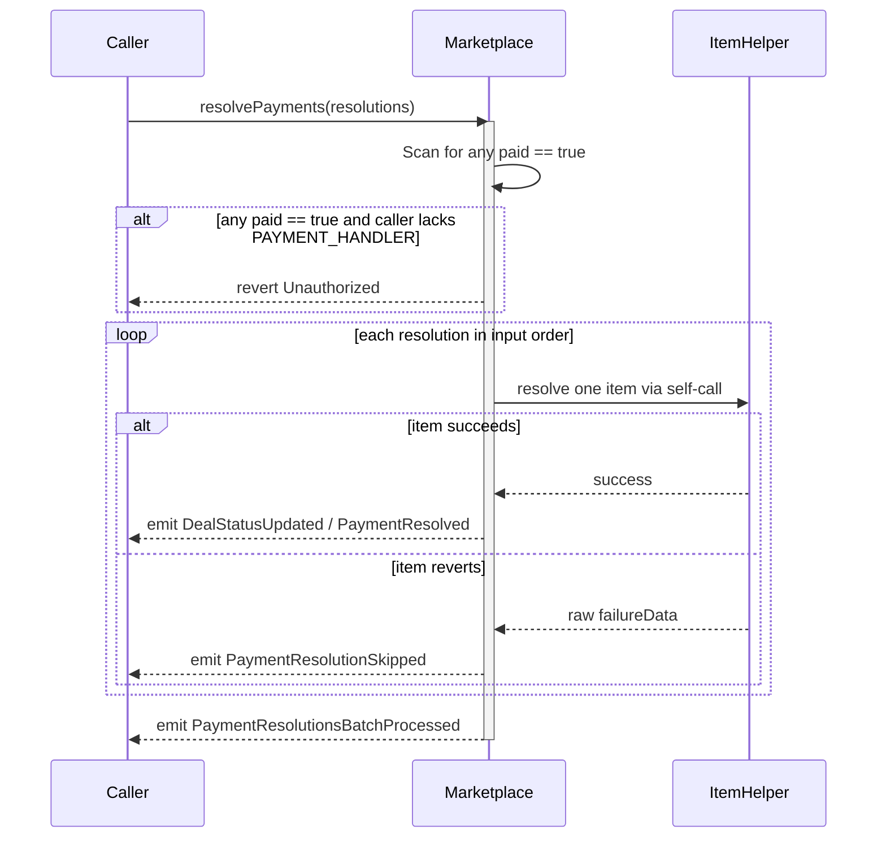
```mermaid
sequenceDiagram
    participant Caller
    participant Marketplace
    participant ItemHelper

    Caller->>Marketplace: resolvePayments(resolutions)
    activate Marketplace
    Marketplace->>Marketplace: Scan for any paid == true

    alt any paid == true and caller lacks PAYMENT_HANDLER
        Marketplace-->>Caller: revert Unauthorized
    end

    loop each resolution in input order
        Marketplace->>ItemHelper: resolve one item via self-call
        alt item succeeds
            ItemHelper-->>Marketplace: success
            Marketplace-->>Caller: emit DealStatusUpdated / PaymentResolved
        else item reverts
            ItemHelper-->>Marketplace: raw failureData
            Marketplace-->>Caller: emit PaymentResolutionSkipped
        end
    end

    Marketplace-->>Caller: emit PaymentResolutionsBatchProcessed
    deactivate Marketplace
```

### cancelOffer(uint256 offerId)

Cancels a direct-sale offer or an expired failed interest-discovery offer.

Cancellation means that:
- `_offerCancelled[offerId]` is set to `true`
- `offer.expiry` is set to `block.timestamp`
- `offer.amounts.available` is set to `0`
- for direct-sale offers, if `available > 0`, that amount is withdrawn from offer escrow immediately
- for direct-sale offers, if `available == 0` and `inDeals > 0`, cancellation is still allowed
- for failed interest-discovery offers, `reservedInterestUnits` is also set to `0` and `available + reservedInterestUnits` is withdrawn from offer escrow immediately

**Prerequisites:**
- For direct-sale offers, caller must be the offer owner, and the offer owner account must be enabled in `EntityRegistry`.
- For interest-discovery offers, caller must be either:
  - the offer owner, with the owner account enabled in `EntityRegistry`
  - an address holding `INTEREST_DISCOVERY_OPERATOR`, while the offer owner account is enabled in `EntityRegistry`
- Offer must not be already cancelled.
- Offer must not be frozen.
- For direct-sale offers, offer must be in `MARKETPLACE` or `REDEMPTION` mode and at least one of these must hold:
  - `offer.amounts.available > 0`
  - `offer.amounts.inDeals > 0`
- For interest-discovery offers:
  - `block.timestamp > offer.expiry`
  - `interestedUnits < minSaleUnits`

**Parameters:**
- `offerId`: ID of the offer to cancel

**Events:**
- `OfferCancelled(offerId, sender)`: Emitted when offer is cancelled
- `AmountsUpdated(offerId, available, inDeals, sold)`: Emitted when amounts are updated

**Errors:**
- **Marketplace__NotAuthorized(address caller)**: For direct-sale offers, caller is not the offer owner or the offer owner account is disabled in `EntityRegistry`. For interest-discovery offers, caller is the offer owner but the owner account is disabled in `EntityRegistry`, or caller is `INTEREST_DISCOVERY_OPERATOR` while the owner account is disabled.
- **Ownable.Unauthorized()**: For interest-discovery offers, caller is neither the enabled offer owner nor holds `INTEREST_DISCOVERY_OPERATOR`.
- **Marketplace__OfferAlreadyCancelled(uint256 offerId)**: Offer has already been cancelled.
- **Marketplace__OfferFrozen(uint256 offerId)**: Offer is frozen.
- **Marketplace__NotMarketplaceOffer(uint256 offerId)**: Offer is neither a direct-sale offer nor an interest-discovery offer handled by this path.
- **Marketplace__NoAvailableAmount(uint256 offerId)**: Direct-sale offer has no `available` amount and no `inDeals` amount.
- **Marketplace__OfferNotExpired(uint256 expiry, uint256 timestamp)**: Interest-discovery offer has not expired yet.
- **Marketplace__ThresholdAlreadyReached(uint256 offerId, uint256 interestedUnits, uint256 minSaleUnits)**: Interest-discovery offer reached its activation threshold and must use the successful-book lifecycle.
- **Token__TransferNotAllowed(address from, address to, uint256 tokenId)** or token-specific transfer errors: The cancellation was authorized, but asset-level transfer policy rejected the escrow withdrawal recipient for a reason other than Marketplace owner enablement.

**Important Notes:**
- Failed-book cancellation is the canonical closeout path for expired `INTEREST_DISCOVERY` offers whose threshold was not met.
- It releases the full remaining escrow balance represented by direct `available` inventory plus still-reserved expressed interests.
- It does not individually rewrite every expressed interest in storage. `MarketplaceLens.getInterest(...)` projects affected interests as closed after the reserved bucket is released.
- `INTEREST_DISCOVERY_OPERATOR` can perform failed-book closeout when the offer owner is unavailable, but escrow withdrawal still pays the original escrow depositor and requires that owner to remain enabled. If the depositor is disabled, re-enable the depositor and retry, or use `setOfferFrozen(...)` + `seizeOfferEscrow(...)` to redirect through the privileged recovery path to an enabled beneficiary.

### withdrawAvailable(uint256 offerId)

Withdraws currently withdrawable inventory from offer escrow.
This is used for cancelled direct-sale offers and for leftover inventory from successful interest-discovery books.

**Prerequisites:**
- Caller must be the offer owner, and the offer owner account must be enabled in `EntityRegistry`.
- Offer must not be frozen.
- Mode-specific rules:
  - `MARKETPLACE`: Offer must already be cancelled.
  - `INTEREST_DISCOVERY`: Offer must not be cancelled, `block.timestamp > offer.expiry`, and `interestedUnits >= minSaleUnits`.

**Parameters:**
- `offerId`: ID of the offer

**Events:**
- `AmountsUpdated(offerId, available, inDeals, sold)`: Emitted when available is withdrawn and set to zero

**Errors:**
- **Marketplace__OfferNotCancelled(uint256 offerId)**: Offer has not been cancelled yet.
- **Marketplace__OfferAlreadyCancelled(uint256 offerId)**: Interest-discovery offer has already been cancelled.
- **Marketplace__NotAuthorized(address caller)**: Caller is not the offer owner, or the offer owner account is disabled in `EntityRegistry`.
- **Marketplace__OfferFrozen(uint256 offerId)**: Offer is frozen.
- **Marketplace__OfferNotExpired(uint256 expiry, uint256 timestamp)**: Interest-discovery offer has not expired yet.
- **Marketplace__ThresholdNotReached(uint256 offerId, uint256 interestedUnits, uint256 minSaleUnits)**: Interest-discovery threshold was not reached; use `cancelOffer` for failed-book closeout.
- **Marketplace__NoAvailableAmount(uint256 offerId)**: No available amount exists to withdraw.

**Important Notes:**
- For `MARKETPLACE`, only `offer.amounts.available` is withdrawable.
- For `INTEREST_DISCOVERY` failed books, `withdrawAvailable` is intentionally blocked. Use `cancelOffer`, which withdraws both `available` and `reservedInterestUnits` in one step and marks the offer cancelled.
- For `INTEREST_DISCOVERY` successful books, only currently unreserved `available` amount is withdrawable.
- Unactivated successful-book reservations remain protected until the activation deadline. After the deadline passes, `closeExpiredInterests` can release them back to `available`, and the owner can then call `withdrawAvailable`.
- Withdrawal pays the fixed escrow depositor / offer owner through `EscrowManager.withdraw`. If that wallet becomes
  disabled in `EntityRegistry` after the offer was created, withdrawal reverts at token-transfer time and the escrow
  remains locked until the wallet is re-enabled or the offer is frozen and seized.

### initiateDispute(uint256 dealId)

Initiates a dispute for an unpaid deal within the dispute period.

**Prerequisites:**
- Deal must be in UNPAID status
- Only the buyer of the deal can initiate a dispute, and the buyer account must be enabled in `EntityRegistry`
- Current timestamp must be within the dispute buffer period

**Parameters:**
- `dealId`: ID of the deal in dispute

**Events:**
- `DealStatusUpdated(dealId, offerId, newStatus, oldStatus)`: Emitted when deal status is updated to IN_DISPUTE

**Errors:**
- **Marketplace__NotAuthorized(address caller)**: Caller is not the buyer of the deal, or the buyer account is disabled in `EntityRegistry`.
- **Marketplace__InvalidStatus(uint8 actualStatus)**: Deal is not in `UNPAID` status.
- **Marketplace__DisputePeriodExpired()**: Current timestamp exceeds `deal.disputeBuffer`.

**Important Notes:**
- The function remains callable while the deal or its parent offer is frozen
- Freeze does not pause `disputeBuffer`; once the raw dispute window passes, the dispute can no longer be initiated

**Sequence Diagram:**
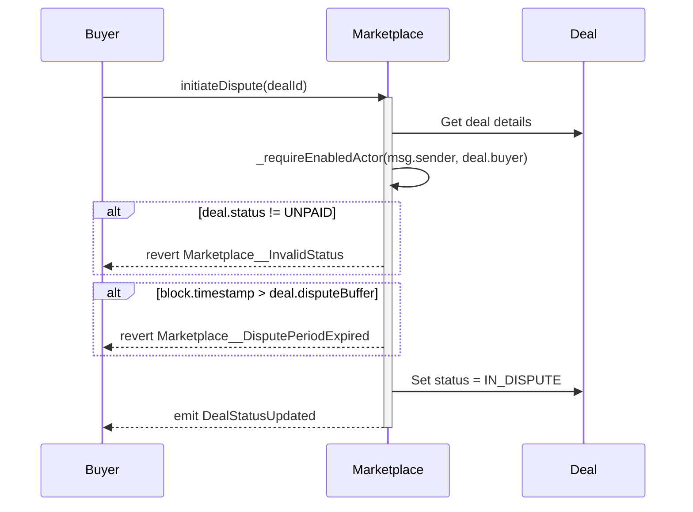
```mermaid
sequenceDiagram
    participant Buyer
    participant Marketplace
    participant Deal

    Buyer->>Marketplace: initiateDispute(dealId)
    activate Marketplace

    Marketplace->>Deal: Get deal details
    Marketplace->>Marketplace: _requireEnabledActor(msg.sender, deal.buyer)
    
    alt deal.status != UNPAID
        Marketplace-->>Buyer: revert Marketplace__InvalidStatus
    end

    alt block.timestamp > deal.disputeBuffer
        Marketplace-->>Buyer: revert Marketplace__DisputePeriodExpired
    end

    Marketplace->>Deal: Set status = IN_DISPUTE
    Marketplace-->>Buyer: emit DealStatusUpdated
    deactivate Marketplace
```

### resolveDispute(uint256 dealId, DealStatus status)

Resolves a dispute for a deal by an arbitrator.

**Prerequisites:**
- Deal must be in IN_DISPUTE status
- Only users with ARBITRATOR role can call this function
- Status must be either PAID or UNPAID

**Parameters:**
- `dealId`: The ID of the deal to resolve
- `status`: The new status for the deal (PAID or UNPAID)

**Events:**
- `DealStatusUpdated(dealId, offerId, newStatus, oldStatus)`: Emitted when deal status is updated

**Errors:**
- Reverts if caller lacks the **ARBITRATOR** role.
- **Marketplace__DealNotInDispute()**: Deal is not in `IN_DISPUTE` status.
- **Marketplace__InvalidStatus(uint8 status)**: Provided `status` is not `PAID` or `UNPAID`.

**Important Notes:**
- Only addresses with ARBITRATOR role can call this function
- The function remains callable while the deal or its parent offer is frozen
- Reverts if the deal is not in IN_DISPUTE status or if the new status is invalid
- Prevents future disputes by setting dispute buffer to 0
- Sets `disputeBuffer` to 0 to prevent the deal from being disputed again (griefing protection)
- Updates deal status to the specified value

**Sequence Diagram:**
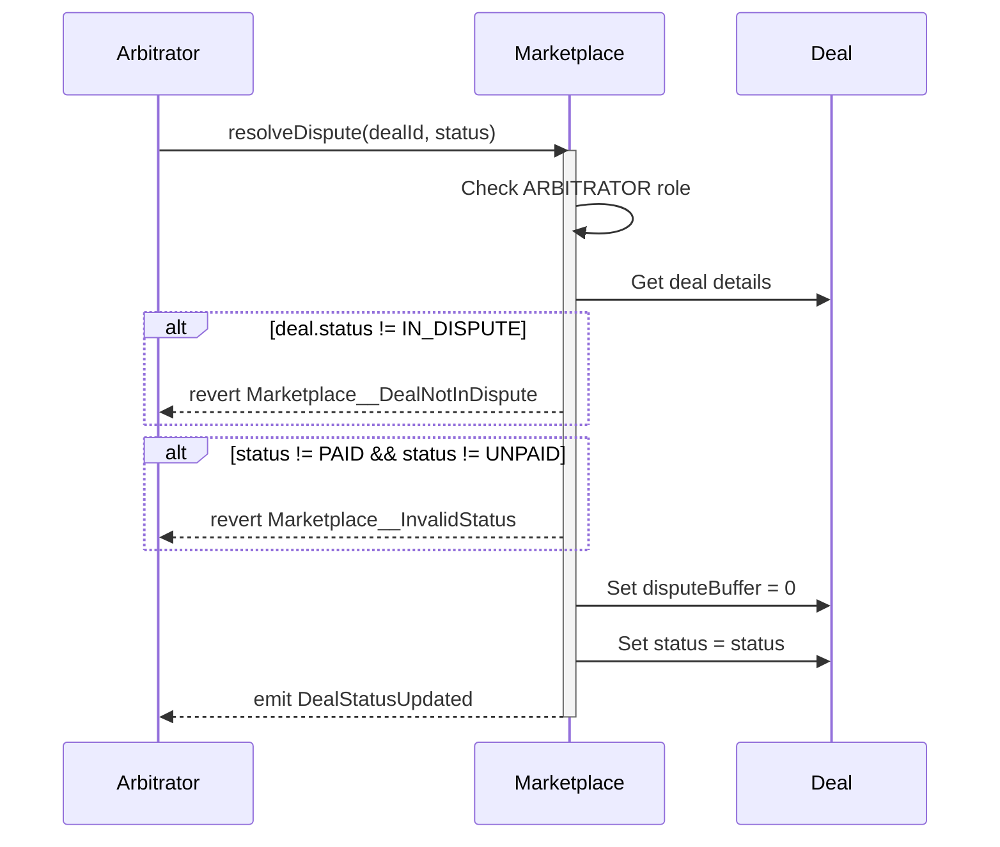
```mermaid
sequenceDiagram
    participant Arbitrator
    participant Marketplace
    participant Deal

    Arbitrator->>Marketplace: resolveDispute(dealId, status)
    activate Marketplace
    
    Marketplace->>Marketplace: Check ARBITRATOR role
    Marketplace->>Deal: Get deal details
    
    alt deal.status != IN_DISPUTE
        Marketplace-->>Arbitrator: revert Marketplace__DealNotInDispute
    end

    alt status != PAID && status != UNPAID
        Marketplace-->>Arbitrator: revert Marketplace__InvalidStatus
    end

    Marketplace->>Deal: Set disputeBuffer = 0
    Marketplace->>Deal: Set status = status
    Marketplace-->>Arbitrator: emit DealStatusUpdated
    deactivate Marketplace
```

### settleDeal(uint256 dealId)

Settles a deal after payment resolution.

**Prerequisites:**
- Neither the deal nor its parent offer may be frozen
- Deal must be in a valid status (PAID or UNPAID)
- If UNPAID, dispute period must have expired
- If PAID, the deal buyer must still be enabled in `EntityRegistry`

**Parameters:**
- `dealId`: The ID of the deal to settle

**Events:**
- `DealStatusUpdated(dealId, offerId, newStatus, oldStatus)`: Emitted when deal status is updated to `SUCCESSFUL` for `PAID` deals or `UNSUCCESSFUL` for `UNPAID` deals
- `AmountsUpdated(offerId, available, inDeals, sold)`: Emitted when amounts are updated

**Errors:**
- **Marketplace__DealFrozen(uint256 dealId)**: Deal is frozen.
- **Marketplace__OfferFrozen(uint256 offerId)**: Parent offer is frozen.
- **Marketplace__InvalidStatus(uint8 actualStatus)**: Deal status is not `PAID` or `UNPAID`.
- **Marketplace__DisputePeriodNotExpired()**: For `UNPAID` deals, dispute period has not yet expired.
- **Marketplace__NotAuthorized(address caller)**: For `PAID` deals, the deal buyer is disabled in `EntityRegistry`.

**Important Notes:**
- Can be called by anyone once the deal is in PAID or UNPAID status
- For UNPAID deals, requires dispute period to have expired
- Transfers tokens to buyer if PAID, restores seller availability if UNPAID
- Changes deal status to `SUCCESSFUL` if `PAID` or `UNSUCCESSFUL` if `UNPAID`, and updates offer amounts
- For PAID deals: Marketplace re-checks that the buyer is enabled, then transfers tokens to the buyer via EscrowManager
- For UNPAID deals: Tokens are returned to the seller's available amount and the deal ends as `UNSUCCESSFUL`
- Updates offer amounts: decreases inDeals, increases either sold (if PAID) or available (if UNPAID)
- Settlement does not choose a new recipient dynamically.
  - `PAID`: escrow is claimed to `deal.buyer`
  - `UNPAID`: inventory is restored to `offer.amounts.available`, but later withdrawal still pays `offer.owner`
- If the paid buyer is disabled in `EntityRegistry` at settlement time, the normal path reverts before state changes or
  escrow release. Recovery then requires either re-enabling the buyer or using freeze + seizure.

**Sequence Diagram:**
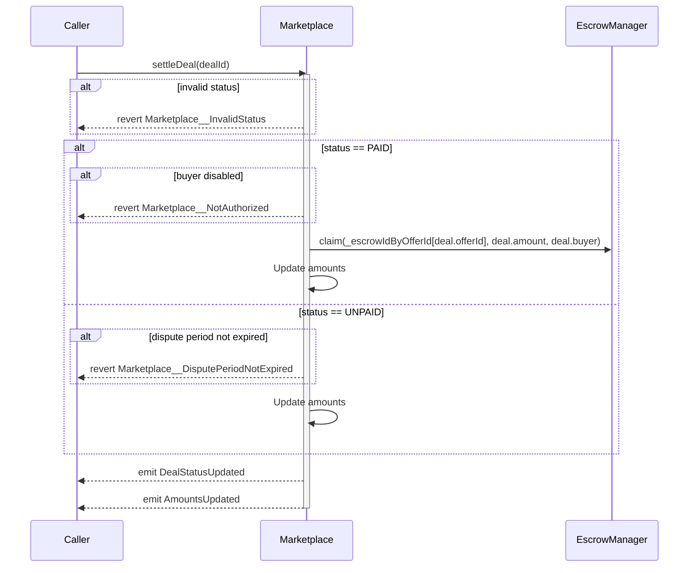
```mermaid
sequenceDiagram
    participant Caller
    participant Marketplace
    participant EscrowManager

    Caller->>Marketplace: settleDeal(dealId)
    activate Marketplace
    
    alt invalid status
        Marketplace-->>Caller: revert Marketplace__InvalidStatus
    end
    
    alt status == PAID
        alt buyer disabled
            Marketplace-->>Caller: revert Marketplace__NotAuthorized
        end
        Marketplace->>EscrowManager: claim(_escrowIdByOfferId[deal.offerId], deal.amount, deal.buyer)
        Marketplace->>Marketplace: Update amounts
    else status == UNPAID
        alt dispute period not expired
            Marketplace-->>Caller: revert Marketplace__DisputePeriodNotExpired
        end
        Marketplace->>Marketplace: Update amounts
    end
    
    Marketplace-->>Caller: emit DealStatusUpdated
    Marketplace-->>Caller: emit AmountsUpdated
    deactivate Marketplace
```

### settleDeals(uint256[] calldata dealIds)

Attempts to settle multiple deals in one transaction. Each item is isolated with an internal self-call, so one reverting deal does not revert the whole batch.

**Prerequisites:**
- Each successful item must satisfy the same rules as `settleDeal(uint256 dealId)`.
- Failed items are skipped and reported through events.

**Parameters:**
- `dealIds`: Ordered list of deal IDs to attempt.

**Events:**
- `DealSettlementSkipped(dealId, settler, failureData)`: Emitted for each item that reverts.
- `DealSettlementsBatchProcessed(settler, requested, succeeded, skipped)`: Emitted once after the batch finishes.
- Successful items emit the same `DealStatusUpdated` and `AmountsUpdated` events as `settleDeal`.

**Important Notes:**
- The function is best suited for operational cleanup where some deals may already be settled, frozen, still pending, or otherwise not settleable.
- Ordering is preserved. Duplicate settleable deal IDs settle only once; later duplicates are skipped because the first successful item changes the deal status to `SUCCESSFUL` or `UNSUCCESSFUL`.
- The helper `settleDealBatchItem(uint256 dealId)` is callable only by the contract itself and exists to provide try/catch isolation.
- A disabled paid buyer or failed asset transfer, including a blacklistable ERC20 rejecting the recipient, skips only that deal in `settleDeals`; later items continue. Single-item `settleDeal` still reverts for that item, so the blast radius is localized to the affected deal.
- Permanently stuck deals should be resolved operationally by re-enabling the recipient where appropriate or by using the freeze and seizure flow.

## Administrative Functions

### initialize(
address owner_,
uint256 offerExpiryThreshold,
uint256 maxOfferLifetime,
uint256 marketplacePaymentExpiryThreshold,
uint256 redemptionPaymentExpiryThreshold,
uint256 interestDiscoveryPaymentExpiryThreshold,
uint256 disputeBufferPeriod,
address assetManager_,
address escrowManager,
address entityRegistry_,
uint256 maxCounterOffers
)

Initializes the contract with required parameters.

**Prerequisites:**
- Contract must not be already initialized
- All addresses must be valid

**Parameters:**
- `owner_`: Address that will own the contract
- `offerExpiryThreshold`: Minimum future offset for new offers and counter offers
- `maxOfferLifetime`: Maximum lifetime accepted for new offers and counter offers
- `marketplacePaymentExpiryThreshold`: Payment deadline window for marketplace deals
- `redemptionPaymentExpiryThreshold`: Payment deadline window for redemption deals
- `interestDiscoveryPaymentExpiryThreshold`: Activation offset and activated-deal payment window snapshotted into new interest-discovery offers
- `disputeBufferPeriod`: Dispute window after payment deadline
- `assetManager_`: Address of the asset manager
- `escrowManager`: Address of the escrow manager
- `entityRegistry_`: Non-zero address of the entity registry
- `maxCounterOffers`: Maximum number of counter offers a user can make per offer (platform-wide limit)

**Errors:**
- Reverts if the contract is already initialized.
- `Marketplace__OfferExpiryThresholdTooLow(uint256 offerExpiryThreshold)`: `offerExpiryThreshold < MIN_OFFER_EXPIRY_THRESHOLD`.
- `Marketplace__OfferExpiryThresholdTooHigh(uint256 offerExpiryThreshold)`: `offerExpiryThreshold > MAX_OFFER_EXPIRY_THRESHOLD`.
- `Marketplace__MaxOfferLifetimeTooHigh(uint256 maxOfferLifetime)`: `maxOfferLifetime > MAX_CONFIGURABLE_OFFER_LIFETIME`.
- `Marketplace__MaxOfferLifetimeBelowOfferExpiryThreshold(uint256 maxOfferLifetime, uint256 offerExpiryThreshold)`: `maxOfferLifetime < offerExpiryThreshold`.
- `Marketplace__MaxCounterOffersPerUserZero()`: `maxCounterOffers == 0`.
- `ZeroAddress()` if `entityRegistry_` is zero.
- May revert if provided addresses are invalid per base initializer checks.

**Sequence Diagram:**
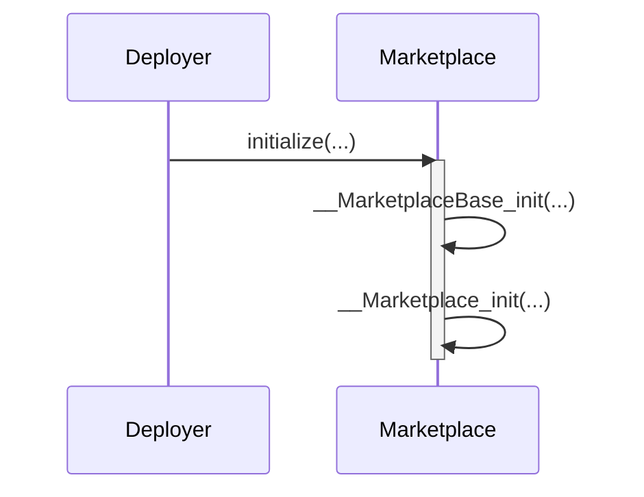
```mermaid
sequenceDiagram
    participant Deployer
    participant Marketplace

    Deployer->>Marketplace: initialize(...)
    activate Marketplace
    
    Marketplace->>Marketplace: __MarketplaceBase_init(...)
    Marketplace->>Marketplace: __Marketplace_init(...)
    deactivate Marketplace
```

### setAssetManager(address assetManager) / setEscrowManager(address escrowManager) / setEntityRegistry(address entityRegistry)

Sets protocol dependency addresses used by Marketplace.

**Prerequisites:**
- Caller must have `ADMIN` role
- Address must be non-zero

**Errors:**
- `ZeroAddress()`
- `DependenciesBase__EscrowManagerAlreadySet()`
- `DependenciesBase__EntityRegistryAlreadySet()`

**Important Notes:**
- `setAssetManager(...)` can update the configured asset manager.
- `setEscrowManager(...)` and `setEntityRegistry(...)` are single-assignment in `DependenciesBase`.
- `setEntityRegistry(...)` is retained for shared dependency wiring, but initialized `Marketplace` instances already have this dependency set.

### addCurrency(bytes3 currency) / removeCurrency(bytes3 currency)

Adds or removes supported pricing currencies.

**Prerequisites:**
- Caller must have `ADMIN` role

**Parameters:**
- `currency`: 3-byte currency code such as `bytes3("EUR")`

**Important Notes:**
- Marketplace validates offer currencies by exact `bytes3` allowlist membership.
- `addCurrency(bytes3)` does not validate ISO 4217 character shape; admins should only add canonical uppercase currency codes.

**Errors:**
- `Marketplace__CurrencyAlreadyExists(bytes3 currency)`
- `Marketplace__CurrencyDoesNotExist(bytes3 currency)`

### setOfferExpiryThreshold(uint256 offerExpiryThreshold)

Sets the minimum future offset required for new offers and counter offers.

**Prerequisites:**
- Caller must have `ADMIN` role

**Errors:**
- `Marketplace__OfferExpiryThresholdTooLow(uint256 offerExpiryThreshold)`
- `Marketplace__OfferExpiryThresholdTooHigh(uint256 offerExpiryThreshold)`
- `Marketplace__MaxOfferLifetimeBelowOfferExpiryThreshold(uint256 maxOfferLifetime, uint256 offerExpiryThreshold)`

**Important Notes:**
- This setting controls the minimum required lifetime for subsequently registered offers and subsequently created counter offers.
- It cannot be raised above the current `maxOfferLifetime`; admins must raise `maxOfferLifetime` first if they want a larger minimum lifetime.

### setMaxOfferLifetime(uint256 maxOfferLifetime)

Sets the maximum lifetime accepted for new offers and counter offers.

**Prerequisites:**
- Caller must have `ADMIN` role

**Events:**
- `MaxOfferLifetimeSet(uint256 indexed maxOfferLifetime)`

**Errors:**
- `Marketplace__MaxOfferLifetimeTooHigh(uint256 maxOfferLifetime)`
- `Marketplace__MaxOfferLifetimeBelowOfferExpiryThreshold(uint256 maxOfferLifetime, uint256 offerExpiryThreshold)`

**Important Notes:**
- This setting controls the maximum accepted lifetime for subsequently registered offers and subsequently created counter offers.
- It must remain greater than or equal to the current `offerExpiryThreshold`.
- The hard cap is `MAX_CONFIGURABLE_OFFER_LIFETIME`.

### setMarketplacePaymentExpiryThreshold(uint256 marketplacePaymentExpiryThreshold) / setRedemptionPaymentExpiryThreshold(uint256 paymentExpiryThreshold) / setInterestDiscoveryPaymentExpiryThreshold(uint256 paymentExpiryThreshold)

Sets payment deadline windows used by the sale flows.

**Prerequisites:**
- Caller must have `ADMIN` role

**Errors:**
- `Marketplace__PaymentExpiryThresholdTooLow(uint256 paymentExpiryThreshold)`
- `Marketplace__PaymentExpiryThresholdTooHigh(uint256 paymentExpiryThreshold)`

**Important Notes:**
- `marketplacePaymentExpiryThreshold` is used for `MARKETPLACE` acceptances and accepted counter offers.
- `redemptionPaymentExpiryThreshold` is used for `REDEMPTION` acceptances. It is configured during initialization and can be updated independently.
- `interestDiscoveryPaymentExpiryThreshold` is snapshotted into each new `INTEREST_DISCOVERY` offer. That per-offer value is added to `saleEnd` to derive the final activation deadline; activated interests use the same snapshot as their payment window, anchored to `saleEnd` when activated through `saleEnd` and to `block.timestamp` when activated after `saleEnd`. Updating the global value affects subsequently registered offers, not existing interest-discovery offers.
- Deployment defaults are 4 days for direct marketplace deals, 5 days for redemption deals, and 4 days for interest-discovery activation/payment windows.
- Offer lifetime bounds and payment expiry thresholds must stay within their configured minimum and maximum bounds.

### setDisputeBufferPeriod(uint256 disputeBufferPeriod)

Sets the dispute window used after a deal becomes payable.

**Prerequisites:**
- Caller must have `ADMIN` role

**Events:**
- `DisputeBufferPeriodSet(uint256 indexed disputeBufferPeriod)`

**Errors:**
- `Marketplace__DisputeBufferPeriodTooLow(uint256 disputeBufferPeriod)`
- `Marketplace__DisputeBufferPeriodTooHigh(uint256 disputeBufferPeriod)`

**Important Notes:**
- The deployment default dispute buffer is 3 days.

### setAllowedEntityType(uint256 typeId, bool allowed) / setAllowedEntityTypes(uint256[] calldata typeIds, bool allowed)

Configures the entity-type allowlist used at selected entrypoints.

**Prerequisites:**
- Caller must have `ADMIN` role

**Important Notes:**
- Changes affect future eligibility checks. Existing expressed interests are not invalidated by later entity-type allowlist changes; activation re-checks wallet/entity enabled state instead.

### setMaxCounterOffersPerUser(uint256 maxCounterOffers)

Sets the maximum number of counter offers a user can make for a single offer.

**Prerequisites:**
- Caller must have the `ADMIN` role

**Parameters:**
- `maxCounterOffers`: The new maximum number of counter offers per user per offer

**Errors:**
- Reverts if caller lacks the **ADMIN** role.
- `Marketplace__MaxCounterOffersPerUserZero()`: `maxCounterOffers == 0`.

**Important Notes:**
- This is a platform-wide setting that applies to all offers
- The value must be greater than 0 so counter offers cannot be disabled through this limit
- Does not affect counter offers already created
- Changes take effect immediately for new counter offers

## View Functions

`Marketplace` now exposes a compact read surface intended for `MarketplaceLens`. The user-facing convenience getters are documented in [MarketplaceLens.md](./MarketplaceLens.md).

### getOfferData(uint256 offerId)

Returns the grouped offer-side state required by the lens contract.

**Parameters:**
- `offerId`: The ID of the offer to retrieve

**Returns:**
- `Offer`: The complete offer structure
- `InterestDiscoveryState`: The interest-discovery-only state linked to the offer, including the snapshotted payment expiry threshold
- `uint256[]`: All interest identifiers linked to the offer
- `address[]`: Direct-sale allowlist linked to the offer
- `uint256`: Escrow ID allocated by `EscrowManager`

**Errors:**
- None.

**Important Notes:**
- This grouped getter exists to reduce `Marketplace` runtime bytecode while keeping the external read surface available through `MarketplaceLens`
- It intentionally excludes the simple offer flags because those flags are available through dedicated getters, keeping this grouped return value focused and low-stack
- For a marketplace offer, the returned `InterestDiscoveryState` is the zero-initialized default struct

### getDealData(uint256 dealId)

Returns the grouped deal-side state required by the lens contract.

**Parameters:**
- `dealId`: The ID of the deal to retrieve

**Returns:**
- `Deal`: The complete deal structure containing all deal data
- `bool`: Whether the deal is currently frozen

**Errors:**
- None.

### getInterestData(uint256 interestId)

Returns the raw stored details of one interest.

**Parameters:**
- `interestId`: The ID of the interest to retrieve

**Returns:**
- `Interest`: The stored interest structure

**Errors:**
- **Marketplace__InterestNotFound(uint256 interestId)**: Interest does not exist.

**Important Notes:**
- This function returns the stored state only
- The projected `CLOSED` view after failed-book cancellation is implemented in `MarketplaceLens.getInterest(...)`, not in `Marketplace` itself
- The projected `SEIZED` view after offer-level reserved seizure is also implemented in `MarketplaceLens.getInterest(...)`; raw storage may still show `EXPRESSED`

### getOfferFlags(uint256 offerId)

Returns the compact offer-side flags required by the lens contract.

**Parameters:**
- `offerId`: The ID of the offer to inspect

**Returns:**
- `bool`: Whether the offer was explicitly cancelled
- `bool`: Whether the offer is currently frozen
- `bool`: `true` if `seizeOfferEscrow(...)` consumed the reserved-interest bucket and set the raw offer-level flag

**Errors:**
- None.

**Important Notes:**
- This getter keeps flag-only reads out of `getOfferData(...)` so the lens-source surface remains coverage-friendly
- The reserved-interest marker is a raw offer-level value used by `MarketplaceLens.getInterest(...)` for lazy `EXPRESSED -> SEIZED` projection
- It does **not** rewrite individual `Interest` records in storage
- For offers where only `available` was seized and no reserved bucket existed, the value remains `false`

### getConfigAndCounters() / isCurrencyAllowed() / getCounterOfferCount()

Returns current configuration, identifier counters, currency allowlist state, and per-user counter-offer counts inherited from `MarketplaceBase`.

`getConfigAndCounters()` returns a `Config` snapshot with:
- `offerExpiryThreshold`
- `marketplacePaymentExpiryThreshold`
- `redemptionPaymentExpiryThreshold`
- `interestDiscoveryPaymentExpiryThreshold`
- `disputeBufferPeriod`
- `maxCounterOffersPerUser`
- `maxOfferLifetime`

It also returns the runtime offer, deal, and interest counters.

`isCurrencyAllowed(currency)` returns whether a `bytes3` pricing currency is currently enabled.

`getCounterOfferCount(user, offerId)` returns the number of successful counter offers submitted by `user` for `offerId`. Counts do not decrement when counter offers are cancelled or declined.

## Internal and Validation Functions

### _doAddressesMatch(address caller, address owner_)

Validates that the caller matches an expected address without checking `EntityRegistry`.

This helper is reserved for non-business-actor checks such as the internal `resolvePaymentBatchItem` self-call. Business-actor identity checks use `_requireEnabledActor(...)` instead.

**Parameters:**
- `caller`: Address of the transaction sender to validate
- `owner_`: Expected owner address

**Returns:**
- None

**Errors:**
- **Marketplace__NotAuthorized(address caller)**: `caller != owner_`.

**Sequence Diagram:**
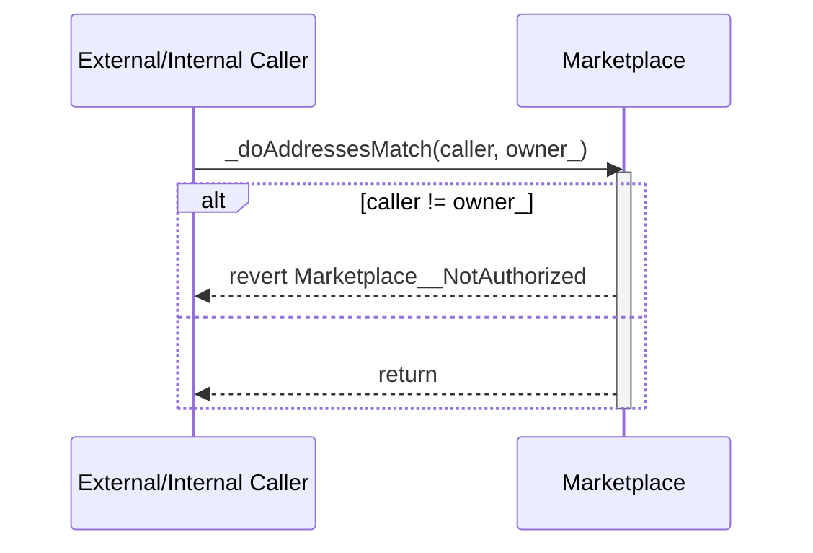
```mermaid
sequenceDiagram
    participant Caller as External/Internal Caller
    participant Marketplace

    Caller->>Marketplace: _doAddressesMatch(caller, owner_)
    activate Marketplace

    alt caller != owner_
        Marketplace-->>Caller: revert Marketplace__NotAuthorized
    else
        Marketplace-->>Caller: return
    end
    deactivate Marketplace
```

### _requireEnabledActor(address caller, address actor)

Validates that the caller matches a stored business actor address and that the actor is enabled in `EntityRegistry`.

**Parameters:**
- `caller`: Address of the transaction sender to validate
- `actor`: Expected business actor address

**Returns:**
- None

**Errors:**
- **Marketplace__NotAuthorized(address caller)**: `caller != actor`, or `actor` is disabled in `EntityRegistry`.

### _validateOffer(OfferInput calldata offer, address owner_) → Offer

Validates an incoming `OfferInput` and builds the immutable `Offer` struct used internally.

**Parameters:**
- `offer`: Proposed offer input
- `owner_`: Address to set as offer owner (must be enabled and have an allowlisted entity type if registry configured)

**Returns:**
- `Offer`: Validated and normalized offer struct

**Errors:**
- **EntityEligibilityGuard__EntityWalletNotAllowed(address wallet)**: Offer owner wallet/entity is disabled.
- **EntityEligibilityGuard__EntityTypeNotAllowed(uint256 typeId)**: Offer owner entity type is not allowlisted.
- **Marketplace__AssetManagerNotSet()**: Asset manager dependency is missing.
- **Marketplace__ZeroAmount()**: `totalAmount == 0` or `lot == 0`.
- **Marketplace__LotSizeTooLarge()**: `lot > totalAmount`.
- **Marketplace__TotalAmountNotMultipleOfLot()**: `totalAmount % lot != 0`.
- **Marketplace__ZeroPrice()**: `unitPrice == 0`.
- **Marketplace__InvalidCurrency(bytes3 currency)**: Currency not allowed.
- **Marketplace__InvalidExpiry(uint256 expiry, uint256 timestamp)**: `expiry` is in the past or its lifetime is below `offerExpiryThreshold`.
- **Marketplace__ExpiryTooFar(uint256 expiry, uint256 timestamp, uint256 maxOfferLifetime)**: `expiry - block.timestamp` exceeds `maxOfferLifetime`.
- **Marketplace__CounterOffersMustBeDisabled()**: Invalid interest-discovery configuration.
- **Marketplace__MinSaleUnitsNotAllowed(uint256 minSaleUnits)**: Invalid marketplace configuration.
- **Marketplace__InvalidMinSaleUnits(uint256 minSaleUnits, uint256 totalAmount, uint256 lot)**: Invalid threshold configuration.

**Sequence Diagram:**
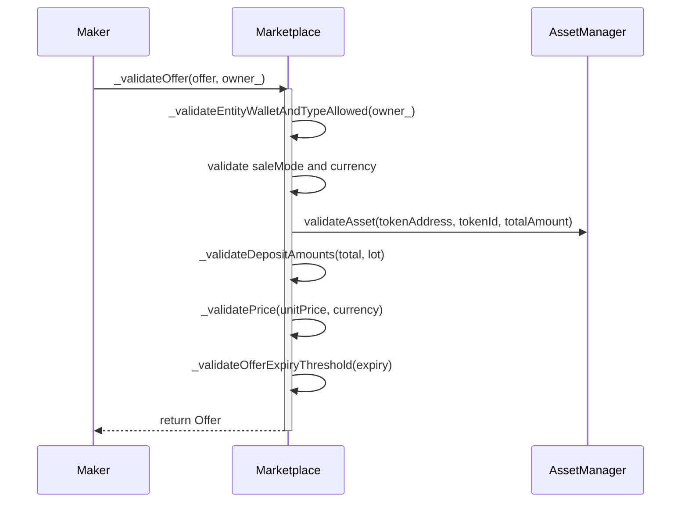
```mermaid
sequenceDiagram
    participant Maker
    participant Marketplace
    participant AssetManager

    Maker->>Marketplace: _validateOffer(offer, owner_)
    activate Marketplace

    Marketplace->>Marketplace: _validateEntityWalletAndTypeAllowed(owner_)
    Marketplace->>Marketplace: validate saleMode and currency
    Marketplace->>AssetManager: validateAsset(tokenAddress, tokenId, totalAmount)
    Marketplace->>Marketplace: _validateDepositAmounts(total, lot)
    Marketplace->>Marketplace: _validatePrice(unitPrice, currency)
    Marketplace->>Marketplace: _validateOfferExpiryThreshold(expiry)
    Marketplace-->>Maker: return Offer
    deactivate Marketplace
```

### _validateOfferNotExpired(uint256 offerExpiry) / _validateCounterOfferNotExpired(uint256 counterOfferExpiry)

Ensures an offer or counter offer has not expired.

**Parameters:**
- `offerExpiry` / `counterOfferExpiry`: Expiration timestamp to check

**Errors:**
- **Marketplace__OfferExpired(uint256 expiry, uint256 timestamp)**: Current time past `offerExpiry`.
- **Marketplace__CounterOfferExpired(uint256 expiry, uint256 timestamp)**: Current time past `counterOfferExpiry`.

**Sequence Diagram:**
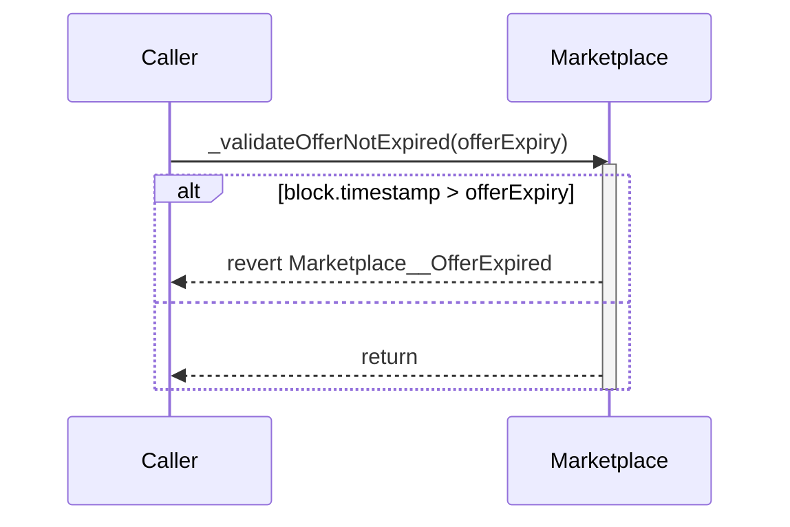
```mermaid
sequenceDiagram
    participant Caller
    participant Marketplace

    Caller->>Marketplace: _validateOfferNotExpired(offerExpiry)
    activate Marketplace

    alt block.timestamp > offerExpiry
        Marketplace-->>Caller: revert Marketplace__OfferExpired
    else
        Marketplace-->>Caller: return
    end
    deactivate Marketplace
```

### _validateOfferExpiryThreshold(uint256 offerExpiry)

Ensures a newly supplied offer or counter-offer expiry satisfies the configured lifetime bounds.

### _validateDepositAmounts(uint256 total, uint256 lot)

Ensures total and lot sizes are non-zero, consistent, and divisible.

**Parameters:**
- `total`: Total units to deposit
- `lot`: Lot size per match

**Errors:**
- **Marketplace__ZeroAmount()**: `total == 0` or `lot == 0`.
- **Marketplace__LotSizeTooLarge()**: `lot > total`.
- **Marketplace__TotalAmountNotMultipleOfLot()**: `total % lot != 0`.

**Sequence Diagram:**
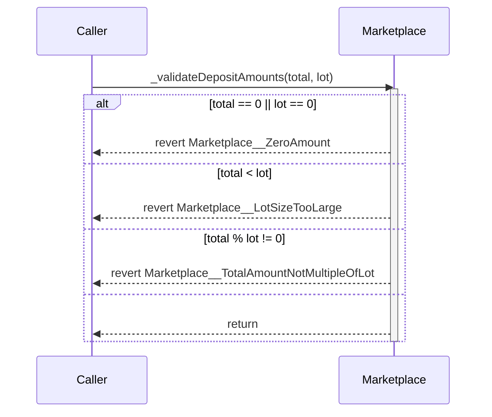
```mermaid
sequenceDiagram
    participant Caller
    participant Marketplace

    Caller->>Marketplace: _validateDepositAmounts(total, lot)
    activate Marketplace

    alt total == 0 || lot == 0
        Marketplace-->>Caller: revert Marketplace__ZeroAmount
    else total < lot
        Marketplace-->>Caller: revert Marketplace__LotSizeTooLarge
    else total % lot != 0
        Marketplace-->>Caller: revert Marketplace__TotalAmountNotMultipleOfLot
    else
        Marketplace-->>Caller: return
    end
    deactivate Marketplace
```

### _validatePrice(uint256 price, bytes3 currency)

Checks price is positive and currency is supported.

**Parameters:**
- `price`: Unit price
- `currency`: 3-byte currency code

**Errors:**
- **Marketplace__ZeroPrice()**: `price == 0`.
- **Marketplace__InvalidCurrency(bytes3 currency)**: Currency not in allowed set.

**Sequence Diagram:**
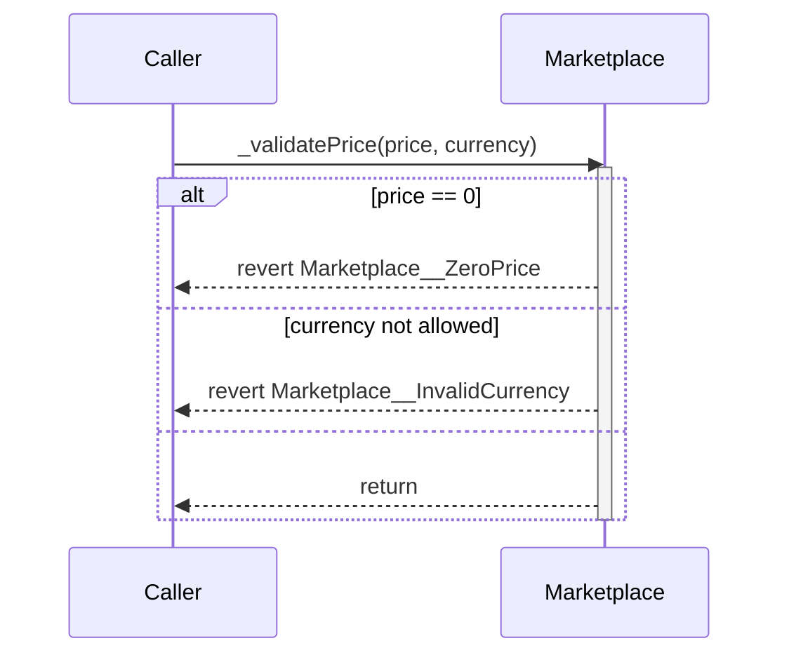
```mermaid
sequenceDiagram
    participant Caller
    participant Marketplace

    Caller->>Marketplace: _validatePrice(price, currency)
    activate Marketplace

    alt price == 0
        Marketplace-->>Caller: revert Marketplace__ZeroPrice
    else currency not allowed
        Marketplace-->>Caller: revert Marketplace__InvalidCurrency
    else
        Marketplace-->>Caller: return
    end
    deactivate Marketplace
```

### _validateNonZeroPrice(uint256 price)

Checks price is non-zero.

**Parameters:**
- `price`: Unit price

**Errors:**
- **Marketplace__ZeroPrice()**: `price == 0`.

**Sequence Diagram:**
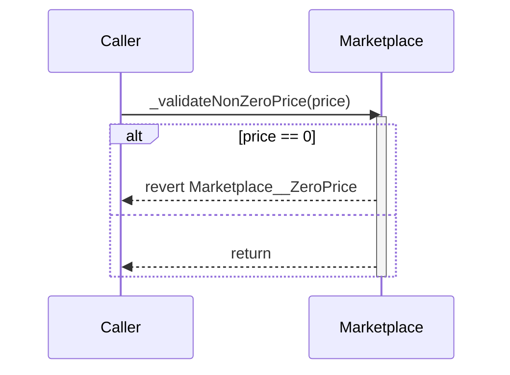
```mermaid
sequenceDiagram
    participant Caller
    participant Marketplace

    Caller->>Marketplace: _validateNonZeroPrice(price)
    activate Marketplace

    alt price == 0
        Marketplace-->>Caller: revert Marketplace__ZeroPrice
    else
        Marketplace-->>Caller: return
    end
    deactivate Marketplace
```

### _validateAsset(OfferInput calldata offer) → AssetType

Validates the offered asset through the configured `AssetManager`.

This validation is performed during offer registration. Trade execution paths for existing offers (`acceptOffer`, `expressInterest`, `activateInterest`, `createCounterOffer`, and accepted `resolveCounterOffer`) do not re-check `AssetManager`, so delisting an asset blocks new offers but does not by itself cancel, freeze, or make existing offers untradable.

**Parameters:**
- `offer`: Offer input containing token metadata

**Returns:**
- `AssetType`: The asset type resolved by `AssetManager`

**Errors:**
- **Marketplace__AssetManagerNotSet()**: Asset manager dependency is missing.

**Sequence Diagram:**
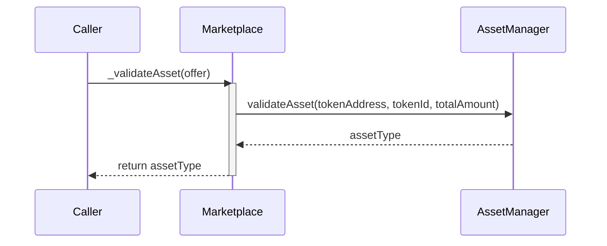
```mermaid
sequenceDiagram
    participant Caller
    participant Marketplace
    participant AssetManager

    Caller->>Marketplace: _validateAsset(offer)
    activate Marketplace

    Marketplace->>AssetManager: validateAsset(tokenAddress, tokenId, totalAmount)
    AssetManager-->>Marketplace: assetType
    Marketplace-->>Caller: return assetType
    deactivate Marketplace
```

### _getInterest(uint256 interestId) / _hasReachedThreshold(uint256 interestedUnits, uint256 minSaleUnits) / _validateThresholdReached(uint256 offerId, uint256 interestedUnits, uint256 minSaleUnits) / _getInterestActivationDeadline(uint256 offerId, uint256 saleEnd) / _getActivatedInterestPaymentDeadline(uint256 offerId, uint256 saleEnd) / _getInterestDiscoveryPaymentExpiryThreshold(uint256 offerId) / _validateInterestActivationWindow(uint256 offerId, uint256 saleEnd)

Interest-discovery-specific helpers used to:

- load and validate that an interest exists
- derive threshold reach from cumulative expressed interest
- enforce threshold-only activation / cleanup paths
- read the offer's snapshotted payment expiry threshold
- enforce the bounded activation deadline derived from `saleEnd` and the offer snapshot
- reject activation-deadline overflow before comparing timestamps
- derive activated-interest payment deadlines from either `saleEnd` or the activation timestamp

### _validateAmounts(Offer offer, uint256 amount)

Ensures the requested `amount` is greater than zero, available, and respects the `lot` granularity.

**Parameters:**
- `offer`: The current offer
- `amount`: Requested amount for the deal

**Errors:**
- **Marketplace__ZeroAmount()**: `amount == 0`.
- **Marketplace__InsufficientAvailableAmount(uint256 requested, uint256 available)**: `amount > offer.amounts.available`.
- **Marketplace__AmountNotMultipleOfLot(uint256 lot, uint256 amount)**: `amount % offer.lot != 0`.

**Sequence Diagram:**
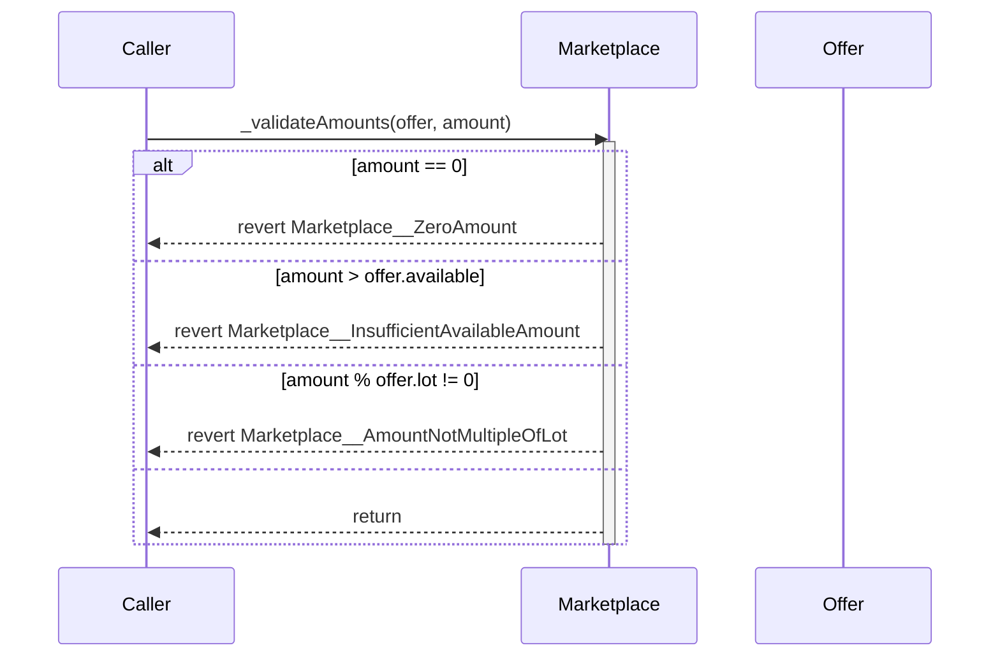
```mermaid
sequenceDiagram
    participant Caller
    participant Marketplace
    participant Offer

    Caller->>Marketplace: _validateAmounts(offer, amount)
    activate Marketplace

    alt amount == 0
        Marketplace-->>Caller: revert Marketplace__ZeroAmount
    else amount > offer.available
        Marketplace-->>Caller: revert Marketplace__InsufficientAvailableAmount
    else amount % offer.lot != 0
        Marketplace-->>Caller: revert Marketplace__AmountNotMultipleOfLot
    else
        Marketplace-->>Caller: return
    end
    deactivate Marketplace
```

### _validateDealStatus(DealStatus actual, DealStatus desired)

Ensures a deal has the expected status.

**Parameters:**
- `actual`: Current status
- `desired`: Required status

**Errors:**
- **Marketplace__InvalidStatus(uint8 actualStatus)**: `actual != desired`.

**Sequence Diagram:**
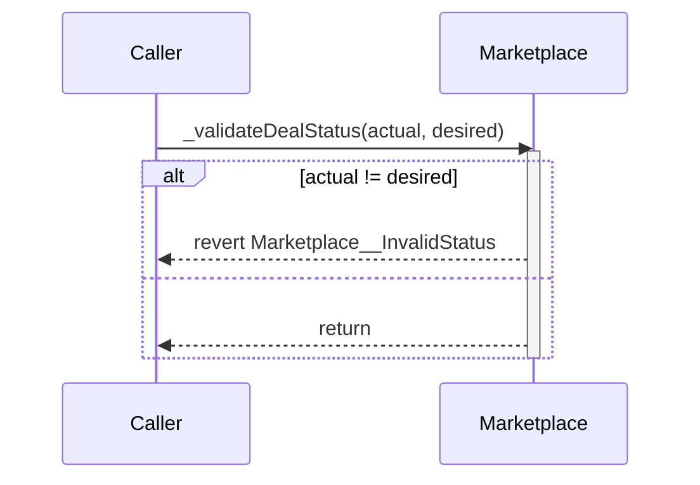
```mermaid
sequenceDiagram
    participant Caller
    participant Marketplace

    Caller->>Marketplace: _validateDealStatus(actual, desired)
    activate Marketplace

    alt actual != desired
        Marketplace-->>Caller: revert Marketplace__InvalidStatus
    else
        Marketplace-->>Caller: return
    end
    deactivate Marketplace
```

## Dispute Workflow

The dispute mechanism provides a way for buyers to challenge deals that have been marked as UNPAID when they believe payment was actually made:

1. **Deal Expiry**: When a deal expires without payment confirmation, it can be marked as `UNPAID` using `resolvePayment(dealId, false)`
2. **Dispute Initiation**: Buyer can call `initiateDispute()` within the dispute buffer period:
    a. Deal status changes from `UNPAID` to `IN_DISPUTE`
    b. Only the buyer who made the deal can initiate disputes
    c. Must be done within `disputeBuffer` timeframe (calculated as `paymentDeadline + disputeBufferPeriod`)
3. **Dispute Resolution**: An arbitrator with `ARBITRATOR` role calls `resolveDispute()`:
    a. Arbitrator investigates the payment claim
    b. Sets final status to either `PAID` (buyer was correct) or `UNPAID` (seller was correct)
    c. `disputeBuffer` is set to 0 to prevent re-disputing (griefing protection)
4. **Settlement**: After dispute resolution, `settleDeal()` can be called:
    a. If resolved as `PAID`: Tokens are transferred to buyer and the deal ends as `SUCCESSFUL`
    b. If resolved as `UNPAID`: Tokens return to seller's available amount and the deal ends as `UNSUCCESSFUL`
5. **Griefing Protection**: Once disputed and resolved, the deal cannot be disputed again due to `disputeBuffer = 0`

## Counter Offer Workflow

Counter offers provide a mechanism for buyers to propose different terms (price) for an existing offer:

1. **Offer Configuration**: Counter offers are available only for `MARKETPLACE` offers. When creating a marketplace offer, the seller specifies whether counter offers are allowed via the `allowCounterOffers` flag
   - `true`: Counter offers are permitted for this offer
   - `false`: Counter offers are blocked for this offer
   - `REDEMPTION` and `INTEREST_DISCOVERY` offers must set `allowCounterOffers` to `false`

2. **Creation**: Buyer calls `createCounterOffer()` with desired amount and price
   - **Validation Process**:
     a. Checks if the original offer allows counter offers (`allowCounterOffers = true`)
     b. Checks if the buyer has not exceeded the platform-wide counter offer limit for this specific offer
     c. Validates other standard requirements (authorization, non-zero price, amounts, expiry, etc.)
   - **Counter Tracking**: On success, the buyer's counter offer count for this offer is incremented
   
3. **Status**: Counter offer is created as a `Deal` with `PROPOSED` status and `COUNTER_OFFER` type

4. **Limits and Tracking**:
   - **Platform-Wide Limit**: Configurable maximum counter offers per user per offer (default: 5)
   - **Per-User, Per-Offer**: Each user has an independent counter for each offer they interact with
   - **Persistence**: Counter does not decrement when counter offers are cancelled or declined
   - **Admin Control**: Administrators can adjust the platform-wide limit using `setMaxCounterOffersPerUser()`

5. **Cancellation**: Counter offer with `PROPOSED` status can be cancelled by calling `cancelCounterOffer()`:
   - only by its creator
   - and only if the counter offer has not expired

6. **Resolution**: Original offer owner can invoke `resolveCounterOffer()` to accept or decline the counter offer:
   - **Expiry Validation**: The counter offer must not be expired (current timestamp ≤ counter offer expiry)
   - **If accepted (`accepted = true`)**:
     - Original offer must not be expired
     - Deal status changes to `PENDING`
     - Deal type changes to `OFFER`
     - `paymentDeadline` is set to `block.timestamp + marketplacePaymentExpiryThreshold`
     - `disputeBuffer` is set to `paymentDeadline + disputeBufferPeriod`
     - `counterOfferExpiry` is reset to 0
     - Offer amounts are updated (available decreases, inDeals increases)
   - **If declined (`accepted = false`)**:
     - Deal status changes to `DECLINED`
     - `counterOfferExpiry` is reset to 0
     - Original offer expiry is not checked for declines

### Counter Offer Feature Summary

| Feature | Description | Scope |
|---------|-------------|-------|
| **Mode Restriction** | Counter offers only work for `MARKETPLACE` offers | Sale mode |
| **Per-Offer Permission** | `allowCounterOffers` flag in marketplace offer | Individual offer level |
| **Platform-Wide Limit** | Maximum counter offers per user per offer | Global setting (default: 5) |
| **Counter Tracking** | Tracks counter offer count per user per offer | Per-user, per-offer |
| **Admin Control** | `setMaxCounterOffersPerUser()` | ADMIN role required |
| **View Functions** | `getConfigAndCounters()`, `getCounterOfferCount()`, `isCurrencyAllowed()` | Public, read-only |

**Example Scenario:**
- Platform limit is set to 5 counter offers per user per offer
- Alice creates Offer A with `allowCounterOffers = true`
- Bob can make up to 5 counter offers on Offer A
- Bob's counter offers on Offer A don't affect his ability to make counter offers on other offers
- If Alice declines all of Bob's counter offers, Bob cannot make more (limit reached)
- If admin changes the platform limit to 10, Bob can now make 5 more counter offers on Offer A

---

## Freeze Semantics

Freeze is a reversible, **operational / custody hold** operated by `FREEZE_ROLE`.

- Freeze does **not** pause time.
- Deadlines (`offer.expiry`, `paymentDeadline`, `disputeBuffer`, `counterOfferExpiry`) continue to run normally while an offer or deal is frozen. They are **never** extended because of freeze.
- Freeze blocks actions that move escrowed assets, create new commercial commitments against frozen inventory, or otherwise change deal-formation / finalization state.
- Time-based cleanup, freeze/unfreeze administration, and payment/dispute procedural actions **remain callable** while frozen.

### Functions blocked by freeze

| Function | Blocked by | Reason |
|---|---|---|
| `acceptOffer` | offer frozen | creates commercial commitment |
| `cancelOffer` | offer frozen | moves escrowed assets |
| `withdrawAvailable` | offer frozen | moves escrowed assets |
| `createCounterOffer` | offer frozen | creates commercial commitment |
| `expressInterest` | offer frozen | creates commercial reservation against inventory (independently also blocked on cancelled offers) |
| `activateInterest` | parent offer frozen | creates a new deal (commercial commitment; independently also blocked on cancelled offers) |
| `cancelCounterOffer` | deal or parent offer frozen | changes deal formation state |
| `resolveCounterOffer` | deal or parent offer frozen | changes deal formation state |
| `settleDeal` | deal or parent offer frozen | finalizes economic outcome / moves assets |

### Functions that remain callable while frozen

| Function | Rationale |
|---|---|
| `resolvePayment` | Payment workflow progresses against the raw stored deadline; freeze must not block it |
| `resolvePayments` | Batched payment workflow uses the same raw-deadline semantics as `resolvePayment` |
| `initiateDispute` | Dispute window runs against the raw `disputeBuffer`; freeze does not pause it |
| `resolveDispute` | Arbitration is a procedural workflow that must continue regardless of frozen state |
| `closeExpiredInterests` | Time-based cleanup; remains callable so long as the offer has not been cancelled |

> **Important:** `closeExpiredInterests` is **blocked** on cancelled offers (e.g. after `seizeOfferEscrow`). Calling `seizeOfferEscrow` cancels the offer and zeroes the offer-level reserved bucket in O(1). Remaining stored interests may still be `EXPRESSED` in storage, but the lens projects them as `SEIZED` based on the parent offer state. Attempting to close them after cancellation is blocked to prevent underflow in `reservedInterestUnits`.

### setOfferFrozen(uint256 offerId, bool frozen)

Freezes or unfreezes an offer. The offer must exist.

**Prerequisites:**
- Caller must have `FREEZE_ROLE`
- `offerId` must reference an existing offer

**Effects when frozen:**
- `acceptOffer` reverts with `Marketplace__OfferFrozen`
- `cancelOffer` reverts with `Marketplace__OfferFrozen`
- `withdrawAvailable` reverts with `Marketplace__OfferFrozen`
- `createCounterOffer` reverts with `Marketplace__OfferFrozen`
- `cancelCounterOffer` reverts with `Marketplace__OfferFrozen` (via deal-or-offer check)
- `resolveCounterOffer` reverts with `Marketplace__OfferFrozen` (via deal-or-offer check)
- `settleDeal` reverts with `Marketplace__OfferFrozen` (via deal-or-offer check)
- `expressInterest` reverts with `Marketplace__OfferFrozen`
- `activateInterest` reverts with `Marketplace__OfferFrozen`
- `resolvePayment`, `resolvePayments`, `initiateDispute`, `resolveDispute`, `closeExpiredInterests` are **not** affected by offer freeze
- Existing counter offers continue to age against their raw `counterOfferExpiry`; unfreezing does not revive an already expired counter offer
- Freeze alone does **not** unblock a disabled-recipient payout. It only prevents further normal progression and enables
  the seizure path to an enabled beneficiary.

**Events:**
- `OfferFrozenSet(uint256 indexed offerId, bool indexed frozen)`

**Errors:**
- `Marketplace__OfferDoesNotExist(uint256 offerId)`: Offer was never registered

### setDealFrozen(uint256 dealId, bool frozen)

Freezes or unfreezes a deal. The deal must exist.

**Prerequisites:**
- Caller must have `FREEZE_ROLE`
- `dealId` must reference an existing deal

**Effects when the deal is frozen (or when the parent offer is frozen):**
- `cancelCounterOffer` reverts
- `resolveCounterOffer` reverts
- `settleDeal` reverts
- `resolvePayment`, `resolvePayments`, `initiateDispute`, `resolveDispute` are **not** blocked — they progress normally against raw stored deadlines
- `counterOfferExpiry`, `paymentDeadline`, and `disputeBuffer` continue running normally while frozen
- Freeze alone does **not** release escrow; it is only a prerequisite for `seizeDeal(...)`.

**Events:**
- `DealFrozenSet(uint256 indexed dealId, bool indexed frozen)`

**Errors:**
- `Marketplace__DealDoesNotExist(uint256 dealId)`: Deal was never created

### isOfferFrozen(uint256 offerId) / isDealFrozen(uint256 dealId)

Public view getters returning the current frozen state.

---

## Seizure

Seizure is an **irreversible** operation that transfers escrowed tokens to a designated beneficiary. The seizure caller must hold `SEIZURE_ROLE` (_ROLE_3), and the target must be frozen first.

### DealStatus.SEIZED

`SEIZED` is appended at index 10 to `DealStatus`. All existing numeric values (`NON_EXISTING`=0 through `UNSUCCESSFUL`=9) are unchanged.

### InterestStatus.SEIZED

`SEIZED` is appended at index 4 to `InterestStatus`. All existing numeric values (`NON_EXISTING`=0 through `CLOSED`=3) are unchanged. Integrators observe this status through `MarketplaceLens.getInterest(...)` when an `EXPRESSED` interest loses its backing inventory because the parent offer's reserved bucket was seized at the offer level.

### seizeOfferEscrow(uint256 offerId, address beneficiary, bytes32 reason)

Seizes the non-deal escrow balance of a frozen offer. For `MARKETPLACE` offers this is just `offer.amounts.available`. For `INTEREST_DISCOVERY` offers it includes both `offer.amounts.available` and the aggregated `reservedInterestUnits` bucket.

**Prerequisites:**
- Caller must have `SEIZURE_ROLE`
- Offer must exist (`_escrowIdByOfferId[offerId] != 0`)
- Offer must be frozen (`isOfferFrozen(offerId) == true`)
- `beneficiary != address(0)` (reverts with `Errors.ZeroAddress()`)
- `reason != bytes32(0)` (reverts with `Marketplace__ZeroReason()`)
- Beneficiary must be an enabled `EntityRegistry` account
- Either `offer.amounts.available > 0` or, for `INTEREST_DISCOVERY`, `reservedInterestUnits > 0`

**Side effects:**
- `offer.amounts.available` set to 0
- For `INTEREST_DISCOVERY`, `state.reservedInterestUnits` is zeroed in O(1) and the offer-level reserved-seizure flag is set
- `_offerCancelled[offerId]` set to `true`; `offer.expiry` set to `block.timestamp`
- `EscrowManager.claim(escrowId, seizedAmount, beneficiary)` called
- Individual `Interest` records are **not** rewritten in storage
- `inDeals`, `sold`, and `total` are **not** modified

**Events:**
- `OfferCancelled(offerId, msg.sender)`
- `AmountsUpdated(offerId, 0, inDeals, sold)`
- `OfferEscrowSeized(offerId, beneficiary, seizedAmount, reason, caller)`

### seizeDeal(uint256 dealId, address beneficiary, bytes32 reason)

Seizes the escrowed tokens locked in a specific frozen deal.

**Prerequisites:**
- Caller must have `SEIZURE_ROLE`
- Deal must exist (`deal.status != NON_EXISTING`)
- Deal must be frozen (`isDealFrozen(dealId) == true`)
- Parent offer must be frozen (`isOfferFrozen(deal.offerId) == true`)
- `beneficiary != address(0)` and `reason != bytes32(0)`
- Beneficiary must be an enabled `EntityRegistry` account
- `deal.status` must be one of: `PENDING`, `UNPAID`, `IN_DISPUTE`, `PAID`
  - All other statuses revert with `Marketplace__InvalidStatus`

**Side effects:**
- `offer.amounts.inDeals` decremented by `deal.amount`
- `EscrowManager.claim(escrowId, deal.amount, beneficiary)` called
- `deal.status` set to `DealStatus.SEIZED`
- `available`, `sold`, and `total` are **not** modified

**Events:**
- `DealStatusUpdated(dealId, offerId, newStatus, oldStatus)`
- `AmountsUpdated(offerId, available, inDeals - dealAmount, sold)`
- `DealSeized(dealId, offerId, beneficiary, amount, reason, caller)`

### Operational Notes

- Freeze is reversible; seizure is not.
- `seizeOfferEscrow` always marks the offer as cancelled. `seizeDeal` does **not** auto-cancel the parent offer.
- For `INTEREST_DISCOVERY` offers, offer-level seizure handles both free `available` inventory and the aggregated `reservedInterestUnits` bucket in one call.
- After `seizeOfferEscrow`, remaining raw `EXPRESSED` interests are interpreted via the lens as effectively `SEIZED`; this avoids an O(n) loop over all interest records during seizure.
- After `seizeDeal` the parent offer remains frozen; it must be explicitly unfrozen or fully cleared via `seizeOfferEscrow`.
- Freeze does **not** pause time. All deadlines run normally during freeze. Payment/dispute workflows continue against raw stored timestamps.
- For disabled-recipient deadlocks, the practical recovery options are:
  - re-enable the original payout recipient in `EntityRegistry`, then retry the blocked lifecycle action
  - or freeze and seize to an enabled beneficiary:
    - `seizeOfferEscrow(...)` for offer-owner withdrawal deadlocks
    - `setOfferFrozen(...)` + `setDealFrozen(...)` + `seizeDeal(...)` for paid-deal buyer deadlocks
