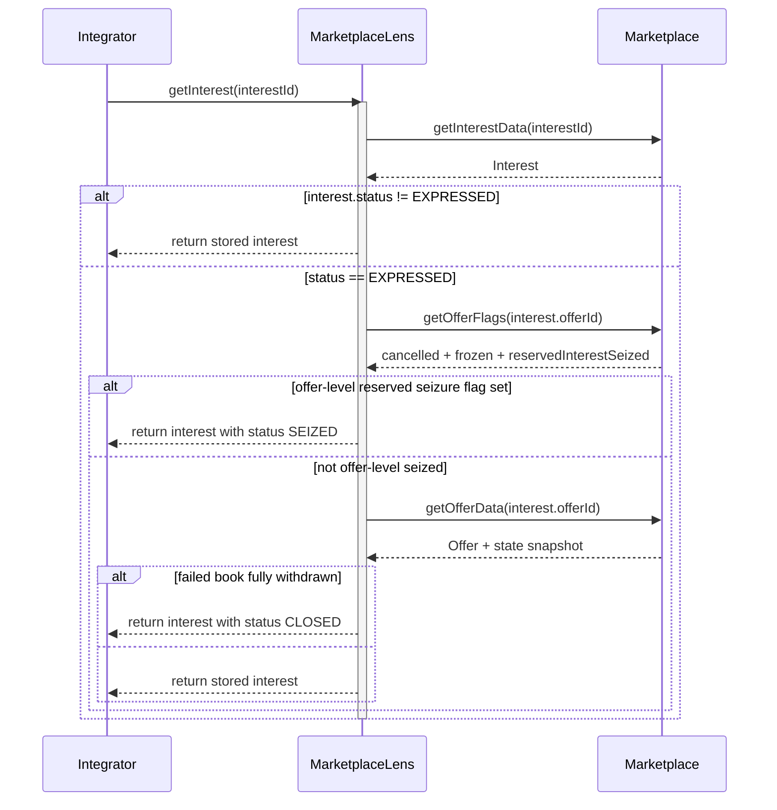

# MarketplaceLens Contract Documentation

## Overview
The `MarketplaceLens` contract is the read-only companion for `Marketplace`.

It restores the user-facing getter API that was removed from the main marketplace implementation to reduce runtime bytecode. The lens reads compact grouped snapshots from `Marketplace` and exposes the convenience view surface expected by integrators.

## Prerequisites
- The lens proxy must be initialized with:
  - a non-zero owner
  - a non-zero `Marketplace` proxy address
- The linked `Marketplace` instance must implement `IMarketplaceLensSource`.

## Contract Architecture
- `MarketplaceLens` is deployed behind an upgradeable beacon proxy.
- The implementation constructor disables initializers.
- The proxy stores the linked `marketplace` address in regular storage set during `initialize(...)`.
- It reads offer-side grouped state through `getOfferData(...)`, including direct-sale allowlists and escrow linkage.
- It reads compact offer flags through `getOfferFlags(...)`.
- It reads deal-side grouped state through `getDealData(...)`.
- It reads one stored interest through `getInterestData(...)`.
- It preserves integration-facing derived-state behavior by projecting some stored `EXPRESSED` interests as `CLOSED` or `SEIZED` based on the parent offer state.

## Core Functions

### initialize(address owner_, address marketplace_)

Initializes the lens proxy.

**Prerequisites:**
- Proxy must not be initialized yet
- `owner_ != address(0)`
- `marketplace_ != address(0)`

**Parameters:**
- `owner_`: Owner address for the beacon proxy instance
- `marketplace_`: Address of the `Marketplace` proxy this lens will read from

**Errors:**
- `ZeroAddress()`

### marketplace()

Returns the linked `Marketplace` address.

**Returns:**
- `address`: Bound `Marketplace` proxy address

### getOffer(uint256 offerId)

Returns the complete offer structure for `offerId`.

**Parameters:**
- `offerId`: Offer identifier

**Returns:**
- `Offer`: The complete offer structure

### getAllowedBuyers(uint256 offerId)

Returns the direct-sale allowlist for `offerId`.

**Parameters:**
- `offerId`: Offer identifier

**Returns:**
- `address[]`: Allowlisted buyer accounts for the offer

### getDeal(uint256 dealId)

Returns the complete deal structure for `dealId`.

**Parameters:**
- `dealId`: Deal identifier

**Returns:**
- `Deal`: The complete deal structure

### getInterest(uint256 interestId)

Returns one interest using the integration-facing effective-status semantics.

**Parameters:**
- `interestId`: Interest identifier

**Returns:**
- `Interest`: Interest structure, with derived `CLOSED` / `SEIZED` projection when applicable

**Errors:**
- **Marketplace__InterestNotFound(uint256 interestId)**: Interest does not exist.

**Important Notes:**
- The lens first loads the stored interest from `Marketplace`.
- If the stored status is not `EXPRESSED`, it returns the stored value unchanged.
- If the stored status is `EXPRESSED` and the parent offer has the offer-level reserved-seizure flag set, the lens projects the interest as `SEIZED`.
- Otherwise, if the stored status is `EXPRESSED`, the lens projects it as `CLOSED` only when all of the following hold:
  - cumulative interest never reached the offer threshold
  - the offer has already expired
  - `reservedInterestUnits == 0`
  - `offer.amounts.available == 0`
- This keeps offer-level seizure and failed-book cleanup cheap in `Marketplace` while preserving the integration-facing read behavior.

**Sequence Diagram:**

### getInterestIdsByOfferId(uint256 offerId)

Returns all interest identifiers linked to one offer.

**Parameters:**
- `offerId`: Offer identifier

**Returns:**
- `uint256[]`: Interest identifiers linked to the offer

### getInterestDiscoveryState(uint256 offerId)

Returns the interest-discovery-only state linked to one offer.

**Parameters:**
- `offerId`: Offer identifier

**Returns:**
- `InterestDiscoveryState`: Offer-specific threshold, snapshotted payment-expiry window, and reservation state

### isOfferCancelled(uint256 offerId)

Returns whether an offer was explicitly cancelled.

**Parameters:**
- `offerId`: Offer identifier

**Returns:**
- `bool`: `true` if the offer is marked as cancelled

### isOfferFrozen(uint256 offerId)

Returns whether an offer is currently frozen.

**Parameters:**
- `offerId`: Offer identifier

**Returns:**
- `bool`: `true` if the offer is frozen

### isDealFrozen(uint256 dealId)

Returns whether a deal is currently frozen.

**Parameters:**
- `dealId`: Deal identifier

**Returns:**
- `bool`: `true` if the deal is frozen

### getEscrowIdByOfferId(uint256 offerId)

Returns the `EscrowManager` escrow identifier linked to one offer.

**Parameters:**
- `offerId`: Offer identifier

**Returns:**
- `uint256`: Internal escrow identifier allocated for the offer

### isReservedInterestSeized(uint256 offerId)

Returns whether the parent offer has the raw offer-level reserved-seizure marker set.

**Parameters:**
- `offerId`: Offer identifier

**Returns:**
- `bool`: `true` if `seizeOfferEscrow(...)` consumed the offer's reserved-interest bucket

**Important Notes:**
- This is the raw flag exposed by `Marketplace` for lens consumers
- `getInterest(...)` uses this flag to lazily project stored `EXPRESSED` interests as effective `SEIZED`
- The flag is offer-level only; individual stored `Interest.status` values are not mass-rewritten during seizure

## Trust and Operational Notes
- The lens is read-only and holds no mutable marketplace state.
- A lens proxy instance is tied to one `Marketplace` deployment through storage set during initialization.
- Upgrades happen at the beacon owned by governance, consistent with the other marketplace deployers.
- Deployment scripts serialize the lens proxy, beacon, and implementation under `.utils.MarketplaceLens`, and bootstrap transfers both proxy and beacon ownership to `TimelockController`.
