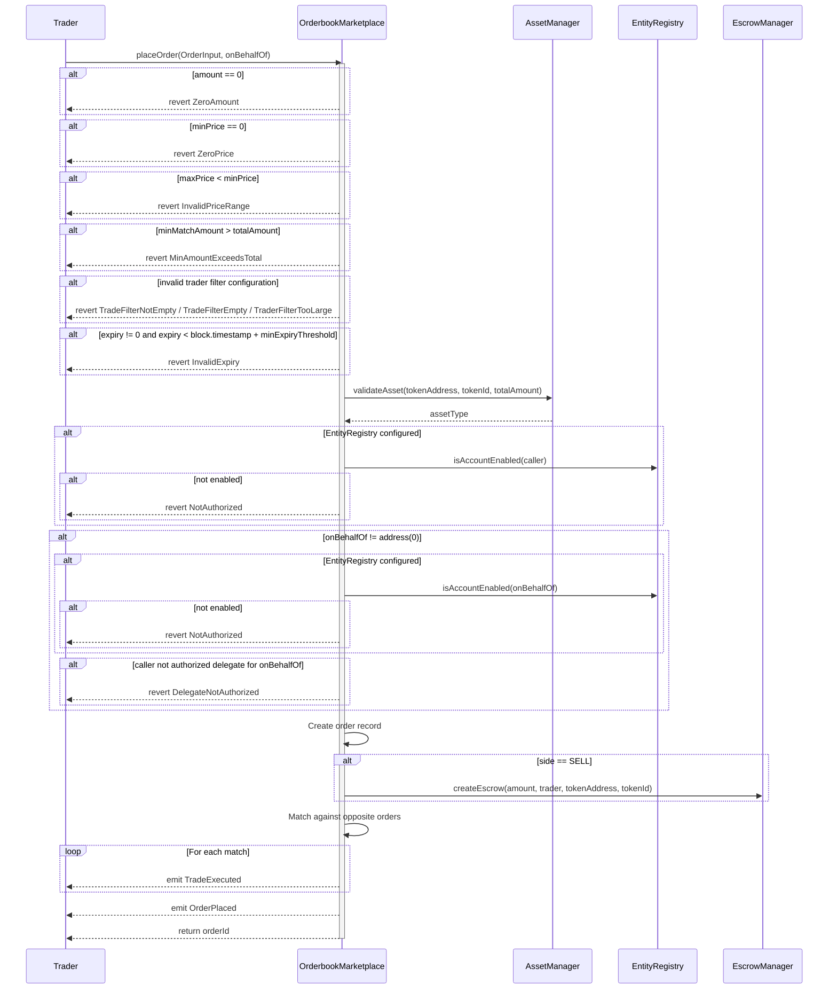
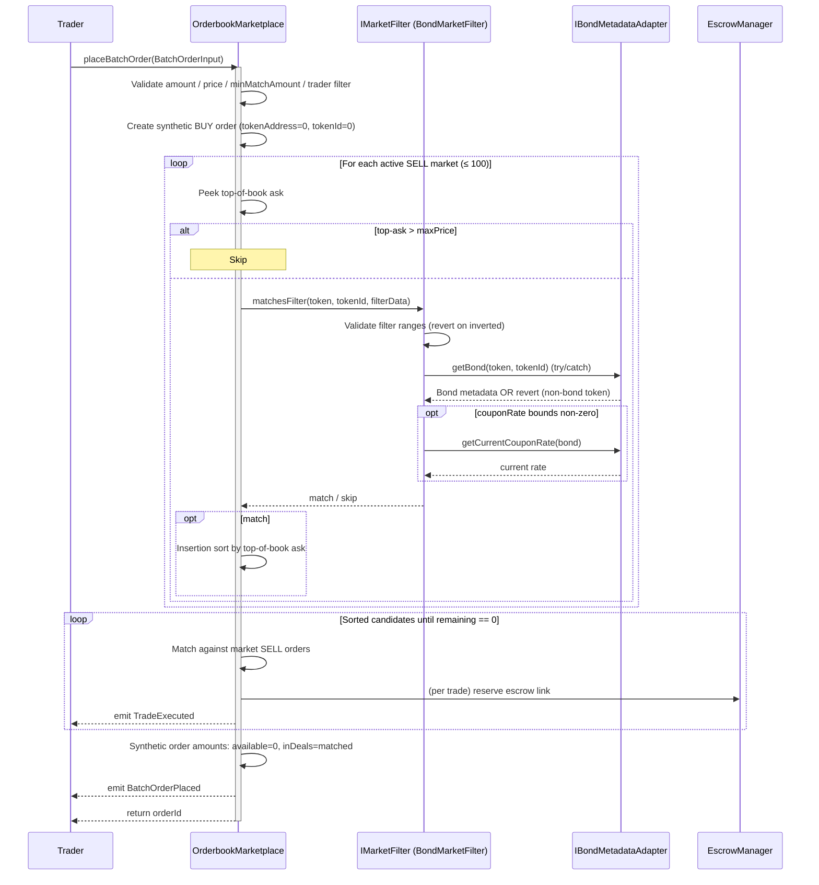
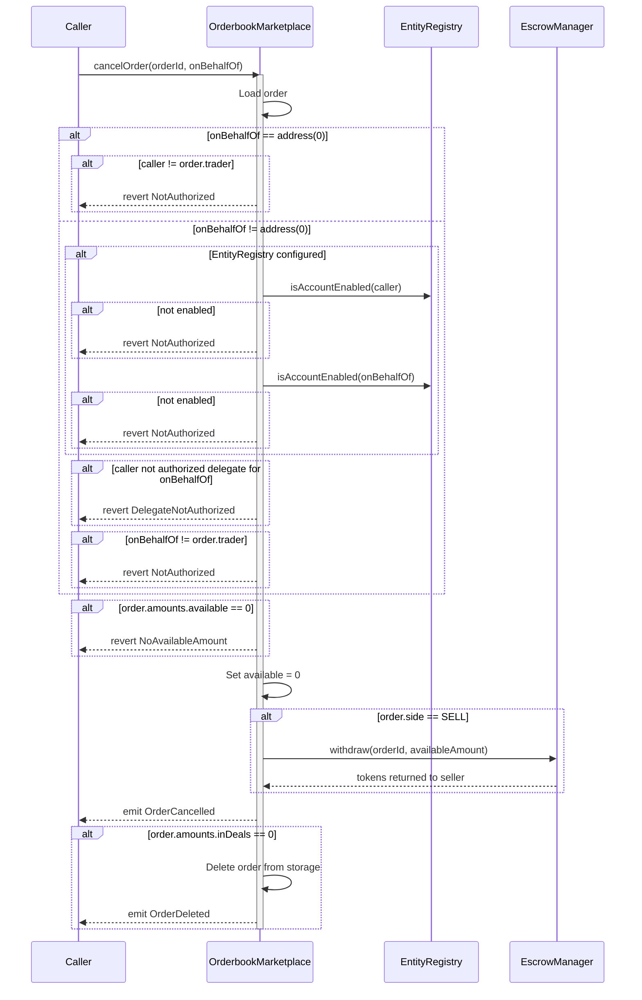
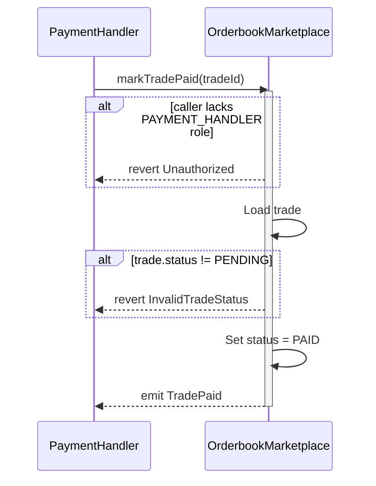
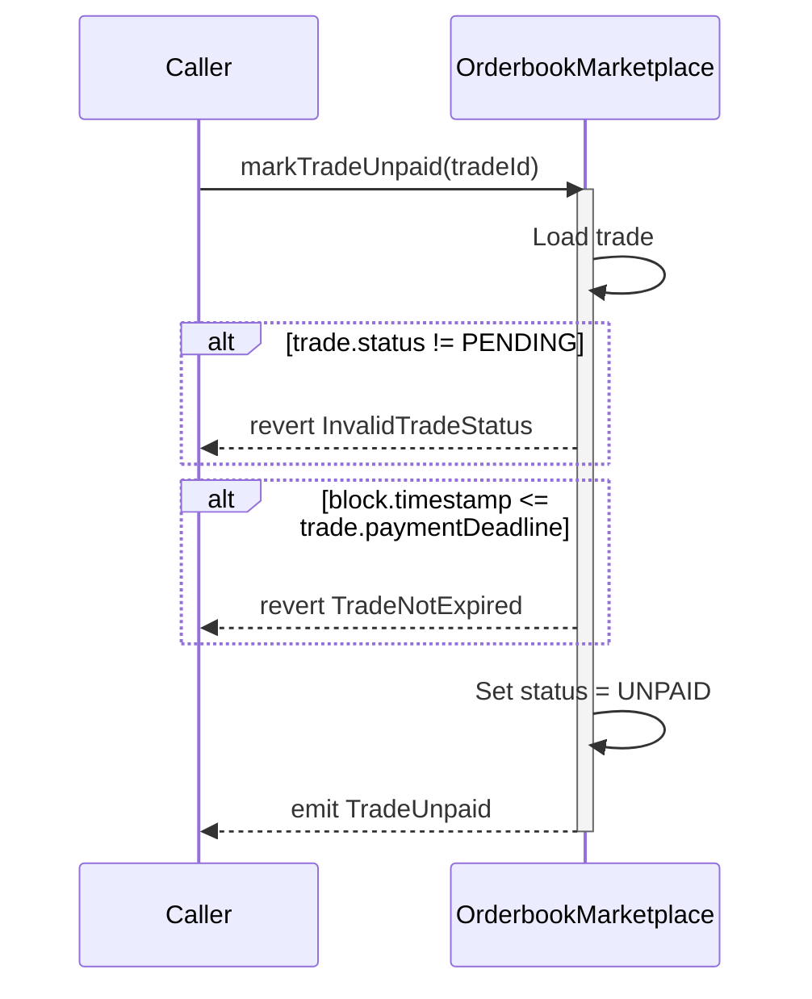
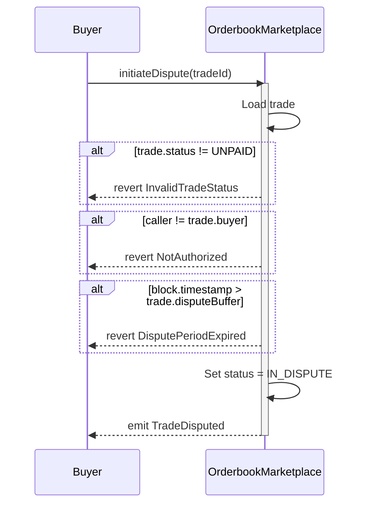
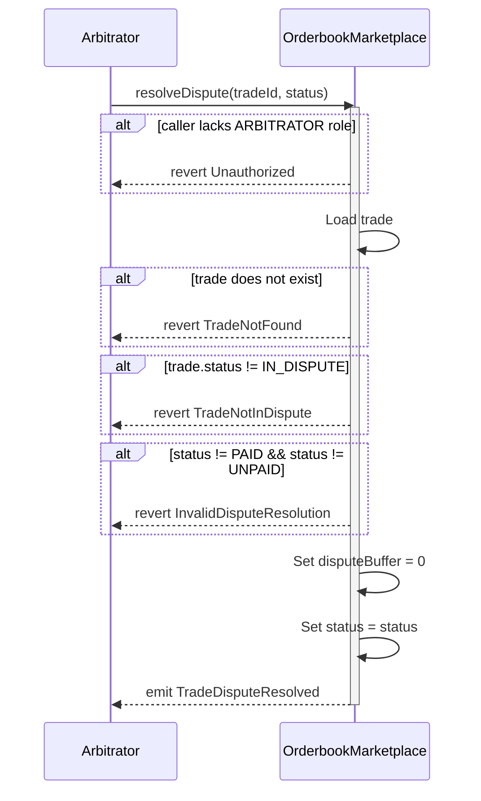
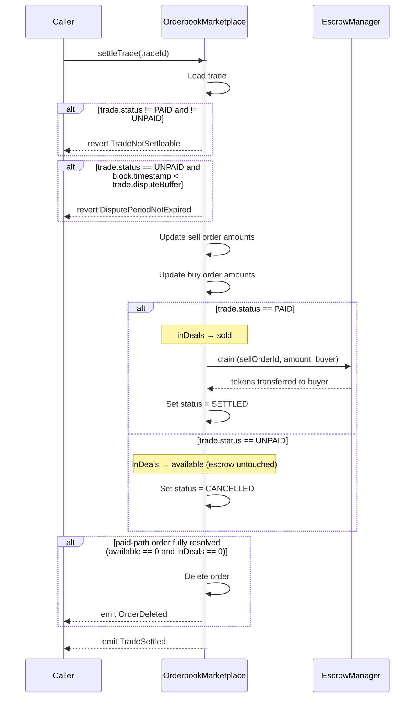

# OrderbookMarketplace Contract Documentation

## Overview
The `OrderbookMarketplace` contract is a core trading component of the DEUSS bond marketplace, implementing a traditional orderbook model with price-time priority matching. It enables traders to place buy and sell orders for issued bonds, with automatic matching when prices cross. The contract integrates with [`EscrowManager`](EscrowManager.md) for secure token custody during the trade lifecycle and [`AssetManager`](AssetManager.md) for asset validation. Batch orders can use [`BondMarketFilter`](BondMarketFilter.md) to evaluate bond metadata across candidate markets. It also supports a buyer dispute window for unpaid trades and maintains an on-chain TWAP oracle per `(tokenAddress, tokenId)` by recording trade-price observations whenever a match is executed.

## Prerequisites
- Contract must be initialized with owner and required registry addresses
- Proper roles must be assigned to authorized users:
  - `ADMIN`: For administrative functions (updating registry addresses and trade timing configuration)
  - `PAYMENT_HANDLER`: For confirming off-chain payments
  - `ARBITRATOR`: For resolving buyer disputes on unpaid trades
  - `FREEZE_ROLE`: For freezing/unfreezing orders and trades (compliance, sanctions, legal holds)
  - `SEIZURE_ROLE`: For seizing frozen orders and trades to redirect funds to a beneficiary; bootstrap grants this to `TimelockController`, not the operational admin
- Required contracts must be properly configured:
  - Asset Manager: For validating token assets (address, token ID, amount)
  - Escrow Manager: For token custody during trades
  - Market Filter (required): `IMarketFilter` resolver (e.g. `BondMarketFilter`) used by `placeBatchOrder()` to evaluate caller-supplied filter payloads against each candidate market. Must be non-zero at initialization and when updated via `setMarketFilter`
  - Company Wallet Registry (optional): If set, only enabled company wallets can place orders
- Trade timing configuration must be set:
  - `paymentExpiryThreshold`: Used to derive each trade's `paymentDeadline`
  - `minExpiryThreshold`: Minimum required duration for non-zero order expiries at placement time
  - `disputeBufferPeriod`: Added to each trade's `paymentDeadline` to derive the trade's `disputeBuffer`
- Deployment timing defaults from `DeployConstants.sol`:
  - Payment expiry: 1 day / 24 hours
  - Minimum non-zero order expiry: 1 day / 24 hours
  - Dispute buffer period: 1 day / 24 hours

## Contract Architecture
The `OrderbookMarketplace` is a core component of the bond marketplace system:
- Inherits from `OwnableRolesExtension` for role-based access control
- Inherits from `Initializable` for proxy initialization
- Inherits from `OrderbookMarketplaceStorage` for state management
- Implements `IOrderbookMarketplace` interface
- Integrates with EscrowManager for token custody
- Integrates with AssetManager for asset validation
- Integrates with EntityRegistry for trader authorization (optional)
- Maintains a per-token circular observation buffer for TWAP reads
- Supports buyer-initiated disputes on unpaid trades with arbitrator resolution
- Uses configurable `paymentExpiryThreshold`, `minExpiryThreshold`, and `disputeBufferPeriod`

## Core Functions

### setDelegate(address delegate, bool authorized)

Grants or revokes permission for a `delegate` address to place and cancel orders on behalf of the caller.

**Parameters:**
- `delegate`: Address to authorize or deauthorize
- `authorized`: `true` to grant delegation, `false` to revoke it

**Events:**
- `DelegateSet(trader, delegate, authorized)`: Emitted on success

**Errors:**
- `Errors.ZeroAddress()`: When `delegate` is the zero address

**Important Notes:**
- Delegation is per-trader and per-delegate; there is no global delegation
- A delegate can place and cancel orders but cannot further sub-delegate
- Revocation takes effect immediately for any subsequent call

---

### placeOrder(OrderInput calldata input, address onBehalfOf)

Places a new buy or sell order on the orderbook. Supports both fixed-price orders (`minPrice == maxPrice`) and price range orders. For SELL orders, tokens are deposited into escrow. The system automatically attempts to match the order against existing orders on the opposite side of the same `(tokenAddress, tokenId)` book.

**Prerequisites:**
- Token must be registered and enabled in AssetManager
- If EntityRegistry is configured, caller (and `onBehalfOf`, if set) must be an enabled company wallet
- For SELL orders, the effective trader must have approved EscrowManager to transfer their tokens
- For delegated calls (`onBehalfOf != address(0)`), caller must have been granted delegation by `onBehalfOf` via `setDelegate`

**Parameters:**
- `onBehalfOf`: Address of the trader the caller is acting for; pass `address(0)` to act as `msg.sender`

**Parameters (OrderInput struct):**
- `tokenAddress`: Address of the token contract
- `tokenId`: Token ID
- `totalAmount`: Number of bond units to trade
- `minPrice`: Minimum price per bond unit
- `maxPrice`: Maximum price per bond unit (set `minPrice == maxPrice` for fixed-price orders)
- `minMatchAmount`: Minimum amount for a single match (0 = no minimum)
- `traderFilterMode`: `TraderFilterMode.NONE`, `TraderFilterMode.WHITELIST`, or `TraderFilterMode.BLACKLIST`
- `traderFilterAddresses`: Addresses for the filter (must be empty for `NONE`, non-empty for `WHITELIST`/`BLACKLIST`, max 50)
- `side`: `OrderSide.BUY` or `OrderSide.SELL`
- `expiry`: Optional order expiry timestamp (`0` = does not expire)

**Returns:**
- `orderId`: Unique identifier for the created order

**Events:**
- `OrderPlaced(orderId, tokenId, trader, tokenAddress, totalAmount, unfilledAmount, minPrice, maxPrice, minMatchAmount, traderFilterMode, side, expiry)`: Always emitted
- `TradeExecuted(buyOrderId, sellOrderId, tokenId, tokenAddress, buyer, seller, amount, unitPrice)`: Emitted for each match
- `TWAPObservationRecorded(tokenAddress, tokenId, timestamp, cumulativePrice, lastPrice)`: Emitted for each executed trade as the oracle snapshot is updated

**Errors:**
- `OrderbookMarketplace__ZeroAmount()`: When totalAmount is zero
- `OrderbookMarketplace__ZeroPrice()`: When minPrice is zero
- `OrderbookMarketplace__InvalidPriceRange(minPrice, maxPrice)`: When maxPrice < minPrice
- `OrderbookMarketplace__MinAmountExceedsTotal(minMatchAmount, totalAmount)`: When minMatchAmount > totalAmount
- `OrderbookMarketplace__TradeFilterNotEmpty()`: When filter mode is `NONE` with non-empty addresses
- `OrderbookMarketplace__TradeFilterEmpty()`: When filter mode is `WHITELIST`/`BLACKLIST` with empty addresses
- `OrderbookMarketplace__TraderFilterTooLarge(length)`: When address list exceeds 50 entries
- `OrderbookMarketplace__InvalidExpiry(expiry, currentTimestamp)`: When a non-zero expiry is below `block.timestamp + minExpiryThreshold`
- `OrderbookMarketplace__AssetManagerNotSet()`: When asset manager is not configured
- `AssetManager__AssetNotSupported(token, tokenId)`: When token is not registered or enabled in AssetManager
- `AssetManager__TokenIdNotSupported(token, tokenId)`: When token ID is not in the allowlist (if enforced)
- `AssetManager__InvalidTokenId(tokenId)`: When an ERC-20 asset is submitted with a non-zero token ID
- `AssetManager__InvalidAmountForERC721(amount)`: When an ERC-721 asset is submitted with an amount other than 1
- `OrderbookMarketplace__NotAuthorized(sender)`: When caller (or `onBehalfOf`) is not an enabled company wallet (if registry is configured)
- `OrderbookMarketplace__DelegateNotAuthorized(delegate, trader)`: When caller has not been granted delegation by `onBehalfOf`

**Important Notes:**
- SELL orders deposit tokens into escrow immediately upon order creation
- BUY orders do not require any token deposit
- If `expiry == 0`, the order does not expire
- If `expiry != 0`, it must satisfy `expiry >= block.timestamp + minExpiryThreshold`
- Orders are inserted into a sorted array (price-time priority)
- Orderbooks are keyed by both `tokenAddress` and `tokenId`; orders for different token contracts never match or appear in each other's `getOrderBook(tokenAddress, tokenId)` result even if the numeric token ID is identical
- BUY orders are sorted by `maxPrice` (highest willingness to pay first)
- SELL orders are sorted by `minPrice` (lowest asking price first)
- Matching happens automatically during order placement
- Matching skips opposite-side orders that are expired, just as it skips orders with zero available amount
- Partial fills are supported; unfilled amounts remain in the orderbook
- Self-matching is prevented (cannot match your own orders)
- If `minMatchAmount > 0`, a potential match is skipped when the match amount is below either side's minimum
- Trader filter is checked for both sides: the new order's filter must allow the counterparty, and the counterparty's filter must allow the new order's trader
- Every executed trade also records a TWAP observation for that `(tokenAddress, tokenId)` pair
- Every matched trade is created with:
  - `status = PENDING`
  - `paymentDeadline = block.timestamp + paymentExpiryThreshold`
  - `disputeBuffer = paymentDeadline + disputeBufferPeriod`

**Trader Filter:**
- `NONE`: No filter, matches any counterparty (default)
- `WHITELIST`: Only matches counterparties in the address list
- `BLACKLIST`: Matches any counterparty NOT in the address list
- Both sides' filters are checked during matching — both must allow the counterparty for a match to occur

**Price Range Matching:**
- A BUY order matches a SELL order when the ranges overlap:
  - `buyMaxPrice >= sellMinPrice`
  - `sellMaxPrice >= buyMinPrice`
- Trade executes at a price **within the intersection of both ranges**
- Fixed-price orders (`minPrice == maxPrice`) behave identically to the original single-price model

**Sequence Diagram:**

### placeBatchOrder(BatchOrderInput calldata input)

Places a multi-market BUY order selected by bond metadata filters instead of a specific `(tokenAddress, tokenId)`. The contract iterates its own set of active SELL markets, applies the filter on-chain, sorts the surviving markets by best ask (lowest `minPrice` across their top-of-book), and matches greedily until the global amount budget is exhausted or the pool is empty. The order is **immediate-or-cancel**: any amount that cannot be matched in this call is discarded — nothing is added to the orderbook.

A "synthetic" `Order` record is still written (with `tokenAddress = 0`, `tokenId = 0`) so that each resulting `Trade` has a valid `buyOrderId` for settlement and audit. The synthetic order is never pushed to `_buyOrderIdsByTokenId`, cannot be matched by later SELL orders, and cannot be cancelled.

**Prerequisites:**
- An `IMarketFilter` resolver is required and is set at initialization; it can be swapped via `setMarketFilter(address)` but never cleared (zero address reverts with `ZeroAddress`)
- For DEUSS bonds the resolver must be `BondMarketFilter` with a per-token adapter registered (`BondMarketFilter.setAdapter(token, adapter)`); the default DEUSS adapter is `DeussBondMetadataAdapter` wrapping `BondRegistry`
- If `EntityRegistry` is configured, caller must be an enabled company wallet
- Trader filter arrays must respect the per-order size cap (50)

**Parameters (BatchOrderInput struct):**
- `totalAmount`: Global amount budget shared across all matched markets
- `minPrice` / `maxPrice`: Price bounds for every individual match
- `minMatchAmount`: Minimum amount per match (0 = no minimum)
- `filterData` (`bytes`): Opaque payload forwarded to `IMarketFilter.matchesFilter(token, tokenId, filterData)` on every candidate market. For `BondMarketFilter` the payload ABI-decodes to `BondMarketFilter.BondFilter`:
  - `maturityFrom` / `maturityTo`: Inclusive maturity-date range (0 = unbounded on that side)
  - `currencyWhitelist` / `currencyBlacklist`: `bytes3` currency codes (ASCII `"EUR"`, `"USD"`, …); whitelist is permissive when empty, blacklist is ignored when empty
  - `couponRateFrom` / `couponRateTo`: Inclusive coupon-rate range in basis points, evaluated against the adapter's `getCurrentCouponRate(bond)` at the time of the call (skipped entirely when both bounds are zero). For DEUSS bonds the registry resolves this from explicit coupon timestamp checkpoints, not from `couponFrequency`
  - `couponRateTypes`: Non-empty array restricts to `ZERO_COUPON` / `FIXED` / `FLOATING`
  - `issuerWhitelist` / `issuerBlacklist`: Address lists, same semantics as currency
  - `bondNominalValueFrom` / `bondNominalValueTo`: Inclusive bondNominalValue range
- `traderFilterMode`, `traderFilterAddresses`: Same semantics as `placeOrder`

**Returns:**
- `orderId`: Identifier of the synthetic BUY order

**Events:**
- `BatchOrderPlaced(orderId, trader, totalAmount, matchedAmount, minPrice, maxPrice, minMatchAmount, traderFilterMode)`: Always emitted
- `TradeExecuted(buyOrderId, sellOrderId, tokenId, tokenAddress, buyer, seller, amount, unitPrice)`: Emitted for each match against a SELL order
- `TWAPObservationRecorded(tokenAddress, tokenId, timestamp, cumulativePrice, lastPrice)`: Emitted for each executed trade as the oracle snapshot is updated

**Errors:**
- `OrderbookMarketplace__ZeroAmount()`: When totalAmount is zero
- `OrderbookMarketplace__ZeroPrice()`: When minPrice is zero
- `OrderbookMarketplace__InvalidPriceRange(minPrice, maxPrice)`: When maxPrice < minPrice
- `OrderbookMarketplace__MinAmountExceedsTotal(minMatchAmount, totalAmount)`: When minMatchAmount > totalAmount
- `OrderbookMarketplace__TradeFilterNotEmpty()`: When filter mode is `NONE` with non-empty addresses
- `OrderbookMarketplace__TradeFilterEmpty()`: When filter mode is `WHITELIST`/`BLACKLIST` with empty addresses
- `OrderbookMarketplace__TraderFilterTooLarge(length)`: When address list exceeds 50 entries
- `OrderbookMarketplace__NotAuthorized(sender)`: When caller is not an enabled company wallet (if registry is configured)
- `BondMarketFilter__InvalidFilterRange()`: Raised by `BondMarketFilter.matchesFilter` when any filter range is inverted (e.g. `maturityFrom > maturityTo`); propagates through `placeBatchOrder` when at least one candidate market exists

**Important Notes:**
- Markets come from the contract's own active-sell-market set; the caller does not supply a candidate list, and every survivor is re-checked via `IMarketFilter.matchesFilter`
- The active sell market set is capped at `MAX_ACTIVE_SELL_MARKETS = 100`; attempts to place a new SELL for a 101st market revert with `OrderbookMarketplace__TooManyActiveSellMarkets()`
- The active sell market cap is an intentional gas-safety bound for `placeBatchOrder`, which iterates active markets. Opening a SELL market requires escrowed tokens, expired orders can be removed through permissionless `cleanupExpiredOrder`, and markets with pending trades remain active until those trades settle or are otherwise resolved.
- For `BondMarketFilter`, markets whose bond is not in `BondStatus.Issued` (e.g. `Suspended`, `Replaced`, `Closed`) are skipped inside the resolver
- The current coupon rate is fetched via the per-token adapter only when at least one of `couponRateFrom` / `couponRateTo` is non-zero; `ZERO_COUPON` bonds compare at rate `0`
- Markets are sorted ascending by the top-of-book SELL `minPrice` (best ask first); SELL orders inside each market are already price-time sorted, so the taker sees the globally cheapest lot first
- `totalAmount` is a global budget shared across all matches; once exhausted, the loop stops immediately — any residual unmatched amount is discarded (IOC semantics)
- The synthetic order settles like a regular BUY order via `settleTrade`; it always has `available == 0`, so `cancelOrder` reverts with `OrderbookMarketplace__NoAvailableAmount(orderId)`, and it is never pushed to `_buyOrderIdsByTokenId` so future SELL orders cannot match against it

**Sequence Diagram:**

### cancelOrder(uint256 orderId, address onBehalfOf)

Cancels an existing order and returns any available (unfilled) amount. For SELL orders, tokens are withdrawn from escrow back to the seller. Supports delegated cancellation via `onBehalfOf`, and expired orders can still be cancelled by their owner or authorized delegate.

**Prerequisites:**
- Caller must be the order owner, or a delegate authorized by the order owner via `setDelegate`
- For delegated calls, both caller and `onBehalfOf` must be enabled entity accounts (if registry is configured)
- Order must have available amount > 0

**Parameters:**
- `orderId`: Identifier of the order to cancel
- `onBehalfOf`: Address of the order owner the caller is acting for; pass `address(0)` to act as `msg.sender`

**Events:**
- `OrderCancelled(orderId, trader, remainingAmount)`: Always emitted
- `OrderDeleted(orderId, trader)`: Emitted if order has no amounts in deals

**Errors:**
- `OrderbookMarketplace__OrderNotFound(orderId)`: When order does not exist
- `OrderbookMarketplace__OrderFrozen(orderId)`: When the order is frozen and cannot be cancelled
- `OrderbookMarketplace__NotAuthorized(sender)`: When caller is not the order owner (direct path) or the resolved effective trader is not the order owner (delegated path), or when caller/`onBehalfOf` is not an enabled company wallet (if registry is configured)
- `OrderbookMarketplace__DelegateNotAuthorized(delegate, trader)`: When caller has not been granted delegation by `onBehalfOf`
- `OrderbookMarketplace__NoAvailableAmount(orderId)`: When order has no available amount to cancel

**Important Notes:**
- Only cancels the available (unfilled) portion of the order
- Amounts already matched (inDeals) cannot be cancelled
- For SELL orders, tokens are withdrawn from escrow to the original seller
- Order is deleted from storage only if no amounts are pending in deals
- If order has pending deals, it remains in storage with available = 0
- Direct owner cancellation (`onBehalfOf == address(0)`) intentionally checks only `msg.sender == order.trader` and does not re-run the EntityRegistry enablement check. This preserves direct-owner cancellation semantics when no registry is configured. Compliance blocking is handled by `setOrderFrozen`: frozen orders cannot be cancelled, cleaned up, or matched.

### cleanupExpiredOrder(uint256 orderId)

Permissionlessly removes the available amount of an expired order from the orderbook. For SELL orders, the available amount is withdrawn from escrow back to the original trader.

**Prerequisites:**
- Order must exist
- Order must be expired (`block.timestamp > order.expiry`)
- Order must not be frozen
- Order must still have available amount > 0

**Parameters:**
- `orderId`: Identifier of the expired order to clean up

**Events:**
- `OrderCancelled(orderId, trader, remainingAmount)`: Always emitted
- `OrderDeleted(orderId, trader)`: Emitted if order has no amounts in deals

**Errors:**
- `OrderbookMarketplace__OrderNotFound(orderId)`: When order does not exist
- `OrderbookMarketplace__OrderFrozen(orderId)`: When the order is frozen and cannot be cleaned up
- `OrderbookMarketplace__OrderNotExpired(orderId, expiry, currentTimestamp)`: When the expiry has not strictly passed yet
- `OrderbookMarketplace__NoAvailableAmount(orderId)`: When the order already has zero available amount

**Important Notes:**
- Anyone can call this function
- For `BUY` orders, only the available amount is removed from the orderbook
- For `SELL` orders, only the available amount is withdrawn from escrow
- If the order still has `inDeals > 0`, it remains in storage so its existing trades can still settle later
- If the order has `inDeals == 0`, it is deleted from storage
- Frozen expired orders are intentionally excluded from permissionless cleanup so escrow cannot be withdrawn while a compliance freeze is active.

**Sequence Diagram:**

### markTradePaid(uint256 tradeId)

Confirms that off-chain payment has been received for a trade. Only callable by addresses with PAYMENT_HANDLER role.

**Prerequisites:**
- Caller must have `PAYMENT_HANDLER` role
- Trade must exist and be in `PENDING` status

**Parameters:**
- `tradeId`: Identifier of the trade to mark as paid

**Events:**
- `TradePaid(tradeId, buyer, seller)`: Emitted on success

**Errors:**
- `Unauthorized()`: When caller does not have PAYMENT_HANDLER role
- `OrderbookMarketplace__InvalidTradeStatus(current)`: When trade is not in PENDING status

**Important Notes:**
- This is the bridge between off-chain payment and on-chain settlement
- `paymentDeadline` is not a hard cutoff for this function; a late off-chain payment may still be confirmed while the
  trade remains `PENDING`
- Once someone marks the trade `UNPAID`, the buyer-protection dispute flow takes over and `markTradePaid()` can no
  longer be used for that trade
- Trade status changes from `PENDING` to `PAID`
- After this call, anyone can call `settleTrade()` to transfer tokens

**Sequence Diagram:**

### markTradeUnpaid(uint256 tradeId)

Marks a trade as unpaid after the payment deadline has expired. Callable by anyone.

**Prerequisites:**
- Trade must exist and be in `PENDING` status
- Current block timestamp must be strictly past the trade's payment deadline

**Parameters:**
- `tradeId`: Identifier of the trade to mark as unpaid

**Events:**
- `TradeUnpaid(tradeId, buyer, seller)`: Emitted on success

**Errors:**
- `OrderbookMarketplace__InvalidTradeStatus(current)`: When trade is not in PENDING status
- `OrderbookMarketplace__TradeNotExpired()`: When payment deadline has not yet strictly passed

**Important Notes:**
- Anyone can call this function (no access control) — it is permissionless after the deadline
- Trade status changes from `PENDING` to `UNPAID`
- The payment deadline is set per-trade at creation time: `block.timestamp + paymentExpiryThreshold`
- The dispute cutoff is fixed at trade creation time: `paymentDeadline + disputeBufferPeriod`
- After this call, the buyer may either call `initiateDispute()` before `trade.disputeBuffer`, or anyone may settle once the dispute window has passed

**Sequence Diagram:**

### initiateDispute(uint256 tradeId)

Moves an unpaid trade into dispute. Only the buyer of the trade can call this function.

**Prerequisites:**
- Caller must be the trade buyer
- Trade must be in `UNPAID` status
- Current block timestamp must be less than or equal to the trade's `disputeBuffer`

**Parameters:**
- `tradeId`: Identifier of the trade to dispute

**Events:**
- `TradeDisputed(tradeId, buyer, seller)`: Emitted on success

**Errors:**
- `OrderbookMarketplace__InvalidTradeStatus(current)`: When trade is not in `UNPAID` status
- `OrderbookMarketplace__NotAuthorized(sender)`: When caller is not the buyer
- `OrderbookMarketplace__DisputePeriodExpired()`: When the dispute buffer window has already passed

**Important Notes:**
- This function is buyer-only by design
- Trade status changes from `UNPAID` to `IN_DISPUTE`
- `disputeBuffer` is stored as an absolute timestamp when the trade is created, not when the trade is marked unpaid

**Sequence Diagram:**

### resolveDispute(uint256 tradeId, TradeStatus status)

Arbitrator-only function for resolving a disputed trade as paid or unpaid.

**Prerequisites:**
- Caller must have `ARBITRATOR` role
- Trade must exist
- Trade must be in `IN_DISPUTE` status
- `status` must be either `PAID` or `UNPAID`

**Parameters:**
- `tradeId`: Identifier of the disputed trade
- `status`: Resolution outcome, either `PAID` or `UNPAID`

**Events:**
- `TradeDisputeResolved(tradeId, status, arbitrator)`: Emitted on success

**Errors:**
- `Unauthorized()`: When caller does not have `ARBITRATOR` role
- `OrderbookMarketplace__TradeNotFound(tradeId)`: When trade does not exist
- `OrderbookMarketplace__TradeNotInDispute()`: When trade is not in `IN_DISPUTE`
- `OrderbookMarketplace__InvalidDisputeResolution(status)`: When status is not `PAID` or `UNPAID`

**Important Notes:**
- The arbitrator can only resolve to `PAID` or `UNPAID`
- The function clears `trade.disputeBuffer` to `0`
- If resolved as `PAID`, anyone can call `settleTrade()` on the paid path
- If resolved as `UNPAID`, anyone can call `settleTrade()` immediately on the unpaid path because the dispute buffer is cleared

**Sequence Diagram:**

### settleTrade(uint256 tradeId)

Finalizes a trade after it has been marked as `PAID` or `UNPAID`. Can be called by anyone.

**Prerequisites:**
- Trade must exist and be in `PAID` or `UNPAID` status
- If trade is `UNPAID`, the dispute window must already be over or the trade must have been arbitrated with `disputeBuffer = 0`

**Parameters:**
- `tradeId`: Identifier of the trade to settle

**Events:**
- `TradeSettled(tradeId, buyer, amount)`: Always emitted
- `OrderDeleted(orderId, trader)`: Emitted when a paid-path order becomes fully resolved and is removed from storage

**Errors:**
- `OrderbookMarketplace__TradeNotFound(tradeId)`: When trade does not exist
- `OrderbookMarketplace__TradeNotSettleable(status)`: When trade is not in `PAID` or `UNPAID`
- `OrderbookMarketplace__DisputePeriodNotExpired()`: When an `UNPAID` trade is still inside the dispute window

**Important Notes:**
- Anyone can call this function (no access control)
- **PAID trades**: tokens are transferred from escrow to the buyer via `claim`. Order amounts move from `inDeals` to `sold`, and fully resolved orders may be deleted.
- **UNPAID trades**: escrow is untouched (tokens stay in escrow). Order amounts move from `inDeals` back to `available`, making the order re-matchable. The seller can later call `cancelOrder` to withdraw tokens from escrow.
- After the unpaid path is settled, the trade status becomes `CANCELLED`
- `Trade` keeps `tokenAddress` and `tokenId`, so the settled trade remains self-describing even after fully resolved orders are deleted
- Works even if the original orders were already deleted by a previous `settleTrade` call

**Sequence Diagram:**

### setPaymentExpiryThreshold(uint256 paymentExpiryThreshold_)

Sets the payment expiry threshold used for new trade payment deadlines. Only callable by addresses with the ADMIN role.

**Prerequisites:**
- Caller must have `ADMIN` role
- `paymentExpiryThreshold_` must be within [`MIN_PAYMENT_EXPIRY_THRESHOLD`, `MAX_PAYMENT_EXPIRY_THRESHOLD`]

**Parameters:**
- `paymentExpiryThreshold_`: The new payment expiry threshold in seconds

**Events:**
- `PaymentExpiryThresholdSet(paymentExpiryThreshold)`: Emitted on success

**Errors:**
- `Unauthorized()`: When caller does not have `ADMIN` role
- `OrderbookMarketplace__PaymentExpiryThresholdTooLow(paymentExpiryThreshold)`: When value is below the minimum
- `OrderbookMarketplace__PaymentExpiryThresholdTooHigh(paymentExpiryThreshold)`: When value exceeds the maximum

**Important Notes:**
- Affects only newly created trades
- Existing trades keep the `paymentDeadline` that was fixed at trade creation time

### setMinExpiryThreshold(uint256 minExpiryThreshold_)

Sets the minimum required duration for non-zero order expiries. Only callable by addresses with the ADMIN role.

**Prerequisites:**
- Caller must have `ADMIN` role
- `minExpiryThreshold_` must be at least `MIN_ORDER_EXPIRY_THRESHOLD`

**Parameters:**
- `minExpiryThreshold_`: The new minimum required order expiry duration in seconds

**Events:**
- `MinExpiryThresholdSet(minExpiryThreshold)`: Emitted on success

**Errors:**
- `Unauthorized()`: When caller does not have `ADMIN` role
- `OrderbookMarketplace__MinExpiryThresholdTooLow(minExpiryThreshold)`: When value is below the minimum

**Important Notes:**
- Affects only newly placed orders with non-zero `expiry`
- Orders with `expiry = 0` remain perpetual regardless of this setting
- The deployment default is 1 day; `MIN_ORDER_EXPIRY_THRESHOLD` remains the immutable 30-minute lower bound for future administrative updates.

### setDisputeBufferPeriod(uint256 disputeBufferPeriod_)

Sets the dispute buffer period used for new trades. Only callable by addresses with the ADMIN role.

**Prerequisites:**
- Caller must have `ADMIN` role
- `disputeBufferPeriod_` must be within [`MIN_DISPUTE_BUFFER_PERIOD`, `MAX_DISPUTE_BUFFER_PERIOD`]

**Parameters:**
- `disputeBufferPeriod_`: The new dispute buffer period in seconds

**Events:**
- `DisputeBufferPeriodSet(disputeBufferPeriod)`: Emitted on success

**Errors:**
- `Unauthorized()`: When caller does not have `ADMIN` role
- `OrderbookMarketplace__DisputeBufferPeriodTooLow(disputeBufferPeriod)`: When value is below the minimum
- `OrderbookMarketplace__DisputeBufferPeriodTooHigh(disputeBufferPeriod)`: When value exceeds the maximum

**Important Notes:**
- Affects only newly created trades
- The deployment default dispute buffer is 1 day.
- Existing trades keep the `disputeBuffer` timestamp that was fixed at trade creation time

### setMarketFilter(address marketFilter_)

Sets the `IMarketFilter` resolver used by `placeBatchOrder` to evaluate candidate markets. Only callable by addresses with the ADMIN role.

**Prerequisites:**
- Caller must have `ADMIN` role
- `marketFilter_` must be non-zero

**Parameters:**
- `marketFilter_`: The new market filter resolver address

**Events:**
- `MarketFilterSet(marketFilter)`: Emitted on success

**Errors:**
- `Unauthorized()`: When caller does not have `ADMIN` role
- `ZeroAddress()`: When `marketFilter_` is the zero address

**Important Notes:**
- Affects only subsequent `placeBatchOrder` calls
- Cannot be cleared — the zero address is always rejected

---

### setOrderFrozen(uint256 orderId, bool frozen, bytes32 reason)

Freezes or unfreezes an order to prevent it from being cancelled or used in matching operations. This function is used for legal/compliance purposes, such as responding to sanctions, anti-money laundering (AML) requirements, or judicial orders. Only callable by addresses with the FREEZE_ROLE.

**Parameters:**
- `orderId`: The ID of the order to freeze or unfreeze
- `frozen`: `true` to freeze the order, `false` to unfreeze
- `reason`: An opaque bytes32 identifier for the legal/compliance reason (e.g., `keccak256("SANCTIONS")`, `keccak256("AML_INVESTIGATION")`, `keccak256("JUDICIAL_ORDER")`)

**Effects:**
- When `frozen == true`: The order cannot be cancelled and will be skipped during matching operations
- When `frozen == false`: The order is unfrozen and can resume normal operations
- A frozen order can be seized only when it still has a non-zero `available` amount

**Events:**
- `OrderFrozenSet(orderId, frozen, reason, freezer)`: Emitted on success

**Errors:**
- `OrderbookMarketplace__OrderNotFound(orderId)`: When the order does not exist
- `OrderbookMarketplace__ZeroFreezeReason()`: When `reason` is bytes32(0)
- Insufficient `FREEZE_ROLE`: When caller lacks the required role

**Important Notes:**
- The `reason` parameter is opaque and immutable; it can be any non-zero bytes32 value and is included in events for audit trail purposes
- Frozen orders are skipped during matching and are also hidden from `getOrderBook()` so the public view matches the matchable state
- Unfreezing does not require the original reason — any non-zero `reason` is accepted; use `keccak256(abi.encodePacked(reasonString))` for consistent reason identifiers

---

### setTradeFrozen(uint256 tradeId, bool frozen, bytes32 reason)

Freezes or unfreezes a trade to prevent payment confirmation, unpaid marking, or settlement. This function is used for legal/compliance purposes, such as responding to sanctions or judicial orders. Only callable by addresses with the FREEZE_ROLE.

**Parameters:**
- `tradeId`: The ID of the trade to freeze or unfreeze
- `frozen`: `true` to freeze the trade, `false` to unfreeze
- `reason`: An opaque bytes32 identifier for the legal/compliance reason

**Effects:**
- When `frozen == true`: The trade cannot be marked as paid, marked as unpaid, or settled
- When `frozen == false`: The trade is unfrozen and can resume normal operations

**Events:**
- `TradeFrozenSet(tradeId, frozen, reason, freezer)`: Emitted on success

**Errors:**
- `OrderbookMarketplace__TradeNotFound(tradeId)`: When the trade does not exist
- `OrderbookMarketplace__ZeroFreezeReason()`: When `reason` is bytes32(0)
- Insufficient `FREEZE_ROLE`: When caller lacks the required role

**Important Notes:**
- A frozen trade cannot progress through its lifecycle (PENDING → PAID → SETTLED or PENDING → UNPAID → CANCELLED)
- Both the trade and its parent sell order can be frozen independently
- Use the same `reason` parameter for consistent audit trail tracking

---

### seizeOrder(uint256 orderId, address beneficiary, bytes32 reason)

Seizes all available tokens from a frozen order and transfers them to a beneficiary. This function is used in compliance scenarios where assets must be forfeited or redirected due to legal/regulatory requirements. Only callable by addresses with the SEIZURE_ROLE.

**Parameters:**
- `orderId`: The ID of the frozen order to seize from
- `beneficiary`: The address that will receive the seized tokens
- `reason`: An opaque bytes32 identifier for the legal/compliance reason (e.g., `keccak256("SANCTIONS")`, `keccak256("ASSET_FORFEITURE")`)

**Effects:**
- Sets the order's `available` amount to zero
- Transfers tokens from escrow (for SELL orders) to the beneficiary
- BUY orders do not hold tokens in escrow, so no transfer occurs
- If the order has no pending trades (`inDeals == 0`), it is deleted from storage and removed from the sorted order array; the `_orderFrozen` flag is cleared on deletion. `OrderDeleted(orderId, trader)` is emitted in this case.
- If pending trades exist (`inDeals > 0`), the order stays alive so those trades can still be processed via `seizeTrade` or settlement

**Events:**
- `OrderSeized(orderId, beneficiary, amount, reason, seizer)`: Emitted on success
- `OrderDeleted(orderId, trader)`: Emitted when the seized order is fully drained and removed

**Errors:**
- `OrderbookMarketplace__OrderNotFound(orderId)`: When the order does not exist
- `OrderbookMarketplace__CannotSeizeUnfrozenOrder(orderId)`: When the order is not frozen
- `OrderbookMarketplace__NoAvailableAmountToSeize(orderId)`: When the order has no available tokens to seize (e.g., a partially-matched order whose `available` was already seized)
- `ZeroAddress()`: When `beneficiary` is the zero address
- `OrderbookMarketplace__ZeroReason()`: When `reason` is bytes32(0)
- Insufficient `SEIZURE_ROLE`: When caller lacks the required role

**Important Notes:**
- Only SELL orders can have tokens seized (they hold tokens in escrow)
- BUY orders can be seized (no-op transfer) to maintain compliance uniformity
- Once seized, the available amount becomes zero and cannot be recovered
- If an order is partially matched (has `inDeals > 0`), seizing drains only `available`; a second seize will revert with `NoAvailableAmountToSeize` until pending trades resolve

---

### seizeTrade(uint256 tradeId, address beneficiary, bytes32 reason)

Seizes a frozen non-terminal escrow-backed trade and transfers its escrow tokens to a beneficiary. This function is used in compliance scenarios where trade settlements must be forfeited. The trade's parent SELL order must also be frozen. Only callable by addresses with the SEIZURE_ROLE.

**Parameters:**
- `tradeId`: The ID of the frozen trade to seize
- `beneficiary`: The address that will receive the seized tokens
- `reason`: An opaque bytes32 identifier for the legal/compliance reason

**Effects:**
- Sets the trade's status to `SEIZED`
- Decrements `inDeals` by the trade amount on both the sell and buy orders
- Transfers the trade amount from the sell order's escrow to the beneficiary
- The trade can no longer be marked as paid, unpaid, or settled
- For each of the sell and buy orders: if the order is fully drained after the decrement (`available == 0 && inDeals == 0`), it is deleted from storage and removed from its sorted order array; the `_orderFrozen` flag is cleared on deletion. `OrderDeleted(orderId, trader)` is emitted for each deleted order.
- When seizing a PAID trade, the contract does not refund the buyer's off-chain payment; off-chain remediation is the seizing operator's responsibility.

**Events:**
- `TradeSeized(tradeId, sellOrderId, beneficiary, amount, reason, seizer)`: Emitted on success
- `OrderDeleted(orderId, trader)`: Emitted (up to twice) when the sell and/or buy order is fully drained by the seizure

**Errors:**
- `OrderbookMarketplace__TradeNotFound(tradeId)`: When the trade does not exist
- `OrderbookMarketplace__CannotSeizeUnfrozenTrade(tradeId)`: When the trade is not frozen
- `OrderbookMarketplace__ParentOrderNotFrozen(sellOrderId)`: When the parent SELL order is not frozen
- `OrderbookMarketplace__InvalidTradeStatus(status)`: When the trade is not in PENDING, PAID, UNPAID, or IN_DISPUTE status
- `ZeroAddress()`: When `beneficiary` is the zero address
- `OrderbookMarketplace__ZeroReason()`: When `reason` is bytes32(0)
- Insufficient `SEIZURE_ROLE`: When caller lacks the required role

**Important Notes:**
- Only PENDING, PAID, UNPAID, or IN_DISPUTE trades can be seized; cancelled, settled, and already-seized trades cannot be seized
- Seizing a PAID trade is the recovery path when the buyer becomes disabled and `settleTrade` would otherwise revert with `Token__TransferNotAllowed`, leaving the escrow stuck
- Seizing an UNPAID or IN_DISPUTE trade is the recovery path when compliance freezes block normal unpaid settlement or arbitration progress while the trade amount is still escrow-backed
- The parent SELL order must be frozen before the trade can be seized (the buy order does not need to be frozen)
- Once seized, the trade's status becomes immutable (SEIZED is terminal) and the escrow is transferred
- Check-Effects-Interactions: all state changes (trade status, `inDeals`, order deletions) are applied before the external escrow `claim` call

---

### getEscrowIdByOrderId(uint256 orderId)

Returns the `EscrowManager` escrow identifier linked to a SELL order.

**Parameters:**
- `orderId`: Order identifier to query

**Returns:**
- `escrowId`: Linked escrow identifier for a SELL order; `0` for BUY or unknown order IDs

**Important Notes:**
- Use the returned identifier with `EscrowManager.getEscrow()` when integrations need the escrow's depositor, asset, or remaining amount
- The identifier is allocated by `EscrowManager` and is not guaranteed to equal the order ID

---

### TWAP Oracle View Functions

The contract exposes four TWAP-related read functions:

- `getTWAP(tokenAddress, tokenId, secondsAgo)`: Returns the time-weighted average unit price over the interval ending at the current block timestamp
- `getObservation(tokenAddress, tokenId, index)`: Returns the raw observation stored at a physical ring-buffer slot
- `getObservationCount(tokenAddress, tokenId)`: Returns the number of valid stored observations for the token
- `getLastTradedPrice(tokenAddress, tokenId)`: Returns the most recent executed trade price used to project the accumulator forward

**How recording works:**

- A new observation is written every time `_createTrade()` executes a match
- Observations are recorded at match time, before payment settlement. The recorded price is the agreed execution price for the trade, not a settlement-confirmed payment signal.
- The stored observation is not the raw trade price history; it is a cumulative-price snapshot:
  - `newCumulative = prev.cumulativePrice + lastPrice * (currentTime - prev.timestamp)`
- The new trade price becomes `lastPrice` only after the new observation is written
- This means the trade that just happened affects the oracle from its block onward, not retroactively
- TWAP is exposed as a read-only informational oracle. No current protocol pricing, collateral, matching, or settlement decision consumes it on-chain, so manipulation has no direct in-protocol extraction path.

**Observation retention and wrap-around:**

- Each `(tokenAddress, tokenId)` pair has its own independent ring buffer of `MAX_RECENT_OBSERVATIONS = 256`
- `observationCount` grows from `0` to `256` and then stops increasing
- On trade `257` and later, the oldest retained observation is overwritten
- `currentIndex` always points to the most recently written slot and advances modulo `256`
- Once full, the oldest retained observation is `(currentIndex + 1) % 256`
- As a result, binary-search bounds stay stable:
  - `obsCount` is always in `[1, 256]` for active tokens
  - `right = obsCount - 1` is therefore always in `[0, 255]`

**What happens if you ask for more history than is still retained:**

- `getTWAP()` searches for the latest observation with `timestamp <= block.timestamp - secondsAgo`
- If no retained observation is old enough, it falls back to the oldest retained observation
- In that case, the returned TWAP is the average over the retained history window, not over the token's full lifetime

**Errors:**

- `OrderbookMarketplace__NoObservations()`: No trade has been recorded yet for that token pair
- `OrderbookMarketplace__InsufficientTWAPAge()`: The chosen observation is in the current block, so no positive time interval exists yet
- `OrderbookMarketplace__TWAPAccumulatorOverflow()`: The projected cumulative accumulator would exceed the `uint224` storage bound

### Other Functions

The contract also provides administrative functions for initialization and updating registry addresses (restricted to ADMIN role), as well as view functions for retrieving order details, trade information, TWAP state, and the current active non-expired orderbook state for a given token address and token ID pair.

## Workflow

### Order Placement & Matching

When a trader places an order, the system automatically attempts to match it against existing orders on the opposite side of the orderbook:

1. **Order Validation**: The contract validates the asset via AssetManager, amount, price range, minMatchAmount, trader filter configuration, trader authorization, and non-zero expiry threshold
2. **Escrow (SELL orders only)**: For SELL orders, tokens are immediately deposited into escrow via EscrowManager
3. **Order Creation**: The order is created with its `expiry` and inserted into the sorted orderbook (price-time priority). BUY orders are sorted by `maxPrice`, SELL orders by `minPrice`.
4. **Automatic Matching**: The system attempts to match the new order against existing orders:
   - **BUY order placed**: Iterates through SELL orders starting from the lowest `minPrice`. Matches occur when the two price ranges overlap (`buyMaxPrice >= sellMinPrice` and `sellMaxPrice >= buyMinPrice`). Continues until no more matching SELL orders or the BUY order is fully filled.
   - **SELL order placed**: Iterates through BUY orders starting from the highest `maxPrice`. Matches occur when the two price ranges overlap (`buyMaxPrice >= sellMinPrice` and `sellMaxPrice >= buyMinPrice`). Continues until no more matching BUY orders or the SELL order is fully filled.
   - Expired opposite-side orders are skipped
   - Self-matching is prevented (trader cannot match their own orders)
   - Matches where the amount is below either order's `minMatchAmount` are skipped
   - Trader filters are checked for both the new order and the counterparty order
5. **Trade Price**: Trades always favor the taker — execution occurs at the best price for the incoming order within the overlap interval:
   - **BUY taker**: `max(sellMinPrice, buyMinPrice)` — buyer pays the lowest price in the overlap
   - **SELL taker**: `min(buyMaxPrice, sellMaxPrice)` — seller receives the highest price in the overlap
   For fixed-price orders (`minPrice == maxPrice`), this reduces to the maker's stated price.
6. **Trade Creation**: For each match, a Trade record is created with:
   - `status = PENDING`
   - `paymentDeadline = block.timestamp + paymentExpiryThreshold`
   - `disputeBuffer = paymentDeadline + disputeBufferPeriod`
7. **TWAP Recording**: The executed trade price is recorded into the token's TWAP ring buffer as a cumulative-price observation
8. **Partial Fills**: Orders can be partially filled; unfilled amounts remain in the orderbook

### TWAP Observation Lifecycle

The TWAP oracle is driven only by executed trades. It does not store one price sample per second.

1. Before the first trade for a token, the token has no observations and `getTWAP()` reverts
2. On the first trade, the contract writes the first observation and sets `lastPrice` to the trade price
3. On each later trade, the contract:
   - accumulates the previous `lastPrice` over elapsed time
   - writes a new observation
   - updates `lastPrice` to the just-executed trade price
4. Once 256 observations have been stored, the next trade overwrites the oldest slot
5. TWAP reads project the latest stored cumulative value forward from the last observation timestamp to `block.timestamp`

This design keeps storage bounded while still allowing on-chain average-price queries over recent trade history.

### Trade Payment, Dispute, and Settlement

After a trade is created, it follows one of two paths:

**Successful payment path:**
1. **PENDING**: Trade awaits off-chain payment confirmation (each trade has a `paymentDeadline`)
2. **Payment Confirmation**: `PAYMENT_HANDLER` calls `markTradePaid()` to confirm payment received — status changes to `PAID`
3. **Settlement**: Anyone calls `settleTrade()` — tokens are transferred from escrow to the buyer, order amounts move from `inDeals` to `sold`

**Unpaid path without dispute:**
1. **PENDING**: Trade awaits off-chain payment, but the payment deadline expires
2. **Mark Unpaid**: Anyone calls `markTradeUnpaid()` after the deadline — status changes to `UNPAID`
3. **Dispute Window**: Until `trade.disputeBuffer`, the buyer may call `initiateDispute()`
4. **Settlement**: If no dispute is opened, anyone calls `settleTrade()` after `trade.disputeBuffer` — escrow is untouched, order amounts move from `inDeals` back to `available` (order becomes re-matchable). The seller can later call `cancelOrder` to withdraw tokens from escrow.

**Disputed unpaid path:**
1. **PENDING**: Trade awaits off-chain payment, but the payment deadline expires
2. **Mark Unpaid**: Anyone calls `markTradeUnpaid()` after the deadline — status changes to `UNPAID`
3. **Dispute Initiation**: Buyer calls `initiateDispute()` before `trade.disputeBuffer` — status changes to `IN_DISPUTE`
4. **Arbitration**: `ARBITRATOR` calls `resolveDispute()`:
   - `PAID`: trade can be settled on the paid path
   - `UNPAID`: trade can be settled on the unpaid path immediately because the dispute buffer is cleared to `0`
5. **Settlement**:
   - `PAID` outcome -> escrow is claimed by buyer, trade ends as `SETTLED`
   - `UNPAID` outcome -> liquidity returns to the orders, trade ends as `CANCELLED`

On the paid path, fully resolved orders (`available == 0` and `inDeals == 0`) may be deleted from storage immediately. On the unpaid path, liquidity is returned to `available`, so the order remains reusable until it is matched again or explicitly cancelled.

### Batch BUY Orders

`placeBatchOrder()` is an alternative entry point for buyers who want liquidity selection driven by bond metadata rather than a specific token. `OrderbookMarketplace` itself treats `filterData` as opaque bytes and delegates every market evaluation to the configured `IMarketFilter` resolver — it has no `BondRegistry`, `Bond`, or `CouponRateType` dependency. The DEUSS resolver `BondMarketFilter` dispatches per-token to an `IBondMetadataAdapter`, so different issuers can plug in heterogeneous metadata sources without changing the marketplace; unknown tokens evaluate to `false` and are silently skipped. The flow is:

1. **Validation**: Same input validation as `placeOrder`. The `filterData` payload is forwarded verbatim to the resolver; range consistency is enforced inside `BondMarketFilter` (propagates back as `BondMarketFilter__InvalidFilterRange` when at least one candidate market exists)
2. **Synthetic order creation**: A BUY `Order` is written with `tokenAddress = 0` and `tokenId = 0`; it carries the audit trail and is referenced by every matched `Trade.buyOrderId`. It is never inserted into `_buyOrderIdsByTokenId`, so later SELL orders cannot re-match it
3. **Candidate pool**: Iterate `_activeSellMarkets` (capped at `MAX_ACTIVE_SELL_MARKETS = 100`). The cap is deliberate because this loop is on-chain and must stay bounded. Adding a market requires escrowed SELL liquidity, expired available liquidity can be released by anyone via `cleanupExpiredOrder`, and markets with pending trades stay tracked until those trades settle or are otherwise resolved. For each market, delegate evaluation to `IMarketFilter.matchesFilter(token, tokenId, filterData)` on the configured resolver (`BondMarketFilter` for DEUSS bonds). `BondMarketFilter` dispatches per-token through its `IBondMetadataAdapter` registry (unknown tokens -> `false`), rejects anything not in `BondStatus.Issued`, and checks every filter clause (maturity / currency / coupon-type / current coupon-rate / issuer / bondNominalValue). Markets whose top-of-book ask is above `maxPrice` are also dropped. This keeps the marketplace itself token-agnostic
4. **Pre-sort**: Remaining candidates are ordered ascending by their top-of-book ask (best price first) using an O(n²) insertion sort — acceptable because the set is bounded to 100 entries
5. **Greedy match**: Walk the sorted list and match each market via the same primitives used by `placeOrder`, using the synthetic order as the BUY side. Stop as soon as the global `totalAmount` budget is exhausted
6. **IOC close-out**: Any residual amount is discarded. The synthetic order ends with `available = 0` and `inDeals = matchedAmount`; it settles and self-deletes through the normal `settleTrade` path

This makes the batch order a one-shot cross-market sweep — useful for buyers who treat "a 5-year EUR FIXED bond at ≤ 102" as a single order instead of a per-ISIN queue.

### Order Cancellation

Order owners can cancel their orders at any time if there is available (unfilled) amount, including after the order has expired. Authorized delegates can also cancel by passing the owner's address as `onBehalfOf`, and anyone can separately call `cleanupExpiredOrder()` once an order expiry has strictly passed.

1. The order owner can cancel directly, or an authorized delegate can cancel by passing the owner's address as `onBehalfOf`
2. For delegated cancellation, both the caller and `onBehalfOf` must pass the EntityRegistry account-enabled check (if configured), and the caller must have been granted delegation by the order owner via `setDelegate`
3. Frozen orders cannot be cancelled until unfrozen
4. For SELL orders, only the available amount is withdrawn from escrow back to the seller
5. The available amount is set to 0
6. If no amounts are in deals, the order is deleted from storage

### Matching Examples

#### Example 1: Empty Orderbook

**BEFORE:**
| BUY Orders | SELL Orders |
|------------|-------------|
| *(empty)*  | *(empty)*   |

**ACTION:** Alice places a BUY order for 100 units at price 50.

**AFTER:**
| BUY Orders       | SELL Orders |
|------------------|-------------|
| 100 @ 50 (Alice) | *(empty)*   |

No match. Order waits for a matching SELL order.

---

#### Example 2: Exact Match

**BEFORE:**
| BUY Orders | SELL Orders    |
|------------|----------------|
| *(empty)*  | 100 @ 50 (Bob) |

**ACTION:** Alice places a BUY order for 100 units at price 50.

**AFTER:**
| BUY Orders | SELL Orders |
|------------|-------------|
| *(empty)*  | *(empty)*   |

Full match. Trade created for 100 units at price 50.

---

#### Example 3: Price Improvement (Buyer Pays Less)

**BEFORE:**
| BUY Orders | SELL Orders    |
|------------|----------------|
| *(empty)*  | 100 @ 50 (Bob) |

**ACTION:** Alice places a BUY order for 100 units at price 60.

**AFTER:**
| BUY Orders | SELL Orders |
|------------|-------------|
| *(empty)*  | *(empty)*   |

Full match. Trade executes at **50** (maker price), not 60.

This also applies to **price ranges**: if Alice places a BUY order at range [40-60] against Bob's SELL at 50, the trade executes at **50** (seller's minPrice — cheapest price within the intersection for the buyer).

---

#### Example 3b: Price Improvement (Seller Receives More) — SELL Taker

**BEFORE:**
| BUY Orders              | SELL Orders |
|-------------------------|-------------|
| 100 @ [80–120] (Alice)  | *(empty)*   |

**ACTION:** Bob places a SELL order for 100 units at range [80–90].

**AFTER:**
| BUY Orders | SELL Orders |
|------------|-------------|
| *(empty)*  | *(empty)*   |

Full match. Trade executes at **90** — `min(buyOrder.maxPrice, sellOrder.maxPrice)` = min(120, 90) = **90**.

The seller (Bob, taker) receives 90, which is the highest price within the intersection of both ranges [80–90]. Alice (maker) pays 90, which is less than her stated maximum of 120. The execution price stays within both parties' stated ranges. Note that Alice's `maxPrice` of 120 is never used as the trade price, even though Bob would gladly accept it — the trade is capped at Bob's own `maxPrice` (90).

---

#### Example 4: No Match (Prices Don't Cross)

**BEFORE:**
| BUY Orders | SELL Orders    |
|------------|----------------|
| *(empty)*  | 100 @ 50 (Bob) |

**ACTION:** Alice places a BUY order for 100 units at price 40.

**AFTER:**
| BUY Orders       | SELL Orders    |
|------------------|----------------|
| 100 @ 40 (Alice) | 100 @ 50 (Bob) |

No match. Buy price (40) < sell price (50). With price ranges, a BUY order at [30-40] would also not match a SELL order at [50-60], since `buyMaxPrice (40) < sellMinPrice (50)` — the ranges do not overlap.

---

#### Example 5: Partial Fill

**BEFORE:**
| BUY Orders | SELL Orders   |
|------------|---------------|
| *(empty)*  | 50 @ 50 (Bob) |

**ACTION:** Alice places a BUY order for 100 units at price 50.

**AFTER:**
| BUY Orders      | SELL Orders |
|-----------------|-------------|
| 50 @ 50 (Alice) | *(empty)*   |

Partial match. Trade for 50 units. Alice's remaining 50 stays in orderbook.

---

#### Example 6: Multiple Matches

**BEFORE:**
| BUY Orders | SELL Orders                    |
|------------|--------------------------------|
| *(empty)*  | 30 @ 48 (Bob), 50 @ 50 (Carol) |

**ACTION:** Alice places a BUY order for 100 units at price 55.

**AFTER:**
| BUY Orders      | SELL Orders |
|-----------------|-------------|
| 20 @ 55 (Alice) | *(empty)*   |

Two trades: 30 units @ 48 (Bob), 50 units @ 50 (Carol). Alice's remaining 20 stays.

---

#### Example 7: Range vs Fixed (BUY Taker)

- BUY order: `[90-100]`
- SELL order: `[95-95]`
- Expected outcome: Match at `95` (within overlap)

This is the standard "range buy crosses fixed sell" case.

---

#### Example 8: Fixed vs Range (SELL Taker)

- BUY order: `[100-100]`
- SELL order: `[90-110]`
- Expected outcome: Match at `100` (within overlap)

This is the standard "fixed buy crosses range sell" case.

---

#### Example 9: Range vs Range Overlap (BUY Taker)

- BUY order: `[90-100]`
- SELL order: `[95-110]`
- Overlap: `[95-100]`
- Expected outcome: Match at **95** — `max(sellMinPrice, buyMinPrice)` = max(95, 90) = **95**

Seller's `minPrice` (95) is already inside the overlap, so it becomes the execution price.

---

#### Example 10: Range vs Range Overlap (SELL Taker)

- BUY order: `[80-120]`
- SELL order: `[80-90]`
- Overlap: `[80-90]`
- Expected outcome: Match at a price within `[80-90]`

This demonstrates SELL-side upper-bound capping when the seller's maximum price is the limiting bound.

---

#### Example 11: No Match (Non-overlap Case A: `buyMax < sellMin`)

- BUY order: `[80-90]`
- SELL order: `[95-100]`
- Expected outcome: No match

This is one of the two non-overlap shapes that must be rejected.

---

#### Example 12: No Match (Non-overlap Case B: `sellMax < buyMin`)

- BUY order: `[80-120]`
- SELL order: `[50-70]`
- Expected outcome: No match (no overlap exists)

This is the second non-overlap shape and must also be rejected.

---

#### Example 13: BUY Taker Lower-Bound Protection

- BUY order: `[80-120]`
- SELL order: `[50-100]`
- Overlap: `[80-100]`
- Expected outcome: Match at **80** — `max(sellMinPrice, buyMinPrice)` = max(50, 80) = **80** (lower bound of overlap, taker-favorable)

---

#### Example 14: Boundary Overlap (Single-Point Intersection)

Two important edge cases:

1. `buyMax == sellMin`
- Example: BUY `[80-90]`, SELL `[90-100]`
- Expected outcome: Match at `90`

2. `sellMax == buyMin`
- Example: BUY `[80-120]`, SELL `[50-80]`
- Expected outcome: Match at `80`

These boundary cases are valid matches because the overlap interval is a single point.

---

#### Test Coverage Status

This table tracks test coverage for matching-price semantics. It complements the narrative examples above.

| Scenario group | Expected behavior | Coverage status | Test name(s) |
|---|---|---|---|
| Fixed vs Fixed no match (`buy < sell`) | No trade | Covered | `test_placeOrder_success_buyOrderNoMatchPriceTooLow` |
| Fixed vs Fixed matches (exact/partial/multiple/FIFO) | Match at maker prices with price-time priority | Covered | `test_placeOrder_success_buyOrderMatchExact`, `test_placeOrder_success_buyOrderMatchPartial`, `test_placeOrder_success_buyOrderMatchMultiple`, `test_placeOrder_success_sellOrderMatchExact`, `test_placeOrder_success_sellOrderMatchPartial`, `test_placeOrder_success_sellOrderMatchMultiple`, `test_placeOrder_samePriceOrdersMatchedFifo` |
| Range vs Fixed (BUY taker) | Match in overlap | Covered | `test_placeOrder_success_buyRangeMatchesFixedSell` |
| Fixed vs Range (SELL taker) | Match in overlap | Covered | `test_placeOrder_success_sellRangeMatchesFixedBuy` |
| Range vs Range overlap (BUY taker) | Match at lower bound of overlap (taker-favorable) | Covered | `test_placeOrder_success_rangeOverlapExecutesAtMakerPrice`, `test_placeOrder_success_buyTakerExecutesBelowBuyerMinPrice` |
| Range vs Range overlap (SELL taker) | Match in overlap | Covered | `test_placeOrder_success_sellTakerExecutesAtBuyerMaxPrice`, `test_placeOrder_success_sellTakerCapturesSellerMaxOnRange` |
| Non-overlap A (`buyMax < sellMin`) | No trade | Covered | `test_placeOrder_success_rangeNoOverlap` |
| Non-overlap B (`sellMax < buyMin`) | No trade | Covered | `test_placeOrder_success_sellTakerMatchesWithoutFullRangeOverlap`, `test_placeOrder_success_buyTakerMatchesWithoutFullRangeOverlap` |
| BUY taker lower-bound protection | Price must be `>= buyMin` | Covered | `test_placeOrder_success_buyTakerExecutesBelowBuyerMinPrice` |
| BUY range multi-match vs fixed sells | Multiple trades at overlapping prices | Covered | `test_placeOrder_success_buyRangeMatchesMultipleSellOrders` |
| Range sorting (BUY / SELL) | BUY by `maxPrice` desc, SELL by `minPrice` asc | Covered | `test_placeOrder_success_rangeSortingByBestPrice`, `test_placeOrder_success_sellRangeSortingByMinPrice` |
| Boundary overlap points (`==`) | Valid match at boundary price | Covered | `test_placeOrder_success_rangeBoundaryOverlap_buyMaxEqualsSellMinExecutesAtBoundary`, `test_placeOrder_success_rangeBoundaryOverlap_sellMaxEqualsBuyMinExecutesAtBoundary` |
