# BondRegistry Documentation

## Overview
The `BondRegistry` contract is a central registry for managing bonds in the DEUSS system. It handles the lifecycle of bonds from publishing to issuance and redemption, implementing a role-based access control system for different operations.

The registry uses a **bond + tranche** model: one `Bond` holds the shared terms and a single ERC-6909 token identity, while each call to `issueBond` creates one `Tranche` record tracking when and how much was issued. This allows a bond to be issued in multiple tranches under the same ISIN and the same token ID.

Current issuance accounting separates cumulative historical issuance from future headroom. None of these registry fields track **live/circulating supply** — that is the token contract's `totalSupply(tokenId)`. Burns reduce live supply but never reduce `mintedSupply`:
- `mintedSupply`: cumulative amount ever issued across all tranches, monotonically increasing, never reduced by burns
- `maxSupply`: maximum live (concurrently outstanding) supply capacity. Issuer-reclaim burns restore `remainingIssuableSupply`, so cumulative `mintedSupply` may exceed `maxSupply` over the bond's life — it caps reissuable headroom, not the total amount ever issued
- `remainingIssuableSupply`: remaining issuance headroom against `maxSupply`, decreased on issue and restored on issuer-reclaim burn
- `issuanceClosed`: permanent flag that blocks future tranches without affecting live supply
- `isGuaranteed`: immutable on-chain metadata showing whether that exact bond version is backed by a guarantee
- `issuanceCountry`: numeric ISO 3166 country code recorded for the exact bond version

The registry also stores append-only issuer scoring records by wallet. Scoring records are independent of bond versions and are addressed by a 1-based wallet-local scoring ID.

Role assignments for registry operations are summarized in [`roles.md`](../roles.md). Governance/timelock execution is documented in [`TimelockController.md`](../governance/TimelockController.md).

## Prerequisites
- Contract must be properly initialized with an owner
- Bond-specific roles must be assigned for administrative functions
- Token contract must be set via `setMultiToken`

## Contract Architecture
The `BondRegistry` is a core component of the bond management system:
- Inherits from `OwnableRolesExtension` for role-based access control
- Manages bond data with version-aware storage (`_bonds`, `_tranches`, `_isinToLatestVersion`, `_isinToActiveVersion`)
- Uses a single shared ERC-6909 token contract for all bonds, with unique token IDs per `(isin, version)`
- Each bond's token ID is computed from `keccak256(abi.encodePacked(isin, version))`
- Uses `ReentrancyGuard` to protect against reentrancy attacks
- `ISIN` identifies the bond family, while `version` identifies the concrete bond series under that ISIN
- `activeVersion` is the issuer-designated current version returned by ISIN-only read helpers
- Older versions can remain live in `Replaced` while a newer version is already active

### Allowed Bond Status
Below is a list of statuses for a bond:
- **Unregistered:** Default state - bond does not exist in the registry.
- **Published:** Bond version is published on-chain but not yet issued. This is the draft phase.
- **Issued:** Bond version is active and has issued supply.
- **Suspended:** The bond version has been administratively suspended and cannot be replaced.
- **Redeemed:** Reserved for principal redemption semantics.
- **Cancelled:** Unissued bond version cancelled before any tranche was created.
- **Replaced:** Deprecated legacy version. It still exists and may still be used for migration / legacy handling.

### Bond Lifecycle Flow
```
Unregistered → Published → Issued ⇄ Issued (subsequent tranches)
                  ↓           ↓
              Cancelled   Suspended ↔ Issued
                                ↓
                           Redeemed

Issued active version → Replaced (when successor version is first issued)
Replaced → FINAL_SETTLEMENT burns and issuer recovery (no closeBond transition)
```

### Expected Workflows
The registry tracks each ISIN as a versioned bond family. `latestVersion` is the highest version ever published for the ISIN, including cancelled drafts, while `activeVersion` is the current series used by ISIN-only read helpers. Versions and their token IDs are monotonic: cancelling an unpublished draft does not make its version or token ID reusable.

| Current ISIN state | Allowed workflow | Result |
|---|---|---|
| No version exists (`latestVersion == 0`, `activeVersion == 0`) | Call `publishBond` | Creates version `1`; `latestVersion` and `activeVersion` become `1` |
| Latest version is `Published` and unissued | Call `updatePublishedBond` to amend the draft | Same version and token ID stay in place; `activeVersion` is unchanged |
| First version is `Published` and unissued, but should be discarded | Call `cancelBond(isin, 1)`, then call `publishBond` again if needed | Cancellation keeps `latestVersion` at `1` and clears `activeVersion`; the next publish creates version `2` with a fresh token ID |
| Active version is `Issued` and no successor is pending | Call `publishBond` | Creates the next successor version in `Published` status; the issued predecessor remains active |
| Active version is `Issued` and latest successor is `Published` but unissued | Call `updatePublishedBond` to amend the successor, `issueBond` to activate it, or `cancelBond` on that latest successor before closing the active predecessor or publishing a replacement draft | Cancelling the successor preserves it as cancelled history; the next publish creates a later successor version with a fresh token ID. The active predecessor cannot be closed while the successor is pending |
| Successor version is `Published` and ready for sale | Call `issueBond` for the successor | First successor issuance switches `activeVersion` to the successor and marks the previous active issued version as `Replaced` |
| Active version is `Suspended` | Call `unsuspendBond` before publishing a successor | `publishBond` reverts while the active version is not `Issued` |
| Active version is `Redeemed`, `Cancelled`, or another non-`Issued` status | No successor publish workflow is available through `publishBond` | `publishBond` reverts because the active version is not issuable |
| Historical non-latest version is `Published` | Do not cancel it through the normal workflow | `cancelBond` only accepts the current latest version |

For a same-ISIN republish, first discard the current unissued draft with `cancelBond`; otherwise `publishBond` reverts because a pending `Published` version already exists. Issued versions are not republished in place: a later `publishBond` creates a successor, and the active pointer changes only when that successor is first issued.

### Replacement and Migration Model
`Replaced` is reserved for rare lifecycle events where a bond family keeps the same ISIN but a new version becomes the active series. The first issuance of a successor version marks the previously active issued version as `Replaced` and switches `activeVersion` to the successor.

The registry does not perform holder migration by itself. Any holder migration must be handled outside this registry, for example through a dedicated migration contract, operator-assisted exchange, or another controlled process. Until such a process is executed, the replaced version remains an existing token series.

`FINAL_SETTLEMENT` burns and `rotateIssuer` recovery are allowed for both `Issued` and `Replaced` versions so legacy supply can be retired during late settlement or migration cleanup while issuer metadata remains recoverable.

`Replaced` versions are not closeable through `closeBond`; that function currently accepts only `Issued` and `Suspended` versions with zero token supply. Replaced legacy supply can be retired through `FINAL_SETTLEMENT` burns, but the bond version remains in `Replaced` status.

### Authorization Requirements
- BondRegistry uses granular roles:
  - `PUBLISHER` for `publishBond` and `updatePublishedBond`
  - `CANCEL` for `cancelBond`
  - `CLOSE` for `closeBond`
  - `CURRENCY` for `setAllowedCurrency`
  - `SUSPEND` for `suspendBond`
  - `UNSUSPEND` for `unsuspendBond`
  - `BURNER` for third-party final-settlement burns routed through `burnBond` / `burnBondBatch`
  - `SCORING` for appending issuer scoring records
  - `ISSUER_RECOVERY` for rotating a bond issuer during exceptional recovery; this is a critical governance-only role and should be granted only to `TimelockController`
- `issueBond` can be called by an address with `PUBLISHER` role or by `bond.issuer`; when called as `bond.issuer`, the issuer account must be enabled in `EntityRegistry`
- `closeIssuance` can be called by `bond.issuer` or an address with `PUBLISHER`; when called as `bond.issuer`, the issuer account must be enabled in `EntityRegistry`
- For `issueBond` and `closeIssuance`, issuer identity takes precedence over role-based authority: if `msg.sender == bond.issuer`, the call follows the issuer path and requires an enabled issuer account even when the same address also holds `PUBLISHER`
- `rotateIssuer` can be called only by `ISSUER_RECOVERY` for `Published`, `Issued`, `Suspended`, and `Replaced` versions; production use should execute through timelock governance, and the replacement issuer must be enabled in `EntityRegistry`
- `burnBond` / `burnBondBatch` use explicit burn semantics:
  - `ISSUER_RECLAIM`: caller must be `bond.issuer`, the issuer account must be enabled in `EntityRegistry`, `from == bond.issuer`, the bond must be `Issued`, and the reclaimed amount must not exceed the issuer's unfrozen token balance
  - `FINAL_SETTLEMENT`: bond must be `Issued` or `Replaced`; issuer identity path requires enabled issuer and may only burn their own balance; role-based path requires `BURNER` and an enabled caller account
- Actor-identity authority (`bond.issuer`) is only valid while the actor account is enabled; third-party `BURNER` authority also requires an enabled caller account
- Only the owner can:
  - Set token contract (`setMultiToken`)
  - Grant/revoke roles

### Parameters That Can Be Updated
#### Standard amendment path (`updatePublishedBond`)
The following fields can be amended through `updatePublishedBond` only while the exact bond version is in `Published` status. In the normal lifecycle, a `Published` version is unissued and has `trancheCount == 0`:
- `issuer` - Bond issuer address
- `currency` - Currency code; changing it requires the new currency to be allowed, while keeping the stored currency is permitted even if it was disabled after publication
- `bondNominalValue` - Face value metadata per bond unit, using the caller/integrator-defined scale
- `maxSupply` - Hard cap on total issuable token units
- `couponRateType` - Type of coupon (fixed, floating, zero coupon)
- `couponRates` - Interest rate checkpoints, expressed in basis points
- `couponFrequency` - Payment frequency
- `maturityDate` - Maturity date
- `issuanceCountry` - Numeric ISO 3166 country code of issuance

#### Emergency recovery path (`rotateIssuer`)
- `issuer` can also be rotated for `Published`, `Issued`, `Suspended`, or `Replaced` versions through the `ISSUER_RECOVERY` role
- Production issuer recovery should execute through timelock governance and requires a non-zero reason
- The replacement issuer must be non-zero, different from the stored issuer, and enabled in `EntityRegistry`
- `rotateIssuer` updates only the stored issuer address; it does not change financial terms, token ID, tranche records, `mintedSupply`, `remainingIssuableSupply`, `latestVersion`, or `activeVersion`
- `Cancelled` and `Redeemed` versions are not issuer-rotatable

#### ❌ Never Updatable:
- `isin` - Bond identifier (immutable)
- `isGuaranteed` - Guarantee-backed metadata for the bond version

### Special Restrictions
#### For Published Bonds:
- Standard amendments through `updatePublishedBond` are available only while in `Published` status
- In the normal lifecycle, a `Published` version has `trancheCount == 0`; issuance moves it to `Issued`
- `updatePublishedBond` amends the exact unpublished version in place
- A successor version is created only by a fresh `publishBond` call for the same ISIN

#### For Issued Bonds:
- Cannot be amended through `updatePublishedBond`
- Can be suspended, have issuance closed, or later be marked `Redeemed`
- If a newer successor version is issued, the previously active issued version becomes `Replaced`
- May have `issuer` rotated only through the exceptional `ISSUER_RECOVERY` path while the version remains `Issued`, `Suspended`, or `Replaced`

#### For All Bonds:
- ISIN must be exactly 12 bytes with uppercase letters in positions `0..1`, uppercase letters or digits in positions `2..10`, and a digit in position `11`
- Currency must be in the allowed list when publishing a bond or changing a published bond's currency
- Currency strings must be exactly 3 uppercase ASCII letters before conversion to `bytes3`
- String-based ISIN and currency inputs are converted through `StringExtensions` before storage or allowlist lookup; malformed strings revert before lookup logic runs
- Bond nominal value and max supply must be greater than zero
- `bondNominalValue` has no registry-enforced decimal precision; publishers and integrators must agree on the unit scale for each bond
- Issuance country must be non-zero

### Coupon Types

1. `ZERO_COUPON` - The coupon does not bear any interest
2. `FIXED` - Fixed interest between two explicit timestamp checkpoints.
3. `FLOATING` - Predefined dynamic interest where rates change at explicit timestamp checkpoints.

### Coupon Rates

`CouponRates` struct contains 2 arrays: `paymentTimestamps` and `rates`. All non-zero `rates` values are expressed in basis points: `1` = 0.01%, `100` = 1%, and `500` = 5%.

`paymentTimestamps` are absolute Unix timestamps. Each timestamp is an inclusive lower bound for the rate at the same array index. The final checkpoint must carry rate `0` and marks the end of coupon-bearing time. `couponFrequency` remains descriptive metadata for display and categorization; coupon-rate resolution does not derive dates from it.

#### ZERO_COUPON

For `ZERO_COUPON` type, both arrays must be empty, as there is no interest on the coupon.

#### FIXED

`FIXED` type is represented by exactly 2 items in each array:
- `paymentTimestamps` - inclusive start timestamp for the fixed rate, followed by the timestamp where coupon rate becomes 0
- `rates` - rate at the left bound in basis points, and 0 at the right bound

Example of `couponRates` for `FIXED` coupon type. Assuming the coupon-bearing period starts at timestamp `1_735_689_600` and ends at timestamp `1_767_225_600`, the period bears 5% (or 500 bp) interest until the terminal zero-rate checkpoint.

```
CouponRates({
	paymentTimestamps: [1_735_689_600, 1_767_225_600],
	rates: [500, 0]
})
```

#### FLOATING

`FLOATING` type extends on the `FIXED`, allowing for more rates over time (minimum 2 elements). Each non-terminal rate is expressed in basis points.

Example: 5% from timestamp `1_735_689_600`, then 4% from `1_767_225_600`, then 3% from `1_783_036_800`, and finally 0 interest from `1_790_812_800`.

```
CouponRates({
	paymentTimestamps: [1_735_689_600, 1_767_225_600, 1_783_036_800, 1_790_812_800],
	rates: [500, 400, 300, 0]
})
```

### Coupon Rate Validation Rules
- `paymentTimestamps` and `rates` arrays must have the same length
- For `ZERO_COUPON`: both arrays must be empty
- For `FIXED`: exactly 2 elements required
- For `FLOATING`: at least 2 elements required
- First payment timestamp cannot be 0
- Last rate must be 0 (end marker)
- Terminal payment timestamp cannot be after maturity
- Payment timestamps must be in ascending order
- No duplicate adjacent rates allowed

## Core Functions

### publishBond(BondInput calldata bondInput)

Publishes a new bond version to the registry.

**Prerequisites:**
- Caller must have `PUBLISHER`
- ISIN must satisfy the exact 12-byte `StringExtensions` rule: `A-Z` in positions `0..1`, `A-Z` or `0-9` in positions `2..10`, and `0-9` in position `11`
- For a new ISIN: version `1` is created and becomes `activeVersion`
- For an existing ISIN with cancelled draft history and no active version: the next monotonic version is created and becomes `activeVersion`
- For an existing ISIN with an active version: current `activeVersion` must be `Issued`
- For an existing ISIN: there must not already be a pending successor version in `Published`
- BondInput data must be valid
- Currency must be exactly 3 uppercase ASCII letters and must be allowed

**Parameters:**
- `bondInput`: BondInput struct containing:
  - `isin`: Bond identifier (12-byte ISIN-style string with positional uppercase alphanumeric rules; no checksum validation)
  - `issuer`: Address of the bond issuer
  - `currency`: Currency code (3 uppercase ISO 4217-style letters)
  - `bondNominalValue`: Face value metadata per token unit, using the caller/integrator-defined scale
  - `maxSupply`: Hard cap on total issuable token units
  - `couponRateType`: Type of coupon
  - `couponRates`: Coupon rate checkpoints, with rates expressed in basis points
  - `couponFrequency`: Payment frequency
  - `maturityDate`: Maturity date
  - `isGuaranteed`: Whether this bond version is backed by a guarantee
  - `issuanceCountry`: Numeric ISO 3166 country code of issuance

**Events:**
- `BondPublished(bytes12 isin, address issuer, uint8 version, uint256 tokenId, address tokenAddress, bytes3 currency, uint256 bondNominalValue, uint256 maxSupply, uint256 maturityDate, CouponFrequency couponFrequency, CouponRateType couponRateType, bool isGuaranteed, uint16 issuanceCountry, address publisher)`: Publication snapshot for offchain indexers

**Errors:**
- `BondRegistry__ActiveVersionNotIssuable(bytes12)`: When publishing a successor while the current active version is not `Issued`
- `BondRegistry__SuccessorAlreadyPublished(bytes12)`: When a pending successor version already exists in `Published` status
- `BondRegistry__InvalidCurrency()`: When currency is not allowed
- `BondRegistry__IssuerNotEnabled(address)`: When issuer is not an enabled account in EntityRegistry
- `BondRegistry__BondNominalValueIsZero()`: When bondNominalValue is zero
- `BondRegistry__MaxSupplyIsZero()`: When max supply is zero
- `BondRegistry__MaturityDateExpired()`: When maturity date is not strictly in the future
- `BondRegistry__IssuanceCountryIsZero()`: When issuance country is zero
- `ZeroAddress()`: When issuer address is zero
- `BondRegistry__CouponRatesLengthMismatch()`: When arrays have different lengths
- `BondRegistry__CouponRatesUnexpectedLength()`: When array length doesn't match coupon type
- `BondRegistry__PaymentTimestampZero()`: When first timestamp is 0
- `BondRegistry__CouponRatesLastRateNotZero()`: When last rate is not 0
- `BondRegistry__PaymentTimestampAfterMaturity()`: When the terminal timestamp is after maturity
- `BondRegistry__PaymentTimestampsUnordered()`: When timestamps are not strictly ascending (equal consecutive timestamps are rejected)
- `BondRegistry__CouponRatesDuplicate()`: When adjacent coupon rates are duplicated
- `StringExtensions__InvalidBytesLength()`: When ISIN or currency byte length is invalid
- `StringExtensions__NonAsciiCharacter()`: When ISIN or currency contains a byte outside 7-bit ASCII
- `StringExtensions__InvalidCharacter()`: When ISIN or currency contains control characters, lowercase letters, punctuation, letters/digits in disallowed positions, or other ASCII bytes outside the allowed charset

**Sequence Diagram:**
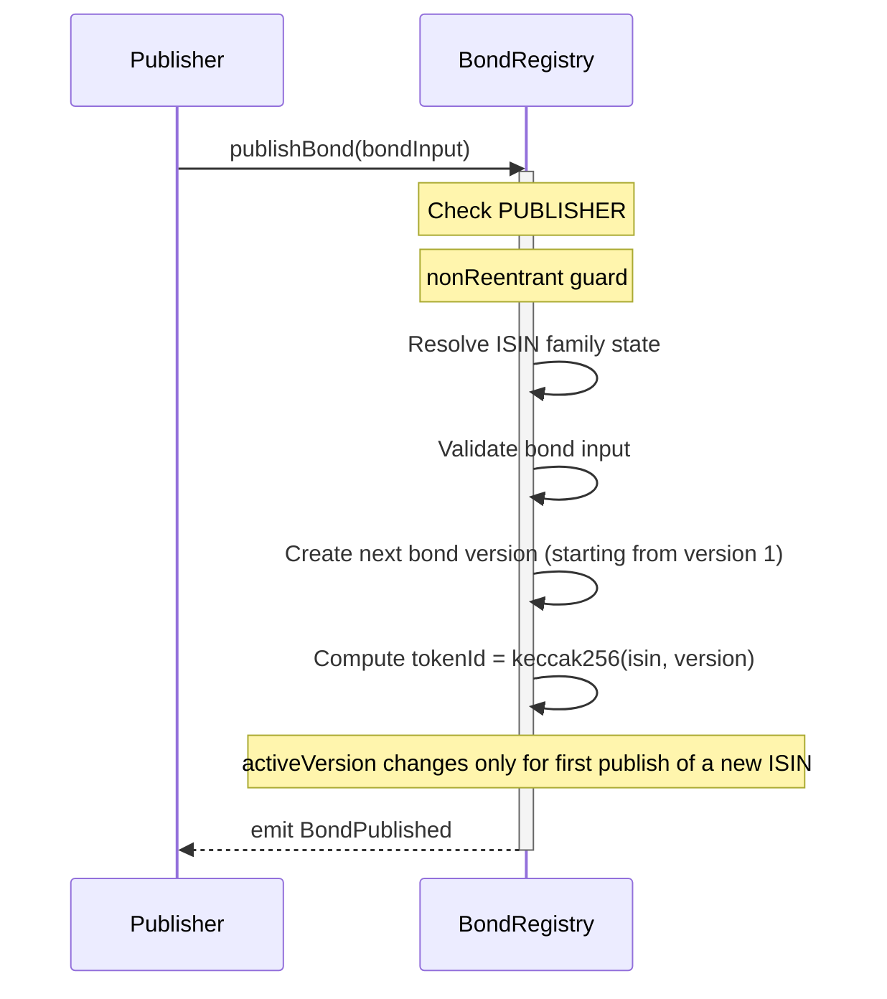
```mermaid
sequenceDiagram
    participant Publisher
    participant BondRegistry

    Publisher->>BondRegistry: publishBond(bondInput)
    activate BondRegistry
    Note over BondRegistry: Check PUBLISHER
    Note over BondRegistry: nonReentrant guard

    BondRegistry->>BondRegistry: Resolve ISIN family state
    BondRegistry->>BondRegistry: Validate bond input
    BondRegistry->>BondRegistry: Create next bond version (starting from version 1)
    BondRegistry->>BondRegistry: Compute tokenId = keccak256(isin, version)
    Note over BondRegistry: activeVersion changes only for first publish of a new ISIN

    BondRegistry-->>Publisher: emit BondPublished
    deactivate BondRegistry
```

### updatePublishedBond(BondInput calldata bondInput, uint8 version)

Amends an already-created unpublished bond version in place.

**Prerequisites:**
- Caller must have `PUBLISHER`
- Target version must be in `Published` status
- BondInput data must be valid
- If `bondInput.currency` differs from the stored currency, the new currency must be allowed
- `bondInput.isGuaranteed` must match the value stored when that version was published

**Parameters:**
- `bondInput`: Same as `publishBond`
- `version`: Exact unpublished version to amend

**Events:**
- `PublishedBondUpdated(bytes12 isin, uint8 version, address publisher, address issuer, uint256 tokenId, address tokenAddress, bytes3 currency, uint256 bondNominalValue, uint256 maxSupply, uint256 maturityDate, CouponFrequency couponFrequency, CouponRateType couponRateType, bool isGuaranteed, uint16 issuanceCountry)`: Updated bond snapshot

**Errors:**
- `BondRegistry__InvalidBondStatus(bytes12)`: When the target version is not in `Published` status, including unregistered or already-issued versions
- `BondRegistry__GuaranteeStatusImmutable(bytes12)`: When attempting to change `isGuaranteed`
- Same validation errors as `publishBond`

**Notes:**
- This does not create a successor version
- This does not change `activeVersion`
- Removing a currency from the allowlist does not block amendments that keep a published bond's existing currency unchanged
- This is only for amending a `Published` draft phase version

**Sequence Diagram:**
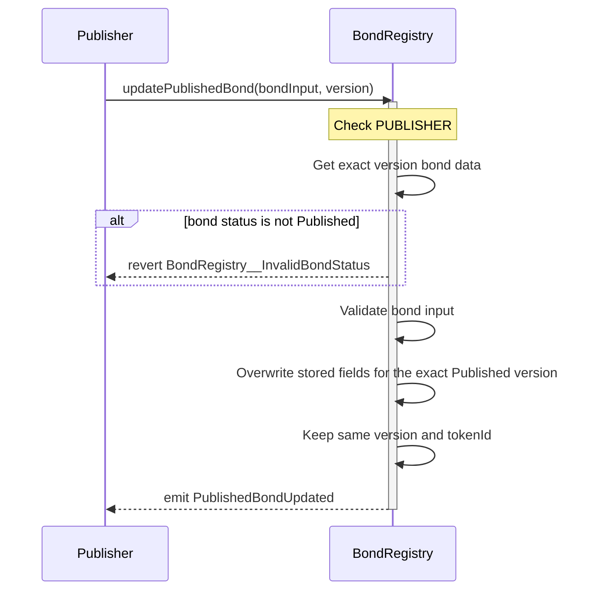
```mermaid
sequenceDiagram
    participant Publisher
    participant BondRegistry

    Publisher->>BondRegistry: updatePublishedBond(bondInput, version)
    activate BondRegistry
    Note over BondRegistry: Check PUBLISHER

    BondRegistry->>BondRegistry: Get exact version bond data

    alt bond status is not Published
        BondRegistry-->>Publisher: revert BondRegistry__InvalidBondStatus
    end

    BondRegistry->>BondRegistry: Validate bond input
    BondRegistry->>BondRegistry: Overwrite stored fields for the exact Published version
    BondRegistry->>BondRegistry: Keep same version and tokenId

    BondRegistry-->>Publisher: emit PublishedBondUpdated
    deactivate BondRegistry
```

### cancelBond(string calldata isin, uint8 version)

Cancels a published bond that has not yet been issued.

**Prerequisites:**
- Caller must have `CANCEL`
- Target version must be in `Published` status
- Target version must have `trancheCount == 0`
- Target version must be the current latest version for the ISIN

**Parameters:**
- `isin`: Bond identifier
- `version`: Exact unpublished version to cancel

**Notes:**
- Cancelling the first unissued version keeps `latestVersion` at the cancelled version and clears `activeVersion`, so the ISIN can be published again only as a later version with a fresh token ID.
- Cancelling an unpublished successor preserves `latestVersion` and leaves the previous issued active version unchanged.
- Cancelled draft versions are never reused, preventing token ID scoped approvals from carrying into a republished replacement bond.

**Events:**
- `BondCancelled(bytes12 indexed isin, uint8 indexed version, address indexed executor)`: Cancellation status transition

**Errors:**
- `BondRegistry__NonExistentBond(bytes12)`: When bond does not exist
- `BondRegistry__InvalidBondStatus(bytes12)`: When bond is not in `Published` status or is not the latest version
- `BondRegistry__BondAlreadyIssued(bytes12)`: When bond already has tranches (`trancheCount > 0`)

**Sequence Diagram:**
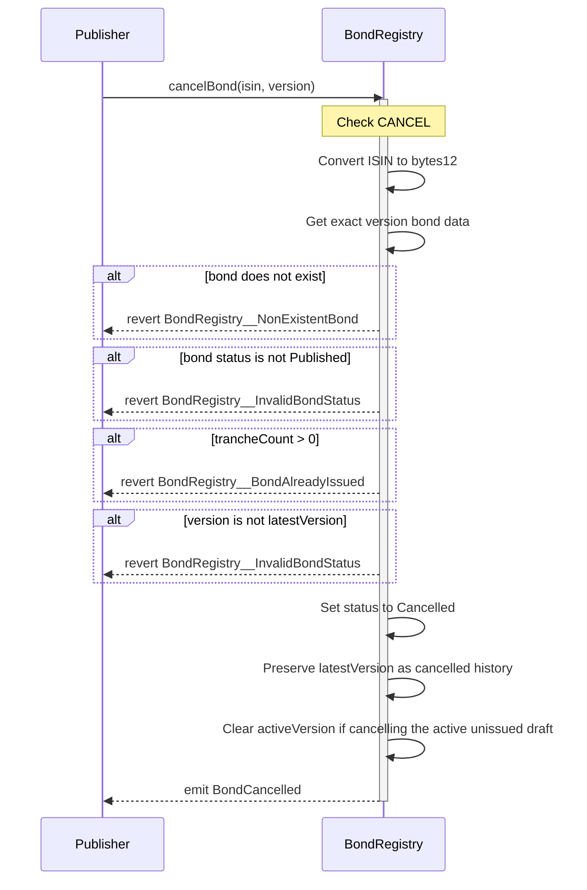
```mermaid
sequenceDiagram
    participant Publisher
    participant BondRegistry

    Publisher->>BondRegistry: cancelBond(isin, version)
    activate BondRegistry
    Note over BondRegistry: Check CANCEL

    BondRegistry->>BondRegistry: Convert ISIN to bytes12
    BondRegistry->>BondRegistry: Get exact version bond data

    alt bond does not exist
        BondRegistry-->>Publisher: revert BondRegistry__NonExistentBond
    end

    alt bond status is not Published
        BondRegistry-->>Publisher: revert BondRegistry__InvalidBondStatus
    end

    alt trancheCount > 0
        BondRegistry-->>Publisher: revert BondRegistry__BondAlreadyIssued
    end

    alt version is not latestVersion
        BondRegistry-->>Publisher: revert BondRegistry__InvalidBondStatus
    end

    BondRegistry->>BondRegistry: Set status to Cancelled
    BondRegistry->>BondRegistry: Preserve latestVersion as cancelled history
    BondRegistry->>BondRegistry: Clear activeVersion if cancelling the active unissued draft

    BondRegistry-->>Publisher: emit BondCancelled
    deactivate BondRegistry
```

### issueBond(string calldata isin, uint8 version, uint256 amount)

Issues one tranche of an exact bond version by minting tokens to the issuer. May be called multiple times on the same version, each call creating a new tranche record.

**Prerequisites:**
- Caller must have `PUBLISHER` role **or** be `bond.issuer`; if caller is `bond.issuer`, the issuer account must be enabled in `EntityRegistry`
- Target version must be in `Published` or `Issued` status
- `issuanceClosed` must be `false`
- `amount` must be greater than zero
- `block.timestamp` must be before `bond.maturityDate`
- `amount` must not exceed `bond.remainingIssuableSupply`

**Parameters:**
- `isin`: Bond identifier
- `version`: Exact version to issue
- `amount`: Number of tokens to mint in this tranche

**Events:**
- `BondIssued(bytes12 indexed isin, uint256 indexed tokenId, uint256 indexed amount, uint16 trancheId, uint8 version, address caller)`: Emitted when a tranche is issued

**Errors:**
- `BondRegistry__NonExistentBond(bytes12)`: When bond does not exist
- `BondRegistry__InvalidBondStatus(bytes12)`: When bond is not in `Published` or `Issued` status
- `BondRegistry__UnauthorizedIssuer(address)`: When caller is neither PUBLISHER nor bond.issuer
- `BondRegistry__IssuerNotEnabled(address)`: When caller is bond.issuer but the issuer account is disabled in EntityRegistry
- `BondRegistry__IssuanceClosed(bytes12)`: When future issuance was permanently closed
- `BondRegistry__IssuanceAmountIsZero()`: When `amount == 0`
- `BondRegistry__MaturityDateExpired()`: When called after maturity date
- `BondRegistry__MaxSupplyExceeded(uint256 amount, uint256 remaining)`: When issuance would exceed `maxSupply`

**Notes:**
- Each call creates exactly one tranche record with `trancheId = trancheCount + 1`
- All tranches share the same `tokenAddress` and `tokenId`
- `Bond.mintedSupply` is updated cumulatively across all tranches and never decreases
- `Bond.remainingIssuableSupply` decreases on issuance and is the operative future-cap check
- First issuance transitions the target version from `Published` to `Issued`
- If the issued version is a newer successor, the previous `activeVersion` is marked `Replaced` and `activeVersion` switches to the newly-issued version

**Sequence Diagram:**
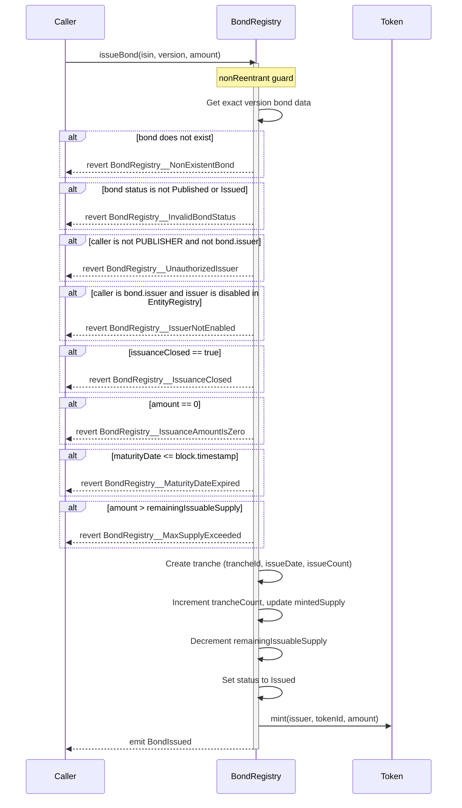
```mermaid
sequenceDiagram
    participant Caller
    participant BondRegistry
    participant Token

    Caller->>BondRegistry: issueBond(isin, version, amount)
    activate BondRegistry
    Note over BondRegistry: nonReentrant guard

    BondRegistry->>BondRegistry: Get exact version bond data

    alt bond does not exist
        BondRegistry-->>Caller: revert BondRegistry__NonExistentBond
    end

    alt bond status is not Published or Issued
        BondRegistry-->>Caller: revert BondRegistry__InvalidBondStatus
    end

    alt caller is not PUBLISHER and not bond.issuer
        BondRegistry-->>Caller: revert BondRegistry__UnauthorizedIssuer
    end

    alt caller is bond.issuer and issuer is disabled in EntityRegistry
        BondRegistry-->>Caller: revert BondRegistry__IssuerNotEnabled
    end

    alt issuanceClosed == true
        BondRegistry-->>Caller: revert BondRegistry__IssuanceClosed
    end

    alt amount == 0
        BondRegistry-->>Caller: revert BondRegistry__IssuanceAmountIsZero
    end

    alt maturityDate <= block.timestamp
        BondRegistry-->>Caller: revert BondRegistry__MaturityDateExpired
    end

    alt amount > remainingIssuableSupply
        BondRegistry-->>Caller: revert BondRegistry__MaxSupplyExceeded
    end

    BondRegistry->>BondRegistry: Create tranche (trancheId, issueDate, issueCount)
    BondRegistry->>BondRegistry: Increment trancheCount, update mintedSupply
    BondRegistry->>BondRegistry: Decrement remainingIssuableSupply
    BondRegistry->>BondRegistry: Set status to Issued

    BondRegistry->>Token: mint(issuer, tokenId, amount)

    BondRegistry-->>Caller: emit BondIssued
    deactivate BondRegistry
```

### closeIssuance(string calldata isin, uint8 version)

Permanently disables future tranches for a bond without affecting already-issued live supply.

**Prerequisites:**
- Caller must be `bond.issuer` or have `PUBLISHER`; if caller is `bond.issuer`, the issuer account must be enabled in `EntityRegistry`
- Target version must be in `Issued` or `Suspended` status; unissued `Published` versions should be cancelled instead
- `issuanceClosed` must currently be `false`

**Events:**
- `BondIssuanceClosed(bytes12 indexed isin, uint8 indexed version, address indexed caller)`

**Errors:**
- `BondRegistry__InvalidBondStatus(bytes12)`: When bond is not in a closeable issuance state
- `BondRegistry__UnauthorizedIssuanceCloser(address)`: When caller is neither issuer nor publisher
- `BondRegistry__IssuerNotEnabled(address)`: When caller is bond.issuer but the issuer account is disabled in EntityRegistry
- `BondRegistry__IssuanceClosed(bytes12)`: When issuance is already closed

### rotateIssuer(string calldata isin, uint8 version, address newIssuer, bytes32 reason)

Rotates the stored issuer for an exact bond version during exceptional recovery, for example when the current issuer wallet is disabled, compromised, or operationally unavailable. This updates registry metadata only, already-minted balances and marketplace positions remain separate recovery surfaces handled by token force-transfer, burn, freeze, or seizure workflows.

**Prerequisites:**
- Caller must have `ISSUER_RECOVERY`; in production this role should be held only by `TimelockController`
- Target version must exist and be in `Published`, `Issued`, `Suspended`, or `Replaced` status
- `newIssuer` must be non-zero, different from the current issuer, and enabled in `EntityRegistry`
- `reason` must be non-zero
- The current issuer is not required to be disabled on-chain, timelock governance is responsible for validating the recovery case before execution

**Parameters:**
- `isin`: Bond ISIN
- `version`: Exact bond version whose issuer is rotated
- `newIssuer`: Enabled replacement issuer wallet
- `reason`: Operator reason code recorded in the event

**Events:**
- `BondIssuerRotated(bytes12 indexed isin, uint8 version, address indexed oldIssuer, address indexed newIssuer, bytes32 reason, address caller)`

**Errors:**
- `BondRegistry__NonExistentBond(bytes12)`: When the exact version does not exist
- `BondRegistry__InvalidBondStatus(bytes12)`: When the bond is `Cancelled`, `Redeemed`, or otherwise not recoverable
- `ZeroAddress()`: When `newIssuer` is zero
- `BondRegistry__IssuerUnchanged(address)`: When `newIssuer` is already the stored issuer
- `BondRegistry__ZeroReason()`: When `reason` is zero
- `BondRegistry__IssuerNotEnabled(address)`: When `newIssuer` is not enabled in `EntityRegistry`

**Sequence Diagram:**
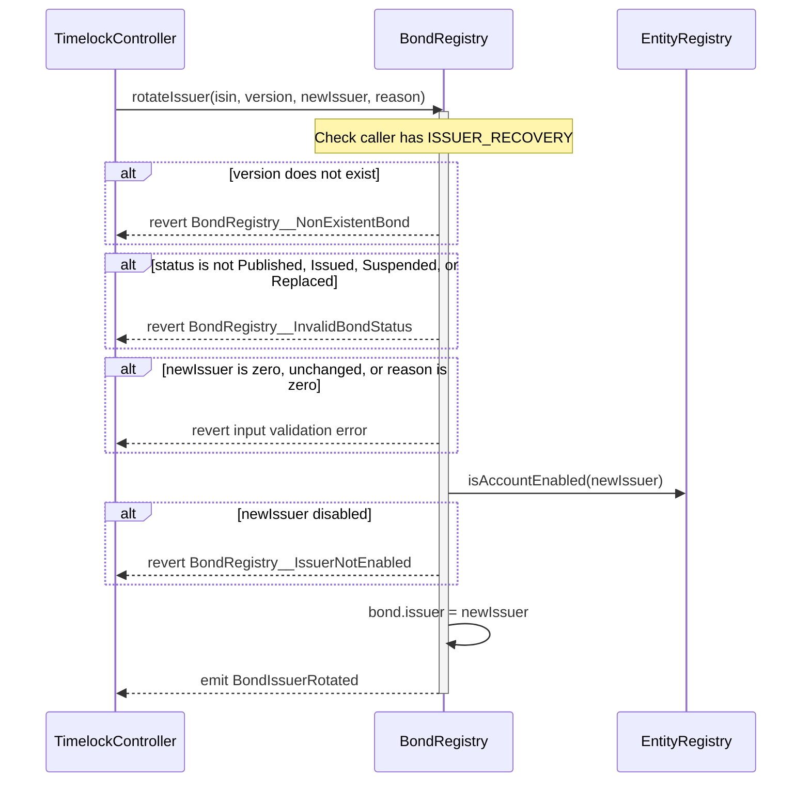
```mermaid
sequenceDiagram
    participant Recovery as TimelockController
    participant BondRegistry
    participant EntityRegistry

    Recovery->>BondRegistry: rotateIssuer(isin, version, newIssuer, reason)
    activate BondRegistry
    Note over BondRegistry: Check caller has ISSUER_RECOVERY

    alt version does not exist
        BondRegistry-->>Recovery: revert BondRegistry__NonExistentBond
    end

    alt status is not Published, Issued, Suspended, or Replaced
        BondRegistry-->>Recovery: revert BondRegistry__InvalidBondStatus
    end

    alt newIssuer is zero, unchanged, or reason is zero
        BondRegistry-->>Recovery: revert input validation error
    end

    BondRegistry->>EntityRegistry: isAccountEnabled(newIssuer)
    alt newIssuer disabled
        BondRegistry-->>Recovery: revert BondRegistry__IssuerNotEnabled
    end

    BondRegistry->>BondRegistry: bond.issuer = newIssuer
    BondRegistry-->>Recovery: emit BondIssuerRotated
    deactivate BondRegistry
```

### burnBond(bytes12 isin, uint8 version, address from, uint256 amount, BurnKind kind)

Burns supply for an exact bond version through the registry and applies the matching bond-level accounting.

**Prerequisites:**
- For `ISSUER_RECLAIM`:
  - target version must be `Issued`
  - caller must equal `bond.issuer`
  - issuer account must be enabled in `EntityRegistry`
  - `from` must equal `bond.issuer`
  - `amount` must not exceed the issuer's unfrozen balance for this token ID
- For `FINAL_SETTLEMENT`:
  - target version must be `Issued` or `Replaced`
  - issuer identity path: caller equals `bond.issuer`, issuer must be enabled in `EntityRegistry`, and `from` must equal `bond.issuer`
  - role-based path: caller must have `BURNER` and be enabled in `EntityRegistry`

**Events:**
- `BondBurned(bytes12 indexed isin, uint8 version, address indexed from, uint256 indexed amount, BurnKind kind, address caller)`

**Errors:**
- `BondRegistry__InvalidBondStatus(bytes12)`: When bond is not burnable
- `BondRegistry__UnauthorizedBurnCaller(address, uint8)`: When caller is not authorized for the requested burn kind
- `BondRegistry__IssuerNotEnabled(address)`: When caller is bond.issuer but the issuer account is disabled in EntityRegistry
- `BondRegistry__InvalidBurnSource(address, bytes12, uint8)`: When `from` is invalid for the requested burn kind
- `BondRegistry__FrozenIssuerReclaimDenied(address, bytes12, uint8, uint256, uint256)`: When `ISSUER_RECLAIM` would consume frozen issuer-held inventory

**Important Notes:**
- `ISSUER_RECLAIM` is limited to unfrozen issuer-held balance of the exact version and increases `remainingIssuableSupply`
- `ISSUER_RECLAIM` does not consume frozen balances; freezer operators must explicitly unfreeze inventory before it can be reclaimed and reissued
- `FINAL_SETTLEMENT` is allowed for both `Issued` and `Replaced` legacy versions
- `FINAL_SETTLEMENT` reduces live token supply only and does not restore issuance headroom
- `FINAL_SETTLEMENT` does not require `BURNER` when an enabled issuer burns only their own balance
- Third-party `BURNER` callers must remain enabled in `EntityRegistry`; disabling the account blocks settlement burns until it is re-enabled
- `mintedSupply` remains cumulative issuance history for both burn kinds

### closeBond(string calldata isin, uint8 version)

Closes an exact bond version by marking it as `Redeemed`. This entrypoint is reserved for principal redemption flow semantics and requires that all tokens have already been burned (`totalSupply == 0`).

**Prerequisites:**
- Caller must have `CLOSE`
- Target version must be in a closeable status
- `totalSupply(bond.tokenId)` must be zero
- If the target is the active version, no later successor may still be pending in `Published` status

**Parameters:**
- `isin`: Bond identifier
- `version`: Exact version to close

**Events:**
- `BondRedeemed(bytes12 indexed isin, uint8 indexed version, address indexed executor)`: Redemption status transition

**Errors:**
- `BondRegistry__NonExistentBond(bytes12)`: When bond does not exist
- `BondRegistry__InvalidBondStatus(bytes12)`: When bond is not in `Issued` or `Suspended` status
- `BondRegistry__TotalSupplyNotZero()`: When token total supply is not zero
- `BondRegistry__SuccessorAlreadyPublished(bytes12)`: When closing the active version while a later successor is still pending in `Published`

**Sequence Diagram:**
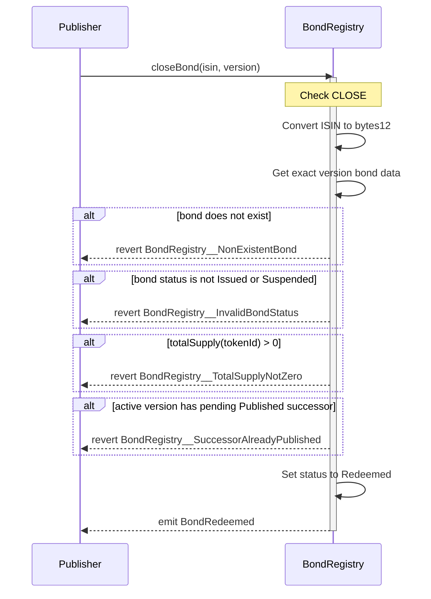
```mermaid
sequenceDiagram
    participant Publisher
    participant BondRegistry

    Publisher->>BondRegistry: closeBond(isin, version)
    activate BondRegistry
    Note over BondRegistry: Check CLOSE

    BondRegistry->>BondRegistry: Convert ISIN to bytes12
    BondRegistry->>BondRegistry: Get exact version bond data

    alt bond does not exist
        BondRegistry-->>Publisher: revert BondRegistry__NonExistentBond
    end

    alt bond status is not Issued or Suspended
        BondRegistry-->>Publisher: revert BondRegistry__InvalidBondStatus
    end

    alt totalSupply(tokenId) > 0
        BondRegistry-->>Publisher: revert BondRegistry__TotalSupplyNotZero
    end

    alt active version has pending Published successor
        BondRegistry-->>Publisher: revert BondRegistry__SuccessorAlreadyPublished
    end

    BondRegistry->>BondRegistry: Set status to Redeemed

    BondRegistry-->>Publisher: emit BondRedeemed
    deactivate BondRegistry
```

### suspendBond(string calldata isin, uint8 version)

Suspends an issued bond and pauses its token ID.

**Prerequisites:**
- Caller must have `SUSPEND`
- Bond must be in `Issued` status

`suspendBond` can be executed while the token contract is globally paused. The underlying token-id pause is an additional restriction and remains available during emergency lockdown.

**Parameters:**
- `isin`: Bond identifier
- `version`: Exact version to suspend

**Events:**
- `BondSuspended(bytes12 indexed isin, uint8 indexed version, address indexed executor)`: Suspension status transition

**Errors:**
- `BondRegistry__NonExistentBond(bytes12)`: When bond does not exist
- `BondRegistry__InvalidBondStatus(bytes12)`: When bond is not in `Issued` status

**Sequence Diagram:**
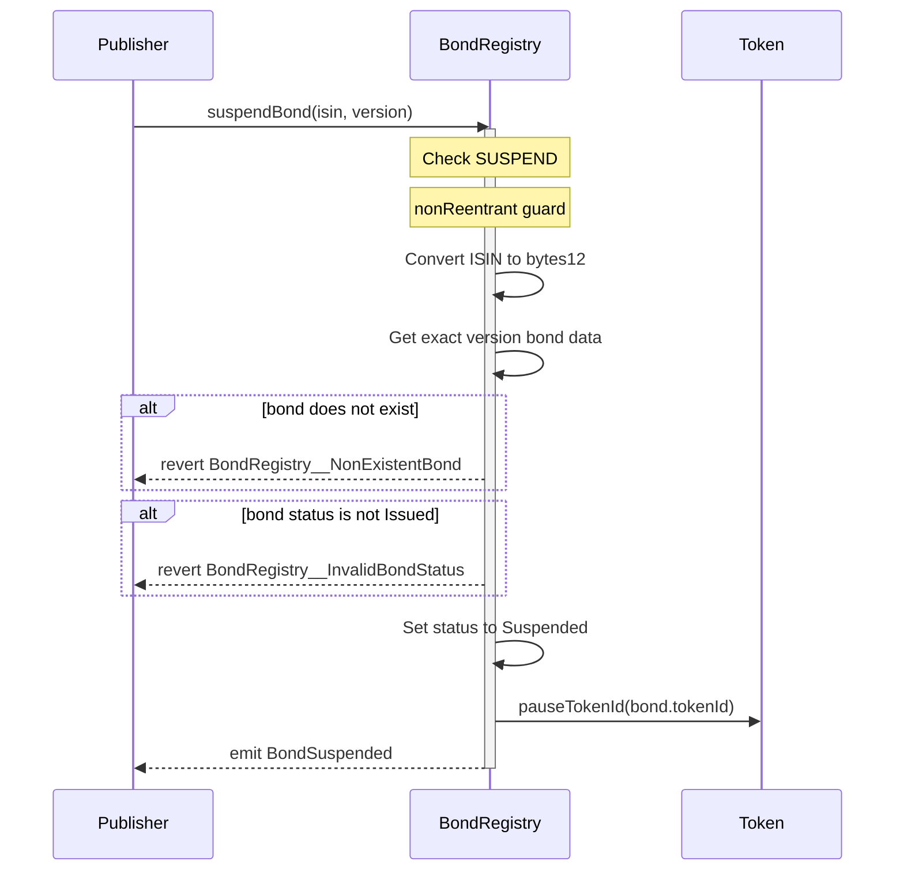
```mermaid
sequenceDiagram
    participant Publisher
    participant BondRegistry
    participant Token

    Publisher->>BondRegistry: suspendBond(isin, version)
    activate BondRegistry
    Note over BondRegistry: Check SUSPEND
    Note over BondRegistry: nonReentrant guard

    BondRegistry->>BondRegistry: Convert ISIN to bytes12
    BondRegistry->>BondRegistry: Get exact version bond data

    alt bond does not exist
        BondRegistry-->>Publisher: revert BondRegistry__NonExistentBond
    end

    alt bond status is not Issued
        BondRegistry-->>Publisher: revert BondRegistry__InvalidBondStatus
    end

    BondRegistry->>BondRegistry: Set status to Suspended

    BondRegistry->>Token: pauseTokenId(bond.tokenId)

    BondRegistry-->>Publisher: emit BondSuspended
    deactivate BondRegistry
```

### unsuspendBond(string calldata isin, uint8 version)

Unsuspends a suspended bond and unpauses its token ID.

**Prerequisites:**
- Caller must have `UNSUSPEND`
- Bond must be in `Suspended` status
- Token contract must not be globally paused

**Parameters:**
- `isin`: Bond identifier
- `version`: Exact version to unsuspend

**Events:**
- `BondUnsuspended(bytes12 indexed isin, uint8 indexed version, address indexed executor)`: Unsuspension status transition

**Errors:**
- `BondRegistry__NonExistentBond(bytes12)`: When bond does not exist
- `BondRegistry__InvalidBondStatus(bytes12)`: When bond is not in `Suspended` status
- `PausableUpgradeable.EnforcedPause()`: When the token contract is globally paused

**Sequence Diagram:**
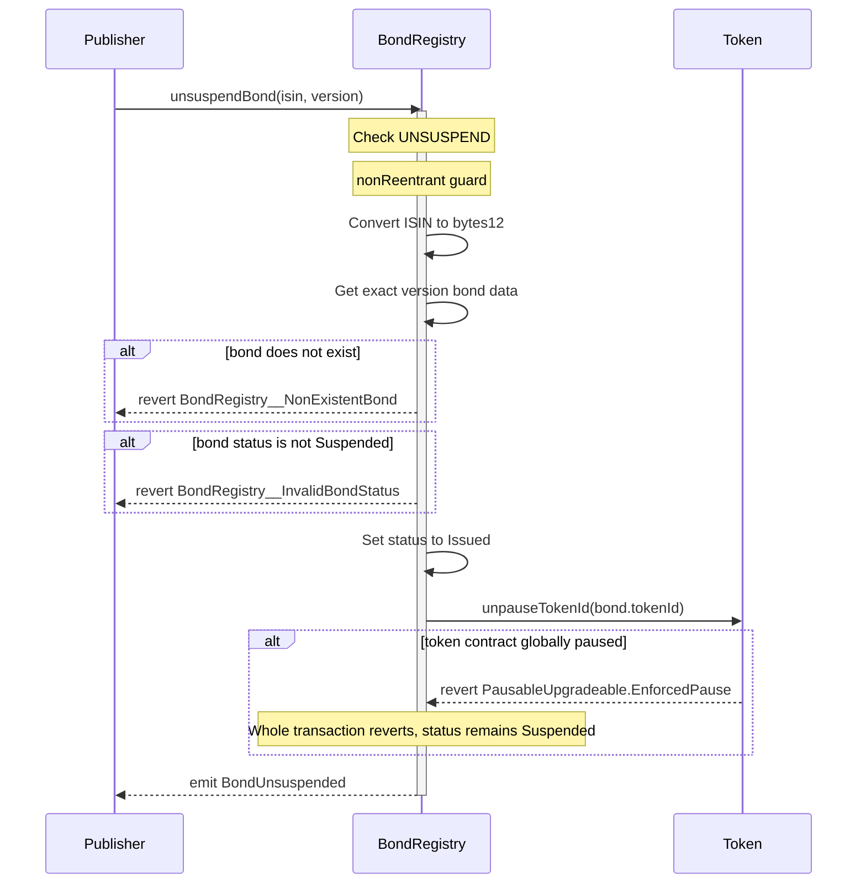
```mermaid
sequenceDiagram
    participant Publisher
    participant BondRegistry
    participant Token

    Publisher->>BondRegistry: unsuspendBond(isin, version)
    activate BondRegistry
    Note over BondRegistry: Check UNSUSPEND
    Note over BondRegistry: nonReentrant guard

    BondRegistry->>BondRegistry: Convert ISIN to bytes12
    BondRegistry->>BondRegistry: Get exact version bond data

    alt bond does not exist
        BondRegistry-->>Publisher: revert BondRegistry__NonExistentBond
    end

    alt bond status is not Suspended
        BondRegistry-->>Publisher: revert BondRegistry__InvalidBondStatus
    end

    BondRegistry->>BondRegistry: Set status to Issued

    BondRegistry->>Token: unpauseTokenId(bond.tokenId)

    alt token contract globally paused
        Token-->>BondRegistry: revert PausableUpgradeable.EnforcedPause
        Note over BondRegistry: Whole transaction reverts, status remains Suspended
    end

    BondRegistry-->>Publisher: emit BondUnsuspended
    deactivate BondRegistry
```

### setAllowedCurrency(string calldata currencyCode, bool allowed)

Sets the allowed status for a given currency code.

**Prerequisites:**
- Caller must have `CURRENCY`

**Parameters:**
- `currencyCode`: Currency code (ISO 4217-style, exactly 3 uppercase ASCII letters)
- `allowed`: True to enable, false to disable

**Events:**
- `AllowedCurrencyUpdated(bytes3 currency, bool allowed, address changedBy)`: Emitted when currency is updated

**Errors:**
- `StringExtensions__InvalidBytesLength()`: When the currency code is not exactly 3 bytes
- `StringExtensions__NonAsciiCharacter()`: When the currency code contains a byte outside 7-bit ASCII
- `StringExtensions__InvalidCharacter()`: When the currency code contains control characters, lowercase letters, digits, punctuation, or other ASCII bytes outside `A-Z`

**Notes:**
- This allowlist controls currencies in which new bonds may be denominated or changed into.
- Disabling a currency does not retroactively invalidate published bond versions that already store that currency.
- Marketplace settlement/pricing currencies are configured separately in `Marketplace`; deployments must coordinate both lists according to the intended market configuration.

**Sequence Diagram:**
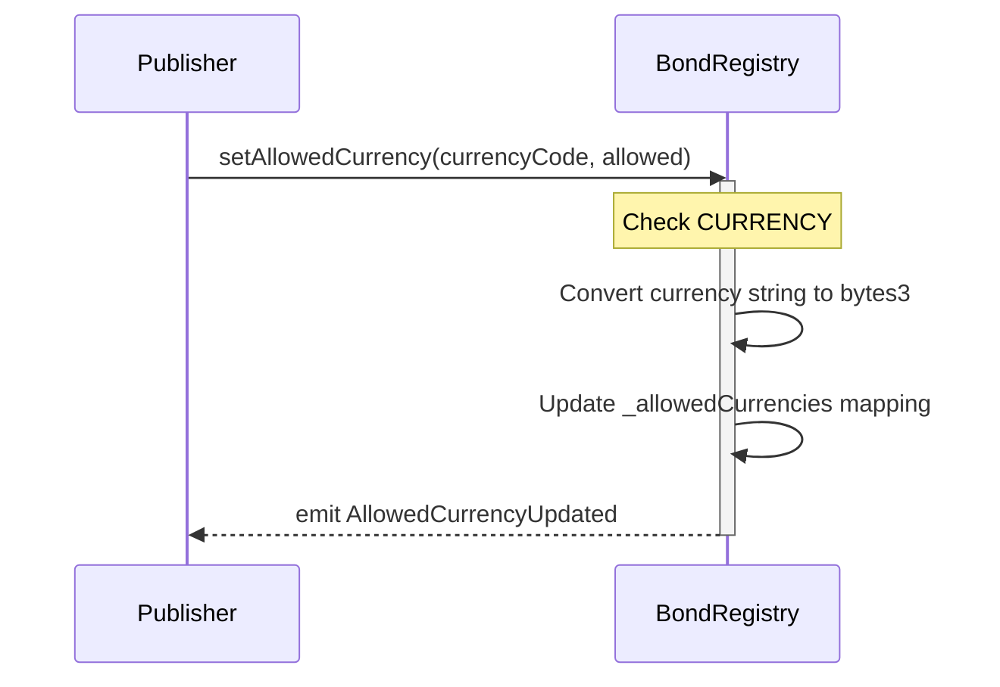
```mermaid
sequenceDiagram
    participant Publisher
    participant BondRegistry

    Publisher->>BondRegistry: setAllowedCurrency(currencyCode, allowed)
    activate BondRegistry
    Note over BondRegistry: Check CURRENCY

    BondRegistry->>BondRegistry: Convert currency string to bytes3
    BondRegistry->>BondRegistry: Update _allowedCurrencies mapping

    BondRegistry-->>Publisher: emit AllowedCurrencyUpdated
    deactivate BondRegistry
```

### appendScoring(address wallet, Scoring calldata scoring)

Appends an issuer scoring record for a wallet.

**Prerequisites:**
- Caller must have `SCORING`
- `wallet` must not be zero
- `scoring.issueDate` must be non-zero
- `scoring.expirationDate` must be greater than `scoring.issueDate`
- `scoring.distributorId` must not be zero
- `scoring.defaultProbabilityBps` must be at most `10_000`

**Parameters:**
- `wallet`: Wallet whose issuer scoring history is being extended
- `scoring`: Scoring record containing default probability in basis points, issue/expiration timestamps, and distributor identifier

**Events:**
- `ScoringAppended(address indexed wallet, uint256 indexed scoringId, uint16 defaultProbabilityBps, uint64 issueDate, uint64 expirationDate, bytes32 distributorId, address indexed caller)`: Emitted when a scoring record is appended

**Errors:**
- `ZeroAddress()`: When `wallet` is zero
- `BondRegistry__ScoringZeroIssueDate()`: When `issueDate == 0`
- `BondRegistry__ScoringExpirationNotAfterIssue()`: When expiration is not after issue date
- `BondRegistry__ScoringZeroDistributorId()`: When distributor ID is zero
- `BondRegistry__ScoringProbabilityTooHigh(uint16)`: When default probability exceeds `10_000`

**Sequence Diagram:**
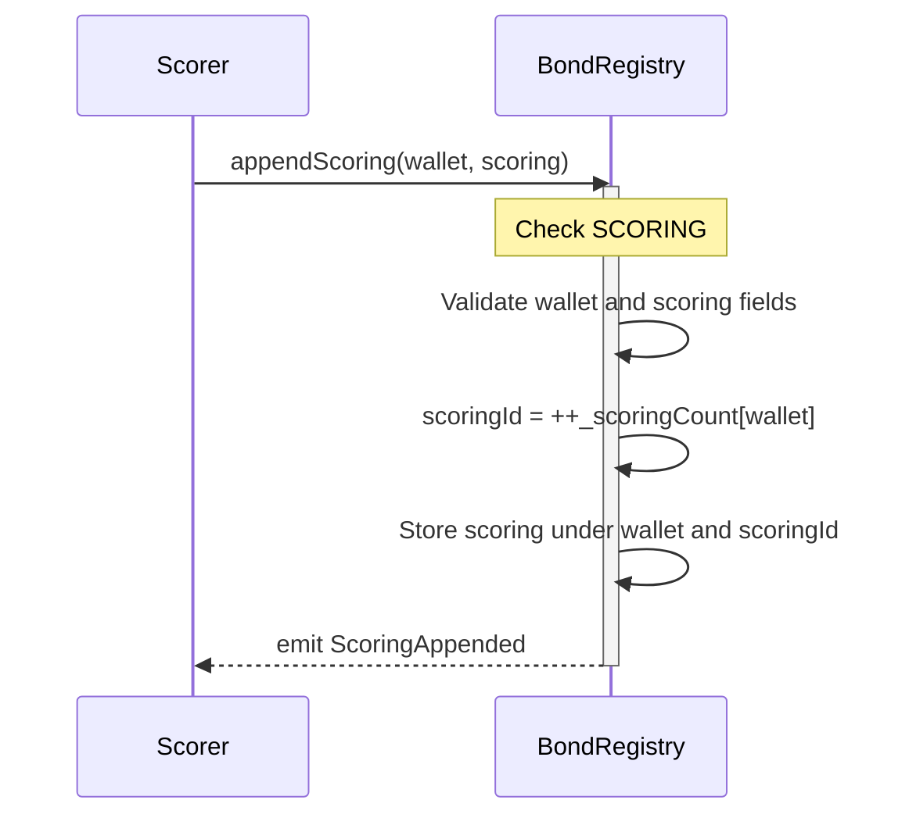
```mermaid
sequenceDiagram
    participant Scorer
    participant BondRegistry

    Scorer->>BondRegistry: appendScoring(wallet, scoring)
    activate BondRegistry
    Note over BondRegistry: Check SCORING

    BondRegistry->>BondRegistry: Validate wallet and scoring fields
    BondRegistry->>BondRegistry: scoringId = ++_scoringCount[wallet]
    BondRegistry->>BondRegistry: Store scoring under wallet and scoringId

    BondRegistry-->>Scorer: emit ScoringAppended
    deactivate BondRegistry
```

## Administrative Functions

### initialize(address owner_)

Initializes the bond registry contract.

**Prerequisites:**
- Contract must not be already initialized

**Parameters:**
- `owner_`: Address that will own the contract

**Sequence Diagram:**
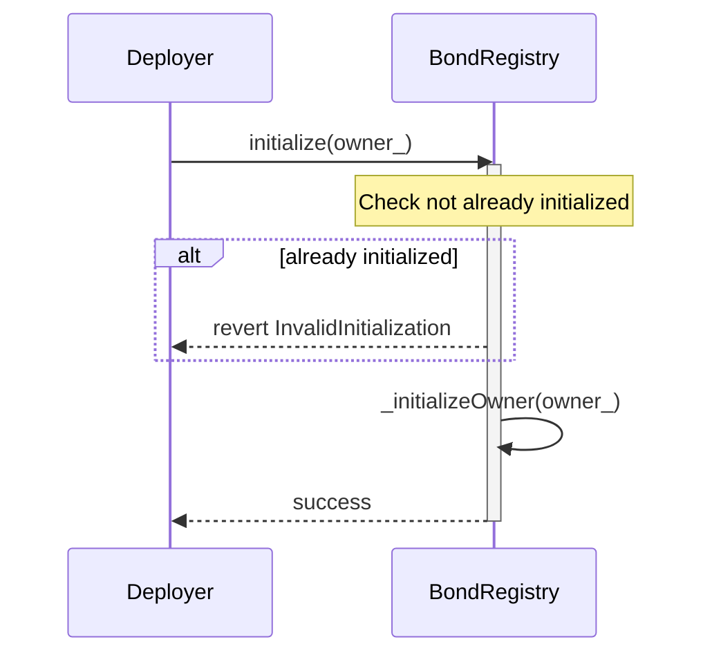
```mermaid
sequenceDiagram
    participant Deployer
    participant BondRegistry

    Deployer->>BondRegistry: initialize(owner_)
    activate BondRegistry
    Note over BondRegistry: Check not already initialized

    alt already initialized
        BondRegistry-->>Deployer: revert InvalidInitialization
    end

    BondRegistry->>BondRegistry: _initializeOwner(owner_)

    BondRegistry-->>Deployer: success
    deactivate BondRegistry
```

### setMultiToken(address multiToken)

Sets the shared ERC-6909 token contract where all bond tokens are minted.

**Prerequisites:**
- Caller must be owner
- Token contract address must not be zero
- Token contract must implement `IBaseToken` and point back to this `BondRegistry`
- Shared token contract must not have been set before

**Parameters:**
- `multiToken`: Address of the ERC-6909 token contract

**Errors:**
- `ZeroAddress()`: When token contract address is zero
- `BondRegistry__InvalidMultiToken(address)`: When the token does not implement `IBaseToken` or does not point back to this `BondRegistry`
- `BondRegistry__MultiTokenLocked()`: When the shared token contract was already set

**Events:**
- `MultiTokenSet(address previousMultiToken, address multiToken)`: Dependency update event

**Notes:**
- `setMultiToken(...)` is a one-time deployment wiring function. After the first successful call, the token dependency is locked and future calls revert with `BondRegistry__MultiTokenLocked()`.

**Sequence Diagram:**
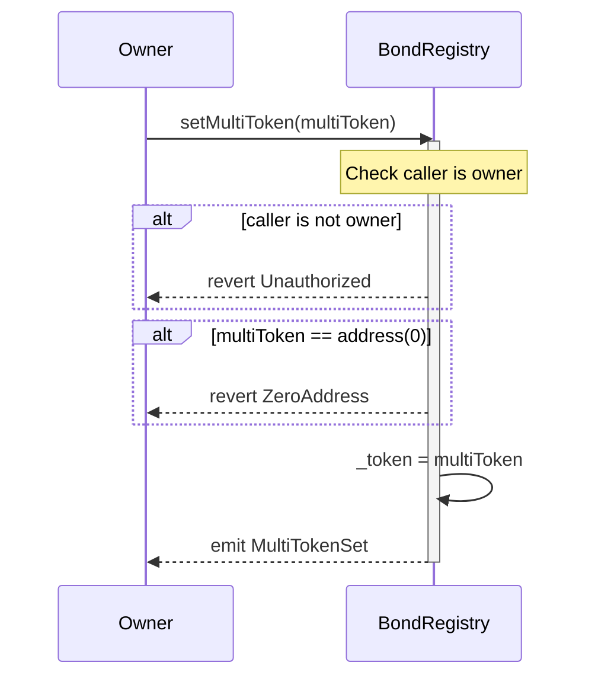
```mermaid
sequenceDiagram
    participant Owner
    participant BondRegistry

    Owner->>BondRegistry: setMultiToken(multiToken)
    activate BondRegistry
    Note over BondRegistry: Check caller is owner

    alt caller is not owner
        BondRegistry-->>Owner: revert Unauthorized
    end

    alt multiToken == address(0)
        BondRegistry-->>Owner: revert ZeroAddress
    end

    BondRegistry->>BondRegistry: _token = multiToken

    BondRegistry-->>Owner: emit MultiTokenSet
    deactivate BondRegistry
```

### grantRoles(address user, uint256 roles)

Grants roles to a user. Only BondRegistry role bits are valid.

**Prerequisites:**
- Caller must be owner
- Only `PUBLISHER | CANCEL | CLOSE | CURRENCY | SUSPEND | UNSUSPEND | BURNER | SCORING | ISSUER_RECOVERY` are valid

**Errors:**
- `InvalidRoles()`: When attempting to grant invalid roles

**Sequence Diagram:**
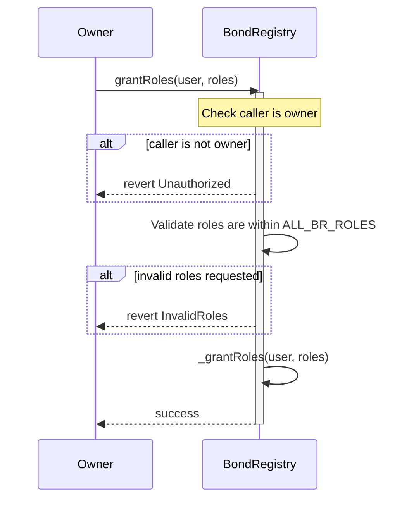
```mermaid
sequenceDiagram
    participant Owner
    participant BondRegistry

    Owner->>BondRegistry: grantRoles(user, roles)
    activate BondRegistry
    Note over BondRegistry: Check caller is owner

    alt caller is not owner
        BondRegistry-->>Owner: revert Unauthorized
    end

    BondRegistry->>BondRegistry: Validate roles are within ALL_BR_ROLES

    alt invalid roles requested
        BondRegistry-->>Owner: revert InvalidRoles
    end

    BondRegistry->>BondRegistry: _grantRoles(user, roles)

    BondRegistry-->>Owner: success
    deactivate BondRegistry
```

## View Functions

### bondStatus(string calldata isin) / bondStatus(bytes12 isin)

Get bond status by ISIN. ISIN-only getters resolve `activeVersion`.

**Returns:**
- `BondStatus`: The current status of the bond (returns `Unregistered` for non-existent bonds)

### getBond(string calldata isin) / getBond(bytes12 isin)

Get the currently active bond data for a given ISIN.

**Returns:**
- `Bond`: The bond struct, including immutable `isGuaranteed` metadata

**Errors:**
- `BondRegistry__NonExistentBond(bytes12)`: When bond does not exist

### getBondAtVersion(bytes12 isin, uint8 version)

Get bond data at a specific version.

**Returns:**
- `Bond`: The bond struct at the specified version, including immutable `isGuaranteed` metadata

**Errors:**
- `BondRegistry__NonExistentBond(bytes12)`: When version does not exist

### getTranche(bytes12 isin, uint16 trancheId)

Get a specific tranche record by tranche ID on the active version for the given ISIN.

**Returns:**
- `Tranche`: The tranche struct (`issueDate`, `issueCount`)

**Errors:**
- `BondRegistry__NonExistentBond(bytes12)`: When bond does not exist
- `BondRegistry__InvalidTrancheId(uint16)`: When tranche ID is out of range

### getTranche(bytes12 isin) / getTranche(string calldata isin)

Convenience getter — returns tranche `1` (the first issuance). Useful for the common single-tranche workflow.

**Returns:**
- `Tranche`: The first tranche struct

**Errors:**
- `BondRegistry__NonExistentBond(bytes12)`: When bond does not exist
- `BondRegistry__InvalidTrancheId(uint16)`: When no tranches exist yet

### getLatestTranche(bytes12 isin)

Get the most recently created tranche record.

**Returns:**
- `Tranche`: The tranche with `trancheId == trancheCount`

**Errors:**
- `BondRegistry__NonExistentBond(bytes12)`: When bond does not exist
- `BondRegistry__InvalidTrancheId(uint16)`: When no tranches exist yet

### getTrancheCount(bytes12 isin)

Get the number of tranches issued for a bond.

**Returns:**
- `uint16`: The number of tranches (0 if not yet issued)

**Errors:**
- `BondRegistry__NonExistentBond(bytes12)`: When bond does not exist

### Bond metadata fields

Read coupon frequency, coupon rate type, currency, bond nominal value, issuance country, and maturity date through
`getBond(bytes12 isin)`, `getBond(string calldata isin)`, `getBondAtVersion(bytes12 isin, uint8 version)`, or
`getBondByTokenId(uint256 tokenId)`. `BondRegistry` intentionally does not expose separate single-field getters for
these fields.

### getToken()

Get the shared ERC-6909 token contract address.

**Returns:**
- `address`: The token contract address

### getTranche(bytes12 isin, uint8 version, uint16 trancheId)

Get a specific tranche record for an exact bond version.

### getTokenId(string calldata isin)

Get the ERC-6909 token ID for the active version of a bond family identified by its ISIN.

**Returns:**
- `uint256`: The token ID used in the shared ERC-6909 token contract

### getBondByTokenId(uint256 tokenId)

Reverse lookup: resolve the `Bond` record from a token ID. The reverse-index is written when a bond is published, so historical versions remain resolvable through their own token IDs.

**Returns:**
- `Bond`: The bond struct associated with the given token ID, including immutable `isGuaranteed` metadata

**Errors:**
- `BondRegistry__NonExistentBond(bytes12)`: When no ISIN is registered for the given token ID

### getBondSeriesByTokenId(uint256 tokenId)

Reverse lookup: resolve the `(isin, version)` pair for a token ID.

**Returns:**
- `bytes12 isin`: ISIN family linked to the token ID
- `uint8 version`: Exact bond version linked to the token ID

**Errors:**
- `BondRegistry__NonExistentBond(bytes12)`: When no bond version is registered for the given token ID

### getActiveVersion(bytes12 isin)

Get the current active version for an ISIN family.

**Returns:**
- `uint8`: Active version number, or `0` when the ISIN has not been registered

### getLatestVersion(bytes12 isin)

Get the latest published version number for an ISIN family.

**Returns:**
- `uint8`: Latest version number, or `0` when the ISIN has not been registered

### getCurrentCouponRate(bytes12 isin)

Get the coupon rate applicable to a bond at the current `block.timestamp`.

**Returns:**
- `uint256`: Current applicable coupon rate in basis points (0 for `ZERO_COUPON` bonds, unissued bonds, timestamps before the first checkpoint, or timestamps at/after maturity)

### getCurrentCouponRateForBond(Bond calldata bond)

Same as `getCurrentCouponRate(isin)` but operates on a caller-supplied `Bond` struct, avoiding a redundant storage load.

**Returns:**
- `uint256`: Current applicable coupon rate in basis points (0 for `ZERO_COUPON` bonds, unissued bonds, timestamps before the first checkpoint, or timestamps at/after maturity)

### getAllCouponRates(string calldata isin)

Get all coupon rate checkpoints for the specified ISIN.

**Returns:**
- `uint256[] memory paymentTimestamps`: Array of timestamp checkpoints
- `uint256[] memory rates`: Array of corresponding rates in basis points

### getCouponRatesLength(string calldata isin)

Get the number of coupon rate checkpoints.

**Returns:**
- `uint256`: The length of the coupon rates arrays

### getCouponRateAt(string calldata isin, uint256 paymentTimestamp)

Get the coupon rate applicable at a specific timestamp using binary search.

**Returns:**
- `uint256`: The applicable rate in basis points (0 if before first checkpoint or at/after maturity)

### getLatestCouponRate(string calldata isin)

Get the latest non-zero coupon rate (the rate at the second-to-last checkpoint).

**Returns:**
- `uint256`: The latest coupon rate in basis points

### getScoringCount(address wallet)

Get the number of scoring records stored for a wallet.

**Returns:**
- `uint256`: Number of scoring records

### getScoringAt(address wallet, uint256 scoringId)

Get a specific scoring record by wallet-local scoring ID.

**Returns:**
- `Scoring`: Stored scoring record

**Errors:**
- `BondRegistry__InvalidScoringId(address wallet, uint256 scoringId)`: When `scoringId` is zero or greater than the wallet's scoring count

### getLatestScoring(address wallet)

Get the latest scoring record for a wallet.

**Returns:**
- `Scoring`: Most recently appended scoring record

**Errors:**
- `BondRegistry__ScoringNotFound(address wallet)`: When the wallet has no scoring records

### isCurrencyAllowed(string memory currencyCode)

Checks whether the specified currency is allowed.

**Parameters:**
- `currencyCode`: Currency code to check (ISO 4217-style, exactly 3 uppercase ASCII letters)

**Returns:**
- `bool`: True if currency is allowed

**Errors:**
- `StringExtensions__InvalidBytesLength()`: When the currency code is not exactly 3 bytes
- `StringExtensions__NonAsciiCharacter()`: When the currency code contains a byte outside 7-bit ASCII
- `StringExtensions__InvalidCharacter()`: When the currency code contains control characters, lowercase letters, digits, punctuation, or other ASCII bytes outside `A-Z`

### supportsInterface(bytes4 interfaceId)

ERC-165 interface detection.

**Returns:**
- `bool`: True if `IBondRegistry` or `IERC165` interface is supported
