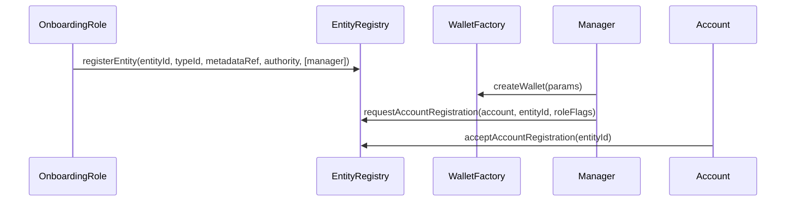

# EntityRegistry Documentation

## Overview
`EntityRegistry` is the canonical registry for:
- entity records,
- account records linked to entities,
- per-entity authority and manager permissions,
- token policy hooks (`canTransfer`, `canApprove`).

Wallet deployment is intentionally decoupled and handled by [`WalletFactory`](../wallet/WalletFactory.md).

Marketplace modules that need entity eligibility checks use [`EntityEligibilityGuard`](EntityEligibilityGuard.md) against this registry.

## Prerequisites
- Contract is deployed behind Beacon and initialized with governance owner.
- Roles are assigned according to operational split (`ENTITY_TYPE_MANAGER`, `ONBOARDING`, `GUARD`, `WALLET_TRANSFER`), with `ADMIN_ROLE` used as protocol-level override where applicable.
- Entities are registered before account registration.

## Contract Architecture
`EntityRegistry` inherits:
- `IEntityRegistry`
- `EntityRegistryStorage`
- `OwnableRolesExtension`
- `Initializable`

Key architecture decisions:
- Entity registration and wallet deployment are split across contracts.
- EntityRegistry tracks entity-account linkage and lifecycle status only.
- Entity types can be frozen permanently once their meaning should become enum-like.
- Entity/account indexes use swap-and-pop for O(1) removals.
- Role grant/revoke is owner-only, and granted role masks are validated against `ALL_ROLES`.

## Data Model

### Entity
Each entity is keyed by `entityId` and stores:
- `typeId`
- `status` (`NONE`, `DISABLED`, `ENABLED`)
- `statusReason` (bytes, last status change reason code — empty at registration)
- `metadataRef`
- `accounts[]`

### Account
Each account record stores:
- `entityId`
- `status` (`NONE`, `DISABLED`, `ENABLED`)
- `statusReason` (bytes, last status change reason code — empty at registration)
- `roleFlags` (metadata bitmask)
- `entityAccountIndex` (1-based)

### What account linkage means
Linking an account in `EntityRegistry` means:
- the account is approved to act as part of a specific entity,
- the account can participate in token validation hooks while both the account and entity remain enabled,
- the account may carry metadata role flags for offchain or protocol-specific use.

`EntityRegistry` does not manage the ownership lifecycle of linked wallets.  
Wallet ownership and delegated control stay local to the account type itself (for example `CompanyWallet`, multisig, EOA, or smart account).

Account linkage also does not prove that the account was deployed by the linked entity through `WalletFactory`. This is intentional: entities may link EOAs, multisigs, smart accounts, externally deployed wallets, or wallets deployed by a DEUSS operator/admin flow. Entity-manager onboarding requires account-side acceptance before the linkage becomes active; protocol admins retain an immediate registration path for bootstrap and recovery operations.

## Authorization Model

### Global admin (`ADMIN_ROLE`)
Can:
- act as protocol-level override for entity authority governance (`setEntityAuthority`, `setEntityManager`),
- register accounts immediately using the `registerAccount` admin path,
- request account registration using the same pending flow as entity managers.

### Entity type manager (`ENTITY_TYPE_MANAGER`)
Can:
- define entity types (`defineEntityType`),
- freeze entity types (`freezeEntityType`).

### Onboarding operator (`ONBOARDING`)
Can:
- register entities (`registerEntity`, `registerEntityBatch`),
- set entity metadata (`setEntityMetadata`),
- set account role flags (`setAccountRoleFlags`).

### Guard operator (`GUARD`)
Can:
- set entity status (`setEntityStatus`),
- set account status (`setAccountStatus`).

### Wallet transfer operator (`WALLET_TRANSFER`)
Can:
- remove accounts (`removeAccount`),
- transfer accounts between entities (`transferAccountToEntity`).

Production `WALLET_TRANSFER` should be controlled by a multisig and routed through a timelock where operational latency allows. It does not update entity governance mappings. If an account is the authority or has its manager flag enabled for its linked entity, that assignment must be changed first through `setEntityAuthority` or `setEntityManager`.

### Entity-scoped authority
`setEntityAuthority(entityId, authority)` configures entity authority.

Entities registered through the 3-argument `registerEntity(...)` overload or `registerEntityBatch(...)` start with authority unset (`address(0)`). Because `setEntityAuthority(...)` is restricted to the current authority or `ADMIN_ROLE`, the first authority assignment for those entities must be performed by `ADMIN_ROLE`. The `ONBOARDING` role that created the entity cannot complete authority setup unless it also has `ADMIN_ROLE` or uses the 5-argument registration overload.

Authority or admin can:
- update entity authority,
- enable/disable entity managers via `setEntityManager`.

Authorities may be unregistered EOAs for bootstrap flows. If an authority address is already registered as an account, it must be enabled and linked to the same entity before it can be assigned or exercise that entity authority. Disabling, removing, or transferring a registered authority account invalidates its scoped authority assignment; the entity must use `ADMIN_ROLE` or another effective authority to assign authority again. After the account lifecycle is recovered, assigning the same authority address again refreshes the scoped assignment.

### Entity manager
Admin or authority sets managers via `setEntityManager`.

Manager or admin can:
- request account registration for that entity via `requestAccountRegistration`.

Entity managers are trusted to request onboarding within the scope of the entity that appointed them. They are not protocol-level administrators, and requested accounts become active only after the account calls `acceptAccountRegistration(entityId)`.

Managers may be unregistered EOAs to support first-wallet onboarding. If a manager address is already registered as an account, it must be enabled and linked to the same entity before it can be enabled as that entity's manager. Disabling, removing, or transferring a registered manager account invalidates stale scoped manager assignments across entities; the account must be explicitly enabled as manager again after the lifecycle change.

### Owner-only
Owner can:
- grant/revoke roles,

## Core Functions

### defineEntityType(uint256 typeId, bytes32 name, uint256 caps)
Defines or updates entity type metadata.

**Prerequisites:**
- Caller has `ENTITY_TYPE_MANAGER`
- `typeId != 0`
- `name != 0`
- Type is not frozen

**Notes:**
- A non-zero `name` is the canonical marker that an entity type is registered.
- `caps` is optional metadata and does not make an entity type registered by itself.

### freezeEntityType(uint256 typeId)
Freezes an entity type against further updates.

**Prerequisites:**
- Caller has `ENTITY_TYPE_MANAGER`
- Entity type is registered (`name != 0`)

**Notes:**
- Freezing is permanent; there is no unfreeze function.
- A frozen type is treated as enum-like metadata whose meaning should not silently change after entities and accounts have been registered under it.
- Freezing does not disable the entity type and does not prevent new entities or accounts from using it.
- Freezing only prevents future metadata updates through `defineEntityType`.
- To stop a type from being accepted in protocol flows, remove it from module-level allowlists or introduce a separate deprecation/disable mechanism.
- If requirements change, define a new type such as `ENTITY_TYPE_V02` and update protocol/module allowlists and account/entity links according to the migration policy.

### registerEntity(bytes32 entityId, uint256 typeId, string metadataRef)
Registers a single entity with default `ENABLED` status.

**Prerequisites:**
- Caller has `ONBOARDING`
- `entityId != 0`
- `typeId != 0`
- Entity type is registered (`name != 0`)
- Entity not previously registered

**Postconditions:**
- Entity authority remains unset (`address(0)`) until explicitly configured
- No managers are configured by this overload
- Initial authority assignment after this overload requires `ADMIN_ROLE`, because there is no current authority address that can authorize `setEntityAuthority(...)`

### registerEntity(bytes32 entityId, uint256 typeId, string metadataRef, address authority, address[] managers)
Registers a single entity with default `ENABLED` status and bootstraps access control in the same transaction.

**Prerequisites:**
- Caller has `ONBOARDING`
- `entityId != 0`
- `typeId != 0`
- Entity type is registered (`name != 0`)
- `authority != address(0)`
- Every manager in `managers` is non-zero
- Entity not previously registered

**Postconditions:**
- Authority is set for `entityId`
- Every provided manager is enabled (`true`)

### registerEntityBatch(bytes32[] entityIds, uint256[] typeIds, string[] metadataRefs)
Batch wrapper over the basic `registerEntity(bytes32,uint256,string)` overload.

**Prerequisites:**
- Caller has `ONBOARDING`
- All arrays have equal length
- Every entry satisfies basic entity registration rules (`entityId`, `typeId`, uniqueness)

**Notes:**
- This batch function does not set authority or managers.
- Initial authority assignment for each registered entity requires `ADMIN_ROLE`.

### setEntityStatus(bytes32 entityId, EntityStatus status, bytes reason)
Updates entity lifecycle status. Pass empty bytes if no reason code is needed.

**Prerequisites:**
- Caller has `GUARD`
- Entity exists
- `status != NONE`

### setEntityMetadata(bytes32 entityId, string metadataRef)
Updates entity metadata reference.

**Prerequisites:**
- Caller has `ONBOARDING`
- Entity exists and is `ENABLED`

### setEntityAuthority(bytes32 entityId, address authority)
Sets entity authority.

**Prerequisites:**
- `authority != address(0)`
- Caller is current authority or admin
- Entity exists
- New authority differs from the current effective authority, or refreshes the same address after its scoped assignment was invalidated by account lifecycle changes
- When assigning a registered account as authority, the account is `ENABLED` and linked to this entity

**Notes:**
- If the current authority is unset (`address(0)`), only an `ADMIN_ROLE` caller can set the first non-zero authority.
- If the current authority is a registered account, disabling, removing, or transferring that account invalidates the current authority assignment until `ADMIN_ROLE` or another effective authority assigns a replacement or refreshes the recovered same address.

### setEntityManager(bytes32 entityId, address manager, bool enabled)
Enables/disables an entity manager.

**Prerequisites:**
- `manager != address(0)`
- Caller is current authority or admin
- Entity exists
- When enabling a registered account as manager, the account is `ENABLED` and linked to this entity

### registerAccount(address account, bytes32 entityId, uint256 roleFlags)
Immediately registers account under entity through the protocol admin path.

**Prerequisites:**
- `account != address(0)`
- Entity exists and is `ENABLED`
- Caller has `ADMIN_ROLE`
- Account not registered yet

**Notes:**
- This path is intended for bootstrap, protocol-owned accounts, recovery, and migration operations.
- Entity managers must use the pending registration flow instead of this immediate path.

### requestAccountRegistration(address account, bytes32 entityId, uint256 roleFlags)
Creates or updates a pending registration request for `account` to join `entityId`.

**Prerequisites:**
- `account != address(0)`
- Entity exists and is `ENABLED`
- Caller is entity manager or admin
- Account not registered yet

**Events:**
- `AccountRegistrationRequested(account, entityId, roleFlags, requester)`

**Notes:**
- The request does not make the account registered or enabled.
- Pending requests are scoped by `(account, entityId)`, so a request from one entity does not block another entity from requesting onboarding for the same account.
- A later request for the same `(account, entityId)` replaces the previous pending requester and role flags.
- The caller's manager authority is scoped to `entityId`; the function does not require `account` to have been created by that same manager or by `WalletFactory`.
- This supports operator-assisted wallet deployment and externally managed account types, but it makes manager selection and monitoring an entity-level trust boundary.
- If a registered requester relies on manager authority, disabling, removing, or transferring that account invalidates its stale scoped assignment. Reassign the manager explicitly if the same address should keep onboarding after the lifecycle change.

### acceptAccountRegistration(bytes32 entityId)
Accepts a pending registration request for `msg.sender`.

**Prerequisites:**
- Entity exists and is `ENABLED`
- Caller is not already registered
- A pending request exists for `(msg.sender, entityId)`
- Original requester is still an entity manager or admin

**Events:**
- `AccountRegistered(account, entityId, roleFlags)`
- `AccountRegistrationAccepted(account, entityId, roleFlags, requester)`

**Notes:**
- EOAs accept directly.
- Smart accounts and `CompanyWallet` instances accept by executing this call from the account itself.
- Acceptance deletes only the accepted `(account, entityId)` pending request. Other pending requests for the same account remain inactive while the account is registered, and can only be accepted later if the account is removed and the original requester is still authorized.

### setAccountStatus(address account, AccountStatus status, bytes reason)
Updates account status. Pass empty bytes if no reason code is needed.

**Prerequisites:**
- Caller has `GUARD`
- Account exists
- `status != NONE`
- Linked entity is `ENABLED`

### setAccountRoleFlags(address account, uint256 roleFlags)
Updates account metadata role bitmask.

**Prerequisites:**
- Caller has `ONBOARDING`
- `account != address(0)`
- Account exists
- Linked entity is `ENABLED`

**Events:**
- `AccountRoleFlagsUpdated(account, entityId, newFlags, oldFlags)`: Event including the linked entity identifier.

### removeAccount(address account, bytes reason)
Removes account record from the registry. Emits `reason` in `AccountStatusUpdated` with `newStatus = NONE`.

**Prerequisites:**
- Caller has `WALLET_TRANSFER`
- `account != address(0)`
- Account exists
- Account is not the current authority of its linked entity
- Account does not have its manager flag enabled for its linked entity

**Notes:**
- If the account is the linked entity's authority, rotate authority first with `setEntityAuthority`.
- If the account has its manager flag enabled for the linked entity, disable that manager first with `setEntityManager(entityId, account, false)`.

### transferAccountToEntity(address account, bytes32 newEntityId)
Wallet-transfer relinking utility for account-to-entity association.

**Prerequisites:**
- Caller has `WALLET_TRANSFER`
- `account != address(0)`
- Account exists
- Old and new entities are both `ENABLED`
- `newEntityId` differs from current entity
- Account is not the current authority of the old entity
- Account does not have its manager flag enabled for the old entity

**Notes:**
- Changes only entity-account linkage.
- Does not change entity authority or manager mappings; revoke/rotate source-entity governance assignments before relinking.
- Not a key recovery mechanism.

### Validation hooks
- `canTransfer(from, to, operator, tokenId, amount)`
- `canApprove(owner, spender, tokenId, amount)`

Rules:
- zero addresses are allowed,
- non-zero participants must be enabled accounts linked to enabled entities.

### Read APIs
Entity/account state:
- `getEntity`, `getEntityStatus`, `getEntityMetadataRef`
- `getAccount`, `getEntityAccounts`, `getEntityId`
- `getPendingAccountRegistration`
- `getEntityAuthority`, `isEntityManager`
- `getEntityTypeMeta`, `getEntityTypeId`, `getEntityTypeIdByAccount`
- `isAccountRegistered`, `isAccountEnabled`, `doesAccountExist`

### RBAC and interfaces
- `grantRoles(address,uint256)` and `grantRoles(address[],uint256)` (owner-only, roles must be within `ALL_ROLES`)
- `supportsInterface(bytes4)` for `IEntityRegistry` and `IERC165`

## Lifecycle Flows

### Entity + account onboarding

## Operational Notes
- Use `getEntityStatus` for status-only checks to avoid copying full entity struct with `accounts[]`.
- `transferAccountToEntity` should be protected operationally (multisig/timelock + monitoring).
- Before removing or transferring a governance account, first rotate source-entity authority with `setEntityAuthority` and/or revoke source-entity manager status with `setEntityManager(entityId, account, false)`.
- If wallet control changes, update the wallet outside `EntityRegistry` and relink/replace the account in `EntityRegistry` only when business ownership needs to change.
- Prefer new entity types over mutating frozen meanings when legal or operational requirements change.
