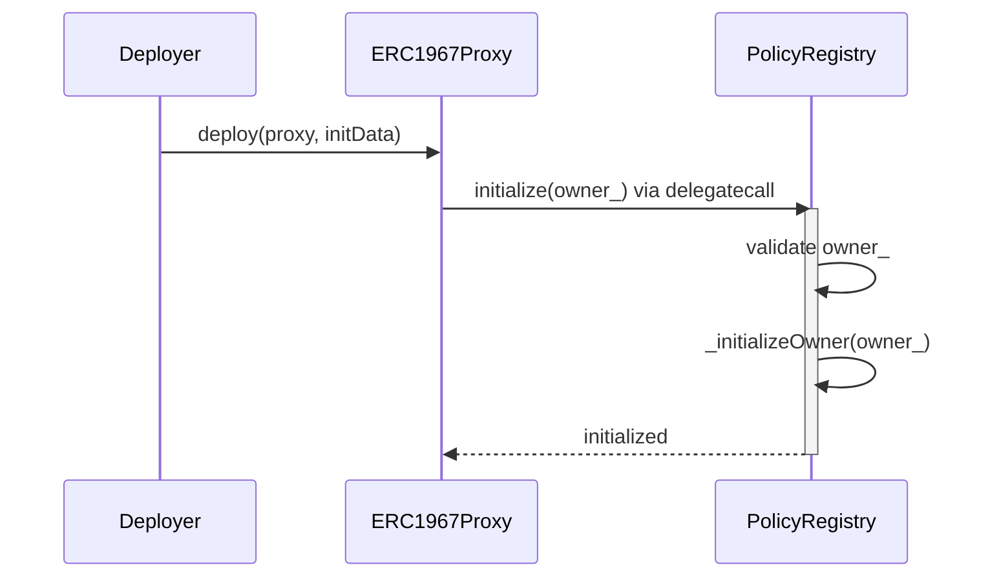
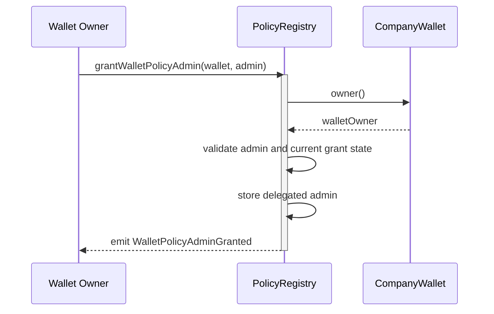
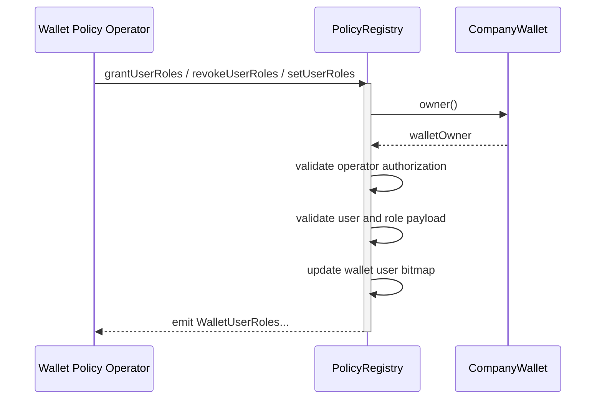
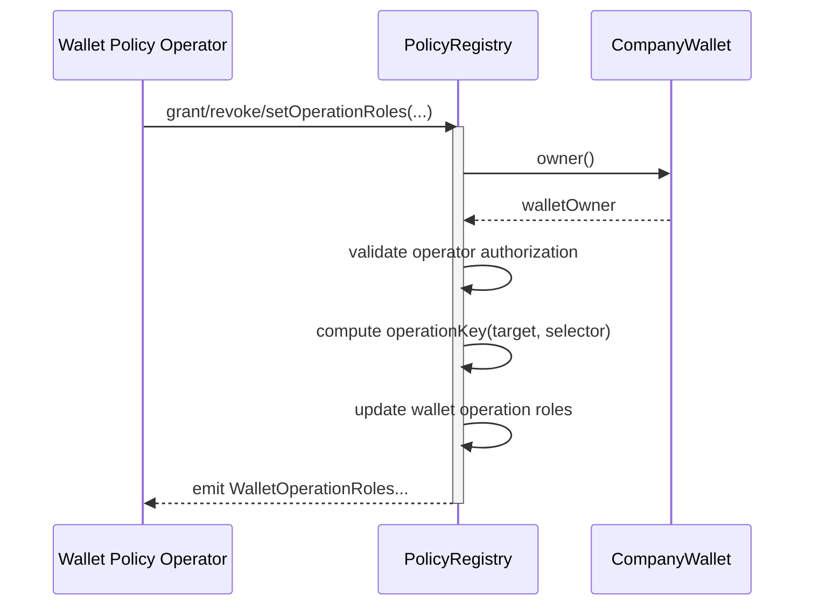
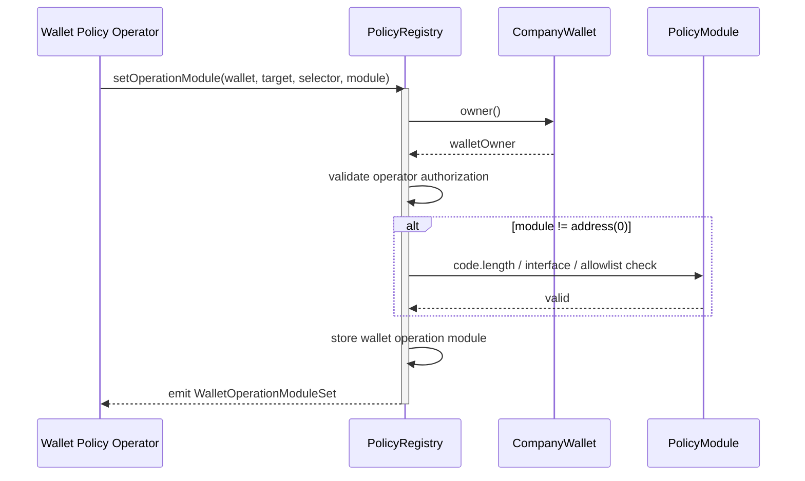
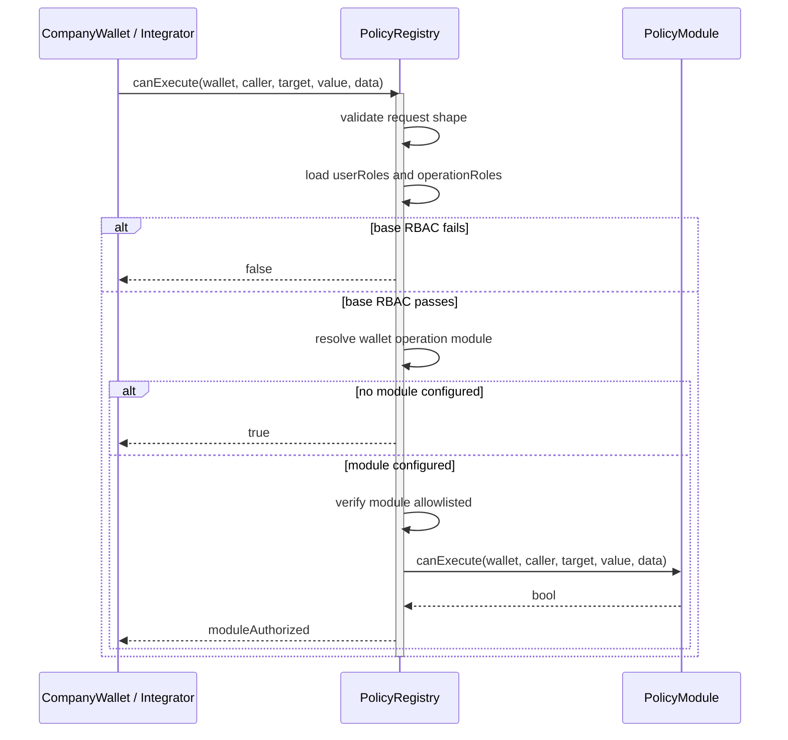
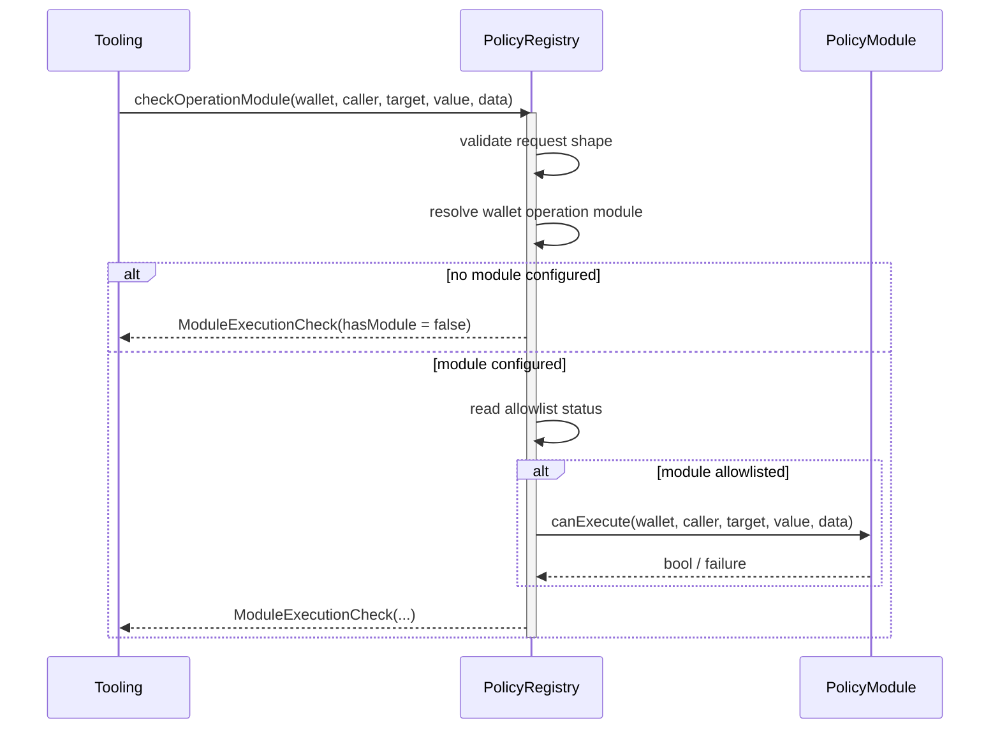

# PolicyRegistry Documentation

## Overview
`PolicyRegistry` is the shared wallet-scoped authorization authority for `CompanyWallet`.

It stores and evaluates:
- delegated wallet policy admins,
- wallet user role bitmaps,
- wallet operation role bitmaps,
- optional wallet operation modules,
- role labels,
- global policy-module allowlist state.

Wallet execution behavior is documented in [`CompanyWallet`](../wallet/CompanyWallet.md). High-level role terminology is summarized in [`roles.md`](../roles.md).
Wallet operational modes, including broker/custodian subwallet ownership, are documented in the [`security operational model`](../security/wallet-operational-modes.md).

The registry is intentionally open to any compatible contract wallet that exposes the expected `owner()` and `ownershipEpoch()` interface. It is not a whitelist of official DEUSS-created wallets.

## Prerequisites
- The proxy must be initialized through `initialize(owner_)`.
- Managed wallets must expose `owner()` and `ownershipEpoch()` via `ICompanyWallet`.
- `canExecute(...)` expects calldata with at least 4 bytes when selector-based evaluation is intended.
- Policy modules must be deployed contracts implementing `IPolicyModule` and must be allowlisted before use.
- View getters (`getUserRoles`, `getOperationRoles`, `getOperationModule`, `isWalletPolicyAdmin`) revert with `PolicyRegistry__InvalidWallet` when called with a zero address or an EOA address. Off-chain tooling that previously relied on these returning `0`/`false` for invalid wallet addresses must be updated.

## Contract Architecture
`PolicyRegistry` inherits:
- `IPolicyRegistry`
- `PolicyRegistryStorage`
- `Ownable`
- `Initializable`

Key design points:
- Base authorization is wallet-scoped bitmap RBAC stored directly in the registry.
- Wallet owner is the implicit super-admin and is not duplicated in registry storage.
- Delegated wallet admins are wallet-scoped only.
- Policy state is scoped to the wallet address and current ownership epoch, so unrelated compatible wallets do not share authority.
- Operation keys are canonicalized as `keccak256(abi.encode(target, selector))`.
- Optional policy modules are attached per `wallet + operation`.
- The wallet only calls the registry; it never talks to policy modules directly.
- The registry follows the same implementation + ERC1967 proxy pattern as the other upgradeable contracts in the repo.

## Data Model

### Wallet-local policy state
All wallet-local state is keyed by `(wallet, ownershipEpoch)`. Every ownership transfer of a `CompanyWallet`, and every owner-triggered `CompanyWallet.advancePolicyEpoch(bytes32 reason)` call, increments its epoch counter, making all previous-epoch state permanently unreachable in O(1) without any enumeration or deletion.

- `wallet -> ownershipEpoch -> user -> roles`
- `wallet -> ownershipEpoch -> operationKey -> allowedRoles`
- `wallet -> ownershipEpoch -> operationKey -> module`
- `wallet -> ownershipEpoch -> admin -> bool`

The current epoch is read from the wallet at the start of every read and write operation via `ICompanyWallet.ownershipEpoch()`.

Manual policy epoch advancement is intentionally wallet-owned. `PolicyRegistry` does not inspect smart-account internals such as Kernel controller state; same-address account recovery playbooks should call `advancePolicyEpoch` on each affected `CompanyWallet` when previous delegated policy state must be cleared.

### Role metadata
- `roleId -> bytes32 label`

### Policy module allowlist
- `module -> bool`

## Authorization Model

### Wallet owner
Wallet owner is resolved from the wallet contract itself.

Owner can:
- grant or revoke delegated wallet policy admins,
- manage wallet user roles,
- manage wallet operation roles,
- manage wallet operation modules.

### Delegated wallet policy admin
Delegated admin can:
- manage wallet user roles,
- manage wallet operation roles,
- manage wallet operation modules.

Delegated admin cannot:
- grant or revoke wallet policy admins,
- change wallet ownership,
- change wallet policy registry,
- manage unrelated wallets.

### Global registry owner
Registry owner can:
- label role ids,
- allowlist or deallowlist policy modules,
- upgrade the registry.

Allowlisting rejects contracts that do not advertise `IPolicyModule` through ERC165.

## Authorization Flow
`canExecute(wallet, caller, target, value, data)` evaluates authorization in two stages:

1. Base RBAC:
   - validate request shape,
   - extract selector from `data`,
   - compute operation key,
   - load `userRoles`,
   - load `operationRoles`,
   - require `userRoles & operationRoles != 0`.

2. Optional module stage:
   - resolve `wallet + operation` module,
   - if none exists, allow,
   - if module exists, require it to remain allowlisted,
   - `staticcall` `IPolicyModule.canExecute(wallet, caller, target, value, data)`,
   - require a successful call returning a 32-byte boolean.

Final decision:
- no module: `baseAuthorized`
- with module: `baseAuthorized && moduleAuthorized`

If module validation fails, reverts, or the module is no longer allowlisted, authorization fails closed.

For parent-mediated subwallet execution, bitmap RBAC on `(target = childWallet, selector = ICompanyWallet.execute)` is not granular by itself. A calldata-aware policy module must decode the nested `execute(...)` payload when the delegate should receive less than full operational control over the child wallet.

## Upgradeability
`PolicyRegistry` is deployed as:
- implementation contract,
- ERC1967 proxy,
- proxy initialization through `initialize(owner_)`.

Only the registry owner may authorize upgrades.

## Core Functions

### initialize(address owner_)
Initializes the proxy instance.

**Prerequisites:**
- `owner_ != address(0)`
- can only be called once per proxy

**Notes:**
- The implementation contract disables initializers in its constructor.

**Sequence Diagram:**

### grantWalletPolicyAdmin(address wallet, address admin)
Grants delegated policy-admin rights for one wallet.

**Prerequisites:**
- Caller is the wallet owner.
- `admin != address(0)`.
- Admin is not already granted for that wallet.

**Events:**
- `WalletPolicyAdminGranted(address wallet, address admin, address caller)`

**Sequence Diagram:**

### revokeWalletPolicyAdmin(address wallet, address admin)
Revokes delegated policy-admin rights for one wallet.

**Prerequisites:**
- Caller is the wallet owner.
- `admin != address(0)`.
- Admin is currently granted for that wallet.

**Events:**
- `WalletPolicyAdminRevoked(address wallet, address admin, address caller)`

### grantUserRoles / revokeUserRoles / setUserRoles
Manage wallet-scoped user role bitmaps.

**Prerequisites:**
- Caller is wallet owner or delegated wallet policy admin.
- User address is non-zero.
- Grant/revoke variants require non-zero role bitmaps.
- Batch `setUserRoles` requires matching array lengths.

**Events:**
- `WalletUserRolesGranted(...)`
- `WalletUserRolesRevoked(...)`
- `WalletUserRolesSet(...)`

**Notes:**
- Grant/revoke are strict and revert on duplicate or missing bits.
- `setUserRoles` is the exact-state synchronization path.

**Sequence Diagram:**

### grantOperationRoles / revokeOperationRoles / setOperationRoles
Manage wallet-scoped operation role bitmaps.

**Prerequisites:**
- Caller is wallet owner or delegated wallet policy admin.
- `target != address(0)`.
- `selector != bytes4(0)`.
- Grant/revoke variants require non-zero role bitmaps.

**Events:**
- `WalletOperationRolesGranted(...)`
- `WalletOperationRolesRevoked(...)`
- `WalletOperationRolesSet(...)`

**Sequence Diagram:**

### setOperationModule
Stores the optional module for one or more wallet operations.

**Prerequisites:**
- Caller is wallet owner or delegated wallet policy admin.
- Operation target and selector are valid.
- Non-zero module must be a deployed contract and currently allowlisted.
- Zero module clears the module binding.

**Events:**
- `WalletOperationModuleSet(...)`

**Sequence Diagram:**

### canExecute(address wallet, address caller, address target, uint256 value, bytes calldata data)
Returns the final authorization decision used by `CompanyWallet`.

**Returns:**
- `bool`: final authorization result.

**Notes:**
- This is the canonical integration entrypoint.
- Integrators should prefer this over reconstructing registry state off-chain.

**Sequence Diagram:**

### checkOperationModule(address wallet, address caller, address target, uint256 value, bytes calldata data)
Returns module-stage diagnostic information without performing the base bitmap gate.

**Returns:**
- `ModuleExecutionCheck` with:
  - `hasModule`
  - `module`
  - `moduleAllowed`
  - `moduleCallSucceeded`
  - `moduleAuthorized`

**Notes:**
- This is a debugging and introspection helper.
- It does not replace `canExecute(...)`.

**Sequence Diagram:**

## Trust Boundary
- `PolicyRegistry` is trusted for non-owner execution authorization.
- Wallet owners are trusted as wallet-local root administrators.
- Delegated wallet policy admins are trusted only within the wallets they administer.
- Global owner is trusted for module governance and upgrades.
- Allowlisted policy modules are trusted only as second-stage validators and never replace base RBAC.
- The registry does not verify that a wallet was deployed through `WalletFactory` or registered in `EntityRegistry`; protocol flows that require official account status must check those registries separately.
