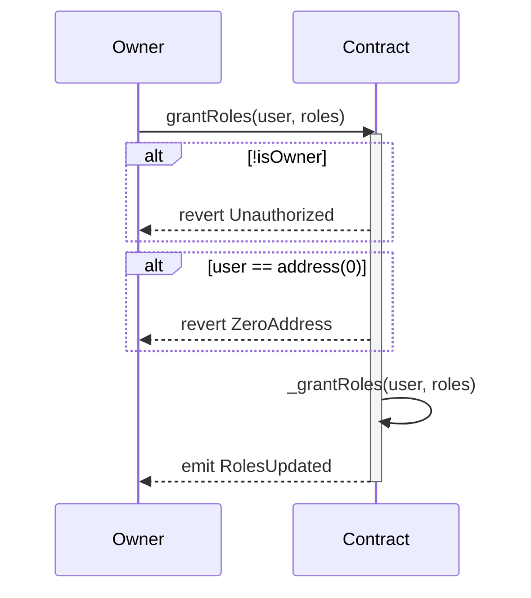
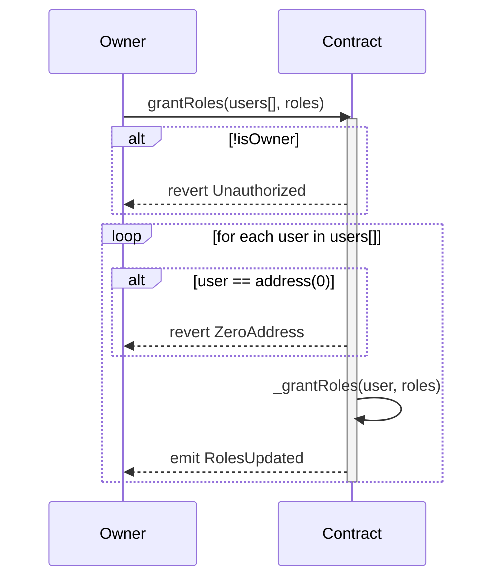
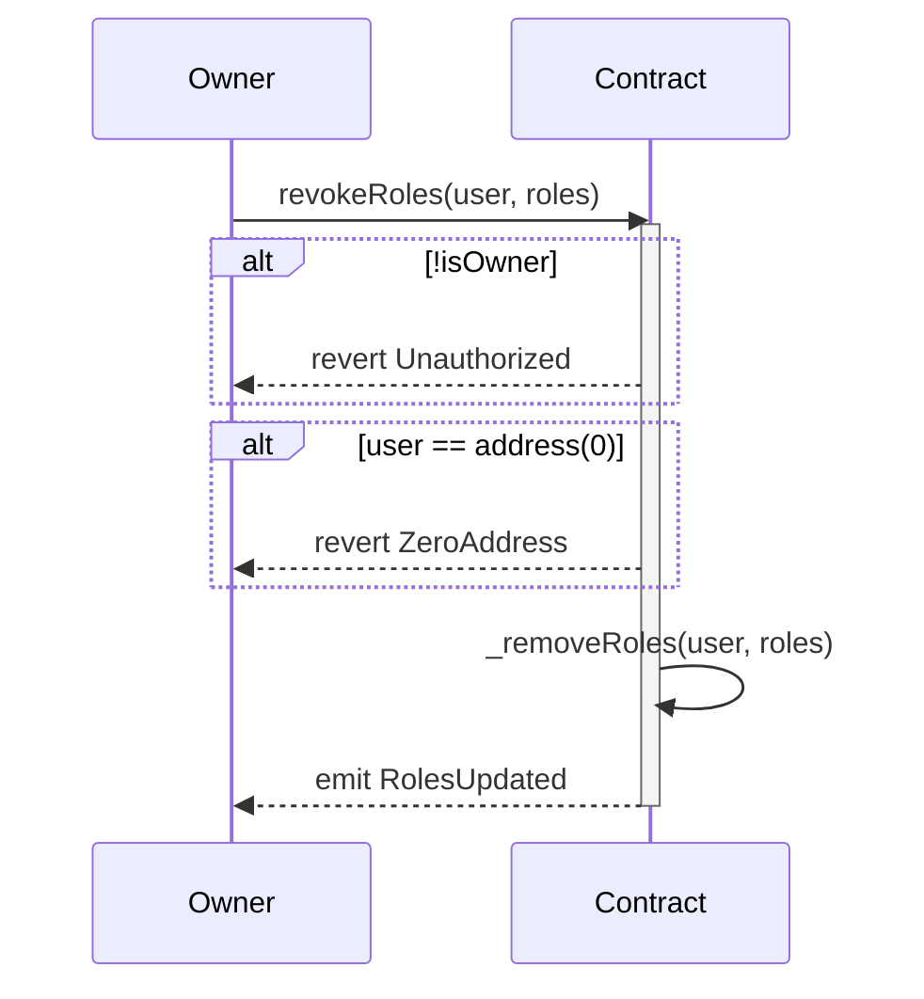
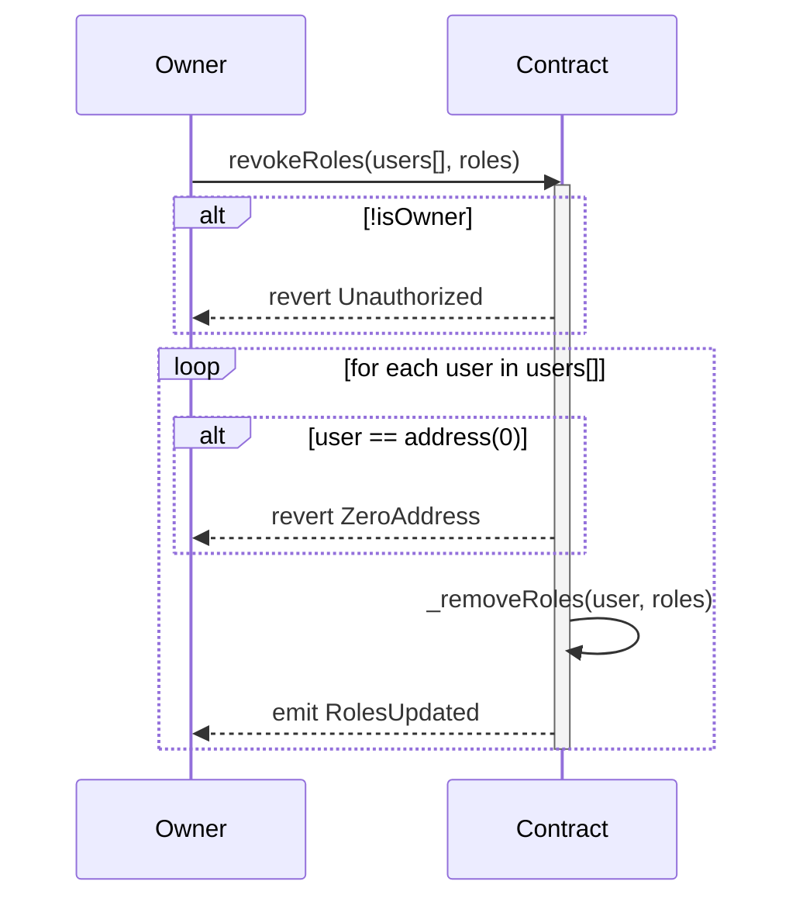
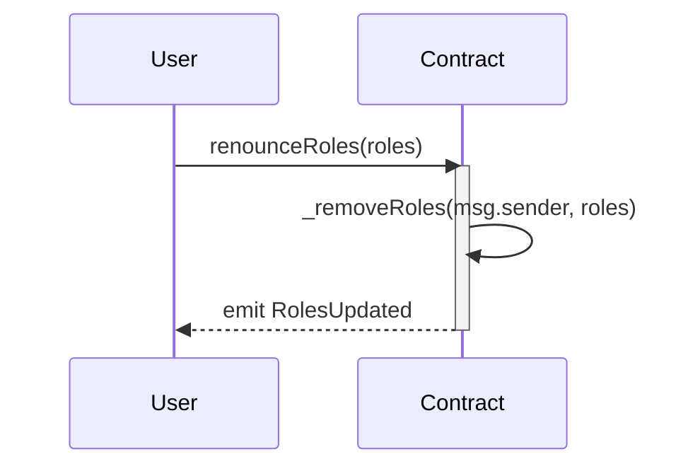

# Smart Contract Roles Overview

This document provides an overview of all roles used across the smart contract system.

Detailed role behavior is documented in the relevant component docs. Timelock execution for owner-gated role changes is documented in [`TimelockController`](governance/TimelockController.md).

> **Production assignment.** This document lists what each role *can do*. It is **not** a
> recommendation to assign roles the way `BootstrapProtocol.s.sol` does by default — that
> flow grants broad operational role bundles to a single admin actor, with the most
> sensitive asset-moving roles held by the timelock. For the recommended production role matrix
> (separation of duties, governance-only
> roles, hardened signers/services, secured onboarding signing service, fast
> freeze/disable containment, and the mandatory `FREEZE_ROLE`/`SEIZURE_ROLE` split), see the
> [operational model](security/operational-model.md). A role grant is usable immediately
> once it exists — production must place owners behind a multisig + non-zero-delay
> `TimelockController` before launch.

## Token Contracts

### BaseToken
- `BURNER_ROLE` (_ROLE_0): Reserved in the shared bitmap; `DEUSSToken` burn and burnBatch are currently restricted to `BondRegistry` rather than this role
- `TOKEN_FREEZER_ROLE` (_ROLE_1): Can freeze/unfreeze tokens
- `FORCE_TRANSFER_ROLE` (_ROLE_2): Can force transfer tokens; caller must also be an enabled account in `EntityRegistry`. Bootstrap grants this role only to `TimelockController` and registers the timelock as an enabled protocol entity account.

`pause()` and `unpause()` are owner-only. Token-id pause controls are reserved for `BondRegistry` through `pauseTokenId(...)` / `unpauseTokenId(...)`.

### DEUSSToken
Inherits all roles from BaseToken. `TOKEN_FREEZER_ROLE` controls partial balance freezes, `FORCE_TRANSFER_ROLE` controls forced transfers, and the owner can mark protected custody addresses through `protectAddress(address)`. Forced transfers cannot move tokens from or into protected custody. See [`DEUSSToken`](token/DEUSSToken.md).

Freezes restrict normal holder movement, but they are not an absolute block against privileged paths. `BondRegistry` burns and `FORCE_TRANSFER_ROLE` transfers may automatically unfreeze the needed amount before burning or transferring.

## Registry Contracts

### BondRegistry
- `PUBLISHER` (_ROLE_0): Can publish bonds and update published bonds; also can call `issueBond`
- `CANCEL` (_ROLE_1): Can cancel published bonds
- `CLOSE` (_ROLE_2): Can close issued bonds after redemption
- `CURRENCY` (_ROLE_3): Can manage allowed bond currencies
- `SUSPEND` (_ROLE_4): Can suspend issued bonds
- `UNSUSPEND` (_ROLE_5): Can unsuspend suspended bonds
- `BURNER` (_ROLE_6): Can execute third-party `FINAL_SETTLEMENT` burns through `burnBond` / `burnBondBatch`; caller must also be enabled in `EntityRegistry`. Bond issuers can `FINAL_SETTLEMENT` burn only their own balance without this role
- `SCORING` (_ROLE_7): Can append issuer scoring records
- `ISSUER_RECOVERY` (_ROLE_8): Critical governance-only role that can rotate a bond issuer for `Published`, `Issued`, `Suspended`, or `Replaced` versions during exceptional recovery. This role should be granted only to `TimelockController`, not deployers or operational actors

`issueBond` authorization path is: caller has `PUBLISHER` role **or** caller is the bond `issuer`.
`closeIssuance` authorization path is: caller has `PUBLISHER` role **or** caller is the bond `issuer`.
Issuer identity is checked first in both functions. If the caller equals `bond.issuer`, the issuer-enabled check applies even when that address also has `PUBLISHER`.
`rotateIssuer` authorization path is: caller has `ISSUER_RECOVERY`; in production this means execution through timelock governance. The replacement issuer must be enabled in `EntityRegistry`.
Bootstrap intentionally leaves `BURNER` unset and grants `ISSUER_RECOVERY` to `TimelockController`.
See [`BondRegistry`](registry/BondRegistry.md).

### EntityRegistry
- `ADMIN_ROLE` (_ROLE_0): Protocol-level admin override for entity governance (`setEntityAuthority`, `setEntityManager`) and immediate account registration (`registerAccount`); can also request pending account registration
- `GUARD` (_ROLE_1): Can manage lifecycle status controls (`setEntityStatus`, `setAccountStatus`)
- `ONBOARDING` (_ROLE_2): Can run onboarding flows (`registerEntity`, `registerEntityBatch`) and onboarding metadata/flags updates (`setEntityMetadata`, `setAccountRoleFlags`)
- `WALLET_TRANSFER` (_ROLE_3): Can run wallet/account relinking administration (`removeAccount`, `transferAccountToEntity`), but cannot move or remove an account while it remains the linked entity's authority or has its manager flag enabled. Production should hold this behind a multisig and timelock where operational latency allows
- `ENTITY_TYPE_MANAGER` (_ROLE_4): Can define and freeze entity type metadata (`defineEntityType`, `freezeEntityType`)

Entity authorities and managers may be unregistered EOAs for bootstrap flows. Once such an address is registered as an account, the scoped assignment is valid only while the account is enabled and linked to the same entity; disabling, removing, or transferring the account invalidates stale scoped assignments until authority or manager access is explicitly reassigned.

See [`EntityRegistry`](registry/EntityRegistry.md).

## Marketplace Contracts

### Marketplace
- `ADMIN` (_ROLE_0): Administrative functions (dependency wiring, configuration parameters, currency allowlist, entity-type allowlist)
- `PAYMENT_HANDLER` (_ROLE_1): Can handle payments
- `ARBITRATOR` (_ROLE_2): Can arbitrate disputes
- `SEIZURE_ROLE` (_ROLE_3): Can seize escrowed assets from frozen offers (`seizeOfferEscrow`) and frozen deals (`seizeDeal`); bootstrap grants this role to `TimelockController`, not the operational admin actor.
- `FREEZE_ROLE` (_ROLE_4): Can freeze/unfreeze offers and deals (`setOfferFrozen`, `setDealFrozen`)
- `INTEREST_DISCOVERY_OPERATOR` (_ROLE_5): Operational maintenance role; can call `closeExpiredInterests` when the offer owner is unavailable or disabled, and can cancel expired failed `INTEREST_DISCOVERY` offers when the offer owner is unavailable and the owner account is enabled to receive escrow withdrawals. Distinct from `ADMIN` — does not grant configuration authority.

See [`Marketplace`](marketplace/Marketplace.md).

### OrderbookMarketplace
- `ADMIN` (_ROLE_0): Administrative functions (`setAssetManager`, `setEntityRegistry`, `setEscrowManager`, `setMarketFilter`, `setPaymentExpiryThreshold`, `setMinExpiryThreshold`, `setDisputeBufferPeriod`)
- `PAYMENT_HANDLER` (_ROLE_1): Can confirm off-chain payment outcomes for pending trades via `markTradePaid`
- `ARBITRATOR` (_ROLE_2): Can resolve trade disputes (`IN_DISPUTE -> PAID | UNPAID`)
- `SEIZURE_ROLE` (_ROLE_3): Can seize escrowed assets from frozen orders (`seizeOrder`) and frozen trades (`seizeTrade`); bootstrap grants this role to `TimelockController`, not the operational admin actor.
- `FREEZE_ROLE` (_ROLE_4): Can freeze/unfreeze orders and trades (`setOrderFrozen`, `setTradeFrozen`)

See [`OrderbookMarketplace`](marketplace/OrderbookMarketplace.md).

### AssetManager
- `ADMIN` (_ROLE_0): Can configure token-level asset support through `setAsset` and optional token-id allowlists through `setAssetTokenId`

See [`AssetManager`](marketplace/AssetManager.md).

### BondMarketFilter
- `ADMIN` (_ROLE_0): Can set per-token metadata adapters through `setAdapter`

See [`BondMarketFilter`](marketplace/BondMarketFilter.md).

### EscrowManager
- `ADMIN` (_ROLE_0): Administrative functions (module management, `setAssetManager`, surplus asset sweep)

See [`EscrowManager`](marketplace/EscrowManager.md).

## Wallet Contracts

### CompanyWallet
- Owner: Can execute arbitrary calls, set the `PolicyRegistry`, manually advance the policy epoch, and transfer ownership.
- Non-owner execution is delegated to `PolicyRegistry.canExecute(wallet, caller, target, value, data)`.
- The wallet itself does not define role constants; per-wallet operation permissions live in `PolicyRegistry`.
- Owner bypass also applies when the owner is a smart account or another `CompanyWallet`. Broker/custodian wallet fleets should follow the [`security operational model`](security/wallet-operational-modes.md), especially the controls for Root-Controlled Subwallet Mode.

See [`CompanyWallet`](wallet/CompanyWallet.md).

### PolicyRegistry
- Owner: Can manage global policy module allowlist and role labels.
- Wallet owner: Can grant/revoke wallet policy admins and configure wallet policy state.
- Wallet policy admin: Can manage the wallet-specific roles/modules permitted by the wallet owner.

See [`PolicyRegistry`](registry/PolicyRegistry.md).

## Role granting and revoking

Each contract that extends `OwnableRolesExtension` (wrapper of Solady `OwnableRoles`) enables the authorized `owner` to assign user roles using the following methods.

Contracts may also wrap these methods to enforce only specific roles. In case the `owner` assigns an invalid role, the call reverts with `InvalidRoles()`

### grantRoles(address user, uint256 roles)

Grants roles to a user.

**Prerequisites:**
- Caller must be owner
- User address must not be zero

**Parameters:**
- `user`: Address of the user to grant roles to
- `roles`: Bitmap of roles to grant

**Events:**
- `RolesUpdated(address, uint256)`: Emitted when roles are updated

**Errors:**
- `ZeroAddress()`: When user address is zero

**Sequence Diagram:**

### grantRoles(address[] calldata users, uint256 roles)

Grants roles to multiple users at once.

**Prerequisites:**
- Caller must be owner
- User addresses must not be zero

**Parameters:**
- `users`: Array of user addresses to grant roles to
- `roles`: Bitmap of roles to grant

**Errors:**
- `ZeroAddress()`: When user address is zero

**Events:**
- `RolesUpdated(address, uint256)`: Emitted for each user when roles are updated

**Sequence Diagram:**

### revokeRoles(address user, uint256 roles)

Revokes roles from a user.

**Prerequisites:**
- Caller must be owner
- User address must not be zero

**Parameters:**
- `user`: Address of the user to revoke roles from
- `roles`: Bitmap of roles to revoke

**Events:**
- `RolesUpdated(address, uint256)`: Emitted when roles are updated

**Sequence Diagram:**

### revokeRoles(address[] calldata users, uint256 roles)

Revokes roles from multiple users at once

**Prerequisites:**
- Caller must be owner
- User addresses must not be zero
- Roles must be valid

**Parameters:**
- `users`: Addresses of the users to revoke roles from
- `roles`: Bitmap of roles to revoke

**Events:**
- `RolesUpdated(address, uint256)`: Emitted for each user when roles are updated

**Sequence Diagram:**

### renounceRoles(uint256 roles)

Allows the caller to renounce their own roles.

**Prerequisites:**
- Caller must have the roles they want to renounce

**Parameters:**
- `roles`: Bitmap of roles to renounce

**Events:**
- `RolesUpdated(address, uint256)`: Emitted when roles are updated

**Sequence Diagram:**

