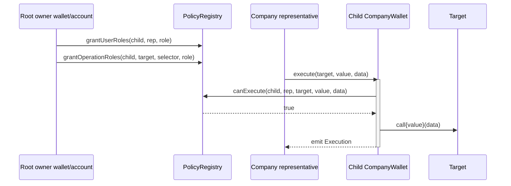
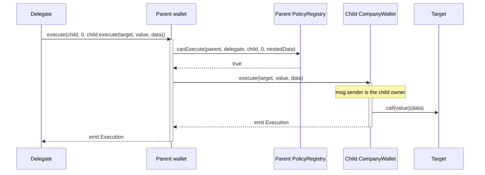

# CompanyWallet Operational Modes

## Overview
`CompanyWallet` has one on-chain execution rule:

- the wallet owner is the root execution authority and can call `execute(...)` without `PolicyRegistry`;
- every non-owner caller must pass `PolicyRegistry.canExecute(wallet, caller, target, value, data)`.

This document describes the supported operational patterns built on top of that rule. These are operational modes, not contract-level execution-mode flags.

The recommended name for the broker/custodian pattern where one controlled owner manages multiple company wallets is
**Root-Controlled Subwallet Mode**.

## Mode Summary

| Mode | Wallet owner | Delegate path | Main use |
| --- | --- | --- | --- |
| Direct-Owned Company Wallet | Company-controlled EOA, multisig, Kernel account, or other smart account | Delegates call the same `CompanyWallet` directly and are checked by that wallet's `PolicyRegistry` | Self-managed companies and simple company operators |
| Root-Controlled Subwallet Mode | A broker/custodian/root wallet or smart account owns one or more child `CompanyWallet` instances | Ordinary operators call child wallets directly through child policy; parent-level delegates require calldata-aware constraints | Broker-managed or custodian-managed company wallet fleets |

## Direct-Owned Company Wallet
In Direct-Owned Company Wallet mode, the company wallet is owned directly by the company authority, or by the company's own high-security smart account or multisig.

Use this mode when:
- the company is expected to be the final operational authority for the wallet;
- the owner should retain direct emergency execution authority;
- ordinary users need limited permissions for specific protocol calls.

Recommended setup:
1. Set the wallet owner to the company authority EOA, multisig, Kernel account, or another company-controlled smart account.
2. Grant routine users `PolicyRegistry` user roles and operation roles on this same wallet.
3. Add an operation module only when bitmap RBAC is not precise enough and calldata, value, token id, amount, buyer, or other arguments must be inspected.
4. Use `advancePolicyEpoch(bytes32 reason)` after owner recovery when existing delegated policy state must be cleared.

Direct owner execution is intentionally unrestricted at the `CompanyWallet` layer. The operational assumption is that the owner is trusted as the wallet-local root authority.

## Root-Controlled Subwallet Mode
Root-Controlled Subwallet Mode is the supported pattern for broker or custodian operations where a root authority remains accountable for child company wallets.

In this mode:
- a root owner, such as a broker multisig, custodian smart account, or broker-owned `CompanyWallet`, owns the child `CompanyWallet`;
- the child wallet remains the protocol-visible company account and holds the company's assets;
- ordinary company representatives or operators should normally receive roles directly on the child wallet's `PolicyRegistry` policy;
- the root owner administers child policy state, performs recovery, and can execute directly as the child owner.

This keeps the child wallet canonical for protocol accounting while giving the broker or custodian a single controlled
root for ownership, recovery, and policy administration.

### Safe Operator Path
The safer routine path is direct child-wallet delegation:

1. Root owner creates or receives ownership of the child `CompanyWallet`.
2. Root owner configures child wallet policy by calling `PolicyRegistry` as the child wallet owner. If the root owner is another `CompanyWallet`, it can call `PolicyRegistry` through its own `execute(...)`.
3. The company representative calls `childWallet.execute(target, value, data)` directly.
4. Because the representative is not the child owner, the child wallet consults `PolicyRegistry`.

**Sequence Diagram:**


### Parent-Mediated Operator Path
A parent-mediated path exists when a delegate operates a child wallet by first calling the parent/root wallet:

```text
delegate -> parentWallet.execute(childWallet, 0, abi.encodeCall(childWallet.execute, (target, value, data)))
```

This path is high risk unless it is constrained. When the parent wallet calls the child wallet, the child sees `msg.sender == owner()` and skips the child wallet's `PolicyRegistry` check. Therefore, a parent delegate that can call
generic `childWallet.execute(...)` through the parent effectively receives broad execution authority over the child wallet.

This is not limited to `CompanyWallet -> CompanyWallet` ownership. The same ambiguity can exist whenever the child owner is a smart contract with its own delegates, session keys, modules, or internal execution policy.

**Sequence Diagram:**


## Required Controls For Parent-Mediated Delegation
Do not grant a parent delegate the raw operation `(target = childWallet, selector = ICompanyWallet.execute.selector)` unless one of the following is true:

- the delegate is intended to have full operational control over that child wallet; or
- the parent operation has a calldata-aware `PolicyModule` that decodes the nested `ICompanyWallet.execute(...)` payload and enforces the allowed inner target, value, selector, and material arguments.

A parent-side policy module for nested child execution should at minimum validate:
- the outer operation target is the expected child wallet;
- the outer selector is `ICompanyWallet.execute.selector`;
- the decoded inner target is in the permitted target set;
- the decoded inner `value` is within the permitted native-value policy;
- the decoded inner calldata selector is in the permitted selector set;
- any material inner arguments, such as token id, amount, issuer, offer id, buyer, or expiry, satisfy the delegated policy;
- malformed nested calldata fails closed.

The current `PolicyRegistry` supports this through operation modules, but the registry only calls the configured module.
It does not provide a built-in nested `CompanyWallet.execute(...)` decoder. Until an audited module for the intended operation exists and is allowlisted, use direct child-wallet delegation for routine operators.

## Operational Constraints

### Generic execute grants are broad
An operation grant for `ICompanyWallet.execute.selector` authorizes a generic execution primitive. If it targets a child wallet from a parent wallet policy, it should be treated as child-wallet administrator access unless a module restricts the nested call.

### Child policy is not evaluated for owner calls
`CompanyWallet` deliberately trusts its owner. If the owner is another wallet or smart account, calls forwarded by that owner do not carry the original human or delegate identity into child policy evaluation.

### Smart-account owners can hide delegated authority
Forbidding only `CompanyWallet` owners would not remove the general risk. Multisigs, Kernel accounts, session-key systems, and custom smart accounts can all have internal delegates that the child wallet cannot inspect.

### Wrong owner selection is a deployment-time risk
`WalletFactory.createWallet(...)` forwards opaque initialization data and does not validate the selected owner. Entity managers and deployment tooling must choose the intended owner according to the operational mode.

### Policy modules add governance and availability risk
Modules are governed through the global policy-module allowlist. Deallowlisting, module bugs, or malformed module return data fail closed and may block delegated execution until policy is updated.

## Operational Checklist
- Classify each wallet as Direct-Owned Company Wallet or Root-Controlled Subwallet Mode before deployment.
- Record the wallet owner type: EOA, multisig, Kernel account, `CompanyWallet`, or custom smart account.
- For Root-Controlled Subwallet Mode, prefer direct child-wallet delegation for routine company operators.
- Avoid parent-level grants to `childWallet.execute(...)` unless broad child authority is intended.
- If parent-mediated delegation is required, attach an allowlisted calldata-aware policy module to the parent operation.
- Monitor `WalletOperationRolesGranted`, `WalletOperationRolesSet`, and `WalletOperationModuleSet` events for grants where `target` is a child wallet and `selector` is `ICompanyWallet.execute.selector`.
- On owner compromise, smart-account recovery, or delegate compromise, call `advancePolicyEpoch(bytes32 reason)` on each affected wallet when existing delegated policy state should be invalidated.

## Related Documentation
- [`CompanyWallet`](../wallet/CompanyWallet.md)
- [`WalletFactory`](../wallet/WalletFactory.md)
- [`PolicyRegistry`](../registry/PolicyRegistry.md)
- [`roles.md`](../roles.md)
