# BaseToken Contract Documentation

## Contract Architecture
- Inherits from `OwnableRolesExtension` for role-based access control. Read more in the [Roles](../roles.md) docs page.
- Uses OpenZeppelin `PausableUpgradeable` for global pause state, pause events, and pause-specific custom errors.

## Administrative Functions

## Core Functions

### approve(address spender, uint256 tokenId, uint256 amount)
Sets an approval to `spender` for `amount` of tokens of type `tokenId` from caller's tokens.
This follows ERC-6909 set semantics: a successful call overwrites any previous allowance for the same owner, spender, and token ID.

**Prerequisites:**
- Sender must be the token owner or otherwise authorized to set approvals
- The approval must be allowed by the EntityRegistry (`canApprove`)
- Contract must not be paused

**Parameters:**
- `spender`: The address that will be allowed to spend the tokens
- `tokenId`: The ID of the token type being approved
- `amount`: The maximum number of tokens spender is allowed to transfer

**Errors:**
- `Token__ApprovalNotAllowed(address, address, uint256, uint256)`: When the EntityRegistry does not allow the approval

**Events:**
- `Approval(address, address, uint256, uint256)`: Emitted when an approval is set or updated

**Sequence Diagram:**
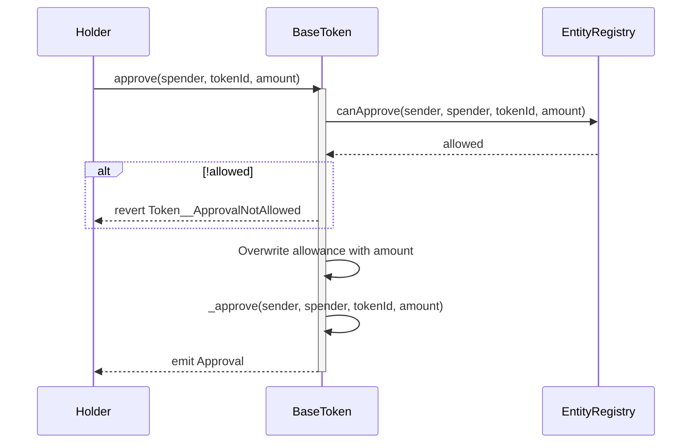

### pause()

Pauses all token operations.

**Prerequisites:**
- Caller must be the owner
- Contract must not be already paused

**Parameters:**
- None

**Errors:**
- `PausableUpgradeable.EnforcedPause()`: When contract is already paused

**Events:**
- `Paused(address)`: Emitted by OpenZeppelin `PausableUpgradeable` when contract is paused

**Sequence Diagram:**
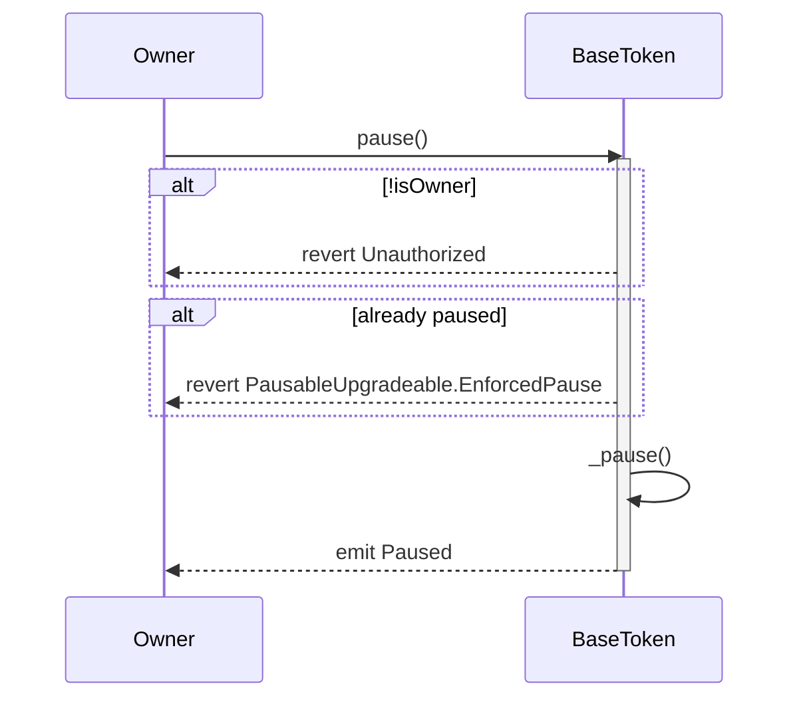

### unpause()

Unpauses all token operations.

**Prerequisites:**
- Caller must be the owner
- Contract must be paused

**Parameters:**
- None

**Errors:**
- `PausableUpgradeable.ExpectedPause()`: When contract is not paused

**Events:**
- `Unpaused(address)`: Emitted by OpenZeppelin `PausableUpgradeable` when contract is unpaused

**Sequence Diagram:**
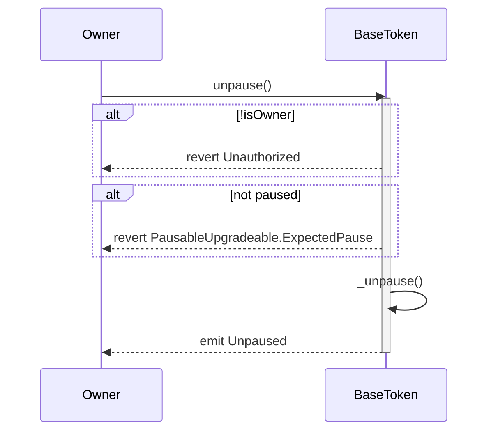

### pauseTokenId(uint256 tokenId)

Pauses a specific token ID, preventing transfers of that token.

**Prerequisites:**
- Caller must be the BondRegistry contract
- Token ID must not be already paused

`pauseTokenId` remains callable while the contract is globally paused. This lets operators curate per-tokenId suspensions under the global emergency stop before reopening the wider token contract.

**Parameters:**
- `tokenId`: The token ID to pause

**Errors:**
- `Token__CallerNotBondRegistry(address)`: When caller is not the BondRegistry
- `Token__TokenIdAlreadyPaused(uint256)`: When the token ID is already paused

**Events:**
- `TokenPaused(uint256, address)`: Emitted when a token ID is paused

**Sequence Diagram:**
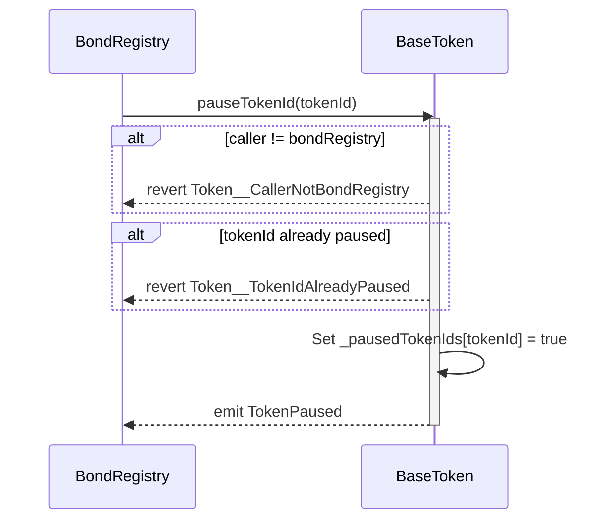

### unpauseTokenId(uint256 tokenId)

Unpauses a specific token ID, allowing transfers of that token again.

**Prerequisites:**
- Caller must be the BondRegistry contract
- Contract must not be globally paused
- Token ID must be currently paused

**Parameters:**
- `tokenId`: The token ID to unpause

**Errors:**
- `Token__CallerNotBondRegistry(address)`: When caller is not the BondRegistry
- `PausableUpgradeable.EnforcedPause()`: When contract is globally paused
- `Token__TokenIdNotPaused(uint256)`: When the token ID is not paused

**Events:**
- `TokenUnpaused(uint256, address)`: Emitted when a token ID is unpaused

**Sequence Diagram:**
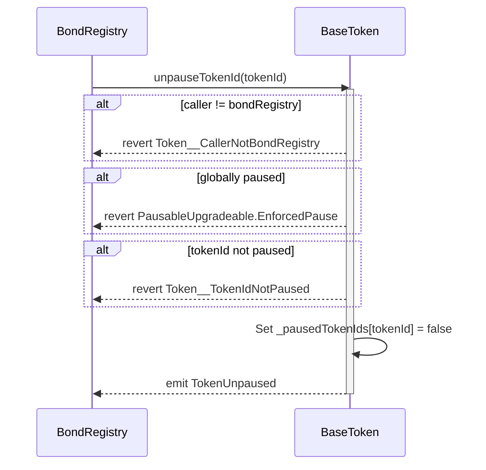

### mint(address to, uint256 tokenId, uint256 amount)

Abstract function to mint tokens.

**Prerequisites:**
- Implementation specific (in DEUSSToken: caller must be the BondRegistry)

**Parameters:**
- `to`: Address to mint tokens to
- `tokenId`: Token ID
- `amount`: Amount of tokens to mint

### bondRegistry()

Returns the bond registry contract address.

**Parameters:**
- None

**Returns:**
- `IBondRegistry`: The bond registry contract interface

**Sequence Diagram:**
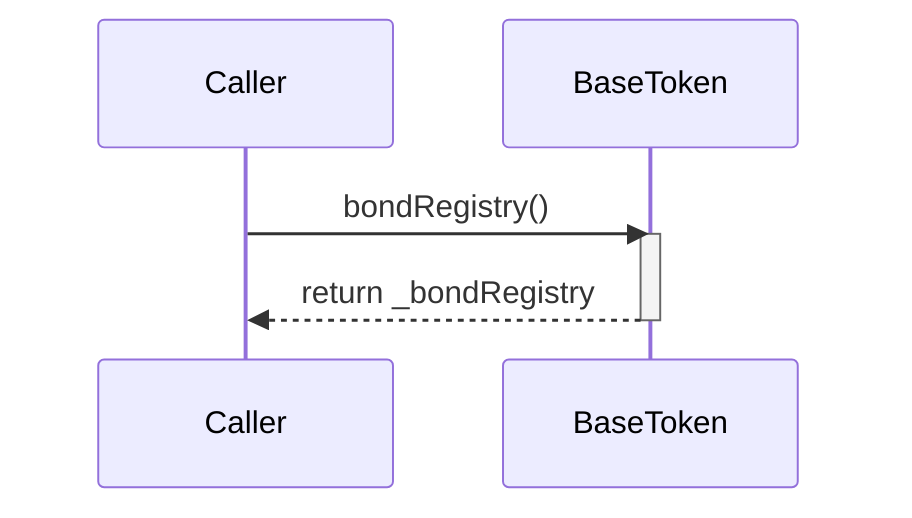

### entityRegistry()

Returns the entity registry contract address.

**Parameters:**
- None

**Returns:**
- `IEntityRegistry`: The entity registry contract interface

**Sequence Diagram:**
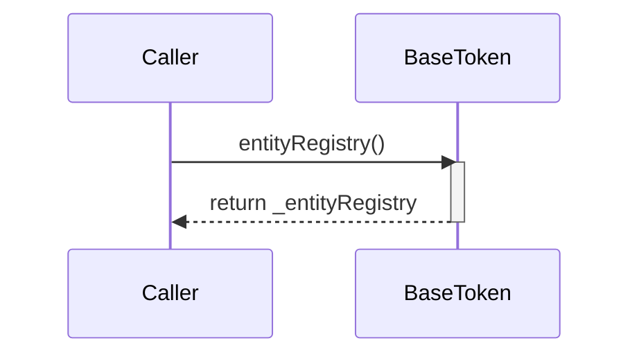

### frozenBalanceOf(address account, uint256 tokenId)

Returns the amount of tokens that are frozen for a given account and token ID.

**Parameters:**
- `account`: The address of the wallet to check
- `tokenId`: The token ID to check

**Returns:**
- `uint256`: The amount of frozen tokens

**Sequence Diagram:**
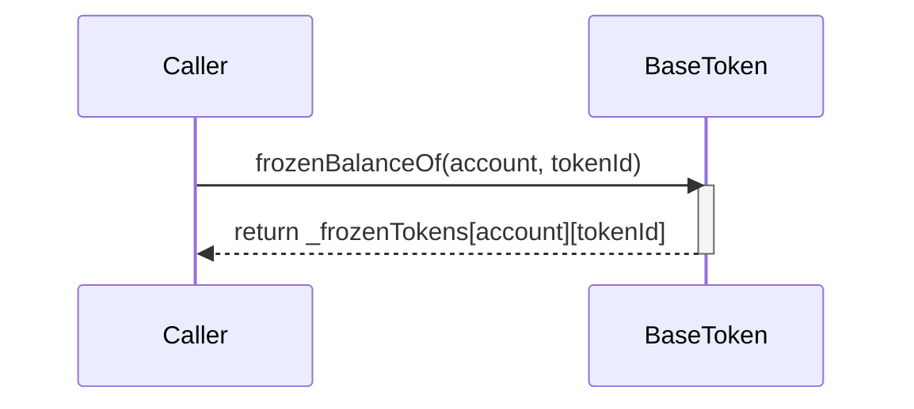

### isTokenPaused(uint256 tokenId)

Checks if a specific token ID is paused.

**Parameters:**
- `tokenId`: The token ID to check

**Returns:**
- `bool`: True if the token ID is paused, false otherwise

**Sequence Diagram:**
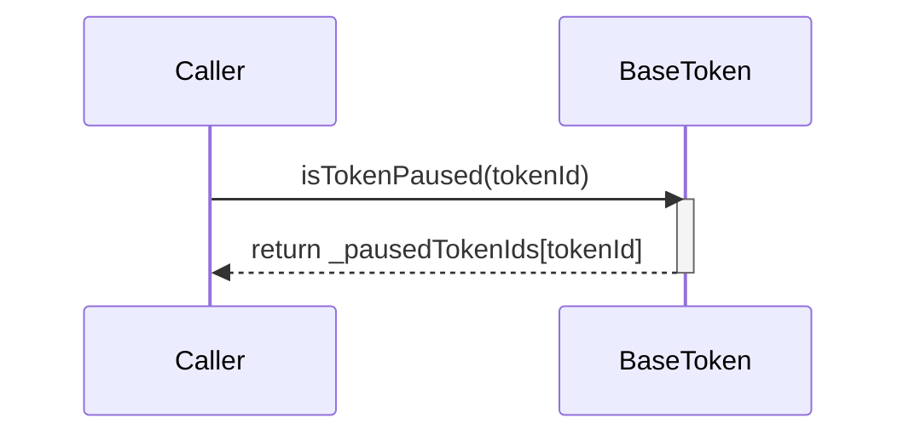

### paused()

Checks if the contract is paused.

**Parameters:**
- None

**Returns:**
- `bool`: True if contract is paused, false otherwise

**Sequence Diagram:**
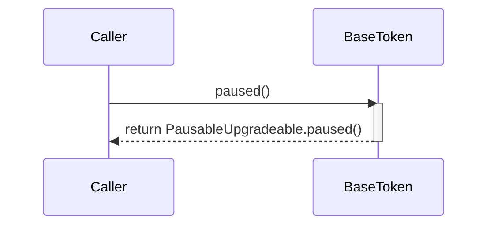

### version()

Returns the version of the token contract.

**Parameters:**
- None

**Returns:**
- `string`: Version string

**Sequence Diagram:**
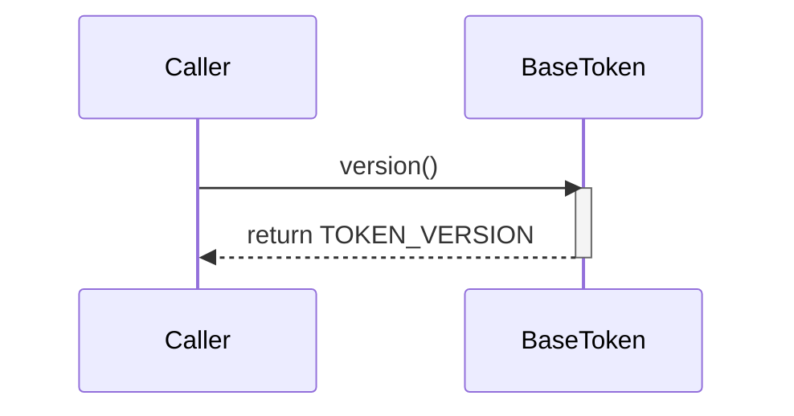

### setBondRegistry(address bondRegistryAddr)

Sets the bond registry contract address. The bond registry can only be set once during token wiring.

**Prerequisites:**
- Caller must be owner
- Bond registry address must not be zero
- Bond registry must not already be configured

**Parameters:**
- `bondRegistryAddr`: Address of the bond registry contract

**Errors:**
- `ZeroAddress()`: When bond registry address is zero
- `BaseToken__BondRegistryAlreadySet()`: When bond registry is already configured

**Events:**
- `BondRegistryUpdated(address)`: Emitted when bond registry is set

**Sequence Diagram:**
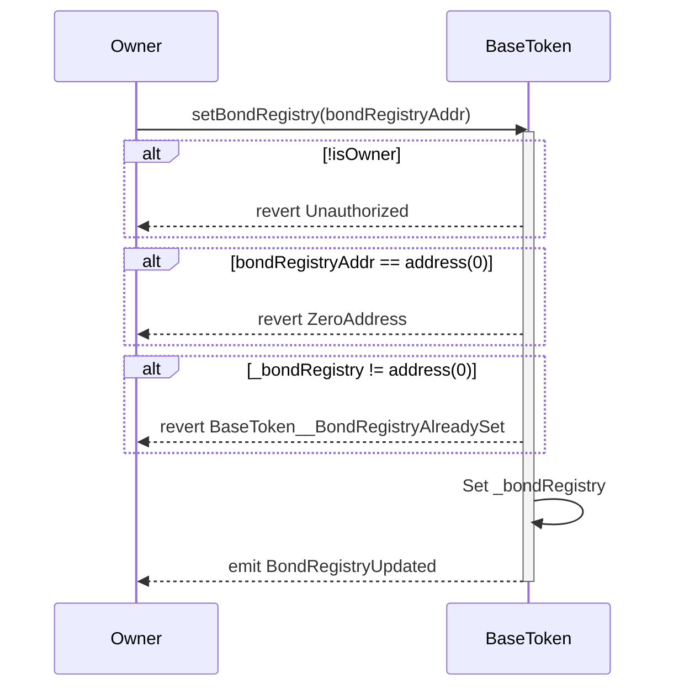

### setEntityRegistry(address entityRegistryAddr)

Sets the entity registry contract address. The entity registry can only be set once during token wiring.

**Prerequisites:**
- Caller must be owner
- Entity registry address must not be zero
- Entity registry must not already be configured

**Parameters:**
- `entityRegistryAddr`: Address of the entity registry contract

**Errors:**
- `ZeroAddress()`: When entity registry address is zero
- `BaseToken__EntityRegistryAlreadySet()`: When entity registry is already configured

**Events:**
- `EntityRegistryUpdated(address)`: Emitted when entity registry is set

**Sequence Diagram:**
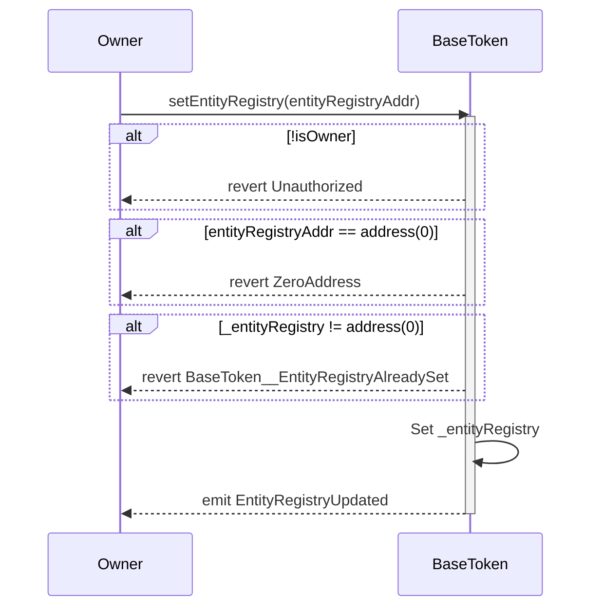

### supportsInterface(bytes4 interfaceId)

Checks if contract supports an interface.

**Parameters:**
- `interfaceId`: Interface identifier to check

**Returns:**
- `bool`: True if interface is supported, false otherwise

**Sequence Diagram:**
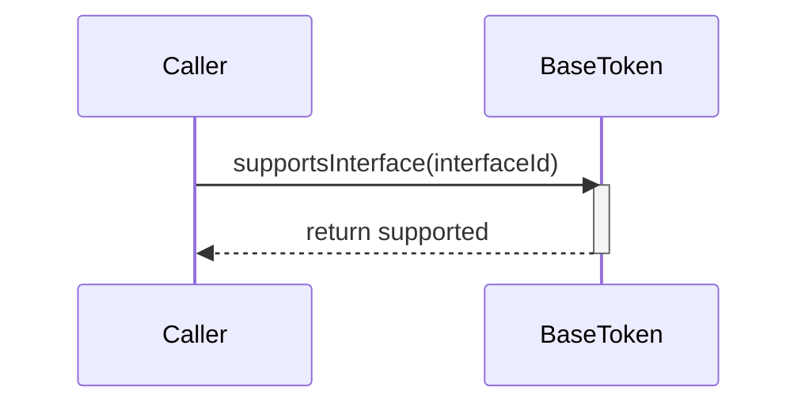
