# DEUSSToken Contract Documentation

## Overview

The `DEUSSToken` contract implements a fungible token standard based on ERC-6909, specifically designed for bond tokens in the DEUSS system. It provides functionality for token minting, burning, transfers, token freezing mechanisms, and historical snapshot queries. The contract supports multiple token IDs, where each token ID represents a distinct bond.

Bond lifecycle mint/burn authority lives in [`BondRegistry`](../registry/BondRegistry.md), while wallet/account transfer and approval eligibility is resolved through [`EntityRegistry`](../registry/EntityRegistry.md).

## Prerequisites
- Contract must be initialized with owner, bond registry, entity registry, and EscrowManager addresses
- The implementation contract disables initializers in its constructor; initialize only the deployed proxy instance
- Proper roles must be assigned to authorized users:
  - `FORCE_TRANSFER_ROLE`: For governed forced transfers
  - `TOKEN_FREEZER_ROLE`: For token freezing/unfreezing
- BondRegistry must be set; protocol minting and burning are restricted to `BondRegistry`
- EscrowManager is marked as protected custody atomically during initialization

## Protected Custody

- The owner can permanently mark an address as protected custody with `protectAddress(address)`.
- Protected custody blocks privileged outbound operations that route through `_beforeRoleTransfer`, namely `forcedTransfer`, `batchForcedTransfer`, `burn`, and `burnBatch`.
- Protected custody also blocks inbound `forcedTransfer` and `batchForcedTransfer` operations; a `FORCE_TRANSFER_ROLE` holder cannot push tokens into protected custody.
- Protected custody addresses cannot be targeted by `freezePartialTokens` or `batchFreezePartialTokens`.
- Protected custody also rejects pushed normal ERC-6909 transfers from other callers. A protected address can still pull tokens into custody through approved `transferFrom` flows where the protected address is the caller.
- The suite deployment protects `EscrowManager` in the `DEUSSToken` initializer.

## Governed Forced Transfer Control

- `forcedTransfer` and `batchForcedTransfer` are intentionally stricter than other token RBAC paths.
- The caller must have `FORCE_TRANSFER_ROLE` and must also be an enabled account in `EntityRegistry`.
- In production, `FORCE_TRANSFER_ROLE` should be held by `TimelockController`, not an operator key. Bootstrap grants the role to the timelock and registers/enables the timelock as an `EntityRegistry` account so forced transfer calls can pass.
- `GUARD` remains a fast emergency stop for forced transfers by disabling the timelock/execution account in `EntityRegistry`; restoring forced-transfer capability then requires a reviewed re-enable plus the normal timelock execution path.
- Forced transfers can move tokens from a disabled `from` wallet to support recovery from blocked or compromised accounts, but the `to` wallet must be enabled and must not be protected custody.
- Freezer operations remain RBAC-only. A `TOKEN_FREEZER_ROLE` caller is not required to be enabled in `EntityRegistry`.

## Freeze Enforcement Boundaries

- Normal ERC-6909 transfers require sufficient unfrozen balance.
- Privileged `BondRegistry` burns and `FORCE_TRANSFER_ROLE` transfers require sufficient total balance and may automatically reduce frozen balance to complete the operation.
- A freeze should be treated as a restriction on normal holder movement, not as an absolute block against maturity burns, final-settlement burns, or authorized recovery transfers.

## Contract Architecture
The `DEUSSToken` inherits from:
- `IDEUSSToken` (interface defining fungible token functionality)
- `DEUSSTokenStorage` (defines storage layout)
- `BaseToken` (base token implementation, which includes ERC-6909 base logic and OpenZeppelin `PausableUpgradeable`)

## Core Functions

### mint(address to, uint256 tokenId, uint256 amount)

Mints new tokens to a specified address.

**Prerequisites:**
- Caller must be `BondRegistry`
- `to` must be an enabled account in `EntityRegistry`

**Parameters:**
- `to`: Address to receive the tokens
- `tokenId`: Token ID to mint
- `amount`: Amount of tokens to mint

**Errors:**
- `Token__CallerNotBondRegistry(address)`: When caller is not the BondRegistry
- `Token__ZeroAmount()`: When amount is zero
- `Token__TransferNotAllowed(address, address, uint256)`: When `to` is not enabled in `EntityRegistry`

**Sequence Diagram:**
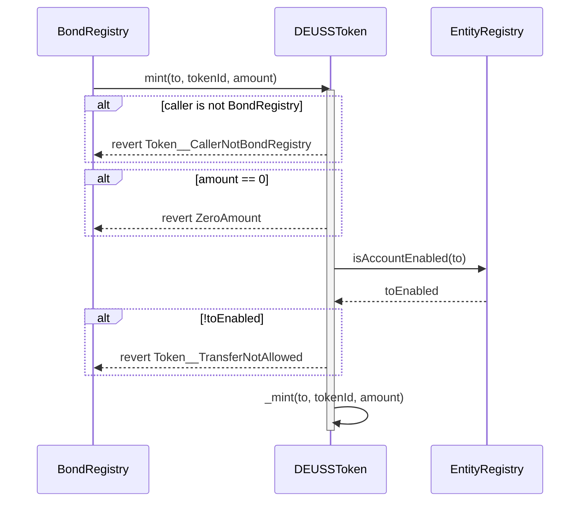

### burn(address from, uint256 tokenId, uint256 amount)

Burns tokens from a specified address.

**Prerequisites:**
- Caller must be `BondRegistry`
- User must have sufficient balance
- `from` may be disabled in EntityRegistry to support protocol recovery burns
- If permitted by the registry burn kind, frozen tokens may be unfrozen to complete the burn
- `ISSUER_RECLAIM` is constrained in `BondRegistry` to unfrozen issuer balance and will not consume frozen inventory

**Parameters:**
- `from`: Address to burn tokens from
- `tokenId`: Token ID to burn
- `amount`: Amount of tokens to burn

**Events:**
- `TokensUnfrozen(address, uint256, uint256)`: Emitted when frozen tokens are unfrozen for burning

**Errors:**
- `Token__CallerNotBondRegistry(address)`: When caller is not the BondRegistry
- `Token__AddressProtected(address)`: When `from` is a protected custody address
- `Token__ZeroAmount()`: When amount is zero
- `Token__InsufficientBalance()`: When account has insufficient balance

**Sequence Diagram:**
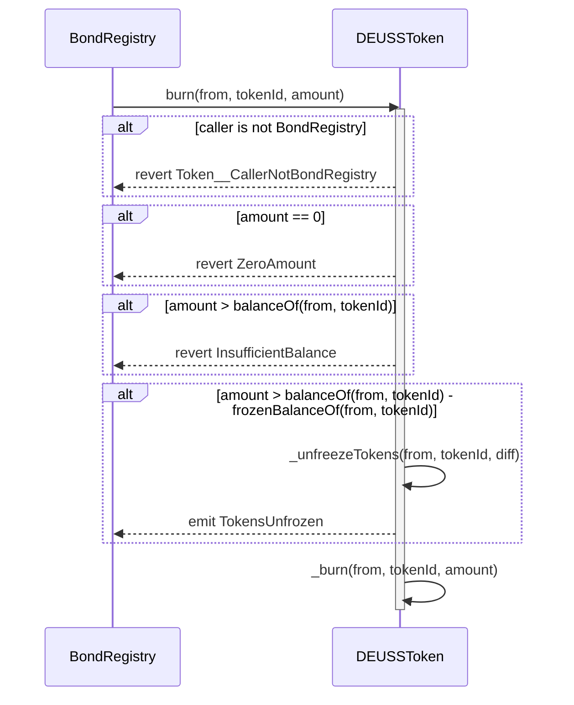

### freezePartialTokens(address account, uint256 tokenId, uint256 amount)

Freezes a specified amount of tokens for an account.

**Prerequisites:**
- Freezer must have `TOKEN_FREEZER_ROLE`
- Contract must not be paused
- Account must not be a protected custody address
- Account must have sufficient balance

**Parameters:**
- `account`: Address to freeze tokens for
- `tokenId`: Token ID to freeze
- `amount`: Amount of tokens to freeze

**Events:**
- `TokensFrozen(address, uint256, uint256)`: Emitted when tokens are frozen

**State impact:**
- Updates frozen-balance checkpoints for `(account, tokenId)` at `block.number`

**Errors:**
- `Ownable.Unauthorized`: When caller lacks `TOKEN_FREEZER_ROLE`
- `PausableUpgradeable.EnforcedPause()`: When contract is paused
- `Token__ZeroAmount()`: When amount is zero
- `Token__AddressProtected(address)`: When `account` is a protected custody address
- `Token__InsufficientBalance()`: When total frozen would exceed balance

**Sequence Diagram:**
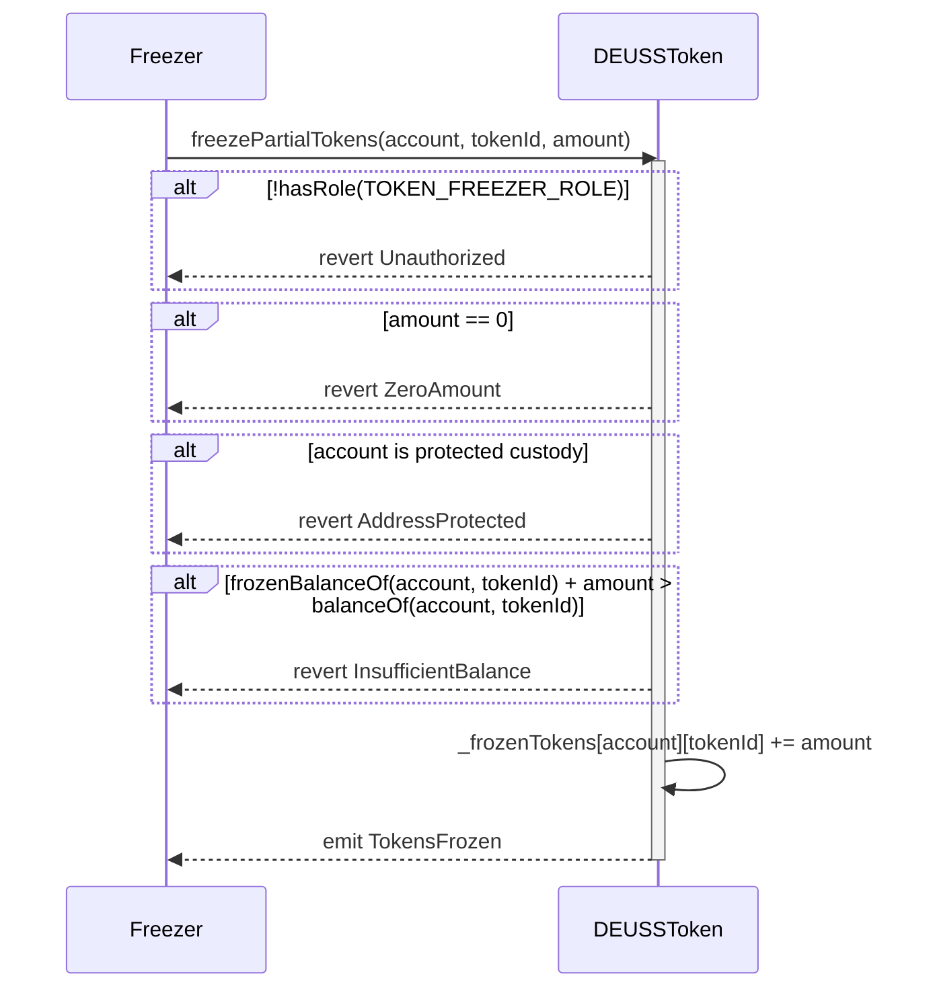

### unfreezePartialTokens(address account, uint256 tokenId, uint256 amount)

Unfreezes a specified amount of tokens for an account.

**Prerequisites:**
- Freezer must have `TOKEN_FREEZER_ROLE`
- Contract must not be paused
- Account must have sufficient frozen balance

**Parameters:**
- `account`: Address to unfreeze tokens for
- `tokenId`: Token ID to unfreeze
- `amount`: Amount of tokens to unfreeze

**Events:**
- `TokensUnfrozen(address, uint256, uint256)`: Emitted when tokens are unfrozen

**State impact:**
- Updates frozen-balance checkpoints for `(account, tokenId)` at `block.number`

**Errors:**
- `Ownable.Unauthorized`: When caller lacks `TOKEN_FREEZER_ROLE`
- `PausableUpgradeable.EnforcedPause()`: When contract is paused
- `Token__ZeroAmount()`: When amount is zero
- `Token__InsufficientBalance()`: When account has insufficient frozen balance

**Sequence Diagram:**
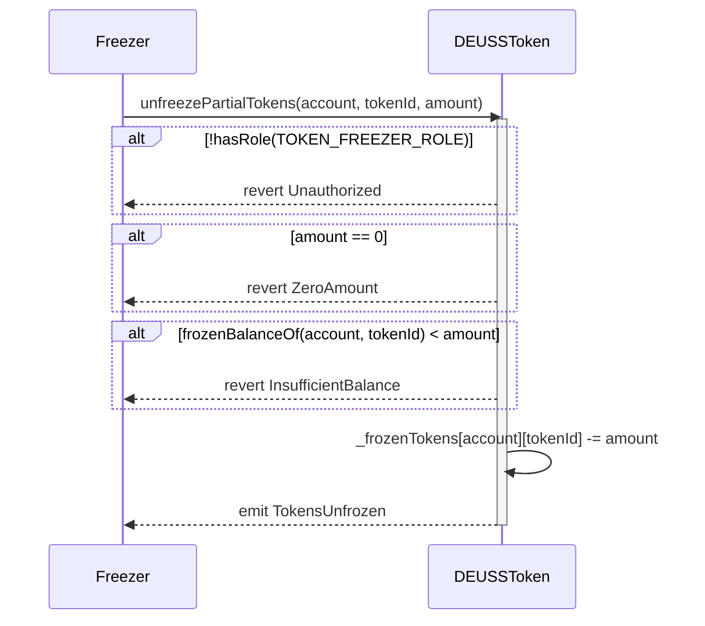

### forcedTransfer(address from, address to, uint256 tokenId, uint256 amount)
Forces transfer from one address to the receiver address.

**Prerequisites:**
- Sender must have `FORCE_TRANSFER_ROLE`
- Sender (caller) must be an enabled wallet in EntityRegistry
- `from` must have sufficient balance
- `from` may be disabled in EntityRegistry to support protocol recovery from blocked accounts
- `to` must be an enabled wallet in EntityRegistry
- `to` must not be protected custody
- If needed, frozen tokens will be unfrozen to complete the transfer

**Parameters:**
- `from`: Address to transfer tokens from
- `to`: Receiver address
- `tokenId`: Token ID to transfer
- `amount`: Tokens amount to transfer

**Errors:**
- `Ownable.Unauthorized`: When caller lacks the required role
- `Token__CallerNotEnabled(address)`: When the caller is not an enabled wallet in EntityRegistry
- `Token__ZeroAmount()`: When amount is zero
- `Token__TransferNotAllowed(address, address, uint256)`: When `to` is not enabled in EntityRegistry
- `Token__ProtectedReceiverTransferNotAllowed(address,address,address,uint256)`: When `to` is protected custody
- `Token__InsufficientBalance()`: When user has insufficient balance

**Sequence Diagram:**
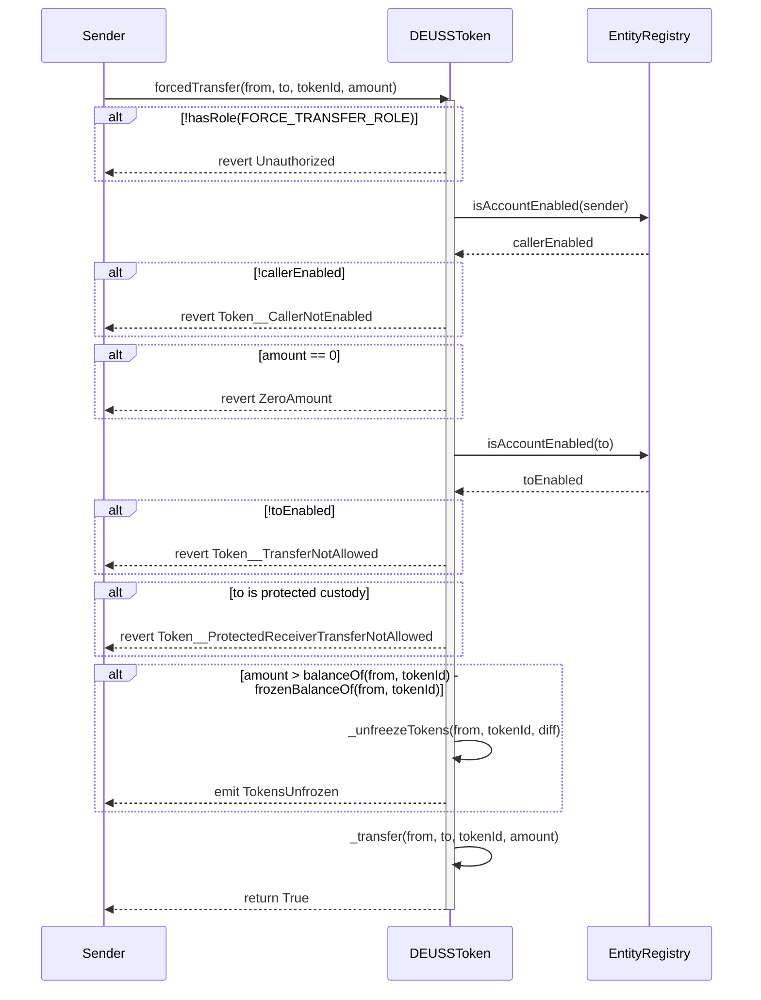

### protectAddress(address account)

Permanently marks a custody address as protected from privileged outbound token movement.

**Prerequisites:**
- Caller must be owner
- `account` must be non-zero
- `account` must not already be protected

**State impact:**
- Sets `isAddressProtected(account) == true`
- There is no unprotect function

**Events:**
- `ProtectedAddressSet(account, true)`

**Errors:**
- `Unauthorized()`: When caller is not owner
- `ZeroAddress()`: When `account` is zero
- `Token__AddressAlreadyProtected(address)`: When the address is already protected

**Important Notes:**
- Protected addresses cannot be the `from` address for `forcedTransfer`, `batchForcedTransfer`, `burn`, or `burnBatch`.
- Protected addresses cannot be the `to` address for `forcedTransfer` or `batchForcedTransfer`.
- Other accounts cannot push tokens into protected custody. Approved custody flows remain available when the protected address pulls tokens as the transfer caller, as `EscrowManager` does during escrow creation.

### isAddressProtected(address account)

Returns whether `account` has been marked as protected custody.

### approve(address spender, uint256 tokenId, uint256 amount)

Overrides `BaseToken.approve` to keep allowance revocation available while preserving the registry approval policy for new spend permissions.

**Behavior:**
- `amount != 0` delegates to `BaseToken.approve`, which follows ERC-6909 set semantics and overwrites any existing allowance after `EntityRegistry.canApprove(owner, spender, tokenId, amount)` passes.
- `amount == 0` clears the allowance directly and remains allowed even if the owner or spender is no longer enabled.

### setOperator(address spender, bool approved)

Grants or revokes global ERC-6909 operator approval for `spender`.

**Prerequisites when `approved == true`:**
- Contract must not be paused
- Owner and spender must be allowed by `EntityRegistry.canApprove(owner, spender, 0, 0)`

**Revocation:**
- `approved == false` remains allowed even if the owner or operator is no longer enabled, so stale operator approvals can always be removed.

**Errors:**
- `Token__OperatorNotEnabled(address)`: When a new operator approval is not allowed by the EntityRegistry approval policy

### transferFrom(address from, address to, uint256 tokenId, uint256 amount)

Performs a transfer from one address to the receiver address.

**Prerequisites:**
- Token ID must not be paused
- Transfer must be allowed by EntityRegistry
- `from` must have sufficient unfrozen balance
- `from` must be an enabled wallet in EntityRegistry
- `to` must be an enabled wallet in EntityRegistry
- `caller` must be an enabled wallet in EntityRegistry

**Parameters:**
- `from`: Address to transfer tokens from
- `to`: Receiver address
- `tokenId`: Token ID to transfer
- `amount`: Tokens amount to transfer

**Errors:**
- `Token__ZeroAmount()`: When amount is zero
- `Token__TokenIdIsPaused(uint256)`: When token ID is paused
- `Token__TransferNotAllowed(address, address, uint256)`: When EntityRegistry does not allow the transfer
- `Token__InsufficientBalance()`: When user has insufficient unfrozen balance
- `Token__ProtectedReceiverTransferNotAllowed(address,address,address,uint256)`: When another caller attempts to push tokens into a protected receiver

**Sequence Diagram:**
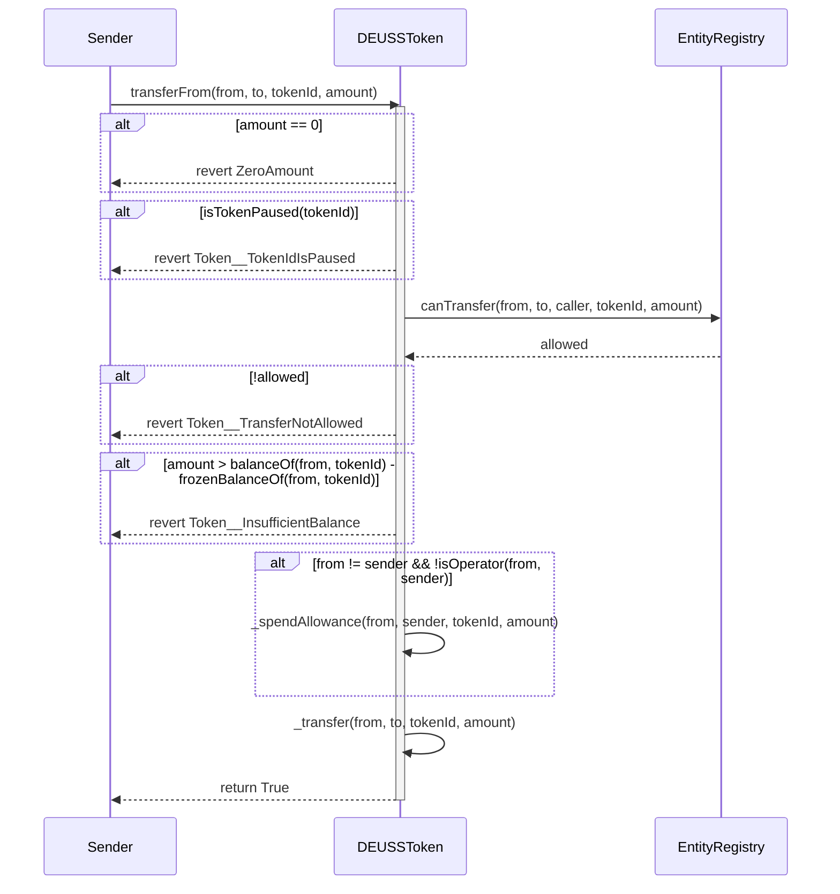

### transfer(address receiver, uint256 tokenId, uint256 amount)
Transfer a specified amount of token type `tokenId` from the caller's account to the receiver address.

**Parameters:**
- `receiver`: Receiver address
- `tokenId`: Token ID to transfer
- `amount`: Tokens amount to transfer

> [!NOTE]
> This function calls **DEUSSToken** function ***transferFrom(address from, address to, uint256 tokenId, uint256 amount)*** and automatically sets `from` to `msg.sender`.

## Batch Operations

### batchForcedTransfer(address[] calldata froms, address[] calldata tos, uint256 tokenId, uint256[] calldata amounts)
Forces multiple transfers between addresses for a given token ID.

**Prerequisites:**
- Sender must have `FORCE_TRANSFER_ROLE`
- Sender (caller) must be an enabled wallet in EntityRegistry
- Arrays must have matching lengths
- `froms` must have sufficient balances
- `tos` must be enabled wallets in EntityRegistry
- `tos` must not include protected custody addresses
- `froms` may include disabled wallets to support protocol recovery from blocked accounts
- If needed, frozen tokens will be unfrozen to complete each transfer

**Parameters:**
- `froms`: Array of addresses from which to transfer tokens
- `tos`: Array of receiver addresses
- `tokenId`: Token ID to transfer
- `amounts`: Array of token amounts to transfer

**Errors:**
- `Ownable.Unauthorized`: When caller lacks the required role
- `Token__CallerNotEnabled(address)`: When the caller is not an enabled wallet in EntityRegistry
- `Token__InvalidArrayLength()`: When arrays lengths don't match
- `Token__ZeroAmount()`: When amount is zero
- `Token__TransferNotAllowed(address, address, uint256)`: When `to` is not an enabled wallet in EntityRegistry
- `Token__ProtectedReceiverTransferNotAllowed(address,address,address,uint256)`: When any `to` is protected custody
- `Token__InsufficientBalance()`: When user has insufficient balance

**Sequence Diagram:**
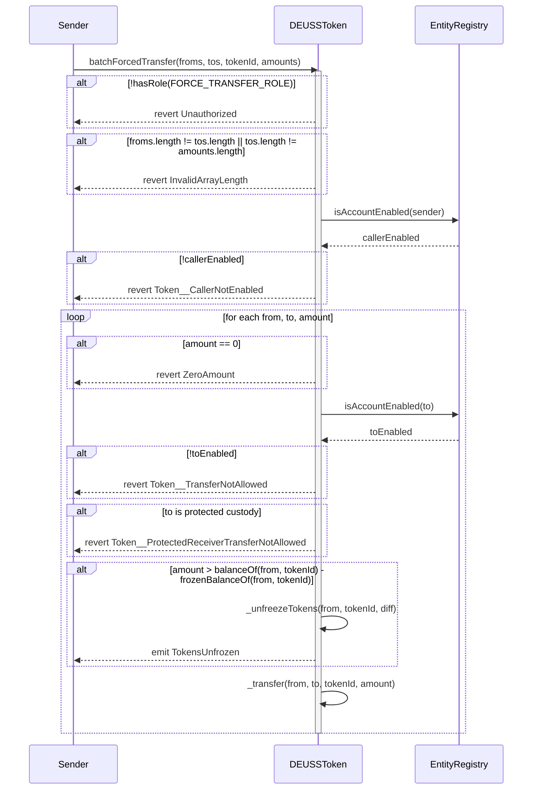

### batchTransferFrom(address from, address to, uint256[] calldata tokenIds, uint256[] calldata amounts)

Transfers multiple token IDs from one address to a single recipient.

**Prerequisites:**
- Arrays must have matching lengths
- Each token ID must not be paused
- Each transfer must be allowed by EntityRegistry
- `from` must have sufficient unfrozen balance for each token ID
- `from` must be an enabled wallet in EntityRegistry
- `to` must be an enabled wallet in EntityRegistry
- `caller` must be an enabled wallet in EntityRegistry

**Parameters:**
- `from`: Address to transfer tokens from
- `to`: Receiver address
- `tokenIds`: Array of token IDs to transfer
- `amounts`: Array of token amounts to transfer for each token ID

**Errors:**
- `Token__InvalidArrayLength()`: When arrays lengths don't match
- `Token__ZeroAmount()`: When amount is zero
- `Token__TokenIdIsPaused(uint256)`: When a token ID is paused
- `Token__TransferNotAllowed(address, address, uint256)`: When EntityRegistry does not allow the transfer
- `Token__InsufficientBalance()`: When user has insufficient unfrozen balance

**Sequence Diagram:**

### batchTransferFrom(address from, address[] calldata tos, uint256 tokenId, uint256[] calldata amounts)

Transfers a single token ID from one address to multiple recipients.

**Prerequisites:**
- Arrays must have matching lengths
- Token ID must not be paused
- Each transfer must be allowed by EntityRegistry
- `from` must have sufficient unfrozen balance
- `from` must be an enabled wallet in EntityRegistry
- `tos` must be an enabled wallet in EntityRegistry

**Parameters:**
- `from`: Address to transfer tokens from
- `tos`: Array of receiver addresses
- `tokenId`: Token ID to transfer
- `amounts`: Array of token amounts to transfer to each receiver

**Errors:**
- `Token__InvalidArrayLength()`: When arrays lengths don't match
- `Token__ZeroAmount()`: When amount is zero
- `Token__TokenIdIsPaused(uint256)`: When token ID is paused
- `Token__TransferNotAllowed(address, address, uint256)`: When EntityRegistry does not allow the transfer
- `Token__InsufficientBalance()`: When user has insufficient unfrozen balance

**Sequence Diagram:**
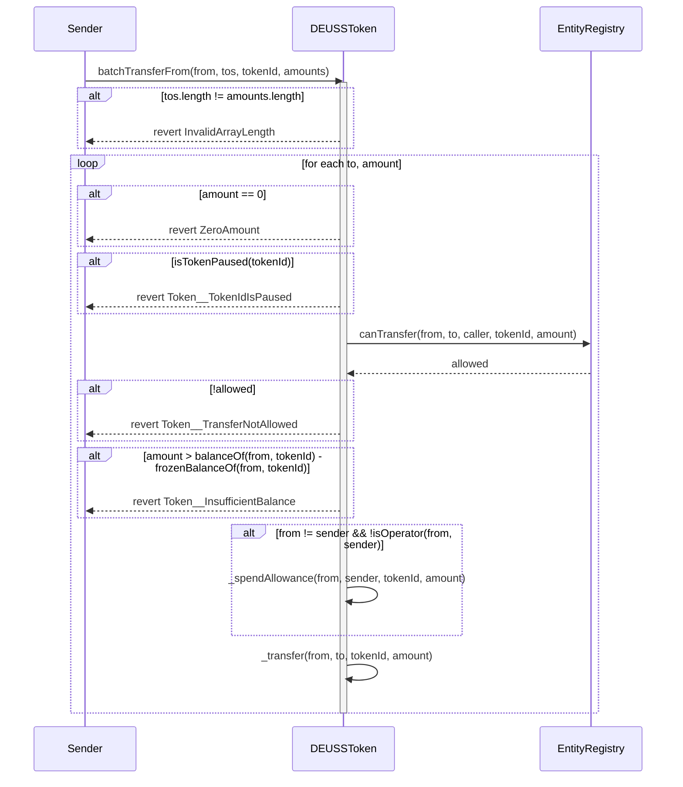

### batchFreezePartialTokens(address[] calldata wallets, uint256 tokenId, uint256[] calldata amounts)

Freezes tokens for multiple wallets in a single transaction.

**Prerequisites:**
- Freezer must have `TOKEN_FREEZER_ROLE`
- Contract must not be paused
- Arrays must have matching lengths
- No wallet may be a protected custody address
- Each wallet must have sufficient balance

**Parameters:**
- `wallets`: Array of wallet addresses
- `tokenId`: Token ID to freeze
- `amounts`: Array of token amounts to freeze

**Events:**
- `TokensFrozen(address, uint256, uint256)`: Emitted for each wallet when tokens are frozen

**State impact:**
- Updates frozen-balance checkpoints for each `(wallet, tokenId)` at `block.number`

**Errors:**
- `Ownable.Unauthorized`: When caller lacks the required role
- `PausableUpgradeable.EnforcedPause()`: When contract is paused
- `Token__InvalidArrayLength()`: When arrays lengths don't match
- `Token__ZeroAmount()`: When amount is zero
- `Token__AddressProtected(address)`: When a wallet is a protected custody address
- `Token__InsufficientBalance()`: When wallet has insufficient balance

**Sequence Diagram:**
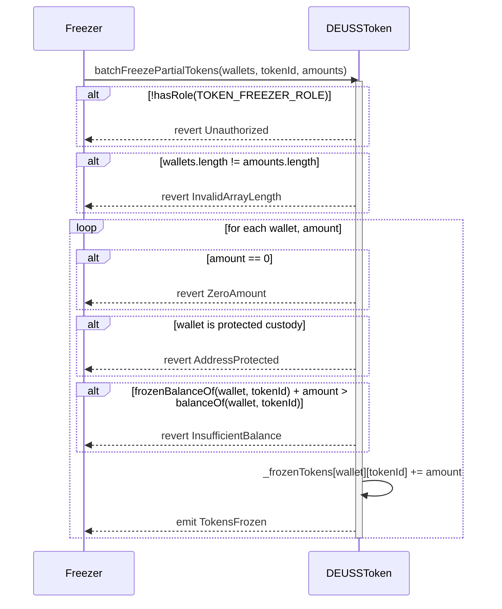

### batchUnfreezePartialTokens(address[] calldata wallets, uint256 tokenId, uint256[] calldata amounts)

Unfreezes tokens for multiple wallets in a single transaction.

**Prerequisites:**
- Freezer must have `TOKEN_FREEZER_ROLE`
- Contract must not be paused
- Arrays must have matching lengths
- Each wallet must have sufficient frozen tokens

**Parameters:**
- `wallets`: Array of wallet addresses
- `tokenId`: Token ID to unfreeze
- `amounts`: Array of token amounts to unfreeze

**Events:**
- `TokensUnfrozen(address, uint256, uint256)`: Emitted for each wallet when tokens are unfrozen

**State impact:**
- Updates frozen-balance checkpoints for each `(wallet, tokenId)` at `block.number`

**Errors:**
- `Ownable.Unauthorized`: When caller lacks the required role
- `PausableUpgradeable.EnforcedPause()`: When contract is paused
- `Token__InvalidArrayLength()`: When arrays lengths don't match
- `Token__ZeroAmount()`: When amount is zero
- `Token__InsufficientBalance()`: When wallet has insufficient frozen tokens

**Sequence Diagram:**
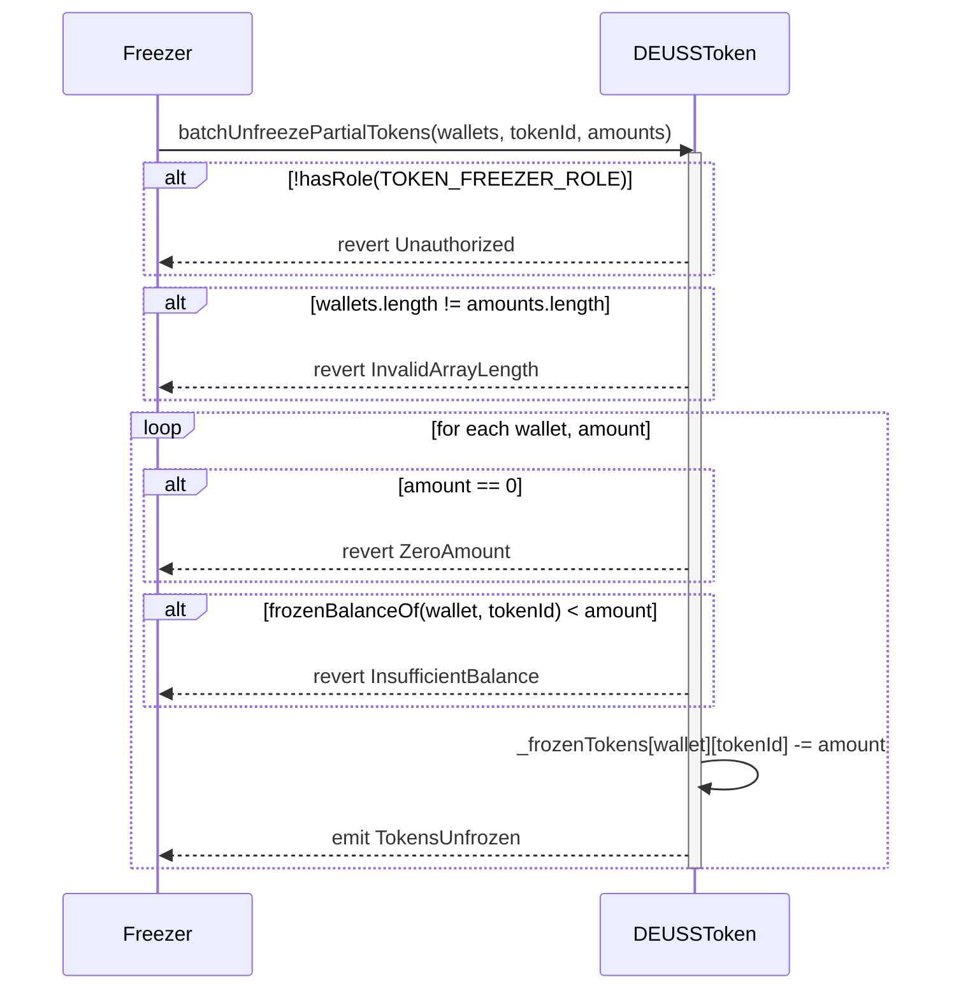

### burnBatch(address[] calldata froms, uint256 tokenId, uint256[] calldata amounts)

Burns tokens from multiple addresses in a single transaction.

**Prerequisites:**
- Caller must be `BondRegistry`
- Arrays must have matching lengths
- Users must have sufficient balances
- `froms` may include disabled wallets to support protocol recovery burns
- If permitted by the registry burn kind, frozen tokens may be unfrozen to complete each burn
- `ISSUER_RECLAIM` is constrained in `BondRegistry` to unfrozen issuer balance and will not consume frozen inventory

**Parameters:**
- `froms`: Array of addresses from which to burn tokens
- `tokenId`: Token ID to burn
- `amounts`: Array of token amounts to burn

**Events:**
- `TokensUnfrozen(address, uint256, uint256)`: Emitted when frozen tokens are unfrozen for burning

**Errors:**
- `Token__CallerNotBondRegistry(address)`: When caller is not the BondRegistry
- `Token__InvalidArrayLength()`: When arrays lengths don't match
- `Token__ZeroAmount()`: When amount is zero
- `Token__InsufficientBalance()`: When account has insufficient balance

**Sequence Diagram:**
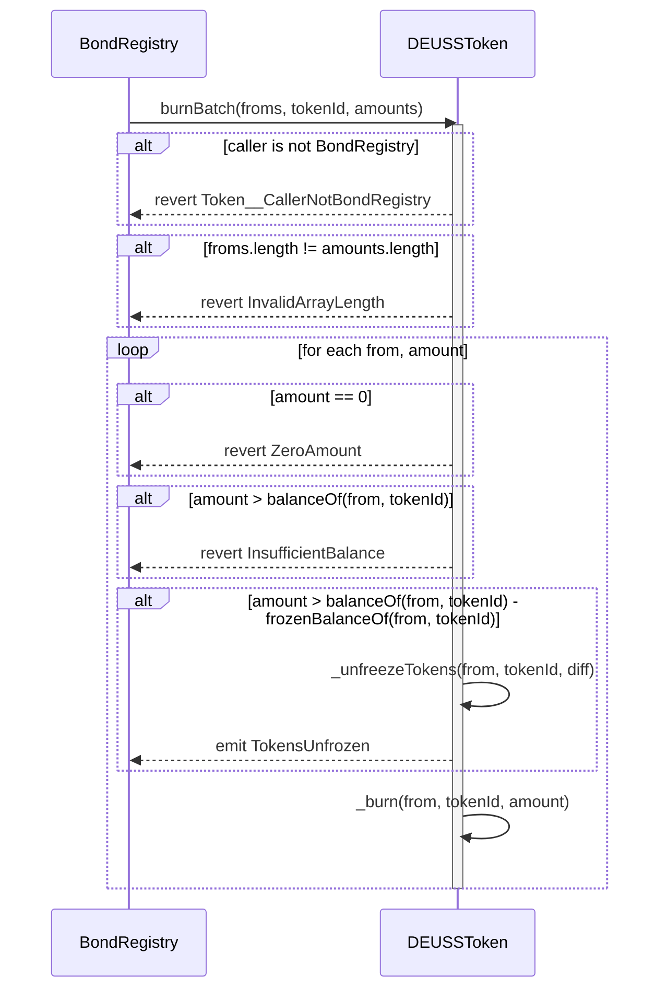

## Administrative Functions

### initialize(address owner_, address bondRegistry_, address entityRegistry_, address escrowManager_)

Initializes the contract with owner, bond registry, entity registry, and protected EscrowManager custody addresses.

**Prerequisites:**
- Contract must not be already initialized
- `escrowManager_` must be non-zero and not already protected

**Parameters:**
- `owner_`: Address of the contract owner
- `bondRegistry_`: Address of the bond registry contract
- `entityRegistry_`: Address of the entity registry contract
- `escrowManager_`: EscrowManager custody address to protect during initialization

**Events:**
- `ProtectedAddressSet(escrowManager_, true)`

**Errors:**
- `ZeroAddress()`: When `escrowManager_`, `bondRegistry_`, or `entityRegistry_` is zero
- `Token__AddressAlreadyProtected(address)`: When `escrowManager_` is already protected

**Sequence Diagram:**
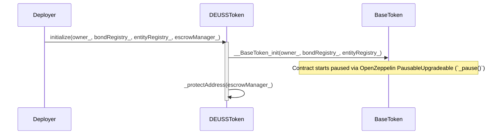

## View Functions

### totalSupply(uint256 tokenId)

Returns the total supply of a given token ID.

**Parameters:**
- `tokenId`: Token ID to query

**Returns:**
- `uint256`: Total token supply for the given token ID

### balanceOfAt(address account, uint256 tokenId, uint256 blockNumber)
Returns an account historical balance for a token ID at a specific block.

**Parameters:**
- `account`: Address to query
- `tokenId`: Token ID to query
- `blockNumber`: Block number to query

**Returns:**
- `uint256`: Account balance at or before `blockNumber`

**Errors:**
- `Token__BlockInFuture(uint256 currentBlock, uint256 queriedBlock)`: When `blockNumber` is greater than the current block

### totalSupplyAt(uint256 tokenId, uint256 blockNumber)
Returns historical total supply for a token ID at a specific block.

**Parameters:**
- `tokenId`: Token ID to query
- `blockNumber`: Block number to query

**Returns:**
- `uint256`: Total supply at or before `blockNumber`

**Errors:**
- `Token__BlockInFuture(uint256 currentBlock, uint256 queriedBlock)`: When `blockNumber` is greater than the current block

### frozenBalanceOfAt(address account, uint256 tokenId, uint256 blockNumber)
Returns historical frozen balance for an account/token ID at a specific block.

**Parameters:**
- `account`: Address to query
- `tokenId`: Token ID to query
- `blockNumber`: Block number to query

**Returns:**
- `uint256`: Frozen balance at or before `blockNumber`

**Errors:**
- `Token__BlockInFuture(uint256 currentBlock, uint256 queriedBlock)`: When `blockNumber` is greater than the current block

### availableBalanceOfAt(address account, uint256 tokenId, uint256 blockNumber)
Returns historical available (transferable) balance for an account/token ID at a specific block.

**Computation:**
- `available = balanceOfAt(account, tokenId, blockNumber) - frozenBalanceOfAt(account, tokenId, blockNumber)`
- If invariant drift ever occurs, the function returns `0` instead of underflowing.

**Parameters:**
- `account`: Address to query
- `tokenId`: Token ID to query
- `blockNumber`: Block number to query

**Returns:**
- `uint256`: Available balance at or before `blockNumber`

**Errors:**
- `Token__BlockInFuture(uint256 currentBlock, uint256 queriedBlock)`: When `blockNumber` is greater than the current block

### supportsInterface(bytes4 interfaceId)
Indicates whether the contract supports a given interface, as per ERC-165.

**Parameters:**
- `interfaceId`: The interface identifier, as specified in ERC-165

**Returns:**
- `bool`: True if the contract implements the requested interface, false otherwise
