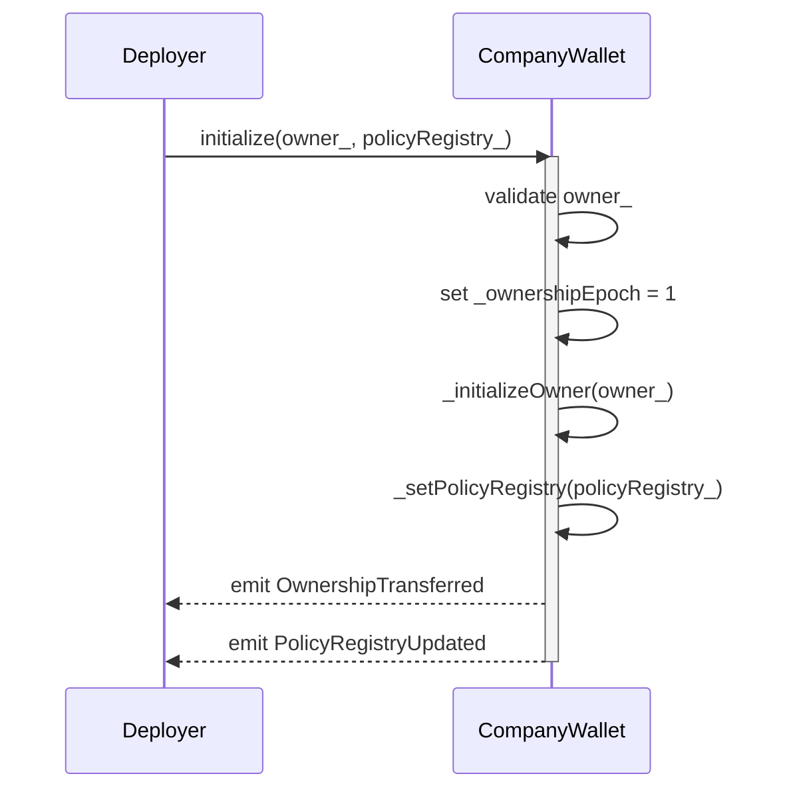
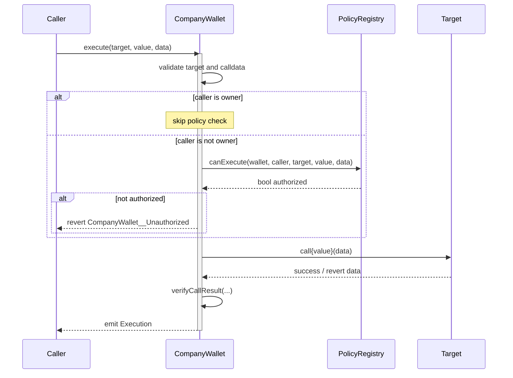
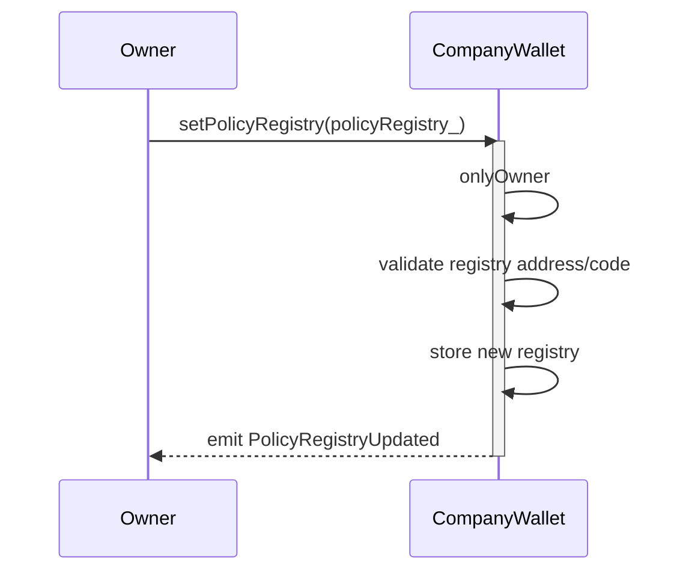
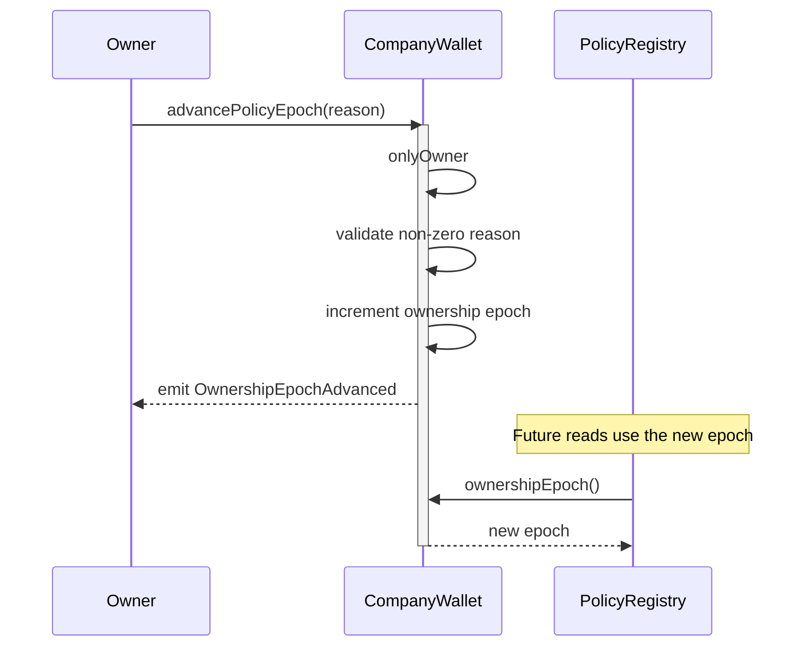

# CompanyWallet Documentation

## Overview
`CompanyWallet` is a minimal execution wallet for DEUSS company accounts.

It is intentionally narrow in scope:
- stores wallet ownership,
- stores the active `PolicyRegistry`,
- accepts native currency,
- accepts ERC-721 and ERC-1155 safe transfers,
- executes arbitrary external calls,
- lets the owner manually advance the policy epoch for incident recovery,
- delegates non-owner authorization to `PolicyRegistry`.

The wallet does not store execution roles, operation-role mappings, delegated policy admins, or template state.
It also does not call `EntityRegistry` during runtime authorization.

Operational deployment patterns, including the recommended **Root-Controlled Subwallet Mode** for broker and custodian wallet fleets, are documented in the [`security operational model`](../security/wallet-operational-modes.md).

## Prerequisites
- Contract is deployed as the implementation behind the CompanyWallet beacon.
- Proxy instance must be initialized through `initialize(owner, policyRegistry)`.
- `owner` must be a non-zero address.
- `policyRegistry` must be a deployed contract address implementing `IPolicyRegistry`.
- Non-owner execution requires the configured policy registry to allow the call.

## Contract Architecture
`CompanyWallet` inherits:
- `ICompanyWallet`
- `CompanyWalletStorage`
- `Ownable`
- `ReentrancyGuard`
- `Initializable`
- `ERC721Holder`
- `ERC1155Holder`

Key architecture decisions:
- Owner is the root authority and bypasses external policy checks.
- Non-owner execution is delegated to `PolicyRegistry.canExecute(wallet, caller, target, value, data)`.
- Call validation remains local to the wallet because it is execution hygiene, not business policy.
- Native currency can be deposited directly via `receive()` or forwarded atomically through `execute(...)`.
- ERC-721 and ERC-1155 assets can be deposited through standard `safeTransferFrom(...)` flows.
- Revert data from downstream calls is bubbled up through `Address.verifyCallResult`.
- The wallet rejects self-calls, zero targets, EOAs, and calldata shorter than 4 bytes.
- Pure native transfers to EOAs are not supported by `execute(...)` because the target must be a contract and calldata must contain at least a function selector.
- An ownership epoch counter (`_ownershipEpoch`) is incremented on every successful ownership transfer and can be manually advanced by the owner through `advancePolicyEpoch(bytes32 reason)`, allowing `PolicyRegistry` to scope all wallet-local policy state by `(wallet, epoch)`. Old policy state becomes unreachable in O(1) without any enumeration.
- `renounceOwnership()` is disabled. Non-owner callers fail the inherited `onlyOwner` check; owner callers revert with `CompanyWallet__RenounceOwnershipDisabled`.

Owner bypass is intentionally transitive. If the wallet owner is another smart account, multisig, Kernel account, or `CompanyWallet`, calls forwarded by that owner are owner calls from this wallet's perspective. Parent-level delegates that can make the owner call this wallet's generic `execute(...)` path can therefore receive broad downstream authority unless the parent policy uses a calldata-aware module. See the [`security operational model`](../security/wallet-operational-modes.md) for the operational controls.

## Authorization Model

### Owner
Owner can:
- call `execute(...)` without `PolicyRegistry`,
- rotate the policy registry via `setPolicyRegistry(...)`,
- manually advance the policy epoch to invalidate previous delegated policy state,
- transfer wallet ownership through inherited `Ownable` flow.

When the owner is a smart contract, its own delegates, modules, session keys, or multisig policy are outside the child wallet's visibility. The child wallet trusts the owner address, not the original actor behind the owner call.

### Non-owner caller
Non-owner can execute only when:
- `target` is valid,
- `data.length >= 4`,
- `PolicyRegistry.canExecute(...)` returns `true`.

### Out of scope
`CompanyWallet` intentionally does not enforce:
- entity enablement checks,
- wallet-scoped role management,
- template logic,
- module routing,
- calldata-aware policy validation.

Those concerns live in `PolicyRegistry` or elsewhere in the protocol.

## Core Functions

### initialize(address owner_, address policyRegistry_)
Initializes a wallet proxy.

**Prerequisites:**
- Function is called only once.
- `owner_ != address(0)`.
- `policyRegistry_` is a deployed contract.

**Parameters:**
- `owner_`: Root wallet owner.
- `policyRegistry_`: External authorization registry.

**Events:**
- `OwnershipTransferred(address oldOwner, address newOwner)` via `Ownable`
- `PolicyRegistryUpdated(address previousPolicyRegistry, address newPolicyRegistry)`

**Errors:**
- `ZeroAddress()`: `owner_` is zero.
- `CompanyWallet__InvalidPolicyRegistry(address)`: registry is zero or has no code.
- `CompanyWallet__UnsupportedPolicyRegistry(address)`: registry does not support `IPolicyRegistry`.

**Notes:**
- Sets `_ownershipEpoch` to `1` on first initialization. Existing beacon proxy instances upgraded from a pre-epoch implementation start at `0`; their epoch is incremented on the first ownership transfer.

**Sequence Diagram:**

### execute(address target, uint256 value, bytes calldata data)
Executes an external call from the wallet.

**Prerequisites:**
- `target != address(0)`
- `target != address(this)`
- `target.code.length != 0`
- `msg.value == 0 || msg.value == value`
- `data.length >= 4`
- If caller is not owner, `PolicyRegistry.canExecute(...)` must return `true`

**Parameters:**
- `target`: Call target.
- `value`: Native value forwarded with the call.
- `data`: Encoded function call.

**Events:**
- `Execution(address caller, address target, uint256 value, bytes data, bytes returnData)`

**Errors:**
- `CompanyWallet__InvalidCallTarget()`: target is zero, self, or non-contract.
- `CompanyWallet__MsgValueMismatch()`: `msg.value` is non-zero but does not match the forwarded `value`.
- `CompanyWallet__InvalidCallData()`: calldata is shorter than selector length.
- `CompanyWallet__Unauthorized()`: non-owner call is rejected by the policy registry.
- Propagated downstream revert from `target.call(...)`.

**Notes:**
- The wallet does not know whether the registry used only bitmap RBAC or an additional policy module.
- The wallet remains policy-agnostic and only consumes the final authorization result.
- When `sender == owner()`, `PolicyRegistry` is not consulted. If the owner is another wallet or smart account, this includes forwarded owner calls.
- `msg.value == value` enables same-transaction funding and forwarding.
- `msg.value == 0` allows spending ETH already held by the wallet.
- Spending existing wallet ETH is intentional for contract calls. For example, a caller may pass `msg.value == 0` and `value > 0` if the wallet already has enough native balance.
- `execute(...)` cannot be used for a plain ETH transfer to an EOA because EOA targets and empty calldata are rejected.

**Sequence Diagram:**

### setPolicyRegistry(address policyRegistry_)
Updates the active external policy registry.

**Prerequisites:**
- Caller is wallet owner.
- `policyRegistry_` is a deployed contract implementing `IPolicyRegistry`.

**Parameters:**
- `policyRegistry_`: New policy registry.

**Events:**
- `PolicyRegistryUpdated(address previousPolicyRegistry, address newPolicyRegistry)`

**Errors:**
- `CompanyWallet__InvalidPolicyRegistry(address)`: registry is zero or has no code.
- `CompanyWallet__UnsupportedPolicyRegistry(address)`: registry does not support `IPolicyRegistry`.

**Sequence Diagram:**

### advancePolicyEpoch(bytes32 reason)
Manually advances the epoch used by `PolicyRegistry` to scope wallet-local policy state.

**Prerequisites:**
- Caller is wallet owner.
- `reason != bytes32(0)`.

**Parameters:**
- `reason`: Opaque owner-supplied reason code for auditability. Use a stable value such as `keccak256("KERNEL_RECOVERY")` for recovery playbooks.

**Events:**
- `OwnershipEpochAdvanced(uint256 previousEpoch, uint256 newEpoch, bytes32 reason, address caller)`

**Errors:**
- `CompanyWallet__ZeroPolicyEpochReason()`: reason is zero.

**Notes:**
- This function does not change the wallet owner.
- It invalidates previous-epoch delegated policy admins, user roles, operation roles, and operation modules because `PolicyRegistry` reads the current epoch from the wallet.
- Same-address smart-account recovery flows, such as Kernel controller recovery, should call this function after recovery when existing wallet delegates must be cleared.
- Normal recovery can skip this function when preserving existing delegated policy is intended.

**Sequence Diagram:**

### policyRegistry()
Returns the current policy registry address.

### receive()
Accepts direct native currency transfers into the wallet.

**Events:**
- `NativeReceived(address sender, uint256 amount)`

**Notes:**
- Native currency received here can be forwarded later only through a valid contract call via `execute(...)`.
- Solidity `.transfer(...)` and `.send(...)` forward only the 2300-gas stipend and may fail because `receive()` emits `NativeReceived`; use `.call{value: amount}("")` with sufficient gas for direct deposits.

### onERC721Received(address, address, uint256, bytes)
Accepts ERC-721 safe transfers.

**Notes:**
- The hook returns the ERC-721 receiver selector.
- The wallet does not apply policy checks on incoming token receipts; policy checks apply when moving assets out through `execute(...)`.

### onERC1155Received(address, address, uint256, uint256, bytes)
Accepts single-token ERC-1155 safe transfers.

**Notes:**
- The hook returns the ERC-1155 single-token receiver selector.
- The wallet does not apply policy checks on incoming token receipts; policy checks apply when moving assets out through `execute(...)`.

### onERC1155BatchReceived(address, address, uint256[], uint256[], bytes)
Accepts batch ERC-1155 safe transfers.

**Notes:**
- The hook returns the ERC-1155 batch receiver selector.
- The wallet does not apply policy checks on incoming token receipts; policy checks apply when moving assets out through `execute(...)`.

### owner()
Returns the current wallet owner.

### ownershipEpoch()
Returns the current ownership epoch. Starts at `1` for new wallets. Incremented by `1` on every successful ownership transfer (`transferOwnership` or `completeOwnershipHandover`) and on every successful `advancePolicyEpoch(bytes32 reason)` call.

`PolicyRegistry` reads this value to scope all wallet-local policy state by `(wallet, epoch)`. When the epoch advances, all previous policy state (admins, user roles, operation roles, operation modules) becomes unreachable without any enumeration or deletion.

**Events:**
- `OwnershipEpochAdvanced(uint256 previousEpoch, uint256 newEpoch, bytes32 reason, address caller)` — emitted whenever the epoch advances. `reason` is `bytes32(0)` for ordinary ownership transfers and the owner-supplied value for manual policy epoch advances.

### transferOwnership(address newOwner)
Transfers wallet ownership to `newOwner` and advances `_ownershipEpoch`.

**Errors:**
- `CompanyWallet__OwnerTransferToSelf()`: `newOwner` is the current owner.
- `NewOwnerIsZeroAddress()` (solady): `newOwner` is `address(0)`.

### completeOwnershipHandover(address pendingOwner)
Completes a pending two-step ownership handover initiated by `pendingOwner` and advances `_ownershipEpoch`.

**Notes:**
- Handover requests expire after 48 hours (solady default).
- New owners should call `cancelOwnershipHandover` for any pending requesters they do not intend to honour, as completing an unexpected handover advances the epoch and wipes the current policy state.

### renounceOwnership()
Ownership cannot be renounced; the wallet must always have an owner.

**Errors:**
- `Unauthorized()` from Solady `Ownable`: non-owner caller fails `onlyOwner` before the function body.
- `CompanyWallet__RenounceOwnershipDisabled()`: owner caller reaches the disabled function body.

### supportsInterface(bytes4 interfaceId)
Reports support for `ICompanyWallet`, `IERC165`, `IERC721Receiver`, and `IERC1155Receiver`.

## Trust Boundary
- `CompanyWallet` is trusted to custody assets and forward calls.
- Wallet owner is trusted as the ultimate recovery and administration authority.
- `PolicyRegistry` is trusted for non-owner authorization.
- Optional policy modules are not trusted directly by the wallet; they are only consumed through `PolicyRegistry`.
- `EntityRegistry` is intentionally outside the wallet execution path.
- Native-currency support is generic EVM compatibility. The primary EBSI deployment target is gasless, so native balances should be treated as operational edge cases unless a deployment explicitly relies on them.
- ERC-721 and ERC-1155 receiver hooks are passive custody hooks. Any direct token deposits must be managed or recovered through authorized wallet execution.
