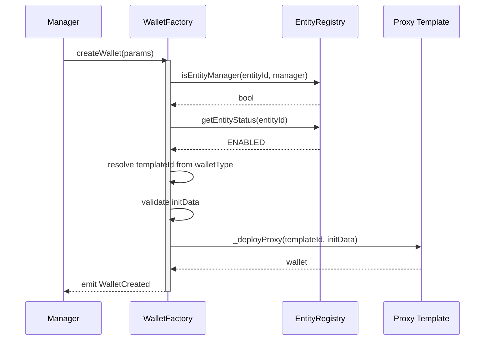
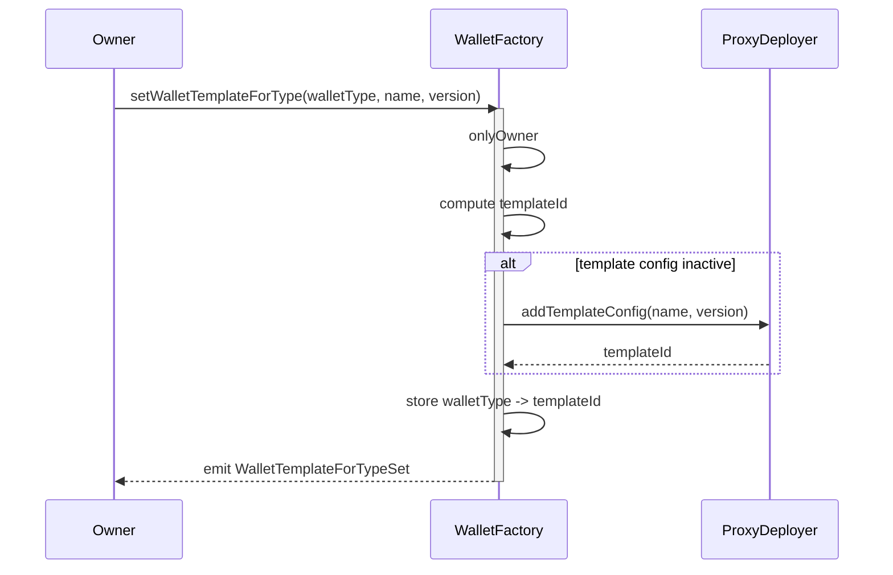

# WalletFactory Documentation

## Overview
`WalletFactory` deploys entity-scoped wallet proxies using EBSI template infrastructure.

Its role is intentionally limited to deployment-time concerns:
- checks entity-manager authorization in `EntityRegistry`,
- checks entity status,
- resolves a template by `walletType`,
- forwards caller-provided `initData` to the proxy deployment flow.

The factory is generic with respect to wallet initialization shape. It does not build `CompanyWallet` init payloads internally.

## Prerequisites
- Proxy is initialized with non-zero `entityRegistry` and `owner`.
- `entityRegistry` must implement `IEntityRegistry`.
- Proxy templates are configured for each supported `walletType`.
- Caller is an entity manager for `params.entityId`.
- Registered manager accounts must remain enabled and linked to `params.entityId`; disabling, removing, or transferring the account invalidates stale manager authority in `EntityRegistry`.
- Entity for `params.entityId` is `ENABLED`.
- `params.initData` is non-empty and valid for the selected wallet template.

## Contract Architecture
`WalletFactory` inherits:
- `IWalletFactory`
- `WalletFactoryStorage`
- `ProxyDeployer`
- `ReentrancyGuard`
- `Initializable`

Key architecture decisions:
- Deployment authorization is entity-scoped through `EntityRegistry`.
- Runtime wallet authorization is not handled by the factory.
- Initialization is fully caller-driven through opaque `initData`.
- Wallet type resolution is a thin mapping from `walletType -> templateId`.
- Shared proxy deployment behavior comes from `ProxyDeployer`; its factory, registry, DID, and template config
  state is stored through ERC-7201 namespaced storage.
- The factory itself follows the repository-standard implementation + ERC1967 proxy pattern.
- `createWallet(...)` uses the inherited unsalted `_deployProxy(...)` path. It does not call `computeProxyAddress(...)` or `_deployProxyWithSalt(...)`, so the factory does not provide a deterministic address guarantee from `(entityId, walletType, initData)`.

## Authorization Model

### Entity manager
Can:
- call `createWallet(...)` for an entity they manage.

Managers may be unregistered EOAs during first-wallet onboarding. Once a manager address is registered as an entity account, its manager authority follows that account lifecycle in `EntityRegistry`; lifecycle changes require explicit manager reassignment before the address can deploy more wallets.

### Factory owner
Can:
- assign or update template mappings via `setWalletTemplateForType(...)`,
- manage inherited `ProxyDeployer` owner-only configuration.

## Core Functions

### initialize(address entityRegistry_, address owner_)
Initializes the factory proxy and stores the `EntityRegistry` reference.

**Prerequisites:**
- `entityRegistry_ != address(0)`
- `owner_ != address(0)`
- `entityRegistry_` implements `IEntityRegistry`

**Parameters:**
- `entityRegistry_`: Entity registry used for deployment authorization.
- `owner_`: Factory owner.

**Events:**
- `EntityRegistrySet(address entityRegistry)`

### createWallet(CreateWalletParams calldata params)
Deploys a wallet proxy for an enabled entity.

**Prerequisites:**
- Caller is an entity manager for `params.entityId`
- If caller is registered as an account, it has not been disabled, removed, or transferred away from `params.entityId` since its manager assignment
- Entity status is `ENABLED`
- `params.walletType` is configured
- `params.initData.length != 0`

**Parameters:**
- `params.entityId`: Entity for which the wallet is created.
- `params.walletType`: Wallet type identifier used to resolve the template.
- `params.initData`: Wallet-specific initialization payload forwarded to the proxy.

**Returns:**
- `address`: Deployed wallet proxy address.

**Important Notes:**
- Wallet addresses are not precomputed by `createWallet(...)`. Address prediction helpers on `ProxyDeployer` apply to the salted deployment helper path, which this function does not use.

**Events:**
- `WalletCreated(bytes32 entityId, address wallet, bytes32 walletType, address caller)`

**Errors:**
- `WalletFactory__NotEntityManager(address,bytes32)`: caller is not authorized for the entity.
- `WalletFactory__EntityNotEnabled(bytes32)`: entity is not enabled.
- `WalletFactory__InitDataEmpty()`: init payload is empty.
- `ER__CompanyWalletTypeIdZero()`: wallet type is zero.
- `ER__CompanyWalletTypeNotConfigured(bytes32)`: no template is configured for the wallet type.
- `ER__CompanyWalletAddressZero()`: proxy deployment returned zero address.

**Notes:**
- The entity manager is responsible for providing the correct wallet owner within `initData`. Owner validation is therefore not performed by the factory or `EntityRegistry`. It is intentional business logic delegated to the entity.
- Owner choice must match the intended operational mode. For broker or custodian fleets, see the [`security operational model`](../security/wallet-operational-modes.md), especially Root-Controlled Subwallet Mode and its controls for nested wallet ownership.
- The factory does not parse or validate the contents of `initData`, including wallet-specific dependencies such as the `PolicyRegistry` address used by a `CompanyWallet` initializer.
- For the standard DEUSS-managed `CompanyWallet` flow, operators are expected to use the protocol `PolicyRegistry`; this is an operational/template configuration responsibility, not a factory-level invariant.
- Post-deployment account registration in `EntityRegistry` remains a separate flow. `WalletCreated` records which entity manager created the proxy, but it does not automatically link the new wallet account to that entity.

**Sequence Diagram:**

### setWalletTemplateForType(bytes32 walletType, string calldata name, string calldata version)
Maps a wallet type to a proxy template.

**Prerequisites:**
- Caller is factory owner.
- `walletType != bytes32(0)`.
- Template exists or can be created through inherited template config flow.

**Parameters:**
- `walletType`: Logical wallet type identifier.
- `name`: Template contract name.
- `version`: Template version.

**Events:**
- `WalletTemplateForTypeSet(bytes32 indexed walletType, bytes32 indexed templateId, string name, string version)`

**Notes:**
- If the template config is not active yet, the factory adds it through `ProxyDeployer`.

**Sequence Diagram:**

### getWalletTemplateIdForType(bytes32 walletType)
Returns the configured template id for a wallet type.

### entityRegistry()
Returns the `EntityRegistry` used for deployment authorization.

## Deployment Flow
1. `WalletFactoryDeployer` deploys the `WalletFactory` implementation.
2. `WalletFactoryDeployer` deploys an ERC1967 proxy and calls `initialize(entityRegistry, governance)`.
3. Manager calls `createWallet(...)` on the factory proxy.
4. Factory checks `EntityRegistry.isEntityManager(entityId, msg.sender)`.
5. Factory checks `EntityRegistry.getEntityStatus(entityId) == ENABLED`.
6. Factory resolves `templateId` from `walletType`.
7. Factory forwards `initData` into `_deployProxy(...)`.
8. Factory emits `WalletCreated(...)`.

`createWallet(...)` does not accept or derive a salt. Operators should use the emitted `WalletCreated(...)` event or transaction return value as the canonical wallet address source.

## Trust Boundary
- `WalletFactory` is trusted only for deployment orchestration.
- `EntityRegistry` is trusted for entity-manager and entity-status checks.
- Proxy template configuration inherited from `ProxyDeployer` remains a factory-owner responsibility.
- Wallet-specific initialization correctness is delegated to the caller and selected template.
- Because initialization is opaque, adding stricter validation for known wallet templates would require type-specific factory logic or a separate deployment helper.
