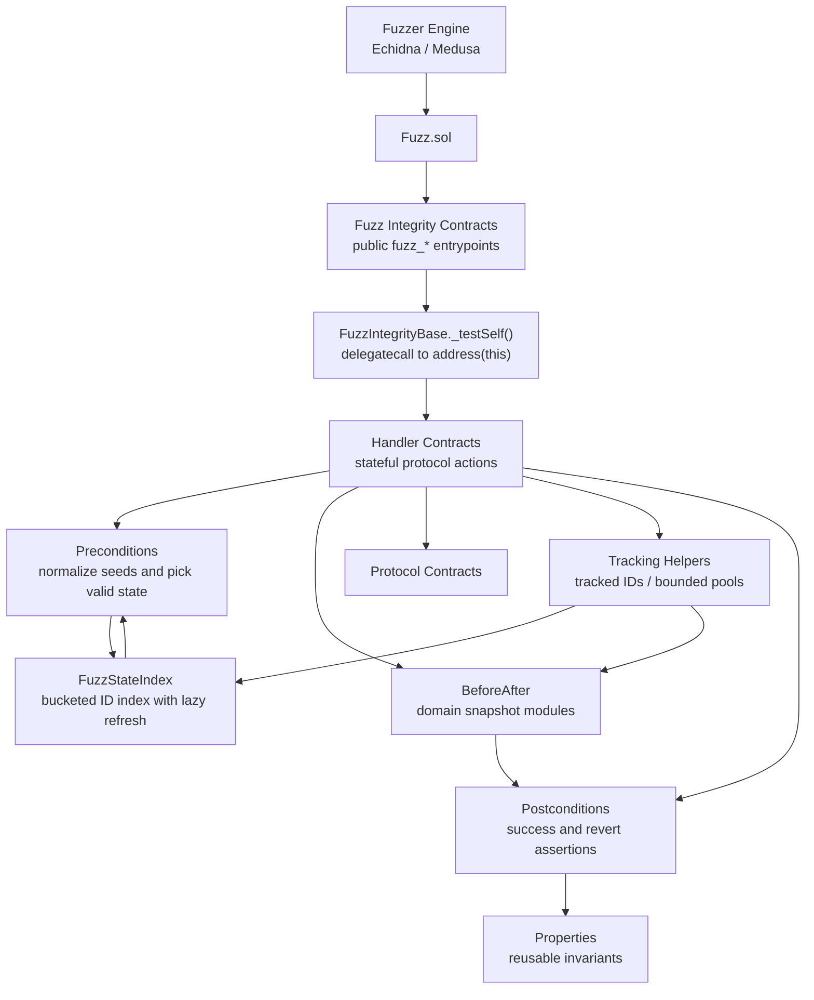
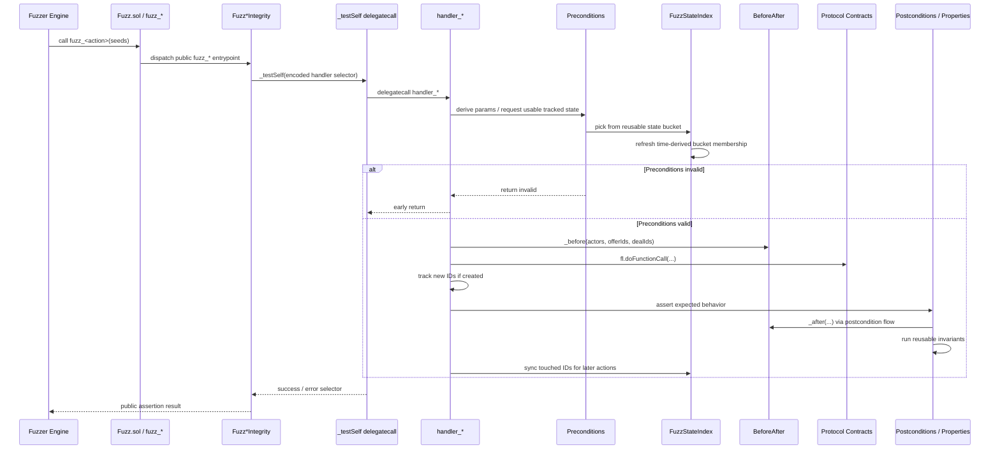

# Fuzz Harness README

This directory contains the repo's composite Solidity fuzzing harness for Echidna and Medusa.

The harness is built on top of perimeter's scaffolding framework [**arachne**](https://github.com/perimetersec/arachne/), but the layout here is repo-specific. The current `Fuzz` target composes vertical coverage for `Marketplace`, `OrderbookMarketplace`, `EscrowManager`, `EntityRegistry`, the issued `DEUSSToken`, `AssetManager`, EscrowManager authorization flows, `PolicyRegistry`, and `BondRegistry`.

## Coverage Docs

The top-level README explains the shared harness architecture. Per-vertical coverage, handler, precondition, and invariant details live in `docs/fuzzing/`:

- [`docs/fuzzing/Marketplace.md`](../../docs/fuzzing/Marketplace.md)
- [`docs/fuzzing/OrderbookMarketplace.md`](../../docs/fuzzing/OrderbookMarketplace.md)
- [`docs/fuzzing/EscrowManager.md`](../../docs/fuzzing/EscrowManager.md)
- [`docs/fuzzing/EntityRegistry.md`](../../docs/fuzzing/EntityRegistry.md)
- [`docs/fuzzing/DEUSSToken.md`](../../docs/fuzzing/DEUSSToken.md)
- [`docs/fuzzing/AssetManager.md`](../../docs/fuzzing/AssetManager.md)
- [`docs/fuzzing/EscrowAuth.md`](../../docs/fuzzing/EscrowAuth.md)
- [`docs/fuzzing/PolicyRegistry.md`](../../docs/fuzzing/PolicyRegistry.md)
- [`docs/fuzzing/BondRegistry.md`](../../docs/fuzzing/BondRegistry.md)

Keep this list one-to-one with the composed `Fuzz*Integrity.sol` verticals in `Fuzz.sol`.

## Coverage Boundaries

Covered protocol areas:
- `Marketplace` offer, interest, failed-book owner/operator cancellation, counter-offer cap configuration, deal, dispute, freeze, seizure, settlement, admin/view helpers, directed sale-mode validation, and offer-linked escrow flows
- `OrderbookMarketplace` directed order placement, matching, batch order, payment, dispute, settlement, freeze, seizure, delegation, TWAP/view, admin, and `BondMarketFilter` predicate surfaces
- Direct `EscrowManager` escrow lifecycle, ERC20/ERC721/ERC1155 transfer branches, surplus accounting, module authorization, and sweep flows
- `EntityRegistry` entity/account lifecycle, pending account registration, admin immediate registration, role surfaces, entity-type metadata, authority, managers, and views
- Issued `DEUSSToken` actions, including approvals, transfers, forced transfers, freezes, burns, pause states, checkpoints, protected custody, and protected-receiver transfer rejection
- `AssetManager` asset configuration, tokenId allowlisting, validation, and admin gates
- `PolicyRegistry` wallet policy admin, user roles, operation roles, modules, module-authorized lookup, `CompanyWallet` admin/receive surfaces, owner admin surfaces, `CompanyWallet.execute` authorization, and manual policy epoch advancement
- `BondRegistry` publish, update, issue, close issuance, cancel, suspend, unsuspend, redeem, issuer recovery, burn, scoring, current-coupon getters, role revoke, and admin/view surfaces

Known gaps and boundaries:
- `OrderbookMarketplace` currently has directed branch and lifecycle coverage, not a full stateful invariant model with order/trade buckets, snapshots, and accounting properties. See [`docs/fuzzing/OrderbookMarketplace.md`](../../docs/fuzzing/OrderbookMarketplace.md).
- `BondMarketFilter` is exercised through the Orderbook directed surface; `DeussBondMetadataAdapter` does not currently have dedicated fuzz coverage. See [`docs/fuzzing/BondMarketFilter.md`](../../docs/fuzzing/BondMarketFilter.md).
- `MarketplaceLens`, deployer contracts, deployment/bootstrap scripts, and `Multicall3` are not fuzzed by this harness.
- Deployment, timelock execution, proxy upgrade, and EBSI infrastructure behavior are expected to be covered by deployment/integration tests or manual runbooks, not by this stateful fuzz target.

Setup mirrors the production timing constants from `DeployConstants.sol`: Marketplace direct payment 4 days, redemption 5 days, interest discovery 4 days, Marketplace dispute buffer 3 days, and Orderbook payment, minimum non-zero expiry, and dispute buffer 1 day each.

## Fuzzing Commands

- `npm run echidna`
Runs the default Echidna campaign through Docker.

- `npm run echidna-fast`
Runs a short Echidna smoke check with Slither disabled and tight limits.

- `npm run echidna-interest-lifecycle`
Runs the directed Marketplace lifecycle Echidna campaign.

- `npm run echidna-interest-lifecycle-fast`
Runs a short directed Marketplace lifecycle Echidna smoke check.

- `npm run medusa`
Runs the default Medusa campaign through Docker.

- `npm run medusa-fast`
Runs a short Medusa smoke check with `--test-limit 1` and Slither value seeding disabled.

- `npm run medusa-interest-lifecycle`
Runs the directed Marketplace lifecycle Medusa campaign.

- `npm run medusa-interest-lifecycle-fast`
Runs a short directed Marketplace lifecycle Medusa smoke check.

## Harness Model

Each fuzz target should follow the same split of responsibilities:

- `Fuzz.sol` is the top-level target contract for external fuzzers.
- `Fuzz*Integrity.sol` contracts expose the public `fuzz_*` entrypoints.
- `helper/handlers/Handler*.sol` contracts contain the real stateful actions against protocol contracts.
- `helper/preconditions/` shapes inputs and selects valid state.
- `helper/FuzzStateIndex.sol` maintains the bounded, lazily refreshed selection index used by preconditions for tracked offers, deals, interests, escrows, entities, bond versions, and fuzz accounts.
- `helper/postconditions/` asserts expected transitions.
- `helper/BeforeAfter.sol` orchestrates domain snapshot modules under `helper/snapshots/`, including the DEUSSToken pair snapshots used by token postconditions.
- `properties/` contains reusable invariants.

The current implementation covers multiple stateful modules. New modules should be added by composing more integrity contracts, handlers, indexed state buckets, and property sets, rather than by changing the basic harness model.

## Architecture

The harness has two distinct layers:

- Public fuzz entrypoints that external engines are allowed to call.
- Internal handler machinery that selects valid state, snapshots tracked objects, executes protocol calls, and asserts behavior.

### Component Flow



Briefly:

- `Fuzz.sol` is the only contract fuzzers should target.
- `Fuzz*Integrity.sol` exposes the allowed public surface and keeps `handler_*` selectors off-limits to engines.
- `Handler*.sol` is the source of truth for state transitions.
- `FuzzStateIndex.sol` is the shared state-selection cache, not an invariant layer and not an alternate entrypoint.
- `Preconditions`, `BeforeAfter`, `Postconditions`, and `Properties` are support layers around the handler, not alternate entrypoints.

### Runtime Sequence



The important state-tracking loop is:

- Handlers track newly created objects in bounded arrays such as `knownOfferIds`, `knownDealIds`, `knownInterestIds`, `knownEscrowIds`, `knownEntityIds`, and `knownBondVersions`.
- `FuzzStateIndex` routes tracked offers, deals, interests, escrows, entities, and fuzz accounts through reusable buckets that store only IDs or addresses, never copied structs.
- Preconditions ask `FuzzStateIndex` for objects from those buckets, then apply actor-specific checks and input shaping.
- Time-derived bucket pickers refresh the bounded tracked ID set before selection so timestamp-only state changes do not go stale.
- Handlers pass the exact actors and IDs touched by the current action into `_before(...)`.
- `BeforeAfter.sol` delegates to domain snapshot modules that also scan bounded tracked sets for broader invariants such as offer accounting, escrow consistency, token supply and frozen-balance bounds, DEUSSToken allowance/operator pairs, bond version consistency, entity/account links, asset configuration, and module authorization state.
- After a handler mutates indexed state, it syncs the touched IDs or accounts back into the FuzzStateIndex so later fuzz actions see current buckets.
- Offer and counter-offer expiries intentionally use a long fuzz-only horizon so Echidna's automatic timestamp movement does not prune multi-step marketplace flows before later handlers can exercise them.

### FuzzStateIndex Buckets

`FuzzStateIndex.sol` exists to make stateful fuzzing dense enough to exercise protocol logic. Handlers create real offers, deals, interests, escrows, entities, and accounts during a campaign. Tracking helpers keep a bounded set of those IDs, and the index classifies them into lifecycle buckets such as:

- `OfferBucket.MarketplaceOpen`
- `OfferBucket.InterestDiscoveryExpiredWithdrawable`
- `OfferBucket.FrozenSeizable`
- `DealBucket.PendingPayable`
- `DealBucket.Payable`
- `DealBucket.PendingExpired`
- `DealBucket.UnpaidDisputable`
- `DealBucket.InDispute`
- `DealBucket.Settleable`
- `DealBucket.FrozenSeizable`
- `InterestBucket.Activatable`
- `InterestBucket.Closeable`

Preconditions then pick from these buckets instead of guessing arbitrary IDs. For example, `resolvePayment` and the `resolvePayments` variants ask for payable or pending-expired deals, the targeted dispute flow asks for a pending payable deal, `settleDeal` asks for a settleable deal where paid buyers are still enabled, `initiateDispute` asks for an unpaid deal still inside the dispute window, `seizeDeal` asks for a frozen seizable deal, `activateInterest` asks for an activatable interest, and `withdrawInterestAvailable` asks for an expired withdrawable interest-discovery offer whose seller can still receive tokens. This keeps invalid calls as explicit precondition failures and lets successful handler executions spend more time on meaningful state transitions.

Some hard-to-hit production branches are covered by compact flow handlers that reuse the same preconditions, postconditions, and invariants as the single-action handlers. For example, the dispute flow moves one pending payable deal past its payment deadline, marks it unpaid, initiates a dispute as the buyer, then resolves it as the arbitrator. The seizure flows build fresh minimal state, then reserve interest before freezing an offer or mark a newly accepted deal paid before freezing and seizing it, so those narrow branches are not left to random call ordering.

The dedicated `FuzzMarketplaceLifecycle` target is a sibling campaign for rare Marketplace lifecycle states. It builds short realistic prefixes through real public protocol calls, warps only to deadlines read from the exact touched offer or deal, syncs only touched objects after the warp, then calls the same transition flows used by the broad campaign. This keeps the default `Fuzz` campaign unchanged while making `resolvePayment(false)`, unpaid `settleDeal`, cancelled direct-sale `withdrawAvailable`, and expired-interest closeout dense enough for Echidna and Medusa. The lifecycle configs use one-call sequences because each public entrypoint already constructs the required prefix; longer sequences only accumulate tracked-object snapshot gas across unrelated directed actions.

The buckets are a cache over live protocol state, not a source of truth. Each tracked object is synced when it enters the bounded known-ID set, when a handler mutates it, and again when a picker selects it. If the object no longer matches the requested lifecycle state, the picker skips it.

Some bucket membership changes only because `block.timestamp` advances. Before picking from those time-derived buckets, the index refreshes the relevant bounded known-ID set so newly expired offers, closeable interests, pending-expired deals, and settleable deals become reachable even when no protocol call touched them.

PolicyRegistry is the current exception to the shared `BeforeAfter.sol` snapshot flow. Its state is keyed by tuples such as `(wallet, admin)`, `(wallet, user)`, `(wallet, target, selector)`, module address, or role id, and the registry does not expose enumerable IDs for those mappings. The PolicyRegistry handlers therefore snapshot the exact pre-state needed for each action inside their precondition parameter structs, then compare that against live state in postconditions. This keeps the same handler → precondition → protocol call → postcondition structure without adding a separate tracked-key layer to `BeforeAfter.sol`.

## Directory Layout

- `Fuzz.sol`
Top-level fuzz target contract. External fuzzing tools should target this contract, not individual helpers.

- `FuzzIntegrityBase.sol`
Shared delegatecall helper used by fuzz integrity contracts.

- `Fuzz*Integrity.sol`
Public fuzz entrypoints. Each `fuzz_*` function encodes a handler call, delegatecalls into `address(this)`, and validates any allowed failure selectors with `fl.errAllow(...)`.

Current verticals:
`FuzzMarketplaceIntegrity.sol`, `FuzzEscrowManagerIntegrity.sol`, `FuzzEntityRegistryIntegrity.sol`, `FuzzDEUSSTokenIntegrity.sol`, `FuzzAssetManagerIntegrity.sol`, `FuzzEscrowAuthIntegrity.sol`, `FuzzPolicyRegistryIntegrity.sol`, and `FuzzBondRegistryIntegrity.sol`.

Directed campaign:
`FuzzMarketplaceLifecycle.sol` exposes only lifecycle-specific `fuzz_*` entrypoints and uses `HandlerMarketplaceLifecycle.sol` for the directed setup and deadline-local transitions.

- `FuzzSetup.sol`
Protocol deployment and actor initialization for the current harness.

- `util/FuzzConstants.sol`
Shared constants, salts, actor addresses, and protocol parameters used by the harness.

- `helper/FuzzStorageVariables.sol`
Shared mutable harness state and typed references to protocol contracts and fuzz-only mocks.

- `mocks/`
Fuzz-only target and module stubs deployed by the harness to exercise protocol integrations.

- `helper/handlers/`
Stateful action implementations. These are the only contracts that should directly express protocol mutations.

Current handlers cover Marketplace, directed OrderbookMarketplace and BondMarketFilter flows, direct EscrowManager flows, EntityRegistry, issued `DEUSSToken` actions, AssetManager, EscrowManager authorization, PolicyRegistry, and BondRegistry.

- `helper/preconditions/`
Argument sanitization and state selection logic. Handlers should return early through preconditions instead of forcing invalid protocol calls.

Current precondition contracts:
`PreconditionsMarketplace.sol`, `PreconditionsEscrowManager.sol`, `PreconditionsEntityRegistry.sol`, `PreconditionsDEUSSToken.sol`, `PreconditionsAssetManager.sol`, `PreconditionsEscrowAuth.sol`, `PreconditionsPolicyRegistry.sol`, `PreconditionsBondRegistry.sol`, and `FuzzStateIndex.sol`

- `helper/postconditions/`
Success and failure assertions tied to each handler.

- `helper/BeforeAfter.sol`
Thin orchestrator for the domain-specific snapshot modules in `helper/snapshots/`. These modules snapshot tracked actor, token pair, offer, deal, escrow, registry, asset, and authorization state before and after handler execution.

Current snapshot modules:
`BeforeAfterMarketplace.sol`, `BeforeAfterDEUSSToken.sol`, `BeforeAfterBondRegistry.sol`, `BeforeAfterEntityRegistry.sol`, `BeforeAfterAssetManager.sol`, and `BeforeAfterEscrowAuth.sol`.

PolicyRegistry handlers intentionally do not use `BeforeAfter.sol` today. They carry local before-state in `PreconditionsPolicyRegistry` because PolicyRegistry mappings are key-based and not enumerable. Add a PolicyRegistry-specific tracked-key snapshot layer here only if future invariants need broad scans across previously seen `(wallet, user)` or `(wallet, target, selector)` keys.

- `properties/`
Invariant library used by postconditions and global state checks.

## Execution Flow

The runtime flow for a fuzz action is:

1. A fuzzer calls `Fuzz.fuzz_*`.
2. The relevant integrity contract encodes the corresponding `handler_*` selector.
3. `_testSelf(...)` delegatecalls back into the harness.
4. The handler evaluates preconditions and returns early if the selected action is not currently valid.
5. `_before(...)` snapshots tracked state.
6. The handler executes the protocol call with `fl.doFunctionCall(...)`.
7. Tracked IDs are updated if new objects were created.
8. Postconditions assert success or allowed failure behavior.
9. Handlers sync touched indexed state back into the `FuzzStateIndex` when an action changes indexed lifecycle state.
10. Shared invariants check cross-cutting system properties, including token supply, pause-state alignment, escrow consistency, and policy wiring.

This keeps the public fuzz surface thin. The handler layer is the source of truth for state transitions.

## Handler Design

Handlers in this harness should follow a strict pattern:

- Choose or normalize inputs through preconditions.
- Return immediately when the current chain state does not admit the action.
- Snapshot only the actors and IDs relevant to the attempted action.
- Execute the protocol call through `fl.doFunctionCall(...)` instead of calling the target directly.
- Track newly created IDs in bounded arrays so later actions can reference them.
- When working with indexed state, sync touched tracked IDs or accounts back into the `FuzzStateIndex` after the attempted action so later selections see refreshed bucket membership.
- Run explicit postconditions for both success and failure paths.

This design keeps the harness deterministic, minimizes meaningless reverting traffic, and makes invariants easier to debug.

## Layering Rules

The fuzz harness uses strict ownership boundaries. New code should preserve this flow:

`Fuzz*Integrity.sol -> Handler*.sol -> Preconditions*.sol -> protocol call -> Postconditions*.sol -> Properties_*.sol`

Handlers own action orchestration only:

- Do not define parameter structs in handlers. Put action-specific parameter structs in the matching `Preconditions*.sol` contract.
- Do not assert invariants or expected results in handlers.
- Do not pass ad hoc string reasons from handlers to generic assertion helpers.
- Keep handlers focused on selecting parameters, executing protocol calls, tracking touched IDs, and invoking behavior-specific postconditions.

Preconditions own input shaping and local pre-state:

- Clamp or normalize fuzzer seeds in preconditions.
- Select valid tracked state from `FuzzStateIndex` or bounded known-ID sets.
- Return explicit validity flags when the current chain state cannot exercise the action.
- Store action-specific before-state in precondition structs only when the state cannot be represented by the shared snapshot flow, as with key-based PolicyRegistry mappings.

Postconditions own behavior dispatch, not assertion definitions:

- Postcondition functions should be named after the behavior they validate, such as `setAssetManagerPostconditions` or `registerOfferPostconditions`.
- Postconditions should call `invariant_*` functions from `properties/`; they should not contain raw `fl.eq`, `fl.t`, `fl.gt`, `fl.errAllow`, or similar assertions for new behavior.
- Avoid generic assertion wrappers such as `boolPostconditions(actual, expected, reason)` or `expectedRevertPostconditions(success, data, selector, reason)`. These hide missing properties and make failures depend on ad hoc strings instead of invariant IDs.
- Coverage-only handlers still need behavior-specific postconditions and property-backed invariants. If a branch is worth asserting, it needs a named property and description.

Properties own assertion logic and failure labels:

- Add or extend a domain property contract under `properties/`, for example `Properties_ESCROW.sol`, `Properties_PR.sol`, or a new `Properties_<DOMAIN>.sol`.
- Name assertion functions with the existing `invariant_<DOMAIN>_<ID>` pattern.
- Add every new invariant label to `PropertiesDescriptions.sol`; do not use custom string literals as assertion reasons.
- When one invariant checks multiple independent fields, keep the parent ID as the catalog summary and assert each field with a granular sub-label, for example `OFER_10_OWNER`, `OFER_10_TOTAL`, or `OB_10_ASSET_MANAGER`. Do not reuse a broad parent label such as `OB_10` for several different `fl.eq` checks.
- Import new property contracts into `Properties.sol` so the composite harness uses them.
- When adding or renaming invariant IDs, update `INVARIANT_VALIDATION.md` and the relevant `docs/fuzzing/*.md` file in the same change.

## Engine Configuration

### Echidna

`echidna-config.yaml` should be treated as part of the harness, not as a detached runner config.

Current expectations:

- target contract passed on the CLI as `--contract Fuzz`
- target file passed on the CLI as `test/fuzzing/Fuzz.sol`
- assertion mode enabled
- direct `handler_*` selectors blacklisted
- only the public fuzz surface should be explored
- shared sender set defined explicitly
- Foundry profile `echidna` used so external-library addresses are linked during compilation

Run Echidna from the repository root with Docker:

```bash
bash ./tools/fuzzing/run-echidna.sh
```

For short startup checks, it is reasonable to disable Slither and cap the run:

```bash
bash ./tools/fuzzing/run-echidna.sh --disable-slither --test-limit 10000 --shrink-limit 1000
```

The wrapper pins `ghcr.io/crytic/echidna/echidna:v2.3.2` by default and can be overridden with `ECHIDNA_IMAGE`.
It runs the container detached, keeps it after completion for inspection, streams logs back to stdout, and writes a
timestamped copy under `logs/fuzzing/`. Set `ECHIDNA_CONTAINER_NAME` or `ECHIDNA_LOG_DIR` when you need stable names
for CI artifacts or local debugging. Coverage reports are written to `echidna-coverage/` by default; set
`ECHIDNA_COVERAGE_DIR` to override that path.

`HOME=/tmp` avoids permission issues from `solc-select` inside the container, and `FOUNDRY_PROFILE=echidna` makes
Foundry emit pre-linked bytecode for the harness build. The wrapper sets `GHCRTS` from `ECHIDNA_RTS_OPTS` so Echidna's
Haskell runtime has a bounded heap and emits runtime memory stats.

On `amd64` hosts, the wrapper runs without extra flags. On `arm64` hosts, especially Apple Silicon, the wrapper automatically adds Docker `--platform linux/amd64` so Echidna runs under the architecture it expects.

The usual symptom is:

```text
Error: version not found in artifacts for this platform: 0.8.34
```

The blacklist is important. Fuzzers should not call `handler_*` directly, because those functions are internal harness machinery rather than the intended external fuzz interface.

The directed Marketplace lifecycle campaign uses `echidna-interest-lifecycle.yaml` and whitelists only the nine public lifecycle entrypoints on `FuzzMarketplaceLifecycle`:

```bash
npm run echidna-interest-lifecycle-fast
```

The config sets `seqLen: 1` and uses `echidna-interest-lifecycle-directed-corpus/` so stale multi-call corpus sequences cannot obscure the directed transition with snapshot gas exhaustion.

### Medusa

`medusa.json` should mirror the same public surface assumptions:

- target contract: `Fuzz`
- assertion testing enabled
- `targetFunctionSignatures` allowlists only the public `fuzz_*` surface
- any required predeployed contracts declared explicitly
- Slither value seeding disabled by the wrapper unless `--use-slither` or `--use-slither-force` is passed

Medusa v1.5.0 can crash while seeding constants from Slither for this composite target (`ValueSet.SeedFromSlither` nil pointer). Keep Slither disabled for Medusa execution and run static analysis separately through `npm run slither-debug`.

Run Medusa from the repository root with Docker:

```bash
bash ./tools/fuzzing/run-medusa.sh
```

The wrapper builds a repo-local Medusa image that already contains a Linux Foundry toolchain, then runs the fuzzing campaign inside that image. This keeps compilation inside Docker and avoids cross-platform failures from mounting a host `forge` binary into the Medusa container.

For a short startup check, override the limit on the CLI:

```bash
bash ./tools/fuzzing/run-medusa.sh --test-limit 1 --use-slither=false
```

Because `/src` is bind-mounted to the local checkout, Medusa outputs persist on the host. For example, `corpusDirectory: "medusa-corpus"` writes to `./medusa-corpus` in the repo root.

The directed Marketplace lifecycle Medusa campaign uses `medusa-interest-lifecycle.json`, targets `FuzzMarketplaceLifecycle`, and allowlists only the lifecycle `fuzz_*` entrypoints:

```bash
npm run medusa-interest-lifecycle-fast
```

This campaign mirrors the Echidna setup with `callSequenceLength: 1` and `medusa-interest-lifecycle-directed-corpus/`.

If a new handler or integrity contract is added, update both config files so only the matching `fuzz_*` entrypoints remain externally callable.

## Development Workflow

When changing this harness:

1. Update or add the handler in `helper/handlers/`.
2. Add or update preconditions and postconditions.
3. Add or update `invariant_*` functions in the matching `properties/Properties_*.sol` contract.
4. Add or update invariant labels in `properties/PropertiesDescriptions.sol`.
5. Add the public `fuzz_*` entrypoint in the relevant `Fuzz*Integrity.sol` contract.
6. If the action creates or mutates tracked objects, update the relevant snapshot module under `helper/snapshots/` and any tracking helpers as needed.
7. If the current protocol getter surface changed, update the access wrappers in `FuzzStorageVariables.sol`.
8. Update `echidna-config.yaml` and `medusa.json` when the public fuzz surface changes.
9. Update `INVARIANT_VALIDATION.md` and the matching per-vertical doc under `docs/fuzzing/`.
10. Run `FOUNDRY_PROFILE=echidna forge build --build-info test/fuzzing/Fuzz.sol`.
11. Run the relevant smoke campaign, usually `npm run echidna-fast`; use `npm run medusa-fast` when selector/config compatibility is affected.

Prefer adapting the harness to the current protocol API instead of reintroducing removed legacy getters.

## Extension Guidelines

When adding a new fuzzed module:

- Keep the public entrypoint name as `fuzz_<action>`.
- Keep the stateful implementation in a handler contract, not in `Fuzz.sol`.
- Group related actions into a dedicated integrity contract such as `Fuzz<Module>Integrity.sol`.
- Compose those integrity contracts into `Fuzz.sol`.
- Add or extend the relevant property contracts under `properties/`.
- Update engine configs so fuzzers only reach the `fuzz_*` surface.

When changing protocol wiring:

- Preserve the constructor flow in `Fuzz.sol`: `setup()`, `setupActors()`, optional `validateSetup()`.
- Preserve the actor model from `FuzzConstants.sol`, because external fuzzer configs may depend on those sender addresses.
- Preserve the intended external fuzz surface in both configs: Echidna and Medusa should both keep handler selectors excluded.

The harness should stay easy to reason about: thin public surface, stateful handlers, explicit preconditions, explicit postconditions, and clear invariants.
